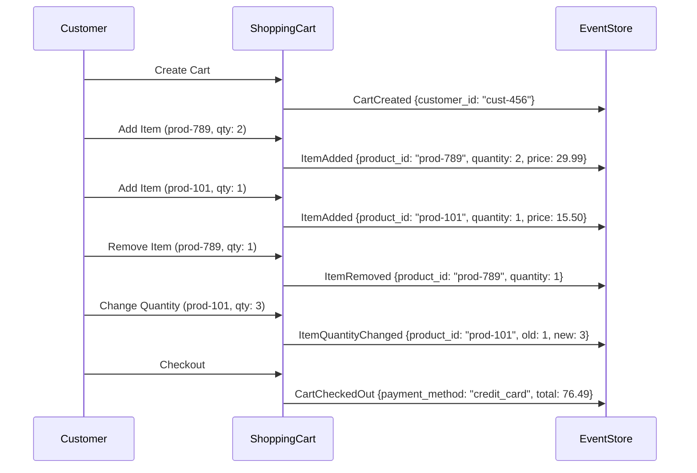
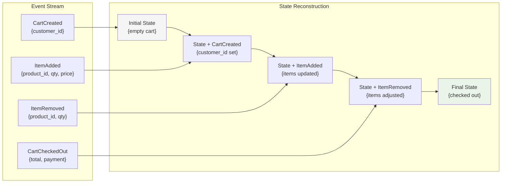
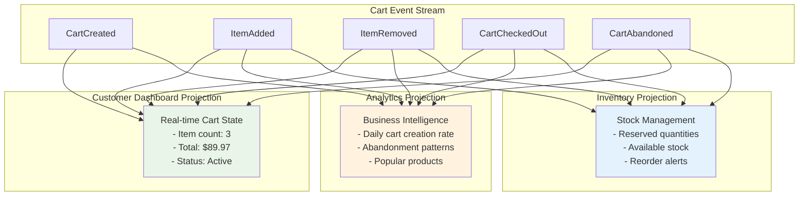

# Modeling a Shopping Cart with Event Sourcing

## The Traditional Approach vs Event Sourcing

Let's model a shopping cart to see how event sourcing transforms our thinking from state-centric to event-centric design.

### Traditional CRUD Approach
```sql
-- Cart table stores current state
CREATE TABLE carts (
    id UUID PRIMARY KEY,
    customer_id UUID,
    status VARCHAR(20),
    total_amount DECIMAL,
    created_at TIMESTAMP,
    updated_at TIMESTAMP
);

-- Cart items as related table
CREATE TABLE cart_items (
    cart_id UUID,
    product_id UUID,
    quantity INT,
    price DECIMAL,
    PRIMARY KEY (cart_id, product_id)
);
```

This approach loses all history. We can't answer questions like:
- What items were removed and when?
- How many times did the customer change their mind?
- What was the sequence of actions leading to checkout?

### Event Sourcing Approach

Instead of storing state, we store events that describe what happened:



```
Events for Cart cart-123:
1. CartCreated      { customer_id: "cust-456" }
2. ItemAdded        { product_id: "prod-789", quantity: 2, price: 29.99 }
3. ItemAdded        { product_id: "prod-101", quantity: 1, price: 15.50 }
4. ItemRemoved      { product_id: "prod-789", quantity: 1 }
5. ItemQuantityChanged { product_id: "prod-101", old_quantity: 1, new_quantity: 3 }
6. CartCheckedOut   { payment_method: "credit_card", total: 76.49 }
```

## Designing Our Shopping Cart Events

### Event Definitions

Let's define the events that can occur in our shopping cart domain:

```json
// Cart lifecycle events
{
  "eventType": "CartCreated",
  "data": {
    "customer_id": "cust-456"
  }
}

{
  "eventType": "ItemAdded",
  "data": {
    "product_id": "prod-789",
    "quantity": 2,
    "unit_price": 29.99,
    "product_name": "Wireless Headphones"
  }
}

{
  "eventType": "ItemRemoved",
  "data": {
    "product_id": "prod-789",
    "quantity": 1,
    "reason": "customer_request"
  }
}

{
  "eventType": "ItemQuantityChanged",
  "data": {
    "product_id": "prod-101",
    "old_quantity": 1,
    "new_quantity": 3
  }
}

{
  "eventType": "CartAbandoned",
  "data": {
    "reason": "session_timeout",
    "minutes_inactive": 30
  }
}

{
  "eventType": "CartCheckedOut",
  "data": {
    "payment_method": "credit_card",
    "shipping_address": {...},
    "total_amount": 76.49
  }
}
```

### Rich Events vs Thin Events

Notice our events contain rich information. This is a design choice:

**Rich Events (Recommended):**
```json
{
  "eventType": "ItemAdded",
  "data": {
    "product_id": "prod-789",
    "quantity": 2,
    "unit_price": 29.99,
    "product_name": "Wireless Headphones",
    "category": "Electronics"
  }
}
```

**Thin Events:**
```json
{
  "eventType": "ItemAdded",
  "data": {
    "product_id": "prod-789",
    "quantity": 2
  }
}
```

Rich events make our system more resilient to changes in external systems (product catalog) and provide better historical context.

## Reconstructing Current State

To determine the cart's current state, we replay all events:

### State Reconstruction Algorithm



```python
def rebuild_cart_state(events):
    cart = {
        "customer_id": None,
        "items": {},
        "status": "active",
        "total": 0.0
    }
    
    for event in events:
        if event["eventType"] == "CartCreated":
            cart["customer_id"] = event["data"]["customer_id"]
            
        elif event["eventType"] == "ItemAdded":
            product_id = event["data"]["product_id"]
            quantity = event["data"]["quantity"]
            price = event["data"]["unit_price"]
            
            if product_id in cart["items"]:
                cart["items"][product_id]["quantity"] += quantity
            else:
                cart["items"][product_id] = {
                    "quantity": quantity,
                    "unit_price": price,
                    "product_name": event["data"]["product_name"]
                }
                
        elif event["eventType"] == "ItemRemoved":
            product_id = event["data"]["product_id"]
            quantity = event["data"]["quantity"]
            
            if product_id in cart["items"]:
                cart["items"][product_id]["quantity"] -= quantity
                if cart["items"][product_id]["quantity"] <= 0:
                    del cart["items"][product_id]
                    
        elif event["eventType"] == "ItemQuantityChanged":
            product_id = event["data"]["product_id"]
            new_quantity = event["data"]["new_quantity"]
            
            if product_id in cart["items"]:
                cart["items"][product_id]["quantity"] = new_quantity
                
        elif event["eventType"] == "CartCheckedOut":
            cart["status"] = "checked_out"
            cart["total"] = event["data"]["total_amount"]
            
        elif event["eventType"] == "CartAbandoned":
            cart["status"] = "abandoned"
    
    return cart
```

### Example Reconstruction
Given these events:
```
1. CartCreated      { customer_id: "cust-456" }
2. ItemAdded        { product_id: "A", quantity: 2, unit_price: 10.00 }
3. ItemAdded        { product_id: "B", quantity: 1, unit_price: 15.00 }
4. ItemRemoved      { product_id: "A", quantity: 1 }
```

The reconstructed state would be:
```json
{
  "customer_id": "cust-456",
  "items": {
    "A": { "quantity": 1, "unit_price": 10.00, "product_name": "..." },
    "B": { "quantity": 1, "unit_price": 15.00, "product_name": "..." }
  },
  "status": "active",
  "total": 0.0
}
```

## Business Rules and Validation

Before emitting events, we validate business rules against the current state:

```python
def add_item_to_cart(cart_state, product_id, quantity, unit_price):
    # Business rule: Can't add items to checked out cart
    if cart_state["status"] == "checked_out":
        raise ValueError("Cannot modify checked out cart")
    
    # Business rule: Quantity must be positive
    if quantity <= 0:
        raise ValueError("Quantity must be positive")
    
    # Business rule: Maximum 10 items per product
    current_quantity = cart_state["items"].get(product_id, {}).get("quantity", 0)
    if current_quantity + quantity > 10:
        raise ValueError("Maximum 10 items allowed per product")
    
    # If validation passes, return the event
    return {
        "eventType": "ItemAdded",
        "data": {
            "product_id": product_id,
            "quantity": quantity,
            "unit_price": unit_price
        }
    }
```

## Creating Projections

From our cart events, we can create different projections for different use cases:



### Customer Dashboard Projection
```sql
-- Shows current cart state for quick UI updates
CREATE TABLE customer_cart_view (
    customer_id UUID PRIMARY KEY,
    cart_id UUID,
    item_count INT,
    total_value DECIMAL,
    last_updated TIMESTAMP
);
```

### Analytics Projection
```sql
-- Tracks cart abandonment patterns
CREATE TABLE cart_analytics (
    date DATE,
    carts_created INT,
    carts_abandoned INT,
    carts_checked_out INT,
    avg_items_before_abandonment DECIMAL,
    abandonment_rate DECIMAL
);
```

### Inventory Projection
```sql
-- Tracks reserved items in active carts
CREATE TABLE inventory_reservations (
    product_id UUID PRIMARY KEY,
    reserved_quantity INT,
    last_updated TIMESTAMP
);
```

## The Power of Event Sourcing for Shopping Carts

With our event-sourced cart, we can now answer rich questions:

1. **Customer Behavior Analysis**: "How often do customers add and remove the same item?"
2. **A/B Testing**: "Does showing the total price earlier reduce abandonment?"
3. **Fraud Detection**: "Are there unusual patterns in cart modifications?"
4. **Personalization**: "What products are frequently added together?"
5. **Operational Insights**: "What's the average time between cart creation and checkout?"

All of this intelligence comes from the same event stream that powers our core cart functionality—no additional tracking code required.