# Event Sourcing and CQRS: The Perfect Partnership

## Understanding CQRS: Command Query Responsibility Segregation

CQRS is an architectural pattern that separates read operations (queries) from write operations (commands). While CQRS can be used without Event Sourcing, the two patterns form a natural and powerful combination.

### The Traditional Approach: One Model for Everything

```mermaid
graph TB
    subgraph "Traditional Architecture"
        APP["Application"]
        DB[("Single Database Model")]
        
        APP -->|"Write Commands<br/>(CREATE, UPDATE, DELETE)"| DB
        APP <--|"Read Queries<br/>(SELECT, JOIN)"| DB
        
        DB -.->|"Compromises"| ISSUES["⚠️ Issues:<br/>• Expensive queries<br/>• Complex writes<br/>• Suboptimal for both"]
    end
    
    style DB fill:#ffebee
    style ISSUES fill:#fff3e0
```

In traditional systems, the same data model serves both reads and writes, leading to compromises:
- **Write-optimized**: Normalized tables that are expensive to query
- **Read-optimized**: Denormalized views that are expensive to maintain
- **The compromise**: A model that's suboptimal for both operations

### CQRS: Separate Models for Different Responsibilities


## Why Event Sourcing and CQRS Are Natural Partners

### 1. Event Stream as the Perfect Write Model

The event stream serves as an ideal write model because:
- **Append-only**: Optimized for writes (no updates or deletes)
- **Single responsibility**: Only handles recording what happened
- **Business-focused**: Events represent business domain concepts

```
Command: PlaceOrder
   ↓ (validation & business logic)
Events: [OrderPlaced, InventoryReserved, PaymentRequested]
   ↓ (stored in event stream)
Write Model: Complete ✓
```

### 2. Projections as Specialized Read Models

From the same event stream, you can build multiple read models, each optimized for specific queries:


## The Mental Model: A News Organization

```mermaid
flowchart TB
    subgraph "News Wire Service (Event Stream)"
        NW["Raw News Events<br/>• Earthquake in Tokyo<br/>• Stock market opens<br/>• Sports scores<br/>• Weather updates"]
    end
    
    subgraph "Editorial Process (Write Model)"
        ED["Editorial Decisions<br/>• Verify authenticity<br/>• Apply business rules<br/>• Authorize publication"]
    end
    
    subgraph "Specialized Publications (Read Models)"
        NP["Daily Newspaper<br/>📰 Summarized digest<br/>Time-delayed"]
        BA["Breaking News App<br/>📱 Real-time alerts<br/>Critical updates only"]
        WM["Weekly Magazine<br/>📖 In-depth analysis<br/>Historical context"]
        SP["Sports Section<br/>⚽ Sports events only<br/>League standings"]
        WS["Weather Service<br/>🌤️ Weather events only<br/>Forecasts"]
    end
    
    NW --> ED
    ED --> NP
    ED --> BA
    ED --> WM
    ED --> SP
    ED --> WS
    
    style NW fill:#e1f5fe
    style ED fill:#e8f5e8
    style NP fill:#f3e5f5
    style BA fill:#f3e5f5
    style WM fill:#f3e5f5
    style SP fill:#f3e5f5
    style WS fill:#f3e5f5
```



Imagine a news organization where:

### The Event Stream = News Wire Service
- Raw, factual events stream in continuously
- Events are immutable facts: "Earthquake hits Tokyo at 14:32 JST"
- Events contain all relevant context and details

### Write Model = Editorial Decisions
- Deciding which events matter to the organization
- Validating event authenticity and business rules
- Adding events to the authoritative record

### Read Models = Different Publications
From the same news wire, different publications create specialized content:

- **Daily Newspaper**: Summarized, time-delayed digest
- **Breaking News App**: Real-time, critical updates only
- **Weekly Magazine**: In-depth analysis with historical context
- **Sports Section**: Sports events only, with league standings
- **Weather Service**: Weather events only, with forecasts

Each publication (read model) is optimized for its audience's needs, but all derive from the same authoritative source.

## Practical Implementation Patterns

### Command Side: Write Model

```rust
// Commands represent intent
pub enum OrderCommand {
    PlaceOrder {
        customer_id: String,
        items: Vec<OrderItem>,
        shipping_address: Address,
    },
    AddItem {
        order_id: String,
        item: OrderItem,
    },
    CancelOrder {
        order_id: String,
        reason: String,
    },
}

// Aggregate handles commands and emits events
impl OrderAggregate {
    pub fn handle_command(&mut self, command: OrderCommand) -> Result<Vec<Event>, Error> {
        match command {
            OrderCommand::PlaceOrder { customer_id, items, shipping_address } => {
                // Validate business rules
                if items.is_empty() {
                    return Err(Error::EmptyOrder);
                }
                
                // Emit events
                Ok(vec![
                    Event::OrderPlaced {
                        order_id: self.id.clone(),
                        customer_id,
                        items: items.clone(),
                        shipping_address,
                    },
                    Event::InventoryReserved {
                        items: items.iter().map(|i| (i.product_id.clone(), i.quantity)).collect(),
                    }
                ])
            }
            // ... other commands
        }
    }
}
```

### Query Side: Read Models

```rust
// Customer Service Read Model
#[derive(Serialize)]
pub struct CustomerOrderView {
    pub order_id: String,
    pub status: OrderStatus,
    pub items: Vec<OrderItemView>,
    pub total_amount: Decimal,
    pub tracking_number: Option<String>,
}

// Analytics Read Model
#[derive(Serialize)]
pub struct SalesAnalyticsView {
    pub date: Date,
    pub total_orders: u32,
    pub total_revenue: Decimal,
    pub top_products: Vec<ProductSalesView>,
    pub average_order_value: Decimal,
}

// Inventory Read Model
#[derive(Serialize)]
pub struct InventoryView {
    pub product_id: String,
    pub available_quantity: u32,
    pub reserved_quantity: u32,
    pub reorder_level: u32,
}
```

## Building and Maintaining Projections

### Event Handlers for Projections

```rust
impl CustomerOrderProjection {
    pub fn handle_event(&mut self, event: &Event) -> Result<(), Error> {
        match event {
            Event::OrderPlaced { order_id, customer_id, items, .. } => {
                let order_view = CustomerOrderView {
                    order_id: order_id.clone(),
                    status: OrderStatus::Placed,
                    items: items.iter().map(|i| OrderItemView::from(i)).collect(),
                    total_amount: items.iter().map(|i| i.price * i.quantity).sum(),
                    tracking_number: None,
                };
                
                self.upsert_order(order_view)?;
            },
            
            Event::OrderShipped { order_id, tracking_number } => {
                self.update_order_status(order_id, OrderStatus::Shipped)?;
                self.update_tracking_number(order_id, tracking_number)?;
            },
            
            // ... other events
        }
        Ok(())
    }
}
```

### Projection Rebuilding

One of the most powerful aspects of this pattern is the ability to rebuild projections:


```rust
pub fn rebuild_projection<P: Projection>(
    event_store: &EventStore,
    projection: &mut P
) -> Result<(), Error> {
    // Clear existing projection
    projection.reset()?;
    
    // Replay all events
    let events = event_store.get_all_events()?;
    for event in events {
        projection.handle_event(&event)?;
    }
    
    Ok(())
}
```

This means you can:
- **Fix bugs** in projection logic by rebuilding with corrected handlers
- **Add new projections** for new requirements without touching the write side
- **Migrate schemas** by rebuilding projections with new structures

### The Evolution Timeline


## Advanced Patterns

### Temporal Queries

With event sourcing and CQRS, you can answer questions about any point in time:

```rust
pub fn get_order_state_at_time(
    event_store: &EventStore,
    order_id: &str,
    timestamp: DateTime<Utc>
) -> Result<OrderView, Error> {
    let events = event_store.get_events_for_stream_until(order_id, timestamp)?;
    let mut order = OrderAggregate::new();
    
    for event in events {
        order.apply_event(&event);
    }
    
    Ok(OrderView::from(order))
}
```

### Snapshot Optimization

For long-lived aggregates with many events, you can use snapshots to optimize reads:

```rust
pub struct OrderSnapshot {
    pub aggregate_id: String,
    pub version: u64,
    pub state: OrderAggregate,
    pub timestamp: DateTime<Utc>,
}

pub fn load_aggregate_with_snapshot(
    event_store: &EventStore,
    snapshot_store: &SnapshotStore,
    aggregate_id: &str
) -> Result<OrderAggregate, Error> {
    // Try to load latest snapshot
    if let Some(snapshot) = snapshot_store.get_latest_snapshot(aggregate_id)? {
        let mut aggregate = snapshot.state;
        
        // Load events since snapshot
        let events = event_store.get_events_after_version(aggregate_id, snapshot.version)?;
        for event in events {
            aggregate.apply_event(&event);
        }
        
        Ok(aggregate)
    } else {
        // No snapshot, load from beginning
        load_aggregate_from_events(event_store, aggregate_id)
    }
}
```

## The Benefits of This Partnership

### 1. Performance Optimization
- **Write side**: Optimized for commands and event appending
- **Read side**: Multiple models optimized for specific query patterns

### 2. Scalability
- **Write side**: Single event store, simpler to scale
- **Read side**: Multiple read databases, can be scaled independently

### 3. Flexibility
- **Add new features**: Create new projections without changing existing code
- **Support different clients**: Mobile app projection vs admin dashboard projection

### 4. Resilience
- **Projection failures**: Don't affect command processing
- **Schema changes**: Rebuild projections rather than migrating live data

### 5. Business Intelligence
- **Historical analysis**: Query how the system looked at any point in time
- **A/B testing**: Different projections for different user segments

## Common Pitfalls and Solutions

### 1. Eventual Consistency
**Problem**: Read models may lag behind the write model.

**Solution**: 
- Design UI to handle eventual consistency
- Use correlation IDs to track command success
- Implement proper retry and error handling

### 2. Projection Complexity
**Problem**: Complex business logic duplicated across projections.

**Solution**:
- Keep projections simple—just data transformation
- Complex business logic stays in the write model
- Use shared domain events with rich data

### 3. Event Schema Evolution
**Problem**: Events change over time, breaking old projections.

**Solution**:
- Version your events
- Use upcasting to handle old event versions
- Design events to be additive when possible

The combination of Event Sourcing and CQRS creates a powerful, flexible architecture that can evolve with your business needs while maintaining a complete audit trail and supporting rich analytical queries.