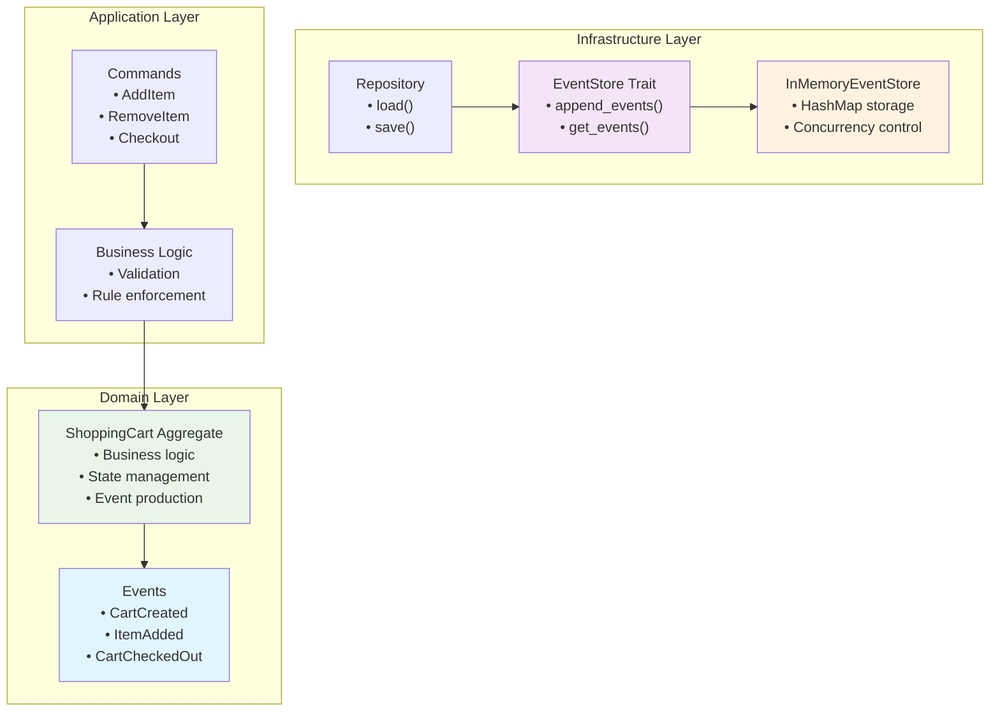
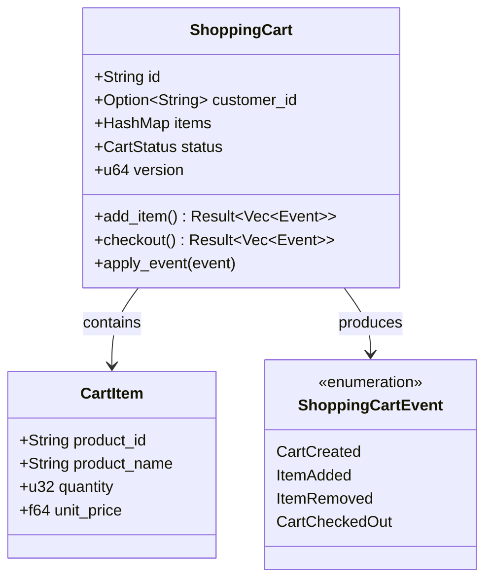
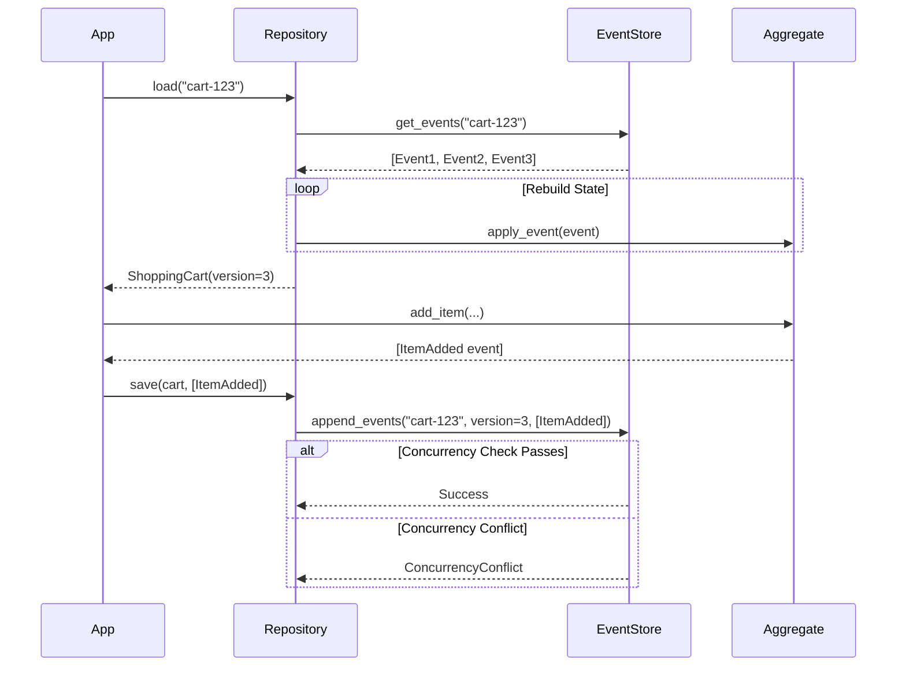
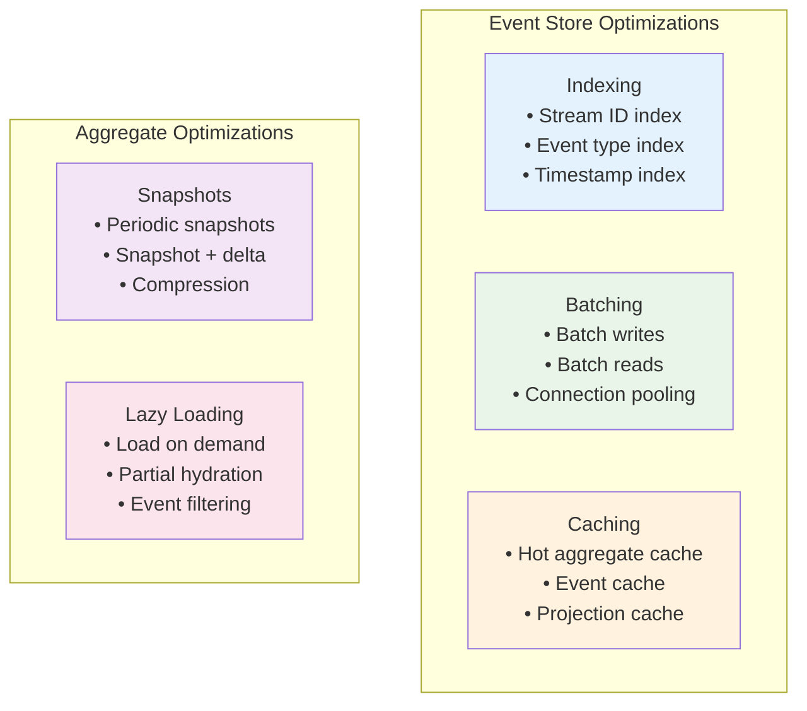
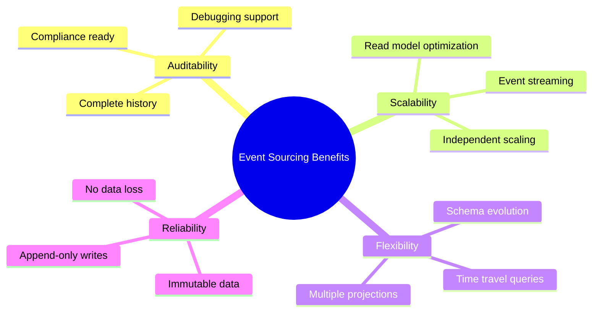

# Rust Implementation: A Complete Event-Sourced Shopping Cart

This implementation demonstrates the core concepts of Event Sourcing through a working shopping cart system in Rust.

## Architecture Overview



This implementation demonstrates the core concepts of Event Sourcing through a working shopping cart system in Rust.

## Dependencies

Add these to your `Cargo.toml`:

```toml
[dependencies]
serde = { version = "1.0", features = ["derive"] }
serde_json = "1.0"
uuid = { version = "1.0", features = ["v4", "serde"] }
chrono = { version = "0.4", features = ["serde"] }
thiserror = "1.0"
```

## Core Event Types

```rust
use serde::{Deserialize, Serialize};
use chrono::{DateTime, Utc};
use uuid::Uuid;

#[derive(Debug, Clone, Serialize, Deserialize)]
pub struct EventEnvelope {
    pub event_id: Uuid,
    pub stream_id: String,
    pub event_type: String,
    pub event_data: serde_json::Value,
    pub version: u64,
    pub timestamp: DateTime<Utc>,
}

#[derive(Debug, Clone, Serialize, Deserialize)]
#[serde(tag = "type")]
pub enum ShoppingCartEvent {
    CartCreated {
        customer_id: String,
    },
    ItemAdded {
        product_id: String,
        product_name: String,
        quantity: u32,
        unit_price: f64,
    },
    ItemRemoved {
        product_id: String,
        quantity: u32,
        reason: String,
    },
    ItemQuantityChanged {
        product_id: String,
        old_quantity: u32,
        new_quantity: u32,
    },
    CartCheckedOut {
        payment_method: String,
        total_amount: f64,
        shipping_address: Address,
    },
    CartAbandoned {
        reason: String,
    },
}

#[derive(Debug, Clone, Serialize, Deserialize)]
pub struct Address {
    pub street: String,
    pub city: String,
    pub state: String,
    pub zip_code: String,
    pub country: String,
}
```

## Shopping Cart Aggregate

```rust
use std::collections::HashMap;
use thiserror::Error;

#[derive(Error, Debug)]
pub enum ShoppingCartError {
    #[error("Cart has already been checked out")]
    CartAlreadyCheckedOut,
    #[error("Cart has been abandoned")]
    CartAbandoned,
    #[error("Product {product_id} not found in cart")]
    ProductNotFound { product_id: String },
    #[error("Invalid quantity: {quantity}")]
    InvalidQuantity { quantity: u32 },
    #[error("Cannot remove more items than exist in cart")]
    InsufficientQuantity,
    #[error("Maximum quantity per item is {max}, requested {requested}")]
    MaxQuantityExceeded { max: u32, requested: u32 },
}

#[derive(Debug, Clone, Serialize, Deserialize)]
pub struct CartItem {
    pub product_id: String,
    pub product_name: String,
    pub quantity: u32,
    pub unit_price: f64,
}

#[derive(Debug, Clone, Serialize, Deserialize, PartialEq)]
pub enum CartStatus {
    Active,
    CheckedOut,
    Abandoned,
}

#[derive(Debug, Clone, Serialize, Deserialize)]
pub struct ShoppingCart {
    pub id: String,
    pub customer_id: Option<String>,
    pub items: HashMap<String, CartItem>,
    pub status: CartStatus,
    pub version: u64,
}

impl ShoppingCart {
    pub fn new(cart_id: String) -> Self {
        Self {
            id: cart_id,
            customer_id: None,
            items: HashMap::new(),
            status: CartStatus::Active,
            version: 0,
        }
    }

    // Create a new cart
    pub fn create(cart_id: String, customer_id: String) -> Result<Vec<ShoppingCartEvent>, ShoppingCartError> {
        Ok(vec![ShoppingCartEvent::CartCreated { customer_id }])
    }

    // Add item to cart
    pub fn add_item(
        &self,
        product_id: String,
        product_name: String,
        quantity: u32,
        unit_price: f64,
    ) -> Result<Vec<ShoppingCartEvent>, ShoppingCartError> {
        // Business rule validations
        if self.status != CartStatus::Active {
            return match self.status {
                CartStatus::CheckedOut => Err(ShoppingCartError::CartAlreadyCheckedOut),
                CartStatus::Abandoned => Err(ShoppingCartError::CartAbandoned),
                _ => unreachable!(),
            };
        }

        if quantity == 0 {
            return Err(ShoppingCartError::InvalidQuantity { quantity });
        }

        // Business rule: Maximum 10 items per product
        let current_quantity = self.items.get(&product_id).map(|item| item.quantity).unwrap_or(0);
        let new_total = current_quantity + quantity;
        if new_total > 10 {
            return Err(ShoppingCartError::MaxQuantityExceeded {
                max: 10,
                requested: new_total,
            });
        }

        Ok(vec![ShoppingCartEvent::ItemAdded {
            product_id,
            product_name,
            quantity,
            unit_price,
        }])
    }

    // Remove item from cart
    pub fn remove_item(
        &self,
        product_id: String,
        quantity: u32,
        reason: String,
    ) -> Result<Vec<ShoppingCartEvent>, ShoppingCartError> {
        if self.status != CartStatus::Active {
            return match self.status {
                CartStatus::CheckedOut => Err(ShoppingCartError::CartAlreadyCheckedOut),
                CartStatus::Abandoned => Err(ShoppingCartError::CartAbandoned),
                _ => unreachable!(),
            };
        }

        let current_item = self.items.get(&product_id)
            .ok_or_else(|| ShoppingCartError::ProductNotFound { product_id: product_id.clone() })?;

        if quantity > current_item.quantity {
            return Err(ShoppingCartError::InsufficientQuantity);
        }

        Ok(vec![ShoppingCartEvent::ItemRemoved {
            product_id,
            quantity,
            reason,
        }])
    }

    // Change item quantity
    pub fn change_item_quantity(
        &self,
        product_id: String,
        new_quantity: u32,
    ) -> Result<Vec<ShoppingCartEvent>, ShoppingCartError> {
        if self.status != CartStatus::Active {
            return match self.status {
                CartStatus::CheckedOut => Err(ShoppingCartError::CartAlreadyCheckedOut),
                CartStatus::Abandoned => Err(ShoppingCartError::CartAbandoned),
                _ => unreachable!(),
            };
        }

        let current_item = self.items.get(&product_id)
            .ok_or_else(|| ShoppingCartError::ProductNotFound { product_id: product_id.clone() })?;

        if new_quantity == 0 {
            return Err(ShoppingCartError::InvalidQuantity { quantity: new_quantity });
        }

        if new_quantity > 10 {
            return Err(ShoppingCartError::MaxQuantityExceeded {
                max: 10,
                requested: new_quantity,
            });
        }

        Ok(vec![ShoppingCartEvent::ItemQuantityChanged {
            product_id,
            old_quantity: current_item.quantity,
            new_quantity,
        }])
    }

    // Checkout cart
    pub fn checkout(
        &self,
        payment_method: String,
        shipping_address: Address,
    ) -> Result<Vec<ShoppingCartEvent>, ShoppingCartError> {
        if self.status != CartStatus::Active {
            return match self.status {
                CartStatus::CheckedOut => Err(ShoppingCartError::CartAlreadyCheckedOut),
                CartStatus::Abandoned => Err(ShoppingCartError::CartAbandoned),
                _ => unreachable!(),
            };
        }

        let total_amount = self.calculate_total();

        Ok(vec![ShoppingCartEvent::CartCheckedOut {
            payment_method,
            total_amount,
            shipping_address,
        }])
    }

    // Abandon cart
    pub fn abandon(&self, reason: String) -> Result<Vec<ShoppingCartEvent>, ShoppingCartError> {
        if self.status != CartStatus::Active {
            return match self.status {
                CartStatus::CheckedOut => Err(ShoppingCartError::CartAlreadyCheckedOut),
                CartStatus::Abandoned => Err(ShoppingCartError::CartAbandoned),
                _ => unreachable!(),
            };
        }

        Ok(vec![ShoppingCartEvent::CartAbandoned { reason }])
    }

    // Apply an event to update the aggregate state
    pub fn apply_event(&mut self, event: &ShoppingCartEvent) {
        match event {
            ShoppingCartEvent::CartCreated { customer_id } => {
                self.customer_id = Some(customer_id.clone());
            }
            ShoppingCartEvent::ItemAdded {
                product_id,
                product_name,
                quantity,
                unit_price,
            } => {
                if let Some(existing_item) = self.items.get_mut(product_id) {
                    existing_item.quantity += quantity;
                } else {
                    self.items.insert(
                        product_id.clone(),
                        CartItem {
                            product_id: product_id.clone(),
                            product_name: product_name.clone(),
                            quantity: *quantity,
                            unit_price: *unit_price,
                        },
                    );
                }
            }
            ShoppingCartEvent::ItemRemoved { product_id, quantity, .. } => {
                if let Some(existing_item) = self.items.get_mut(product_id) {
                    existing_item.quantity -= quantity;
                    if existing_item.quantity == 0 {
                        self.items.remove(product_id);
                    }
                }
            }
            ShoppingCartEvent::ItemQuantityChanged {
                product_id,
                new_quantity,
                ..
            } => {
                if let Some(existing_item) = self.items.get_mut(product_id) {
                    existing_item.quantity = *new_quantity;
                }
            }
            ShoppingCartEvent::CartCheckedOut { .. } => {
                self.status = CartStatus::CheckedOut;
            }
            ShoppingCartEvent::CartAbandoned { .. } => {
                self.status = CartStatus::Abandoned;
            }
        }
        self.version += 1;
    }

    // Calculate total cart value
    pub fn calculate_total(&self) -> f64 {
        self.items
            .values()
            .map(|item| item.quantity as f64 * item.unit_price)
            .sum()
    }

    // Get item count
    pub fn item_count(&self) -> u32 {
        self.items.values().map(|item| item.quantity).sum()
    }
}
```

## In-Memory Event Store

```rust
use std::sync::{Arc, Mutex};

pub trait EventStore {
    fn append_events(
        &self,
        stream_id: &str,
        expected_version: u64,
        events: Vec<ShoppingCartEvent>,
    ) -> Result<(), EventStoreError>;

    fn get_events(&self, stream_id: &str) -> Result<Vec<EventEnvelope>, EventStoreError>;
}

#[derive(Error, Debug)]
pub enum EventStoreError {
    #[error("Concurrency conflict: expected version {expected}, actual version {actual}")]
    ConcurrencyConflict { expected: u64, actual: u64 },
    #[error("Stream not found: {stream_id}")]
    StreamNotFound { stream_id: String },
    #[error("Serialization error: {message}")]
    SerializationError { message: String },
}

#[derive(Debug, Clone)]
pub struct InMemoryEventStore {
    events: Arc<Mutex<HashMap<String, Vec<EventEnvelope>>>>,
}

impl InMemoryEventStore {
    pub fn new() -> Self {
        Self {
            events: Arc::new(Mutex::new(HashMap::new())),
        }
    }
}

impl EventStore for InMemoryEventStore {
    fn append_events(
        &self,
        stream_id: &str,
        expected_version: u64,
        events: Vec<ShoppingCartEvent>,
    ) -> Result<(), EventStoreError> {
        let mut store = self.events.lock().unwrap();
        
        let stream = store.entry(stream_id.to_string()).or_insert_with(Vec::new);
        
        // Check for concurrency conflicts
        let current_version = stream.len() as u64;
        if current_version != expected_version {
            return Err(EventStoreError::ConcurrencyConflict {
                expected: expected_version,
                actual: current_version,
            });
        }
        
        // Append new events
        for (i, event) in events.into_iter().enumerate() {
            let event_data = serde_json::to_value(&event)
                .map_err(|e| EventStoreError::SerializationError {
                    message: e.to_string(),
                })?;
            
            let envelope = EventEnvelope {
                event_id: Uuid::new_v4(),
                stream_id: stream_id.to_string(),
                event_type: match &event {
                    ShoppingCartEvent::CartCreated { .. } => "CartCreated".to_string(),
                    ShoppingCartEvent::ItemAdded { .. } => "ItemAdded".to_string(),
                    ShoppingCartEvent::ItemRemoved { .. } => "ItemRemoved".to_string(),
                    ShoppingCartEvent::ItemQuantityChanged { .. } => "ItemQuantityChanged".to_string(),
                    ShoppingCartEvent::CartCheckedOut { .. } => "CartCheckedOut".to_string(),
                    ShoppingCartEvent::CartAbandoned { .. } => "CartAbandoned".to_string(),
                },
                event_data,
                version: current_version + i as u64 + 1,
                timestamp: Utc::now(),
            };
            
            stream.push(envelope);
        }
        
        Ok(())
    }
    
    fn get_events(&self, stream_id: &str) -> Result<Vec<EventEnvelope>, EventStoreError> {
        let store = self.events.lock().unwrap();
        
        Ok(store
            .get(stream_id)
            .cloned()
            .unwrap_or_default())
    }
}
```

## Repository Pattern

```rust
pub struct ShoppingCartRepository {
    event_store: Arc<dyn EventStore>,
}

impl ShoppingCartRepository {
    pub fn new(event_store: Arc<dyn EventStore>) -> Self {
        Self { event_store }
    }

    pub fn load(&self, cart_id: &str) -> Result<ShoppingCart, EventStoreError> {
        let events = self.event_store.get_events(cart_id)?;
        
        let mut cart = ShoppingCart::new(cart_id.to_string());
        
        for envelope in events {
            let event: ShoppingCartEvent = serde_json::from_value(envelope.event_data)
                .map_err(|e| EventStoreError::SerializationError {
                    message: e.to_string(),
                })?;
            
            cart.apply_event(&event);
        }
        
        Ok(cart)
    }

    pub fn save(
        &self,
        cart: &ShoppingCart,
        events: Vec<ShoppingCartEvent>,
    ) -> Result<(), EventStoreError> {
        self.event_store.append_events(&cart.id, cart.version, events)
    }
}
```

## Key Design Patterns Demonstrated

### 1. Aggregate Pattern
The `ShoppingCart` aggregate encapsulates business logic and maintains consistency boundaries:



### 2. Event Store Pattern
The event store provides append-only storage with optimistic concurrency control:



## Usage Example

```rust
#[cfg(test)]
mod tests {
    use super::*;

    #[test]
    fn test_shopping_cart_workflow() {
        // Setup
        let event_store = Arc::new(InMemoryEventStore::new());
        let repository = ShoppingCartRepository::new(event_store);
        let cart_id = "cart-123";
        let customer_id = "customer-456";

        // Create cart
        let events = ShoppingCart::create(cart_id.to_string(), customer_id.to_string()).unwrap();
        let mut cart = ShoppingCart::new(cart_id.to_string());
        for event in &events {
            cart.apply_event(event);
        }
        repository.save(&cart, events).unwrap();

        // Add items
        let events = cart
            .add_item(
                "product-1".to_string(),
                "Wireless Headphones".to_string(),
                2,
                99.99,
            )
            .unwrap();
        for event in &events {
            cart.apply_event(event);
        }
        repository.save(&cart, events).unwrap();

        let events = cart
            .add_item(
                "product-2".to_string(),
                "USB Cable".to_string(),
                1,
                15.99,
            )
            .unwrap();
        for event in &events {
            cart.apply_event(event);
        }
        repository.save(&cart, events).unwrap();

        // Change quantity
        let events = cart.change_item_quantity("product-1".to_string(), 1).unwrap();
        for event in &events {
            cart.apply_event(event);
        }
        repository.save(&cart, events).unwrap();

        // Checkout
        let address = Address {
            street: "123 Main St".to_string(),
            city: "Anytown".to_string(),
            state: "ST".to_string(),
            zip_code: "12345".to_string(),
            country: "USA".to_string(),
        };

        let events = cart
            .checkout("credit_card".to_string(), address)
            .unwrap();
        for event in &events {
            cart.apply_event(event);
        }
        repository.save(&cart, events).unwrap();

        // Verify final state
        let loaded_cart = repository.load(cart_id).unwrap();
        assert_eq!(loaded_cart.status, CartStatus::CheckedOut);
        assert_eq!(loaded_cart.item_count(), 2);
        assert_eq!(loaded_cart.calculate_total(), 115.98); // (1 * 99.99) + (1 * 15.99)
    }

    #[test]
    fn test_business_rules() {
        let cart = ShoppingCart::new("cart-123".to_string());
        
        // Cannot checkout empty cart - this should be a business rule
        let result = cart.checkout("credit_card".to_string(), Address {
            street: "123 Main St".to_string(),
            city: "Anytown".to_string(),
            state: "ST".to_string(),
            zip_code: "12345".to_string(),
            country: "USA".to_string(),
        });
        
        // Cannot add zero quantity
        let result = cart.add_item(
            "product-1".to_string(),
            "Test Product".to_string(),
            0,
            10.0,
        );
        assert!(result.is_err());
        
        // Cannot exceed maximum quantity
        let mut cart_with_items = cart.clone();
        let events = cart_with_items.add_item(
            "product-1".to_string(),
            "Test Product".to_string(),
            5,
            10.0,
        ).unwrap();
        for event in &events {
            cart_with_items.apply_event(event);
        }
        
        let result = cart_with_items.add_item(
            "product-1".to_string(),
            "Test Product".to_string(),
            6, // Would make total 11, exceeding limit of 10
            10.0,
        );
        assert!(result.is_err());
    }
}

fn main() {
    println!("Event Sourcing Shopping Cart Example");
    
    // Create event store and repository
    let event_store = Arc::new(InMemoryEventStore::new());
    let repository = ShoppingCartRepository::new(event_store);
    
    // Example usage
    let cart_id = "cart-123";
    
    // Create and use cart
    let events = ShoppingCart::create(cart_id.to_string(), "customer-456".to_string()).unwrap();
    let mut cart = ShoppingCart::new(cart_id.to_string());
    for event in &events {
        cart.apply_event(event);
    }
    repository.save(&cart, events).unwrap();
    
    println!("Cart created with ID: {}", cart.id);
    
    // Add item
    let events = cart.add_item(
        "product-1".to_string(),
        "Rust Programming Book".to_string(),
        1,
        49.99,
    ).unwrap();
    for event in &events {
        cart.apply_event(event);
    }
    repository.save(&cart, events).unwrap();
    
    println!("Item added. Cart total: ${:.2}", cart.calculate_total());
    
    // Load cart from events
    let loaded_cart = repository.load(cart_id).unwrap();
    println!("Loaded cart from events. Items: {}, Total: ${:.2}", 
             loaded_cart.item_count(), 
             loaded_cart.calculate_total());
}

## Advanced Patterns and Considerations

### Event Versioning Strategy

```rust
#[derive(Debug, Clone, Serialize, Deserialize)]
pub struct EventMetadata {
    pub event_version: u32,
    pub aggregate_type: String,
    pub correlation_id: Option<String>,
    pub causation_id: Option<String>,
}

// Handle event schema evolution
pub fn upcast_event(event_data: serde_json::Value, version: u32) -> Result<ShoppingCartEvent, Error> {
    match version {
        1 => {
            // Original event format
            serde_json::from_value(event_data)
        }
        2 => {
            // Updated event format with additional fields
            let mut updated_event = event_data;
            // Add default values for new fields
            updated_event["new_field"] = serde_json::Value::String("default".to_string());
            serde_json::from_value(updated_event)
        }
        _ => Err(Error::UnsupportedEventVersion(version))
    }
}
```

### Performance Optimizations



### Error Handling Patterns

```rust
#[derive(Error, Debug)]
pub enum EventSourcingError {
    #[error("Business rule violation: {message}")]
    BusinessRuleViolation { message: String },
    
    #[error("Concurrency conflict: expected version {expected}, got {actual}")]
    ConcurrencyConflict { expected: u64, actual: u64 },
    
    #[error("Event serialization failed: {source}")]
    SerializationError { #[from] source: serde_json::Error },
    
    #[error("Aggregate not found: {id}")]
    AggregateNotFound { id: String },
}

// Implementing retry logic for concurrency conflicts
pub async fn save_with_retry<T>(
    repository: &Repository<T>,
    aggregate: &T,
    events: Vec<Event>,
    max_retries: u32,
) -> Result<(), EventSourcingError> {
    for attempt in 0..=max_retries {
        match repository.save(aggregate, events.clone()).await {
            Ok(_) => return Ok(()),
            Err(EventSourcingError::ConcurrencyConflict { .. }) if attempt < max_retries => {
                // Reload aggregate and retry
                continue;
            }
            Err(e) => return Err(e),
        }
    }
    Err(EventSourcingError::ConcurrencyConflict { 
        expected: aggregate.version(), 
        actual: 0 // Would need to get actual version
    })
}
```
```

## Running the Code

To run this example:

1. Create a new Rust project: `cargo new event_sourcing_cart`
2. Add the dependencies to `Cargo.toml`
3. Replace the contents of `src/main.rs` with the code above
4. Run with: `cargo run`
5. Run tests with: `cargo test`

## Key Takeaways

This implementation demonstrates:

1. **Immutable Events**: Once created, events never change
2. **State Reconstruction**: Current state is always derived from events
3. **Business Rule Validation**: Commands are validated before events are emitted
4. **Aggregate Pattern**: The cart enforces consistency within its boundaries
5. **Repository Pattern**: Abstracts event storage and retrieval
6. **Optimistic Concurrency**: Prevents conflicting concurrent modifications



The event store maintains a complete audit trail, enabling powerful analytics and debugging capabilities while ensuring data consistency and business rule enforcement.

## Production Considerations

When implementing Event Sourcing in production, consider:

- **Event Store Choice**: PostgreSQL with JSONB, EventStore DB, or Apache Kafka
- **Snapshot Strategy**: Balance between replay time and storage overhead
- **Event Schema Evolution**: Plan for backward compatibility
- **Monitoring**: Track event throughput, projection lag, and aggregate performance
- **Security**: Encrypt sensitive event data, implement proper access controls
- **Backup and Recovery**: Event store backup strategies and disaster recovery plans