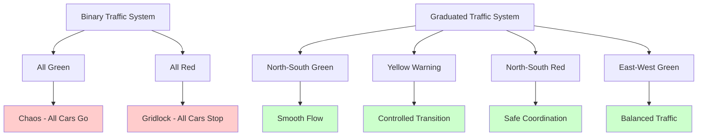
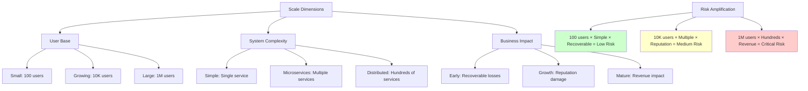
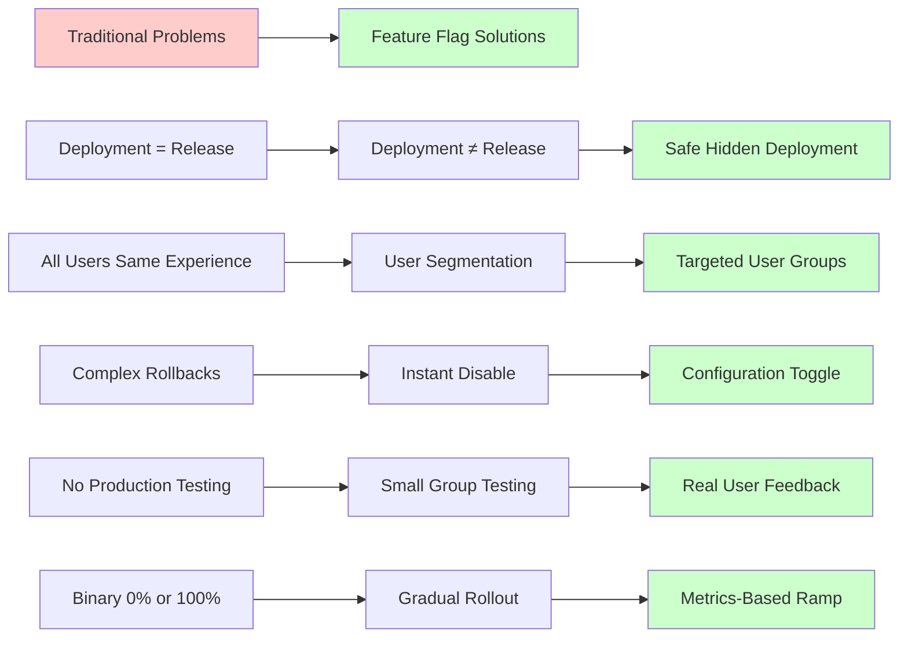
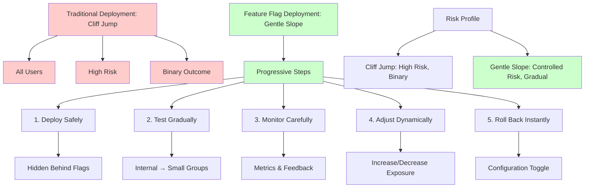

# The Core Problem: The Risk of Big Bang Releases

Picture this: You've been working on a major new feature for months. The code is tested, reviewed, and ready. You deploy it to production, and within minutes, your support channels explode with complaints. The feature that worked perfectly in testing is causing chaos in production. Users are confused, systems are struggling, and you're frantically rolling back while damage control begins.

This scenario plays out in engineering teams worldwide every day. **The fundamental problem is that traditional deployment strategies create an all-or-nothing moment of truth.**

## The Big Bang Problem

In traditional software deployment, there's a binary moment when a feature either exists or doesn't. You write code, test it, and then flip a switch that exposes it to 100% of your users simultaneously. This creates several critical risks:

### 1. **Blast Radius Maximization**
When something goes wrong, it affects everyone at once. A bug that impacts 1% of users under normal conditions suddenly impacts 100% of users when released simultaneously.

### 2. **No Graceful Degradation**
If the feature causes problems, your only option is complete rollback. There's no middle ground - no way to reduce exposure while fixing issues.

### 3. **Limited Real-World Testing**
Your staging environment, no matter how sophisticated, cannot replicate the full complexity of production traffic, edge cases, and user behaviors.

### 4. **Pressure-Cooker Decisions**
When issues arise, decisions must be made quickly under pressure. There's no time for measured analysis or gradual adjustments.

## The Real-World Analogy: Traffic Light Systems

Imagine if traffic lights could only operate in two modes: all green or all red. Every intersection change would be a moment of maximum chaos. Cars would either flow freely in all directions (causing accidents) or stop completely (causing gridlock).

Real traffic systems use intermediate states - yellow lights, pedestrian phases, and coordinated timing. This allows for smooth transitions and graceful handling of edge cases.

Feature flags provide the same graduated control for software releases.

## The Scale Amplification Effect

The problem becomes exponentially worse as your system grows:

### User Base Growth
- **Small team**: 100 users affected by a bad release
- **Growing company**: 10,000 users affected
- **Large platform**: 1 million users affected

### System Complexity Growth
- **Simple application**: Single service, predictable load
- **Microservices**: Multiple services, complex interactions
- **Distributed platform**: Hundreds of services, emergent behaviors

### Business Impact Growth
- **Early stage**: Lost users can be recovered
- **Growth stage**: Reputation damage affects acquisition
- **Mature business**: Customer churn has massive revenue impact

## The Hidden Costs of Traditional Deployment

### Engineering Velocity
Teams become risk-averse, over-engineering features because the cost of failure is so high. Innovation slows as developers add layers of defensive code.

### Testing Burden
Attempting to catch every possible issue before release leads to elaborate testing suites that still miss production-specific problems.

### Release Stress
Deployments become high-stress events requiring all-hands coordination, late-night windows, and extensive rollback procedures.

### Customer Experience
Users become unwilling beta testers, experiencing bugs and half-working features with no recourse.

## The Specific Problems Feature Flags Solve

### 1. **Deployment vs. Release Timing**
**Problem**: Code must be deployed and released simultaneously
**Solution**: Code can be deployed safely while remaining hidden behind flags

### 2. **User Segmentation**
**Problem**: All users must receive the same experience
**Solution**: Different user groups can have different feature sets

### 3. **Rollback Complexity**
**Problem**: Rollbacks require code deployments under pressure
**Solution**: Features can be disabled instantly without code changes

### 4. **Testing in Production**
**Problem**: Production problems can't be discovered until full release
**Solution**: Features can be tested with small user groups first

### 5. **Gradual Rollout**
**Problem**: Features must be 0% or 100% enabled
**Solution**: Features can be gradually ramped up based on metrics

## The Cost of Inaction

Without feature flags, teams often develop workarounds that create technical debt:

### Environment Sprawl
Multiple staging environments trying to simulate production conditions, each with their own maintenance overhead.

### Feature Branches
Long-lived feature branches that become increasingly difficult to merge and deploy.

### Monolithic Releases
Bundling multiple features into large releases, making it harder to isolate issues.

### Conservative Engineering
Over-engineering features because the cost of production issues is so high.

## The Paradigm Shift

Feature flags represent a fundamental shift in thinking:

**From**: "Is this feature ready for everyone?"
**To**: "Is this feature ready for someone?"

**From**: "Will this work in production?"
**To**: "How will this work with real users?"

**From**: "Deploy when perfect"
**To**: "Deploy when safe, release when ready"

This shift enables a new approach to software development where:
- Features are deployed continuously but released strategically
- Real user feedback guides development iterations
- Problems are contained to small user groups
- Releases become low-risk, frequent events

## The Promise of Progressive Rollouts

Feature flags transform the deployment model from a dangerous cliff jump into a gentle slope:

1. **Deploy safely**: Code goes to production hidden behind flags
2. **Test gradually**: Enable for internal users, then small external groups
3. **Monitor carefully**: Watch metrics and user feedback
4. **Adjust dynamically**: Increase or decrease exposure based on results
5. **Roll back instantly**: Disable problematic features without code changes

The next section will explore the guiding philosophy that makes this transformation possible: the separation of deployment from release.