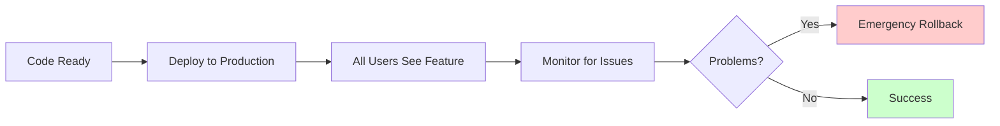
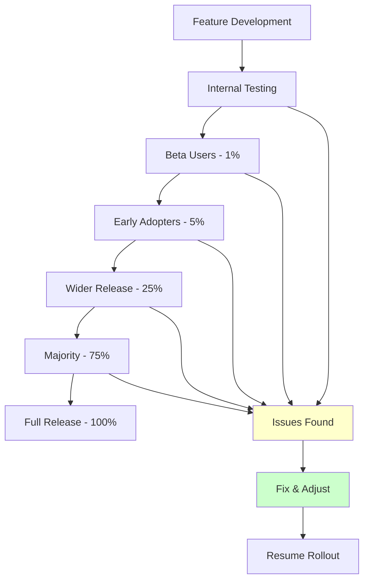
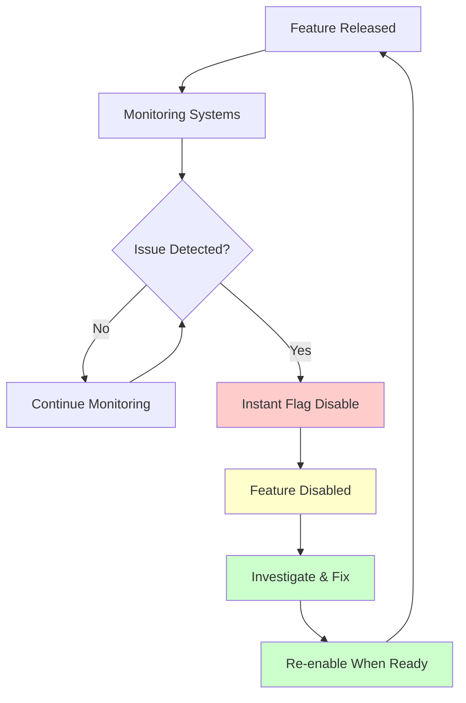
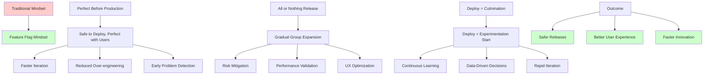
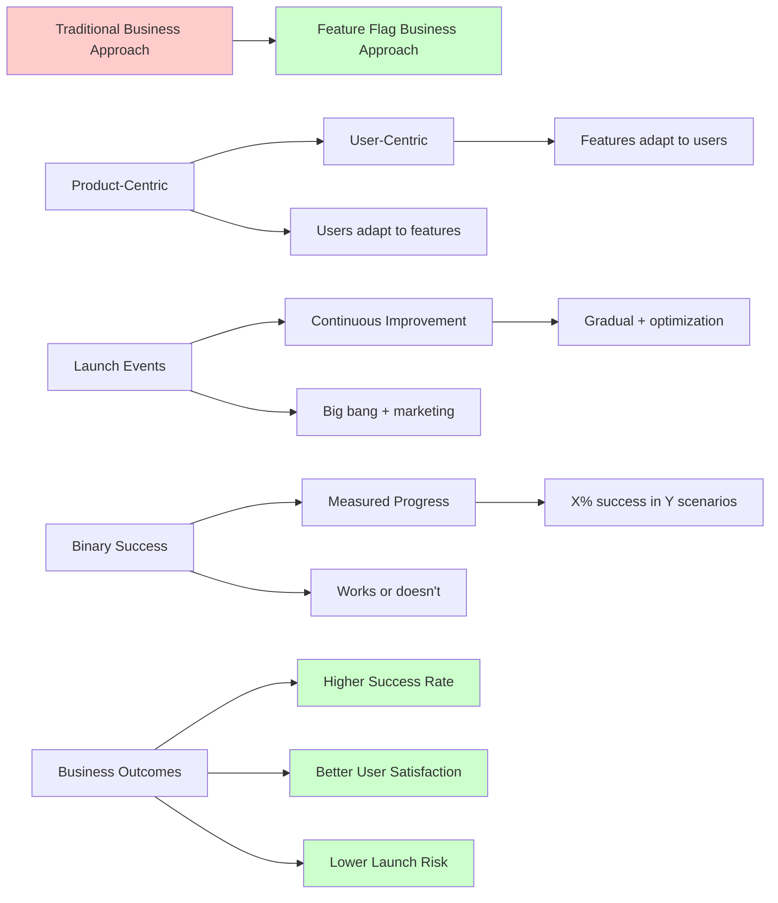
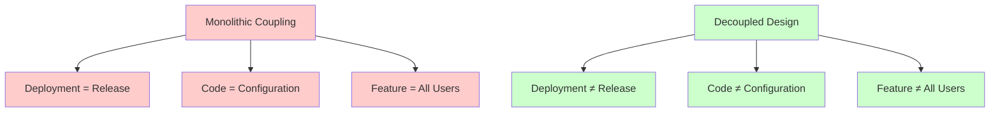
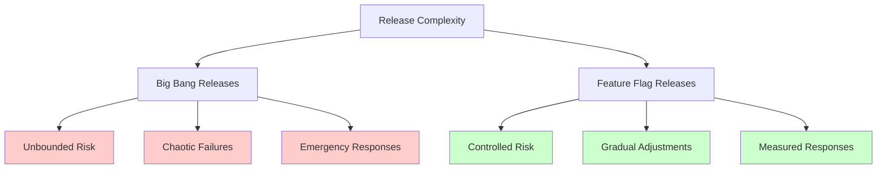
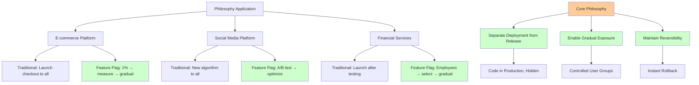

# The Guiding Philosophy: Separating Deployment from Release

The fundamental insight that makes feature flags revolutionary is deceptively simple: **deployment and release are two different things**. This separation creates a new paradigm where code can exist in production without being active, enabling unprecedented control over user experiences.

## The Traditional Coupling Problem

In traditional software development, deployment and release are tightly coupled:



This coupling creates a binary world where features are either completely available or completely unavailable. There's no middle ground, no gradual introduction, no targeted testing with real users.

## The Feature Flag Paradigm

Feature flags introduce a layer of indirection that breaks this coupling:


This paradigm shift enables several powerful capabilities:

### 1. **Safe Deployment**
Code can be deployed to production in a completely safe state, hidden behind flags. This removes the deployment risk and allows for continuous integration.

### 2. **Targeted Testing**
Features can be enabled for specific user groups, allowing real-world testing without affecting the entire user base.

### 3. **Gradual Rollout**
Features can be gradually exposed to larger percentages of users, allowing for careful monitoring and adjustment.

### 4. **Instant Rollback**
Problems can be resolved immediately by disabling flags, without requiring code deployments or emergency procedures.

## The Three Core Principles

Feature flags are built on three fundamental principles that guide their design and implementation:

### Principle 1: Configuration Over Code

**Philosophy**: Feature behavior should be controlled by configuration, not code changes.

**Traditional Approach**:
```javascript
// To disable a feature, you need to comment out code
function processOrder(order) {
    // Feature enabled by code presence
    if (order.isPremium) {
        applyPremiumBenefits(order);
    }
    
    processPayment(order);
}
```

**Feature Flag Approach**:
```javascript
// Feature controlled by configuration
function processOrder(order) {
    if (featureFlag.isEnabled('premium-benefits') && order.isPremium) {
        applyPremiumBenefits(order);
    }
    
    processPayment(order);
}
```

This principle enables features to be controlled without code changes, deployments, or downtime.

### Principle 2: Progressive Disclosure

**Philosophy**: Features should be revealed gradually, allowing for measurement and adjustment at each step.



This progressive approach allows teams to:
- **Validate hypotheses** with real user data
- **Catch issues** before they affect large user groups
- **Adjust features** based on actual usage patterns
- **Build confidence** through gradual exposure

### Principle 3: Reversibility

**Philosophy**: Every feature release should be instantly reversible without code changes.

**The Reversibility Guarantee**:
- Features can be disabled immediately
- No deployment pipeline required
- No downtime or service interruption
- Rollback time measured in seconds, not minutes or hours



## The Philosophy in Practice



### Mindset Shift 1: From "Perfect" to "Safe"

**Traditional mindset**: "This feature must be perfect before it goes to production."
**Feature flag mindset**: "This feature must be safe to deploy, then we'll make it perfect with real users."

This shift enables:
- **Faster iteration** based on real user feedback
- **Reduced over-engineering** of features
- **Early problem detection** in controlled environments

### Mindset Shift 2: From "All or Nothing" to "Gradual"

**Traditional mindset**: "We'll release to everyone simultaneously."
**Feature flag mindset**: "We'll release to specific groups and gradually expand."

This shift enables:
- **Risk mitigation** through controlled exposure
- **Performance validation** under real load
- **User experience optimization** based on actual usage

### Mindset Shift 3: From "Deploy to Release" to "Deploy to Experiment"

**Traditional mindset**: "Deployment is the culmination of development."
**Feature flag mindset**: "Deployment is the beginning of experimentation."

This shift enables:
- **Continuous learning** from user interactions
- **Data-driven decisions** about feature adoption
- **Rapid iteration** based on real-world feedback

## The Business Philosophy

Feature flags also represent a philosophical shift in how businesses think about software:



### From Product-Centric to User-Centric

**Traditional approach**: "We built this feature, users will adapt to it."
**Feature flag approach**: "We built this feature, let's see how users actually use it."

### From Launch Events to Continuous Improvement

**Traditional approach**: "Big bang launch with marketing push."
**Feature flag approach**: "Gradual rollout with continuous optimization."

### From Binary Success to Measured Progress

**Traditional approach**: "The feature either works or it doesn't."
**Feature flag approach**: "The feature works for X% of users in Y scenarios."

## The Technical Philosophy

### Decoupling as a Design Principle

Feature flags represent a broader principle of decoupling:



This decoupling enables:
- **Independent evolution** of different system aspects
- **Reduced complexity** in release management
- **Increased flexibility** in feature delivery

### Configuration as a First-Class Citizen

Feature flags elevate configuration from a afterthought to a core system component:

**Traditional View**: Configuration is static, set at deployment time
**Feature Flag View**: Configuration is dynamic, changeable at runtime

This elevation enables:
- **Runtime behavior modification** without code changes
- **A/B testing** and experimentation platforms
- **Operational control** over system behavior

## The Trade-offs

Like any architectural decision, feature flags come with trade-offs:

### Benefits
- **Reduced deployment risk** through gradual rollouts
- **Faster feedback loops** with real users
- **Improved reliability** through instant rollbacks
- **Better user experience** through targeted features

### Costs
- **Increased complexity** in codebase and testing
- **Configuration management** overhead
- **Technical debt** from long-lived flags
- **Performance impact** from flag evaluations

### The Philosophy of Acceptable Complexity

The feature flag philosophy embraces controlled complexity:

**Core insight**: The complexity of feature flags is **bounded and manageable**, while the complexity of big bang releases is **unbounded and chaotic**.



## The Philosophy in Action

Consider how this philosophy applies to different scenarios:



### E-commerce Platform
**Traditional**: Launch new checkout flow to all users
**Feature Flag**: Test with 1% of users, measure conversion rates, gradually increase

### Social Media Platform
**Traditional**: Release new feed algorithm to everyone
**Feature Flag**: A/B test with different user segments, optimize based on engagement

### Financial Services
**Traditional**: Launch new payment method after extensive testing
**Feature Flag**: Enable for internal employees, then select customers, then gradual rollout

In each case, the philosophy remains consistent: **separate deployment from release, enable gradual exposure, maintain reversibility**.

The next section will explore the key abstractions that make this philosophy concrete and implementable.