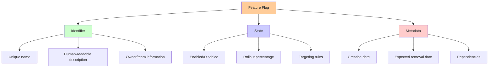
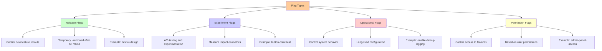
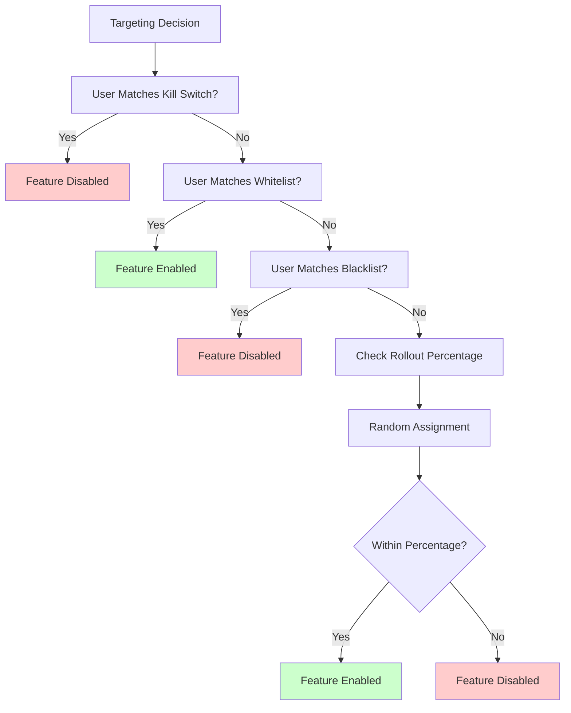
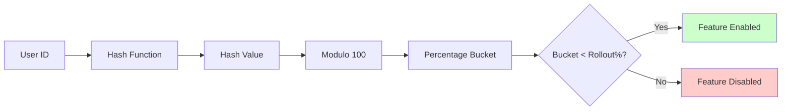
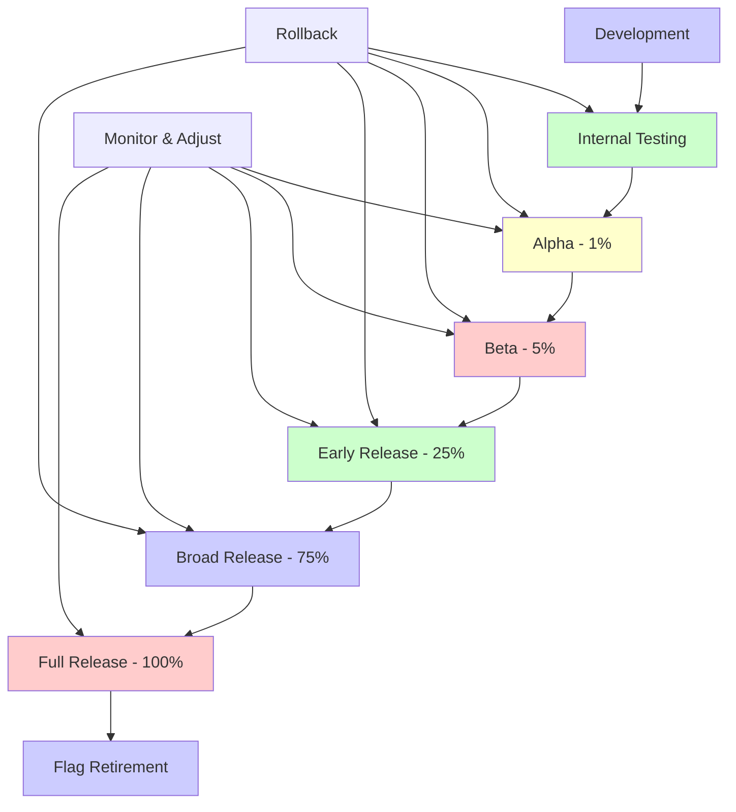
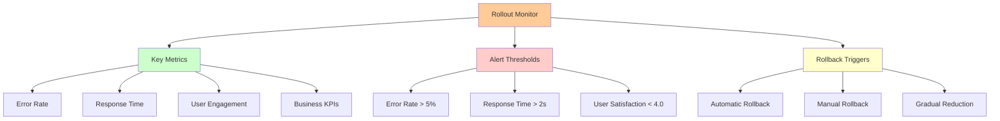
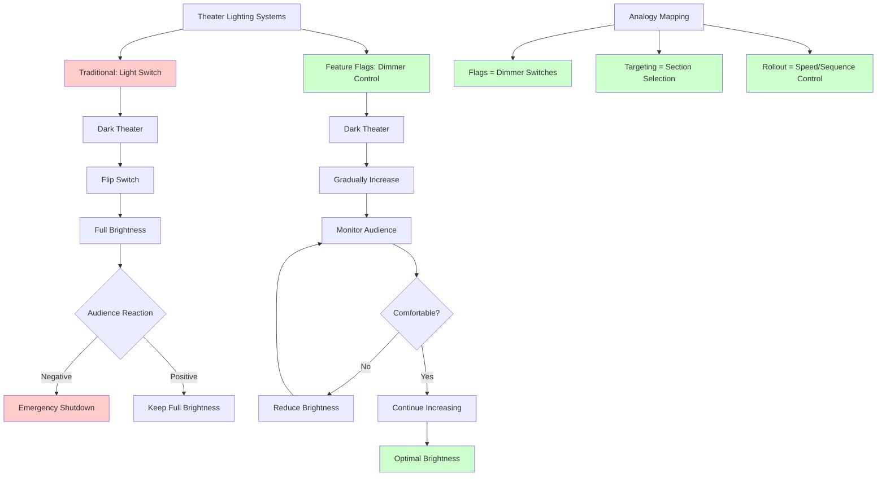
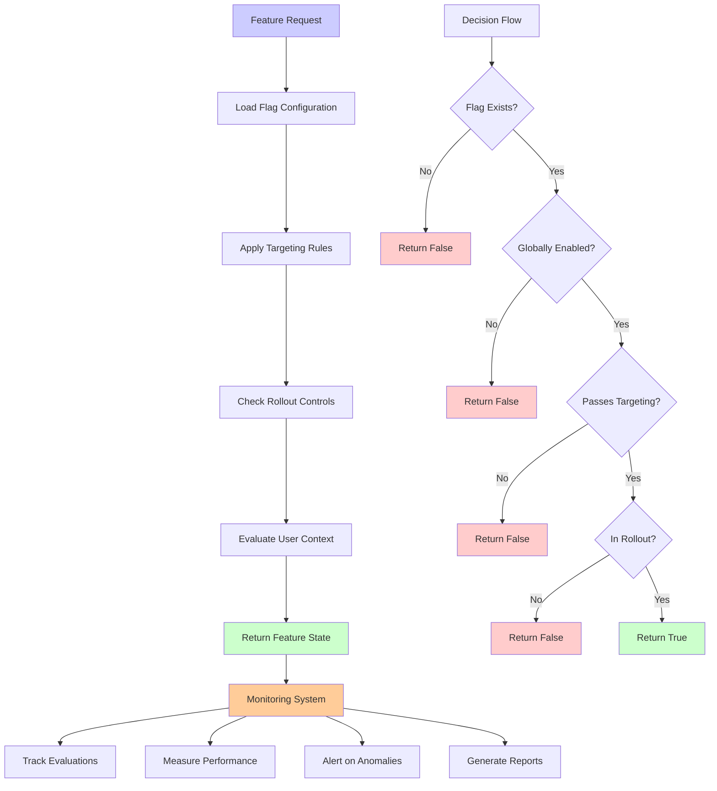

# Key Abstractions: Flags, Targeting, and Rollout Controls

Feature flags are built on three fundamental abstractions that work together to enable safe, controlled feature releases. Understanding these abstractions is crucial for designing effective feature flag systems and using them successfully in production.

## Abstraction 1: The Flag

**A flag is a named boolean configuration that controls whether a feature is active.**

At its simplest, a flag is just a switch that can be turned on or off. However, in practice, flags are more sophisticated configuration entities that encapsulate feature behavior.



### The Anatomy of a Flag

A well-designed flag contains several components:

```javascript
const flag = {
  // Core identity
  name: "premium-checkout-flow",
  description: "New streamlined checkout experience for premium users",
  owner: "checkout-team",
  
  // State configuration
  enabled: true,
  rolloutPercentage: 25,
  
  // Targeting rules
  targeting: {
    userSegments: ["premium-users"],
    geolocations: ["US", "CA"],
    customRules: ["user.accountAge > 30"]
  },
  
  // Lifecycle metadata
  createdAt: "2024-01-15",
  expectedRemovalDate: "2024-04-15",
  dependencies: ["user-service", "payment-service"]
};
```

### Types of Flags

Different types of flags serve different purposes:



## Abstraction 2: Targeting Rules

**Targeting rules determine which users should see which version of a feature.**

While a flag can be simply on or off, targeting rules provide sophisticated control over who experiences different feature states. This is where the real power of feature flags emerges.

### The Targeting Hierarchy



### Targeting Mechanisms

#### 1. User Attributes
Target users based on their characteristics:

```javascript
// User-based targeting
const userTargeting = {
  userId: ["user123", "user456"],           // Specific users
  userSegment: ["premium", "beta-tester"],  // User categories
  email: ["@company.com"],                  // Email patterns
  accountAge: { min: 30, max: 365 },        // Account age in days
  subscriptionTier: ["pro", "enterprise"]   // Subscription levels
};
```

#### 2. Contextual Attributes
Target based on request context:

```javascript
// Context-based targeting
const contextTargeting = {
  geolocation: ["US", "CA", "GB"],          // Geographic regions
  device: ["mobile", "desktop"],            // Device types
  browser: ["chrome", "firefox"],           // Browser types
  timeWindow: {                             // Time-based rules
    start: "09:00",
    end: "17:00",
    timezone: "PST"
  }
};
```

#### 3. Custom Rules
Advanced targeting with custom logic:

```javascript
// Custom rule targeting
const customTargeting = {
  rules: [
    "user.lastLoginDate > Date.now() - 7*24*60*60*1000", // Active users
    "user.purchaseHistory.length > 5",                   // Frequent buyers
    "context.referrer.includes('social-media')"          // Social referrals
  ]
};
```

### The Consistent Hashing Approach

For percentage-based rollouts, consistent hashing ensures users have a stable experience:



This approach ensures:
- **Consistency**: Same user always gets same experience
- **Predictability**: Rollout percentages are accurate
- **Stickiness**: Users don't flip between enabled/disabled states

## Abstraction 3: Rollout Controls

**Rollout controls manage the gradual exposure of features to users over time.**

This is where the "progressive" aspect of progressive rollouts comes into play. Instead of binary on/off switches, rollout controls provide graduated exposure mechanisms.

### The Rollout Lifecycle



### Rollout Strategies

#### 1. Percentage Rollouts
Gradually increase the percentage of users who see the feature:

```javascript
const percentageRollout = {
  strategy: "percentage",
  schedule: [
    { date: "2024-01-01", percentage: 1 },
    { date: "2024-01-03", percentage: 5 },
    { date: "2024-01-07", percentage: 25 },
    { date: "2024-01-14", percentage: 75 },
    { date: "2024-01-21", percentage: 100 }
  ]
};
```

#### 2. Segment Rollouts
Roll out to specific user segments sequentially:

```javascript
const segmentRollout = {
  strategy: "segment",
  sequence: [
    { segment: "internal-users", date: "2024-01-01" },
    { segment: "beta-testers", date: "2024-01-03" },
    { segment: "premium-users", date: "2024-01-07" },
    { segment: "all-users", date: "2024-01-14" }
  ]
};
```

#### 3. Geographic Rollouts
Roll out region by region:

```javascript
const geoRollout = {
  strategy: "geographic",
  regions: [
    { region: "US-West", date: "2024-01-01" },
    { region: "US-East", date: "2024-01-03" },
    { region: "Canada", date: "2024-01-07" },
    { region: "Europe", date: "2024-01-14" },
    { region: "Global", date: "2024-01-21" }
  ]
};
```

### Rollout Monitoring and Controls



## The Theater Dimmer Analogy

Think of feature flags like a theater's lighting system. Instead of harsh on/off switches, you have dimmer controls that allow for smooth transitions:



### Traditional Deployment (Light Switch)
- Binary: Off → On
- High risk of audience discomfort
- Emergency shutdown required for problems

### Feature Flag Deployment (Dimmer Control)
- Gradual: Dark → Gradually Brighter → Optimal
- Continuous monitoring and adjustment
- Smooth transitions and fine-tuned control

In the theater analogy:
- **Flags** are the dimmer switches for different sections
- **Targeting** determines which sections get lit up
- **Rollout controls** manage the speed and sequence of lighting changes

## Integration and Orchestration

These three abstractions work together to create a powerful system:

### Flag Evaluation Pipeline


### Real-World Example: E-commerce Checkout

Consider rolling out a new checkout flow:

```javascript
const checkoutFlagConfig = {
  // Flag definition
  flag: {
    name: "streamlined-checkout",
    description: "Simplified one-page checkout experience",
    owner: "conversion-team"
  },
  
  // Targeting rules
  targeting: {
    userSegments: ["registered-users"],
    excludeSegments: ["high-value-enterprise"],
    geolocations: ["US", "CA"],
    customRules: [
      "user.purchaseHistory.length > 0",
      "user.cartValue < 500"
    ]
  },
  
  // Rollout controls
  rollout: {
    strategy: "percentage",
    currentPercentage: 15,
    schedule: [
      { date: "2024-01-01", percentage: 1 },
      { date: "2024-01-05", percentage: 5 },
      { date: "2024-01-10", percentage: 15 }, // Current
      { date: "2024-01-15", percentage: 40 },
      { date: "2024-01-20", percentage: 100 }
    ]
  },
  
  // Monitoring
  monitoring: {
    metrics: ["conversion_rate", "cart_abandonment", "error_rate"],
    alertThresholds: {
      conversion_rate: { min: 0.85 }, // Alert if < 85% of baseline
      error_rate: { max: 0.02 }       // Alert if > 2% error rate
    }
  }
};
```

This configuration enables:
- **Safe rollout** to a subset of users
- **Targeted exposure** to appropriate user segments
- **Automated monitoring** with rollback capabilities
- **Gradual expansion** based on performance metrics

## The Abstraction Benefits

These three abstractions provide several key benefits:

```mermaid
graph TD
    A[Abstraction Benefits] --> B[Separation of Concerns]
    A --> C[Composability]
    A --> D[Testability]
    A --> E[Observability]
    
    B --> B1[Flags: Feature ID & State]
    B --> B2[Targeting: User Selection]
    B --> B3[Rollout: Temporal Strategy]
    
    C --> C1[Mix Targeting Strategies]
    C --> C2[Combine Rollout Approaches]
    C --> C3[Layer Additional Controls]
    
    D --> D1[Test Rules Independently]
    D --> D2[Validate with Simulated Users]
    D --> D3[Mock Flag States]
    
    E --> E1[Track Evaluations]
    E --> E2[Monitor Effectiveness]
    E --> E3[Measure Success Metrics]
    
    F[System Properties] --> G[Maintainable]
    F --> H[Scalable]
    F --> I[Reliable]
    F --> J[Auditable]
    
    style A fill:#ffcc99
    style B fill:#ccffcc
    style C fill:#ccffcc
    style D fill:#ccffcc
    style E fill:#ccffcc
    style G fill:#ccffcc
    style H fill:#ccffcc
    style I fill:#ccffcc
    style J fill:#ccffcc
```



### 1. **Separation of Concerns**
- **Flags** handle feature identification and basic state
- **Targeting** handles user selection logic
- **Rollout controls** handle temporal and strategic concerns

### 2. **Composability**
- Mix and match different targeting strategies
- Combine multiple rollout approaches
- Layer additional controls without changing core logic

### 3. **Testability**
- Test targeting rules independently
- Validate rollout strategies with simulated users
- Mock flag states for different test scenarios

### 4. **Observability**
- Track flag evaluations and performance
- Monitor targeting effectiveness
- Measure rollout success metrics

### 5. **Emergent System Properties**
- **Maintainable**: Clear boundaries and responsibilities
- **Scalable**: Independent scaling of each concern
- **Reliable**: Isolated failure modes
- **Auditable**: Clear evaluation trails

The next section will show you how to implement these abstractions in a practical feature flag system.