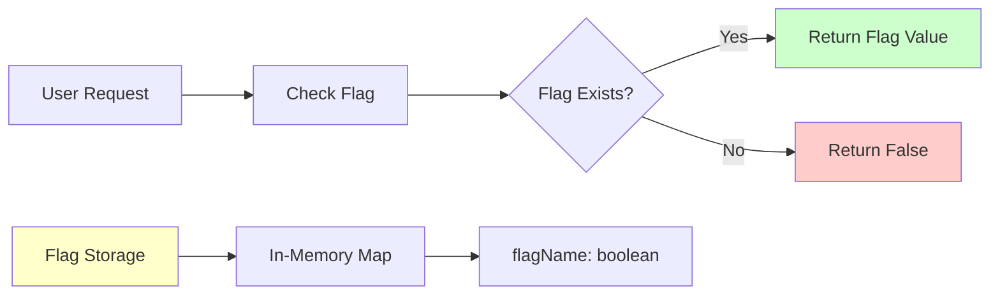
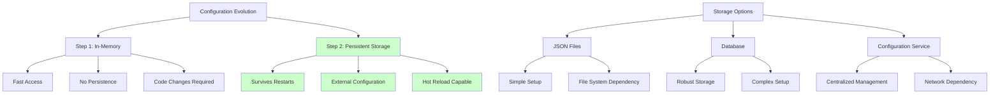
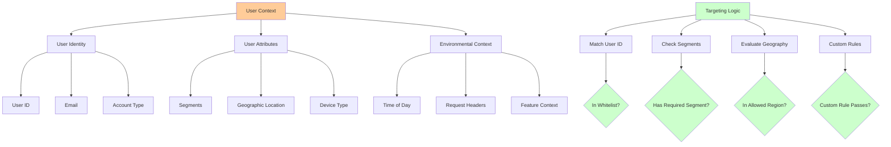

# Implementing Feature Flags: From Simple Boolean to Production-Ready System

This guide walks through building a feature flag system from scratch, starting with a simple boolean flag and evolving into a production-ready system with targeting, rollout controls, and monitoring.

## Step 1: The Basic Boolean Flag

Let's start with the simplest possible implementation - a boolean flag that can be toggled on and off:



```javascript
// Simple boolean flag implementation
class SimpleFeatureFlag {
  constructor() {
    this.flags = new Map();
  }
  
  // Set a flag value
  setFlag(name, enabled) {
    this.flags.set(name, enabled);
  }
  
  // Check if a flag is enabled
  isEnabled(name) {
    return this.flags.get(name) || false;
  }
  
  // List all flags
  listFlags() {
    return Object.fromEntries(this.flags);
  }
}
```

// Usage example
const featureFlags = new SimpleFeatureFlag();

// Set flags
featureFlags.setFlag('new-checkout-flow', true);
featureFlags.setFlag('dark-mode', false);

// Use flags in code
function renderCheckout() {
  if (featureFlags.isEnabled('new-checkout-flow')) {
    return renderNewCheckoutFlow();
  } else {
    return renderLegacyCheckoutFlow();
  }
}
```

**Pros**: Simple, fast, easy to understand
**Cons**: No persistence, no targeting, no rollout controls

## Step 2: Adding Persistence and Configuration

Real feature flags need to survive server restarts and be configurable without code changes:



```javascript
// Flag configuration stored in JSON
const flagConfig = {
  "new-checkout-flow": {
    "enabled": true,
    "description": "New streamlined checkout experience"
  },
  "dark-mode": {
    "enabled": false,
    "description": "Dark theme for the application"
  }
};

class ConfigurableFeatureFlag {
  constructor(configPath = './flags.json') {
    this.configPath = configPath;
    this.flags = new Map();
    this.loadConfig();
  }
  
  // Load configuration from file
  loadConfig() {
    try {
      const fs = require('fs');
      const config = JSON.parse(fs.readFileSync(this.configPath, 'utf8'));
      
      for (const [name, settings] of Object.entries(config)) {
        this.flags.set(name, settings);
      }
    } catch (error) {
      console.warn('Failed to load flag config:', error.message);
    }
  }
  
  // Save configuration to file
  saveConfig() {
    try {
      const fs = require('fs');
      const config = Object.fromEntries(this.flags);
      fs.writeFileSync(this.configPath, JSON.stringify(config, null, 2));
    } catch (error) {
      console.error('Failed to save flag config:', error.message);
    }
  }
  
  // Set flag with metadata
  setFlag(name, enabled, description = '') {
    this.flags.set(name, { enabled, description });
    this.saveConfig();
  }
  
  // Check if flag is enabled
  isEnabled(name) {
    const flag = this.flags.get(name);
    return flag ? flag.enabled : false;
  }
  
  // Get flag details
  getFlag(name) {
    return this.flags.get(name) || null;
  }
  
  // Hot reload configuration
  reloadConfig() {
    this.loadConfig();
  }
}

// Usage with persistence
const featureFlags = new ConfigurableFeatureFlag('./config/flags.json');

// Flags persist across server restarts
featureFlags.setFlag('new-checkout-flow', true, 'New streamlined checkout');
```

## Step 3: Adding User Context and Targeting

Now let's add the ability to target specific users or user groups:



```javascript
class TargetedFeatureFlag {
  constructor(configPath = './flags.json') {
    this.configPath = configPath;
    this.flags = new Map();
    this.loadConfig();
  }
  
  loadConfig() {
    try {
      const fs = require('fs');
      const config = JSON.parse(fs.readFileSync(this.configPath, 'utf8'));
      
      for (const [name, settings] of Object.entries(config)) {
        this.flags.set(name, {
          enabled: settings.enabled || false,
          description: settings.description || '',
          targeting: settings.targeting || {},
          rolloutPercentage: settings.rolloutPercentage || 0
        });
      }
    } catch (error) {
      console.warn('Failed to load flag config:', error.message);
    }
  }
  
  // Check if flag is enabled for specific user
  isEnabled(name, userContext = {}) {
    const flag = this.flags.get(name);
    if (!flag) return false;
    
    // If flag is completely disabled, return false
    if (!flag.enabled) return false;
    
    // Check targeting rules
    if (!this.matchesTargeting(flag.targeting, userContext)) {
      return false;
    }
    
    // Check rollout percentage
    return this.isInRollout(name, userContext.userId, flag.rolloutPercentage);
  }
  
  // Check if user matches targeting rules
  matchesTargeting(targeting, userContext) {
    // No targeting rules means everyone matches
    if (!targeting || Object.keys(targeting).length === 0) {
      return true;
    }
    
    // Check user ID whitelist
    if (targeting.userIds && targeting.userIds.length > 0) {
      return targeting.userIds.includes(userContext.userId);
    }
    
    // Check user segments
    if (targeting.segments && targeting.segments.length > 0) {
      const userSegments = userContext.segments || [];
      return targeting.segments.some(segment => userSegments.includes(segment));
    }
    
    // Check geographic targeting
    if (targeting.countries && targeting.countries.length > 0) {
      return targeting.countries.includes(userContext.country);
    }
    
    // Check custom attributes
    if (targeting.customAttributes) {
      return this.evaluateCustomAttributes(targeting.customAttributes, userContext);
    }
    
    return true;
  }
  
  // Evaluate custom attribute rules
  evaluateCustomAttributes(rules, userContext) {
    for (const [attribute, expectedValue] of Object.entries(rules)) {
      const actualValue = userContext[attribute];
      
      if (Array.isArray(expectedValue)) {
        if (!expectedValue.includes(actualValue)) return false;
      } else if (actualValue !== expectedValue) {
        return false;
      }
    }
    return true;
  }
  
  // Consistent hashing for rollout percentage
  isInRollout(flagName, userId, percentage) {
    if (percentage >= 100) return true;
    if (percentage <= 0) return false;
    
    // Create consistent hash
    const hash = this.simpleHash(flagName + userId);
    const bucket = hash % 100;
    
    return bucket < percentage;
  }
  
  // Simple hash function for consistent user bucketing
  simpleHash(str) {
    let hash = 0;
    for (let i = 0; i < str.length; i++) {
      const char = str.charCodeAt(i);
      hash = ((hash << 5) - hash) + char;
      hash = hash & hash; // Convert to 32-bit integer
    }
    return Math.abs(hash);
  }
  
  // Update flag with targeting
  setFlag(name, enabled, options = {}) {
    const flag = {
      enabled,
      description: options.description || '',
      targeting: options.targeting || {},
      rolloutPercentage: options.rolloutPercentage || 0
    };
    
    this.flags.set(name, flag);
    this.saveConfig();
  }
  
  saveConfig() {
    try {
      const fs = require('fs');
      const config = Object.fromEntries(this.flags);
      fs.writeFileSync(this.configPath, JSON.stringify(config, null, 2));
    } catch (error) {
      console.error('Failed to save flag config:', error.message);
    }
  }
}

// Usage with targeting
const featureFlags = new TargetedFeatureFlag('./config/flags.json');

// Set up a flag with targeting
featureFlags.setFlag('premium-features', true, {
  description: 'Premium features for paying customers',
  targeting: {
    segments: ['premium', 'enterprise'],
    countries: ['US', 'CA', 'GB']
  },
  rolloutPercentage: 25
});

// Check flag with user context
const userContext = {
  userId: 'user123',
  segments: ['premium'],
  country: 'US'
};

if (featureFlags.isEnabled('premium-features', userContext)) {
  // Show premium features
}
```

## Step 4: Adding Rollout Controls and Monitoring

Let's add sophisticated rollout controls and basic monitoring:

```mermaid
graph TD
    A[Rollout Strategies] --> B[Percentage Rollout]
    A --> C[Segment Rollout]
    A --> D[Geographic Rollout]
    A --> E[Gradual Rollout]
    
    B --> B1[Hash User ID]
    B --> B2[Bucket Assignment]
    B --> B3[Percentage Check]
    
    C --> C1[User Segments]
    C --> C2[Segment Matching]
    C --> C3[Enable for Matches]
    
    D --> D1[User Location]
    D --> D2[Region Matching]
    D --> D3[Enable for Regions]
    
    E --> E1[Time-based Schedule]
    E --> E2[Automatic Progression]
    E --> E3[Metric-based Gating]
    
    F[Monitoring] --> G[Evaluation Tracking]
    F --> H[Performance Metrics]
    F --> I[Error Monitoring]
    F --> J[Business Metrics]
    
    G --> K[Flag Usage Stats]
    H --> L[Response Times]
    I --> M[Error Rates]
    J --> N[Conversion Metrics]
    
    style A fill:#ffcc99
    style F fill:#ccffcc
    style K fill:#ccffcc
    style L fill:#ccffcc
    style M fill:#ccffcc
    style N fill:#ccffcc
```



```javascript
class ProductionFeatureFlag {
  constructor(configPath = './flags.json') {
    this.configPath = configPath;
    this.flags = new Map();
    this.metrics = new Map();
    this.loadConfig();
  }
  
  loadConfig() {
    try {
      const fs = require('fs');
      const config = JSON.parse(fs.readFileSync(this.configPath, 'utf8'));
      
      for (const [name, settings] of Object.entries(config)) {
        this.flags.set(name, {
          enabled: settings.enabled || false,
          description: settings.description || '',
          targeting: settings.targeting || {},
          rollout: settings.rollout || { strategy: 'percentage', percentage: 0 },
          monitoring: settings.monitoring || {},
          metadata: {
            createdAt: settings.metadata?.createdAt || new Date().toISOString(),
            owner: settings.metadata?.owner || 'unknown',
            expectedRemovalDate: settings.metadata?.expectedRemovalDate
          }
        });
      }
    } catch (error) {
      console.warn('Failed to load flag config:', error.message);
    }
  }
  
  // Enhanced flag evaluation with monitoring
  isEnabled(name, userContext = {}) {
    const flag = this.flags.get(name);
    if (!flag) {
      this.recordMetric(name, 'flag_not_found');
      return false;
    }
    
    // Global kill switch
    if (!flag.enabled) {
      this.recordMetric(name, 'globally_disabled');
      return false;
    }
    
    // Check targeting rules
    if (!this.matchesTargeting(flag.targeting, userContext)) {
      this.recordMetric(name, 'targeting_excluded');
      return false;
    }
    
    // Check rollout strategy
    const inRollout = this.isInRollout(name, userContext, flag.rollout);
    
    if (inRollout) {
      this.recordMetric(name, 'enabled');
      return true;
    } else {
      this.recordMetric(name, 'rollout_excluded');
      return false;
    }
  }
  
  // Advanced rollout strategies
  isInRollout(flagName, userContext, rollout) {
    switch (rollout.strategy) {
      case 'percentage':
        return this.percentageRollout(flagName, userContext.userId, rollout.percentage);
      
      case 'segment':
        return this.segmentRollout(userContext, rollout.segments);
      
      case 'geographic':
        return this.geographicRollout(userContext, rollout.regions);
      
      case 'gradual':
        return this.gradualRollout(flagName, userContext.userId, rollout);
      
      default:
        return false;
    }
  }
  
  // Percentage-based rollout
  percentageRollout(flagName, userId, percentage) {
    if (percentage >= 100) return true;
    if (percentage <= 0) return false;
    
    const hash = this.simpleHash(flagName + userId);
    const bucket = hash % 100;
    
    return bucket < percentage;
  }
  
  // Segment-based rollout
  segmentRollout(userContext, allowedSegments) {
    const userSegments = userContext.segments || [];
    return allowedSegments.some(segment => userSegments.includes(segment));
  }
  
  // Geographic rollout
  geographicRollout(userContext, allowedRegions) {
    return allowedRegions.includes(userContext.country);
  }
  
  // Gradual rollout based on schedule
  gradualRollout(flagName, userId, rollout) {
    const now = new Date();
    const schedule = rollout.schedule || [];
    
    // Find the current rollout stage
    let currentPercentage = 0;
    for (const stage of schedule) {
      if (now >= new Date(stage.date)) {
        currentPercentage = stage.percentage;
      } else {
        break;
      }
    }
    
    return this.percentageRollout(flagName, userId, currentPercentage);
  }
  
  // Enhanced targeting with custom rules
  matchesTargeting(targeting, userContext) {
    if (!targeting || Object.keys(targeting).length === 0) {
      return true;
    }
    
    // Check blacklist first
    if (targeting.blacklist) {
      if (targeting.blacklist.userIds?.includes(userContext.userId)) return false;
      if (targeting.blacklist.segments?.some(s => userContext.segments?.includes(s))) return false;
    }
    
    // Check whitelist
    if (targeting.whitelist) {
      if (targeting.whitelist.userIds?.includes(userContext.userId)) return true;
      if (targeting.whitelist.segments?.some(s => userContext.segments?.includes(s))) return true;
    }
    
    // Check standard targeting rules
    if (targeting.segments && targeting.segments.length > 0) {
      const userSegments = userContext.segments || [];
      if (!targeting.segments.some(segment => userSegments.includes(segment))) {
        return false;
      }
    }
    
    if (targeting.countries && targeting.countries.length > 0) {
      if (!targeting.countries.includes(userContext.country)) {
        return false;
      }
    }
    
    // Check custom rules
    if (targeting.customRules) {
      for (const rule of targeting.customRules) {
        if (!this.evaluateCustomRule(rule, userContext)) {
          return false;
        }
      }
    }
    
    return true;
  }
  
  // Evaluate custom rules (simplified)
  evaluateCustomRule(rule, userContext) {
    try {
      // In production, use a proper rule engine
      // This is a simplified example
      return new Function('user', `return ${rule}`)(userContext);
    } catch (error) {
      console.error('Rule evaluation error:', error);
      return false;
    }
  }
  
  // Record metrics for monitoring
  recordMetric(flagName, outcome) {
    if (!this.metrics.has(flagName)) {
      this.metrics.set(flagName, {});
    }
    
    const flagMetrics = this.metrics.get(flagName);
    flagMetrics[outcome] = (flagMetrics[outcome] || 0) + 1;
    
    // In production, send to monitoring service
    // console.log(`Flag ${flagName}: ${outcome}`);
  }
  
  // Get flag metrics
  getMetrics(flagName) {
    return this.metrics.get(flagName) || {};
  }
  
  // Set flag with advanced configuration
  setFlag(name, config) {
    const flag = {
      enabled: config.enabled || false,
      description: config.description || '',
      targeting: config.targeting || {},
      rollout: config.rollout || { strategy: 'percentage', percentage: 0 },
      monitoring: config.monitoring || {},
      metadata: {
        createdAt: config.metadata?.createdAt || new Date().toISOString(),
        owner: config.metadata?.owner || 'unknown',
        expectedRemovalDate: config.metadata?.expectedRemovalDate,
        ...config.metadata
      }
    };
    
    this.flags.set(name, flag);
    this.saveConfig();
  }
  
  // Get flag configuration
  getFlag(name) {
    return this.flags.get(name);
  }
  
  // List all flags with their status
  listFlags() {
    const result = {};
    for (const [name, flag] of this.flags) {
      result[name] = {
        enabled: flag.enabled,
        description: flag.description,
        rolloutStrategy: flag.rollout.strategy,
        owner: flag.metadata.owner,
        createdAt: flag.metadata.createdAt
      };
    }
    return result;
  }
  
  // Flag cleanup - identify flags for removal
  getFlagsForCleanup() {
    const now = new Date();
    const result = [];
    
    for (const [name, flag] of this.flags) {
      if (flag.metadata.expectedRemovalDate) {
        const removalDate = new Date(flag.metadata.expectedRemovalDate);
        if (now > removalDate) {
          result.push({ name, ...flag });
        }
      }
    }
    
    return result;
  }
  
  simpleHash(str) {
    let hash = 0;
    for (let i = 0; i < str.length; i++) {
      const char = str.charCodeAt(i);
      hash = ((hash << 5) - hash) + char;
      hash = hash & hash;
    }
    return Math.abs(hash);
  }
  
  saveConfig() {
    try {
      const fs = require('fs');
      const config = Object.fromEntries(this.flags);
      fs.writeFileSync(this.configPath, JSON.stringify(config, null, 2));
    } catch (error) {
      console.error('Failed to save flag config:', error.message);
    }
  }
}

// Usage example with production features
const featureFlags = new ProductionFeatureFlag('./config/flags.json');

// Create a sophisticated flag configuration
featureFlags.setFlag('new-recommendation-engine', {
  enabled: true,
  description: 'AI-powered product recommendations',
  targeting: {
    segments: ['premium', 'beta-tester'],
    countries: ['US', 'CA'],
    customRules: [
      'user.accountAge > 30',
      'user.purchaseHistory.length > 5'
    ]
  },
  rollout: {
    strategy: 'gradual',
    schedule: [
      { date: '2024-01-01', percentage: 1 },
      { date: '2024-01-07', percentage: 10 },
      { date: '2024-01-14', percentage: 50 },
      { date: '2024-01-21', percentage: 100 }
    ]
  },
  metadata: {
    owner: 'ml-team',
    expectedRemovalDate: '2024-04-01'
  }
});

// Use the flag
const userContext = {
  userId: 'user123',
  segments: ['premium'],
  country: 'US',
  accountAge: 45,
  purchaseHistory: [1, 2, 3, 4, 5, 6]
};

if (featureFlags.isEnabled('new-recommendation-engine', userContext)) {
  // Show AI recommendations
}

// Monitor flag usage
console.log(featureFlags.getMetrics('new-recommendation-engine'));
```

## Step 5: Adding Administrative Interface

A simple web interface for managing flags:

```mermaid
graph TD
    A[Admin Interface] --> B[API Endpoints]
    A --> C[Web Dashboard]
    A --> D[CLI Tools]
    
    B --> B1[GET /api/flags]
    B --> B2[POST /api/flags/:name]
    B --> B3[PUT /api/flags/:name]
    B --> B4[DELETE /api/flags/:name]
    B --> B5[GET /api/flags/:name/evaluate]
    B --> B6[GET /api/flags/:name/metrics]
    
    C --> C1[Flag List View]
    C --> C2[Flag Editor]
    C --> C3[Metrics Dashboard]
    C --> C4[User Management]
    
    D --> D1[Flag Creation]
    D --> D2[Bulk Operations]
    D --> D3[Deployment Integration]
    
    E[Security] --> F[Authentication]
    E --> G[Authorization]
    E --> H[Audit Logging]
    
    F --> I[User Login]
    G --> J[Role-based Access]
    H --> K[Change Tracking]
    
    style A fill:#ffcc99
    style E fill:#ffcccc
    style I fill:#ccffcc
    style J fill:#ccffcc
    style K fill:#ccffcc
```



```javascript
const express = require('express');
const app = express();
app.use(express.json());

// Initialize feature flags
const featureFlags = new ProductionFeatureFlag('./config/flags.json');

// API endpoints for flag management
app.get('/api/flags', (req, res) => {
  res.json(featureFlags.listFlags());
});

app.get('/api/flags/:name', (req, res) => {
  const flag = featureFlags.getFlag(req.params.name);
  if (!flag) {
    return res.status(404).json({ error: 'Flag not found' });
  }
  res.json(flag);
});

app.post('/api/flags/:name', (req, res) => {
  try {
    featureFlags.setFlag(req.params.name, req.body);
    res.json({ success: true });
  } catch (error) {
    res.status(400).json({ error: error.message });
  }
});

app.get('/api/flags/:name/evaluate', (req, res) => {
  const userContext = req.query;
  const enabled = featureFlags.isEnabled(req.params.name, userContext);
  res.json({ enabled });
});

app.get('/api/flags/:name/metrics', (req, res) => {
  const metrics = featureFlags.getMetrics(req.params.name);
  res.json(metrics);
});

app.get('/api/cleanup', (req, res) => {
  const flagsForCleanup = featureFlags.getFlagsForCleanup();
  res.json(flagsForCleanup);
});

app.listen(3000, () => {
  console.log('Feature flag admin server running on port 3000');
});
```

## Step 6: Client-Side Usage Patterns

Common patterns for using feature flags in application code:

```mermaid
graph TD
    A[Usage Patterns] --> B[Simple Boolean Check]
    A --> C[Component Wrapper]
    A --> D[Configuration-Driven]
    A --> E[Gradual Rollout]
    
    B --> B1[if/else Logic]
    B --> B2[Direct Flag Check]
    B --> B3[Binary Behavior]
    
    C --> C1[React Component]
    C --> C2[Conditional Rendering]
    C --> C3[Fallback Support]
    
    D --> D1[Algorithm Selection]
    D --> D2[Feature Configuration]
    D --> D3[Behavior Modification]
    
    E --> E1[Canary Deployment]
    E --> E2[A/B Testing]
    E --> E3[Progressive Enhancement]
    
    F[Best Practices] --> G[Fail Safe]
    F --> H[Performance Caching]
    F --> I[Error Handling]
    F --> J[Testing Support]
    
    G --> K[Default to Safe Behavior]
    H --> L[Cache Evaluations]
    I --> M[Graceful Degradation]
    J --> N[Mock Flag States]
    
    style A fill:#ffcc99
    style F fill:#ccffcc
    style K fill:#ccffcc
    style L fill:#ccffcc
    style M fill:#ccffcc
    style N fill:#ccffcc
```



```javascript
// 1. Simple boolean check
function renderDashboard() {
  if (featureFlags.isEnabled('new-dashboard', userContext)) {
    return <NewDashboard />;
  } else {
    return <LegacyDashboard />;
  }
}

// 2. Feature flag wrapper component
function FeatureFlag({ flag, children, fallback = null }) {
  const enabled = featureFlags.isEnabled(flag, userContext);
  return enabled ? children : fallback;
}

// Usage:
<FeatureFlag flag="new-checkout" fallback={<LegacyCheckout />}>
  <NewCheckout />
</FeatureFlag>

// 3. Configuration-driven features
function getRecommendationConfig() {
  const config = {
    algorithm: 'collaborative-filtering',
    maxResults: 10,
    enablePersonalization: false
  };
  
  if (featureFlags.isEnabled('ml-recommendations', userContext)) {
    config.algorithm = 'deep-learning';
    config.enablePersonalization = true;
  }
  
  if (featureFlags.isEnabled('enhanced-results', userContext)) {
    config.maxResults = 25;
  }
  
  return config;
}

// 4. Gradual feature rollout
function processPayment(paymentData) {
  const useNewProcessor = featureFlags.isEnabled('new-payment-processor', userContext);
  
  if (useNewProcessor) {
    try {
      return await newPaymentProcessor.process(paymentData);
    } catch (error) {
      // Fallback to old processor on error
      console.warn('New payment processor failed, falling back:', error);
      return await legacyPaymentProcessor.process(paymentData);
    }
  } else {
    return await legacyPaymentProcessor.process(paymentData);
  }
}
```

## Best Practices for Implementation

### 1. **Fail Safe**
Always default to the safe/existing behavior when flags are missing or evaluation fails:

```javascript
function isEnabled(flagName, userContext) {
  try {
    return featureFlags.isEnabled(flagName, userContext);
  } catch (error) {
    console.error('Flag evaluation error:', error);
    return false; // Safe default
  }
}
```

### 2. **Performance Considerations**
Cache flag evaluations for expensive operations:

```javascript
class CachedFeatureFlag {
  constructor(baseFlags) {
    this.baseFlags = baseFlags;
    this.cache = new Map();
    this.cacheExpiry = 5 * 60 * 1000; // 5 minutes
  }
  
  isEnabled(flagName, userContext) {
    const cacheKey = `${flagName}-${userContext.userId}`;
    const cached = this.cache.get(cacheKey);
    
    if (cached && Date.now() < cached.expiry) {
      return cached.value;
    }
    
    const value = this.baseFlags.isEnabled(flagName, userContext);
    this.cache.set(cacheKey, {
      value,
      expiry: Date.now() + this.cacheExpiry
    });
    
    return value;
  }
}
```

### 3. **Monitoring and Alerting**
Track flag usage and performance impact:

```javascript
function trackFlagUsage(flagName, enabled, userContext) {
  // Send to analytics service
  analytics.track('feature_flag_evaluation', {
    flag: flagName,
    enabled: enabled,
    userId: userContext.userId,
    timestamp: Date.now()
  });
}
```

### 4. **Testing**
Make flags testable by allowing overrides:

```javascript
class TestableFeatureFlag {
  constructor(baseFlags) {
    this.baseFlags = baseFlags;
    this.overrides = new Map();
  }
  
  // Override for testing
  override(flagName, value) {
    this.overrides.set(flagName, value);
  }
  
  isEnabled(flagName, userContext) {
    if (this.overrides.has(flagName)) {
      return this.overrides.get(flagName);
    }
    return this.baseFlags.isEnabled(flagName, userContext);
  }
}
```

This implementation provides a solid foundation for feature flags in production environments. The next section will explore the challenges and lifecycle management of feature flags as they evolve in real-world systems.