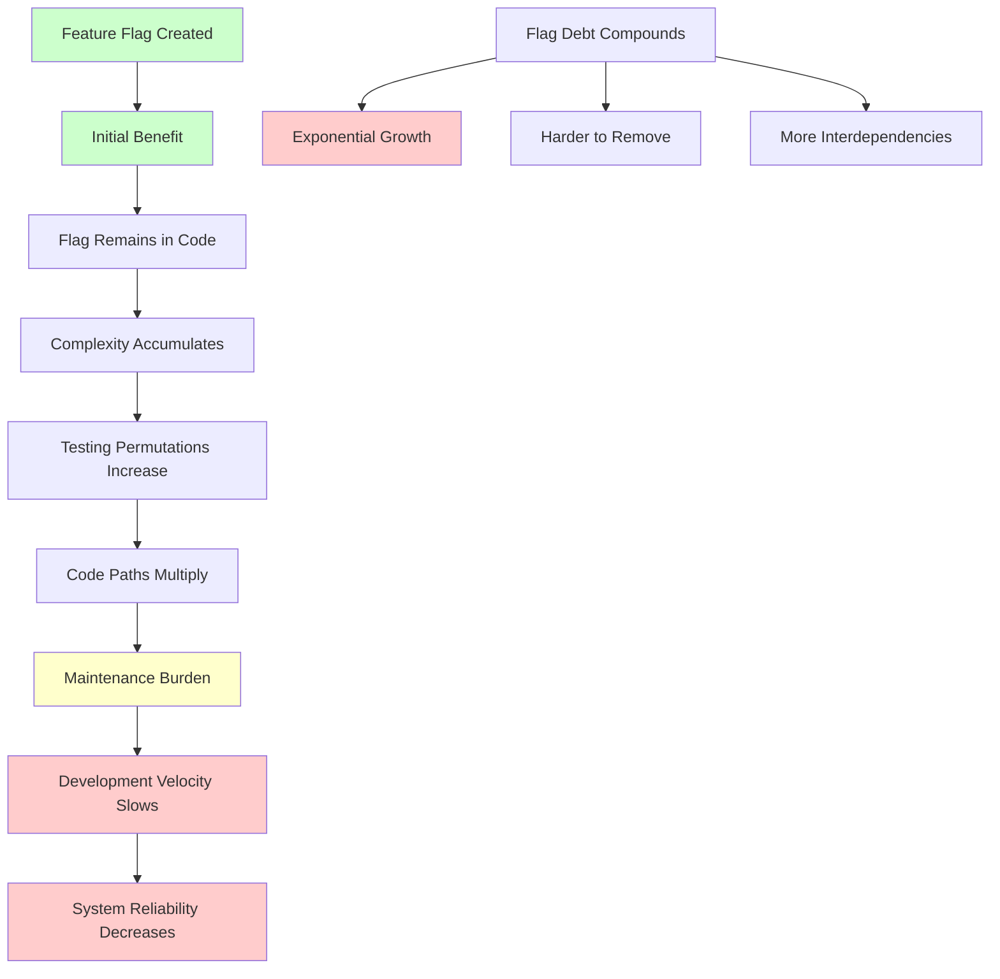
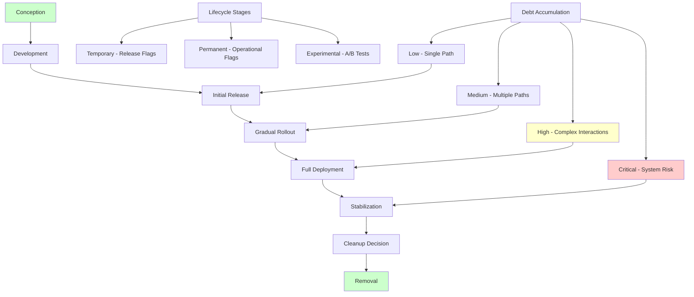
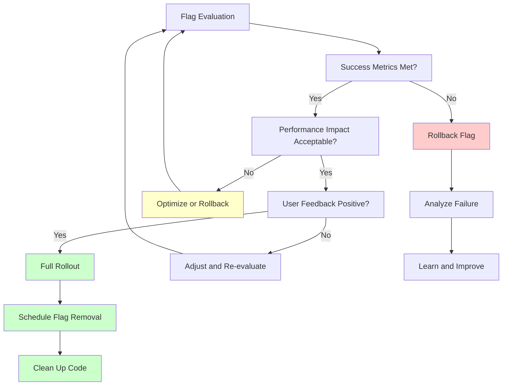
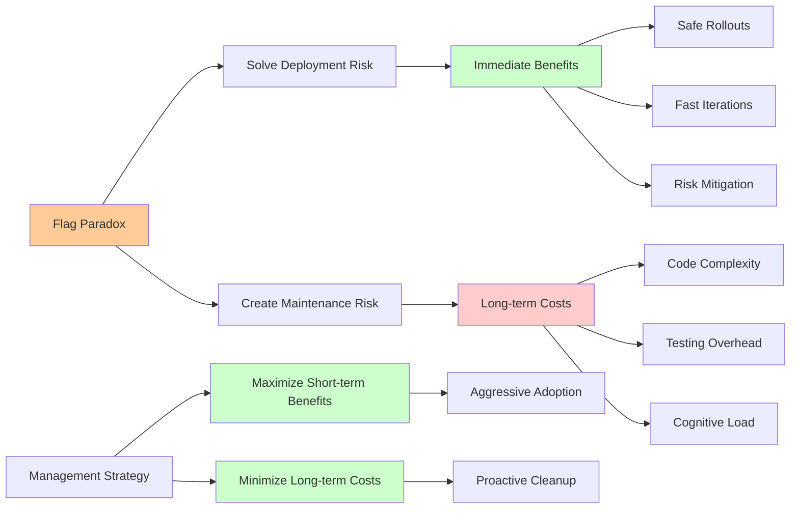

# Flag Debt and Lifecycle Management: The Hidden Cost of Feature Flags

Feature flags are like powerful tools - they solve immediate problems brilliantly but can create long-term challenges if not managed properly. This deep dive explores the hidden costs of feature flags, the concept of "flag debt," and strategies for managing the complete lifecycle of flags in production systems.

## Understanding Flag Debt

**Flag debt** is the accumulated complexity and maintenance burden that results from long-lived feature flags. Like technical debt, it starts small but compounds over time, eventually becoming a significant drag on development velocity and system reliability.



## The Anatomy of Flag Debt

### 1. **Code Complexity Growth**

Each flag introduces conditional logic that branches your codebase:

```javascript
// Single flag - 2 code paths
function processOrder(order) {
  if (featureFlags.isEnabled('new-pricing')) {
    return newPricingLogic(order);
  } else {
    return legacyPricingLogic(order);
  }
}

// Multiple flags - exponential path growth
function processOrder(order) {
  const useNewPricing = featureFlags.isEnabled('new-pricing', user);
  const useExpressShipping = featureFlags.isEnabled('express-shipping', user);
  const useRecommendations = featureFlags.isEnabled('recommendations', user);
  
  // 2^3 = 8 possible code paths
  if (useNewPricing && useExpressShipping && useRecommendations) {
    // Path 1
  } else if (useNewPricing && useExpressShipping && !useRecommendations) {
    // Path 2
  } else if (useNewPricing && !useExpressShipping && useRecommendations) {
    // Path 3
  }
  // ... 5 more combinations
}
```

**The exponential problem**: With `n` flags, you have `2^n` possible code paths to test and maintain.

### 2. **Testing Permutation Explosion**

```mermaid
graph TD
    A[Testing Complexity] --> B[Single Flag: 2 Tests]
    A --> C[Two Flags: 4 Tests]
    A --> D[Three Flags: 8 Tests]
    A --> E[N Flags: 2^N Tests]
    
    F[Real-World Impact] --> G[10 Flags: 1,024 Tests]
    F --> H[20 Flags: 1,048,576 Tests]
    F --> I[Impossible to Test All]
    
    J[Common Shortcuts] --> K[Test Only Happy Path]
    J --> L[Test Only New Features]
    J --> M[Skip Edge Cases]
    
    N[Consequences] --> O[Bugs in Production]
    N --> P[Inconsistent Behavior]
    N --> Q[User Experience Issues]
    
    style E fill:#ffcccc
    style G fill:#ffcccc
    style H fill:#ffcccc
    style I fill:#ffcccc
    style O fill:#ffcccc
    style P fill:#ffcccc
    style Q fill:#ffcccc
```



### 3. **Mental Model Fragmentation**

Developers must hold multiple mental models simultaneously:

```javascript
// Developer mental load increases with each flag
class OrderProcessor {
  process(order) {
    // Mental model 1: What happens with legacy pricing?
    // Mental model 2: What happens with new pricing?
    // Mental model 3: What happens with both pricing AND shipping flags?
    // Mental model 4: What happens during rollout transitions?
    
    // Cognitive overload leads to bugs
    if (this.shouldUseNewPricing(order)) {
      // Wait, does this work with the new shipping logic?
      // Did someone test this combination?
      // Are there edge cases we missed?
    }
  }
}
```

## The Flag Lifecycle: Birth to Death

Understanding the complete lifecycle helps manage flag debt:



### Stage 1: Conception and Planning

**Best Practices**:
- Define clear success criteria
- Set expected removal date
- Plan for both success and failure scenarios

```javascript
const flagPlan = {
  name: 'new-checkout-flow',
  purpose: 'Reduce cart abandonment by 15%',
  owner: 'conversion-team',
  createdAt: '2024-01-15',
  expectedRemovalDate: '2024-04-15', // 3 months maximum
  successCriteria: {
    conversionRate: { target: 0.15, operator: 'increase' },
    errorRate: { target: 0.02, operator: 'below' }
  },
  rollbackTriggers: {
    conversionRate: { threshold: -0.05, operator: 'decrease' },
    errorRate: { threshold: 0.05, operator: 'above' }
  }
};
```

### Stage 2: Development and Implementation

**Debt Prevention Strategies**:

```javascript
// Bad: Scattered flag checks
function processCheckout(cart) {
  if (featureFlags.isEnabled('new-checkout')) {
    // Some new logic
  }
  
  const items = cart.items;
  if (featureFlags.isEnabled('new-checkout')) {
    // More new logic scattered elsewhere
  }
  
  // ... more scattered checks
}

// Good: Centralized flag evaluation
function processCheckout(cart) {
  const checkoutStrategy = featureFlags.isEnabled('new-checkout') 
    ? new NewCheckoutStrategy() 
    : new LegacyCheckoutStrategy();
  
  return checkoutStrategy.process(cart);
}
```

### Stage 3: Rollout and Monitoring

**Debt Monitoring**:

```javascript
class FlagDebtMonitor {
  constructor() {
    this.flagMetrics = new Map();
    this.debtThresholds = {
      age: 90, // Days
      complexity: 5, // Number of code paths
      usage: 0.1 // Percentage of requests
    };
  }
  
  analyzeFlag(flagName) {
    const flag = this.getFlag(flagName);
    const metrics = this.calculateMetrics(flag);
    
    const debtScore = this.calculateDebtScore(metrics);
    const recommendations = this.generateRecommendations(debtScore, metrics);
    
    return {
      flagName,
      debtScore,
      metrics,
      recommendations
    };
  }
  
  calculateDebtScore(metrics) {
    let score = 0;
    
    // Age penalty
    if (metrics.ageInDays > this.debtThresholds.age) {
      score += (metrics.ageInDays - this.debtThresholds.age) * 0.1;
    }
    
    // Complexity penalty
    if (metrics.complexity > this.debtThresholds.complexity) {
      score += (metrics.complexity - this.debtThresholds.complexity) * 2;
    }
    
    // Low usage penalty
    if (metrics.usage < this.debtThresholds.usage) {
      score += (this.debtThresholds.usage - metrics.usage) * 10;
    }
    
    return Math.min(score, 100);
  }
  
  generateRecommendations(debtScore, metrics) {
    const recommendations = [];
    
    if (debtScore > 80) {
      recommendations.push('URGENT: Remove this flag immediately');
    } else if (debtScore > 50) {
      recommendations.push('Schedule flag removal within 30 days');
    } else if (debtScore > 30) {
      recommendations.push('Plan flag removal within 60 days');
    }
    
    if (metrics.complexity > 5) {
      recommendations.push('Consider splitting into smaller flags');
    }
    
    if (metrics.usage < 0.01) {
      recommendations.push('Flag appears unused - candidate for removal');
    }
    
    return recommendations;
  }
}
```

### Stage 4: Stabilization and Decision

**The Go/No-Go Decision Framework**:



## The Flag Debt Economics

### Understanding the Hidden Costs

Flag debt isn't just a technical concern - it has real economic impact:

```mermaid
graph TD
    A[Flag Debt Economics] --> B[Direct Costs]
    A --> C[Opportunity Costs]
    A --> D[Risk Costs]
    
    B --> B1[Development Time]
    B --> B2[Testing Overhead]
    B --> B3[Code Maintenance]
    
    C --> C1[Slower Feature Development]
    C --> C2[Reduced Innovation]
    C --> C3[Developer Frustration]
    
    D --> D1[Production Bugs]
    D --> D2[System Instability]
    D --> D3[Customer Impact]
    
    E[Cost Calculation] --> F[Time Cost]
    E --> G[Quality Cost]
    E --> H[Velocity Cost]
    
    F --> F1[Hours/Sprint on Flag Maintenance]
    G --> G1[Bug Rate Increase]
    H --> H1[Feature Delivery Slowdown]
    
    I[Break-even Analysis] --> J[Short-term Flags: Positive ROI]
    I --> K[Long-term Flags: Negative ROI]
    I --> L[Cleanup Investment vs. Ongoing Cost]
    
    style A fill:#ffcc99
    style B fill:#ffcccc
    style C fill:#ffffcc
    style D fill:#ffcccc
    style J fill:#ccffcc
    style K fill:#ffcccc
    style L fill:#ccffcc
```



## Flag Cleanup Strategies

### 1. **Automated Debt Detection**

```javascript
class FlagCleanupAutomation {
  constructor(flagService) {
    this.flagService = flagService;
  }
  
  identifyCleanupCandidates() {
    const candidates = [];
    
    for (const flag of this.flagService.getAllFlags()) {
      const analysis = this.analyzeFlag(flag);
      
      if (this.shouldCleanup(analysis)) {
        candidates.push({
          flag: flag.name,
          reason: analysis.cleanupReason,
          priority: analysis.priority,
          estimatedEffort: analysis.estimatedEffort
        });
      }
    }
    
    return candidates.sort((a, b) => b.priority - a.priority);
  }
  
  shouldCleanup(analysis) {
    // Flag is at 100% rollout for more than 30 days
    if (analysis.rolloutPercentage >= 100 && analysis.daysSinceFullRollout > 30) {
      return true;
    }
    
    // Flag has very low usage
    if (analysis.usage < 0.001) {
      return true;
    }
    
    // Flag is past its expected removal date
    if (analysis.pastRemovalDate) {
      return true;
    }
    
    return false;
  }
  
  generateCleanupPlan(candidates) {
    return candidates.map(candidate => ({
      flagName: candidate.flag,
      steps: this.generateCleanupSteps(candidate),
      timeline: this.estimateTimeline(candidate),
      risks: this.identifyRisks(candidate)
    }));
  }
  
  generateCleanupSteps(candidate) {
    return [
      'Verify flag is at 100% rollout',
      'Ensure all metrics are stable',
      'Create cleanup branch',
      'Remove flag checks from code',
      'Remove unused code paths',
      'Update tests',
      'Code review',
      'Deploy cleanup',
      'Monitor for issues',
      'Remove flag configuration'
    ];
  }
}
```

### 2. **Gradual Removal Process**

```javascript
// Step 1: Mark for removal
function markFlagForRemoval(flagName, removalDate) {
  const flag = flagService.getFlag(flagName);
  flag.metadata.markedForRemoval = true;
  flag.metadata.plannedRemovalDate = removalDate;
  flag.metadata.removalReason = 'Successful rollout completed';
  
  flagService.updateFlag(flagName, flag);
}

// Step 2: Remove conditional logic
function removeConditionalLogic(flagName) {
  // Before cleanup
  function processOrder(order) {
    if (featureFlags.isEnabled('new-pricing')) {
      return newPricingLogic(order);
    } else {
      return legacyPricingLogic(order);
    }
  }
  
  // After cleanup (assuming flag was successful)
  function processOrder(order) {
    return newPricingLogic(order);
  }
}

// Step 3: Remove unused code
function removeUnusedCode() {
  // Remove legacy implementation
  // Remove flag definitions
  // Remove related tests
  // Update documentation
}
```

### 3. **Safe Removal Techniques**

```javascript
class SafeFlagRemoval {
  constructor(flagService, monitoringService) {
    this.flagService = flagService;
    this.monitoring = monitoringService;
  }
  
  removeFlag(flagName) {
    const removalPlan = this.createRemovalPlan(flagName);
    
    for (const step of removalPlan.steps) {
      this.executeStep(step);
      this.verifyStep(step);
      
      if (this.detectIssues(step)) {
        this.rollbackStep(step);
        throw new Error(`Flag removal failed at step: ${step.name}`);
      }
    }
    
    this.finalizeRemoval(flagName);
  }
  
  createRemovalPlan(flagName) {
    return {
      flagName,
      steps: [
        {
          name: 'freeze-flag',
          action: () => this.freezeFlag(flagName),
          verification: () => this.verifyFlagFrozen(flagName),
          rollback: () => this.unfreezeFlag(flagName)
        },
        {
          name: 'remove-conditionals',
          action: () => this.removeConditionals(flagName),
          verification: () => this.verifyConditionalsRemoved(flagName),
          rollback: () => this.restoreConditionals(flagName)
        },
        {
          name: 'cleanup-code',
          action: () => this.cleanupCode(flagName),
          verification: () => this.verifyCodeCleanup(flagName),
          rollback: () => this.restoreCode(flagName)
        }
      ]
    };
  }
  
  detectIssues(step) {
    // Monitor error rates
    const errorRate = this.monitoring.getErrorRate();
    if (errorRate > 0.01) return true;
    
    // Monitor performance
    const responseTime = this.monitoring.getResponseTime();
    if (responseTime > 2000) return true;
    
    // Monitor business metrics
    const conversionRate = this.monitoring.getConversionRate();
    if (conversionRate < 0.95) return true;
    
    return false;
  }
}
```

## Flag Debt Prevention Strategies

### 1. **Flag Lifecycle Governance**

```javascript
class FlagGovernance {
  constructor() {
    this.policies = {
      maxAge: 90, // Days
      requiresOwner: true,
      requiresRemovalDate: true,
      requiresJustification: true
    };
  }
  
  enforcePolicy(flagRequest) {
    const violations = [];
    
    if (!flagRequest.owner && this.policies.requiresOwner) {
      violations.push('Flag must have an owner');
    }
    
    if (!flagRequest.expectedRemovalDate && this.policies.requiresRemovalDate) {
      violations.push('Flag must have expected removal date');
    }
    
    if (!flagRequest.justification && this.policies.requiresJustification) {
      violations.push('Flag must have business justification');
    }
    
    const age = this.calculateAge(flagRequest.createdAt);
    if (age > this.policies.maxAge) {
      violations.push(`Flag exceeds maximum age of ${this.policies.maxAge} days`);
    }
    
    return violations;
  }
  
  generateComplianceReport() {
    const flags = this.flagService.getAllFlags();
    const report = {
      totalFlags: flags.length,
      compliantFlags: 0,
      violations: []
    };
    
    for (const flag of flags) {
      const violations = this.enforcePolicy(flag);
      if (violations.length === 0) {
        report.compliantFlags++;
      } else {
        report.violations.push({
          flagName: flag.name,
          violations
        });
      }
    }
    
    return report;
  }
}
```

### 2. **Automated Cleanup Workflows**

```javascript
class AutomatedCleanup {
  constructor(flagService, gitService, ciService) {
    this.flagService = flagService;
    this.gitService = gitService;
    this.ciService = ciService;
  }
  
  scheduleCleanup() {
    const candidates = this.identifyCleanupCandidates();
    
    for (const candidate of candidates) {
      this.createCleanupPR(candidate);
    }
  }
  
  createCleanupPR(candidate) {
    const branchName = `cleanup-flag-${candidate.flagName}`;
    
    // Create cleanup branch
    this.gitService.createBranch(branchName);
    
    // Generate cleanup code
    const changes = this.generateCleanupChanges(candidate);
    
    // Apply changes
    this.applyChanges(changes);
    
    // Create pull request
    this.gitService.createPullRequest({
      title: `Cleanup feature flag: ${candidate.flagName}`,
      description: this.generateCleanupDescription(candidate),
      branch: branchName,
      assignee: candidate.owner
    });
  }
  
  generateCleanupChanges(candidate) {
    return {
      filesToModify: this.findFilesWithFlag(candidate.flagName),
      codesToRemove: this.findUnusedCode(candidate.flagName),
      testsToUpdate: this.findTestsToUpdate(candidate.flagName)
    };
  }
}
```

### 3. **Flag Design Patterns**

```javascript
// Pattern 1: Feature Toggle with Strategy Pattern
class FeatureToggle {
  constructor(flagName, strategies) {
    this.flagName = flagName;
    this.strategies = strategies;
  }
  
  execute(context) {
    const enabled = featureFlags.isEnabled(this.flagName, context);
    const strategy = enabled ? this.strategies.enabled : this.strategies.disabled;
    return strategy.execute(context);
  }
}

// Pattern 2: Canary Release Pattern
class CanaryRelease {
  constructor(flagName, newImplementation, oldImplementation) {
    this.flagName = flagName;
    this.newImplementation = newImplementation;
    this.oldImplementation = oldImplementation;
  }
  
  execute(context) {
    const useCanary = featureFlags.isEnabled(this.flagName, context);
    
    if (useCanary) {
      try {
        return this.newImplementation.execute(context);
      } catch (error) {
        // Automatic fallback on error
        console.error('Canary failed, falling back:', error);
        return this.oldImplementation.execute(context);
      }
    } else {
      return this.oldImplementation.execute(context);
    }
  }
}

// Pattern 3: Configuration Flag Pattern
class ConfigurationFlag {
  constructor(flagName, defaultConfig) {
    this.flagName = flagName;
    this.defaultConfig = defaultConfig;
  }
  
  getConfiguration(context) {
    const flagConfig = featureFlags.getConfiguration(this.flagName, context);
    return { ...this.defaultConfig, ...flagConfig };
  }
}
```

## Advanced Flag Debt Metrics

### Measuring Technical Debt Impact

```mermaid
graph TD
    A[Flag Debt Metrics] --> B[Age-based Metrics]
    A --> C[Complexity Metrics]
    A --> D[Usage Metrics]
    A --> E[Impact Metrics]
    
    B --> B1[Days Since Creation]
    B --> B2[Days Since Full Rollout]
    B --> B3[Days Past Planned Removal]
    
    C --> C1[Code Path Count]
    C --> C2[Test Combinations]
    C --> C3[Integration Points]
    
    D --> D1[Evaluation Frequency]
    D --> D2[User Coverage]
    D --> D3[Feature Adoption Rate]
    
    E --> E1[Bug Attribution]
    E --> E2[Performance Impact]
    E --> E3[Developer Velocity]
    
    F[Debt Score Formula] --> G[WeightedScore = Age×0.3 + Complexity×0.4 + Usage×0.3]
    
    H[Actionable Thresholds] --> I[Score 0-30: Low Priority]
    H --> J[Score 31-60: Medium Priority]
    H --> K[Score 61-80: High Priority]
    H --> L[Score 81-100: Critical Priority]
    
    style A fill:#ffcc99
    style F fill:#ccffcc
    style I fill:#ccffcc
    style J fill:#ffffcc
    style K fill:#ffcccc
    style L fill:#ff6666
```



### Cost-Benefit Analysis Framework

```mermaid
graph TD
    A[Flag ROI Analysis] --> B[Implementation Benefits]
    A --> C[Ongoing Costs]
    A --> D[Cleanup Investment]
    
    B --> B1[Risk Reduction Value]
    B --> B2[Faster Time to Market]
    B --> B3[Learning from Real Users]
    
    C --> C1[Development Overhead]
    C --> C2[Testing Complexity]
    C --> C3[Maintenance Burden]
    
    D --> D1[Code Cleanup Time]
    D --> D2[Testing Updates]
    D --> D3[Documentation Updates]
    
    E[ROI Calculation] --> F[Benefits - (Ongoing Costs + Cleanup Investment)]
    
    G[Decision Matrix] --> H[Positive ROI: Keep Flag]
    G --> I[Negative ROI: Schedule Cleanup]
    G --> J[Break-even: Evaluate Context]
    
    style B fill:#ccffcc
    style C fill:#ffcccc
    style D fill:#ffffcc
    style H fill:#ccffcc
    style I fill:#ffcccc
    style J fill:#ffffcc
```

### ROI Calculation

```javascript
class FlagROICalculator {
  calculateROI(flagName, timeframe) {
    const costs = this.calculateCosts(flagName, timeframe);
    const benefits = this.calculateBenefits(flagName, timeframe);
    
    return {
      roi: (benefits - costs) / costs * 100,
      costs,
      benefits,
      recommendation: this.getRecommendation(benefits, costs)
    };
  }
  
  calculateCosts(flagName, timeframe) {
    return {
      developmentTime: this.calculateDevelopmentCost(flagName, timeframe),
      testingOverhead: this.calculateTestingCost(flagName, timeframe),
      maintenanceCost: this.calculateMaintenanceCost(flagName, timeframe),
      complexityCost: this.calculateComplexityCost(flagName, timeframe)
    };
  }
  
  calculateBenefits(flagName, timeframe) {
    return {
      riskReduction: this.calculateRiskReduction(flagName, timeframe),
      deploymentSpeed: this.calculateDeploymentSpeedBenefit(flagName, timeframe),
      abtestingValue: this.calculateABTestingValue(flagName, timeframe),
      rollbackSavings: this.calculateRollbackSavings(flagName, timeframe)
    };
  }
  
  getRecommendation(benefits, costs) {
    const ratio = benefits / costs;
    
    if (ratio > 2) return 'Keep flag - high value';
    if (ratio > 1.5) return 'Keep flag - good value';
    if (ratio > 1) return 'Marginal value - consider cleanup';
    return 'Remove flag - negative value';
  }
}
```

## The Flag Lifecycle Maturity Model

Organizations evolve through predictable stages in their flag management maturity:

```mermaid
graph TD
    A[Flag Maturity Stages] --> B[Stage 1: Ad Hoc]
    A --> C[Stage 2: Structured]
    A --> D[Stage 3: Automated]
    A --> E[Stage 4: Optimized]
    
    B --> B1[Manual flag creation]
    B --> B2[No cleanup process]
    B --> B3[Reactive management]
    
    C --> C1[Governance policies]
    C --> C2[Planned lifecycles]
    C --> C3[Regular reviews]
    
    D --> D1[Automated monitoring]
    D --> D2[Cleanup automation]
    D --> D3[Performance tracking]
    
    E --> E1[Predictive analytics]
    E --> E2[Self-healing systems]
    E --> E3[Continuous optimization]
    
    F[Maturity Indicators] --> G[Process Standardization]
    F --> H[Tooling Sophistication]
    F --> I[Team Expertise]
    F --> J[Business Integration]
    
    style A fill:#ffcc99
    style B fill:#ffcccc
    style C fill:#ffffcc
    style D fill:#ccffcc
    style E fill:#ccffcc
```



## Conclusion: Managing the Flag Lifecycle

Effective flag management requires:

1. **Proactive Planning**: Set clear success criteria and removal dates
2. **Continuous Monitoring**: Track debt accumulation and flag performance
3. **Automated Cleanup**: Use tooling to identify and remove obsolete flags
4. **Governance Processes**: Enforce policies around flag creation and maintenance
5. **Team Education**: Ensure developers understand the long-term costs

```mermaid
graph TD
    A[Successful Flag Management] --> B[Clear Lifecycle]
    A --> C[Automated Monitoring]
    A --> D[Regular Cleanup]
    A --> E[Team Discipline]
    
    B --> F[Defined Success Criteria]
    B --> G[Planned Removal Dates]
    B --> H[Owner Accountability]
    
    C --> I[Debt Detection]
    C --> J[Usage Analytics]
    C --> K[Performance Impact]
    
    D --> L[Automated Candidates]
    D --> M[Safe Removal Process]
    D --> N[Continuous Improvement]
    
    E --> O[Flag Design Patterns]
    E --> P[Best Practices]
    E --> Q[Code Review Standards]
    
    R[Success Metrics] --> S[Reduced Debt Score]
    R --> T[Faster Feature Delivery]
    R --> U[Lower Bug Rate]
    R --> V[Higher Team Satisfaction]
    
    style A fill:#ccffcc
    style B fill:#ccffcc
    style C fill:#ccffcc
    style D fill:#ccffcc
    style E fill:#ccffcc
    style S fill:#ccffcc
    style T fill:#ccffcc
    style U fill:#ccffcc
    style V fill:#ccffcc
```



## Key Insights for Long-term Success

### The Flag Paradox
Feature flags solve deployment problems but create maintenance problems. The key is managing this trade-off:



### The Lifecycle Management Imperative

**The Golden Rule**: Every flag should have a planned death date from the moment it's born.

**The Iron Law**: The cost of keeping a flag increases exponentially with time.

**The Practical Principle**: Automated cleanup is not optional - it's essential for sustainable flag management.

The key insight is that feature flags are not just a deployment mechanism - they're a powerful but complex tool that requires careful lifecycle management. By understanding and proactively managing flag debt, teams can harness the benefits of feature flags while avoiding the long-term costs of accumulated complexity.

The next section provides a complete TypeScript implementation that incorporates these lifecycle management principles into a production-ready feature flag system.