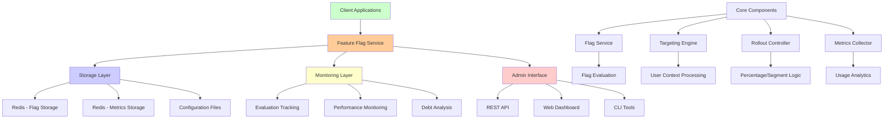
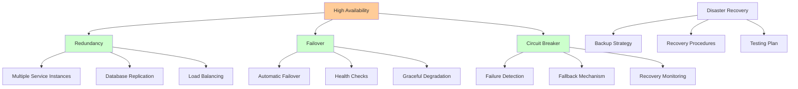
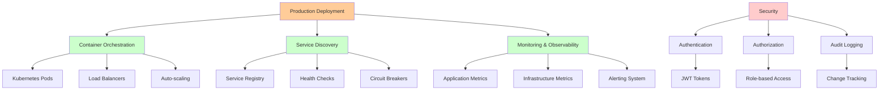

# TypeScript Implementation: Production-Ready Feature Flag System

This section provides a complete, type-safe TypeScript implementation of a feature flag system that incorporates all the concepts from previous sections. The implementation includes targeting, rollout controls, lifecycle management, and monitoring.

## System Architecture Overview

Before diving into the implementation, let's understand the overall system architecture:



## Project Setup

First, let's set up the project structure:

```json
{
  "name": "feature-flags-system",
  "version": "1.0.0",
  "description": "Production-ready feature flag system",
  "main": "dist/index.js",
  "scripts": {
    "build": "tsc",
    "test": "jest",
    "dev": "ts-node-dev src/index.ts"
  },
  "dependencies": {
    "express": "^4.18.2",
    "redis": "^4.6.5",
    "uuid": "^9.0.0",
    "jsonschema": "^1.4.1"
  },
  "devDependencies": {
    "@types/node": "^18.15.0",
    "@types/express": "^4.17.17",
    "@types/uuid": "^9.0.1",
    "@types/jest": "^29.5.0",
    "typescript": "^5.0.0",
    "jest": "^29.5.0",
    "ts-jest": "^29.1.0",
    "ts-node-dev": "^2.0.0"
  }
}
```

## Core Types and Interfaces

```typescript
// src/types/index.ts

export interface UserContext {
  userId: string;
  email?: string;
  segments?: string[];
  country?: string;
  deviceType?: 'mobile' | 'desktop' | 'tablet';
  customAttributes?: Record<string, any>;
}

export interface TargetingRule {
  userIds?: string[];
  segments?: string[];
  countries?: string[];
  deviceTypes?: string[];
  customAttributes?: Record<string, any>;
  customRules?: string[];
}

export interface Targeting {
  whitelist?: TargetingRule;
  blacklist?: TargetingRule;
  rules?: TargetingRule;
}

export interface RolloutSchedule {
  date: string;
  percentage: number;
}

export interface RolloutStrategy {
  strategy: 'percentage' | 'segment' | 'geographic' | 'gradual';
  percentage?: number;
  segments?: string[];
  regions?: string[];
  schedule?: RolloutSchedule[];
}

export interface FlagMetadata {
  createdAt: string;
  createdBy: string;
  owner: string;
  description: string;
  expectedRemovalDate?: string;
  tags?: string[];
  dependencies?: string[];
}

export interface MonitoringConfig {
  metrics?: string[];
  alertThresholds?: Record<string, { min?: number; max?: number }>;
  alertWebhook?: string;
}

export interface FeatureFlag {
  name: string;
  enabled: boolean;
  targeting: Targeting;
  rollout: RolloutStrategy;
  metadata: FlagMetadata;
  monitoring: MonitoringConfig;
}

export interface FlagEvaluationResult {
  enabled: boolean;
  reason: string;
  ruleMatched?: string;
  rolloutBucket?: number;
}

export interface FlagMetrics {
  evaluations: number;
  enabled: number;
  disabled: number;
  lastEvaluated: string;
  reasons: Record<string, number>;
}

export interface FlagDebtAnalysis {
  flagName: string;
  debtScore: number;
  ageInDays: number;
  complexity: number;
  usage: number;
  recommendations: string[];
}

export interface FlagStore {
  getFlag(name: string): Promise<FeatureFlag | null>;
  setFlag(name: string, flag: FeatureFlag): Promise<void>;
  getAllFlags(): Promise<FeatureFlag[]>;
  deleteFlag(name: string): Promise<void>;
}

export interface MetricsStore {
  recordEvaluation(flagName: string, result: FlagEvaluationResult, userContext: UserContext): Promise<void>;
  getMetrics(flagName: string): Promise<FlagMetrics>;
  getUsageStats(flagName: string, days: number): Promise<any>;
}
```

## Flag Storage Implementation

```typescript
// src/stores/RedisStore.ts
import { createClient, RedisClientType } from 'redis';
import { FeatureFlag, FlagStore, FlagMetrics, MetricsStore, FlagEvaluationResult, UserContext } from '../types';

export class RedisFlagStore implements FlagStore {
  private client: RedisClientType;
  private readonly keyPrefix = 'feature_flags:';

  constructor(redisUrl: string = 'redis://localhost:6379') {
    this.client = createClient({ url: redisUrl });
    this.client.on('error', (err) => console.error('Redis error:', err));
  }

  async connect(): Promise<void> {
    await this.client.connect();
  }

  async disconnect(): Promise<void> {
    await this.client.disconnect();
  }

  async getFlag(name: string): Promise<FeatureFlag | null> {
    const key = `${this.keyPrefix}${name}`;
    const data = await this.client.get(key);
    
    if (!data) return null;
    
    try {
      return JSON.parse(data);
    } catch (error) {
      console.error('Failed to parse flag data:', error);
      return null;
    }
  }

  async setFlag(name: string, flag: FeatureFlag): Promise<void> {
    const key = `${this.keyPrefix}${name}`;
    await this.client.set(key, JSON.stringify(flag));
  }

  async getAllFlags(): Promise<FeatureFlag[]> {
    const keys = await this.client.keys(`${this.keyPrefix}*`);
    const flags: FeatureFlag[] = [];

    for (const key of keys) {
      const data = await this.client.get(key);
      if (data) {
        try {
          flags.push(JSON.parse(data));
        } catch (error) {
          console.error('Failed to parse flag data:', error);
        }
      }
    }

    return flags;
  }

  async deleteFlag(name: string): Promise<void> {
    const key = `${this.keyPrefix}${name}`;
    await this.client.del(key);
  }
}

export class RedisMetricsStore implements MetricsStore {
  private client: RedisClientType;
  private readonly keyPrefix = 'flag_metrics:';

  constructor(redisUrl: string = 'redis://localhost:6379') {
    this.client = createClient({ url: redisUrl });
    this.client.on('error', (err) => console.error('Redis metrics error:', err));
  }

  async connect(): Promise<void> {
    await this.client.connect();
  }

  async recordEvaluation(
    flagName: string,
    result: FlagEvaluationResult,
    userContext: UserContext
  ): Promise<void> {
    const key = `${this.keyPrefix}${flagName}`;
    const timestamp = new Date().toISOString();

    // Update basic metrics
    await this.client.hIncrBy(key, 'evaluations', 1);
    await this.client.hIncrBy(key, result.enabled ? 'enabled' : 'disabled', 1);
    await this.client.hIncrBy(key, `reason:${result.reason}`, 1);
    await this.client.hSet(key, 'lastEvaluated', timestamp);

    // Store detailed evaluation for analysis
    const evaluationKey = `${this.keyPrefix}${flagName}:evaluations`;
    await this.client.lPush(evaluationKey, JSON.stringify({
      timestamp,
      userId: userContext.userId,
      enabled: result.enabled,
      reason: result.reason,
      country: userContext.country,
      segments: userContext.segments
    }));

    // Keep only last 10000 evaluations
    await this.client.lTrim(evaluationKey, 0, 9999);
  }

  async getMetrics(flagName: string): Promise<FlagMetrics> {
    const key = `${this.keyPrefix}${flagName}`;
    const data = await this.client.hGetAll(key);

    const reasons: Record<string, number> = {};
    for (const [field, value] of Object.entries(data)) {
      if (field.startsWith('reason:')) {
        reasons[field.substring(7)] = parseInt(value, 10);
      }
    }

    return {
      evaluations: parseInt(data.evaluations || '0', 10),
      enabled: parseInt(data.enabled || '0', 10),
      disabled: parseInt(data.disabled || '0', 10),
      lastEvaluated: data.lastEvaluated || '',
      reasons
    };
  }

  async getUsageStats(flagName: string, days: number): Promise<any> {
    const evaluationKey = `${this.keyPrefix}${flagName}:evaluations`;
    const evaluations = await this.client.lRange(evaluationKey, 0, -1);
    
    const cutoffDate = new Date();
    cutoffDate.setDate(cutoffDate.getDate() - days);

    const recentEvaluations = evaluations
      .map(e => JSON.parse(e))
      .filter(e => new Date(e.timestamp) > cutoffDate);

    const uniqueUsers = new Set(recentEvaluations.map(e => e.userId));
    const enabledCount = recentEvaluations.filter(e => e.enabled).length;

    return {
      totalEvaluations: recentEvaluations.length,
      uniqueUsers: uniqueUsers.size,
      enabledPercentage: recentEvaluations.length > 0 ? (enabledCount / recentEvaluations.length) * 100 : 0,
      dailyStats: this.calculateDailyStats(recentEvaluations)
    };
  }

  private calculateDailyStats(evaluations: any[]): any {
    const dailyStats: Record<string, any> = {};

    for (const evaluation of evaluations) {
      const date = new Date(evaluation.timestamp).toISOString().split('T')[0];
      if (!dailyStats[date]) {
        dailyStats[date] = { total: 0, enabled: 0, uniqueUsers: new Set() };
      }
      
      dailyStats[date].total++;
      if (evaluation.enabled) {
        dailyStats[date].enabled++;
      }
      dailyStats[date].uniqueUsers.add(evaluation.userId);
    }

    // Convert Set to count
    for (const date in dailyStats) {
      dailyStats[date].uniqueUsers = dailyStats[date].uniqueUsers.size;
    }

    return dailyStats;
  }
}
```

## Core Feature Flag Service

```typescript
// src/services/FeatureFlagService.ts
import crypto from 'crypto';
import {
  FeatureFlag,
  UserContext,
  FlagEvaluationResult,
  FlagStore,
  MetricsStore,
  Targeting,
  RolloutStrategy,
  FlagDebtAnalysis
} from '../types';

export class FeatureFlagService {
  constructor(
    private flagStore: FlagStore,
    private metricsStore: MetricsStore
  ) {}

  async isEnabled(flagName: string, userContext: UserContext): Promise<boolean> {
    const result = await this.evaluate(flagName, userContext);
    return result.enabled;
  }

  async evaluate(flagName: string, userContext: UserContext): Promise<FlagEvaluationResult> {
    const flag = await this.flagStore.getFlag(flagName);
    
    if (!flag) {
      const result: FlagEvaluationResult = {
        enabled: false,
        reason: 'flag_not_found'
      };
      await this.metricsStore.recordEvaluation(flagName, result, userContext);
      return result;
    }

    // Global kill switch
    if (!flag.enabled) {
      const result: FlagEvaluationResult = {
        enabled: false,
        reason: 'globally_disabled'
      };
      await this.metricsStore.recordEvaluation(flagName, result, userContext);
      return result;
    }

    // Check targeting rules
    const targetingResult = this.evaluateTargeting(flag.targeting, userContext);
    if (!targetingResult.matches) {
      const result: FlagEvaluationResult = {
        enabled: false,
        reason: targetingResult.reason,
        ruleMatched: targetingResult.ruleMatched
      };
      await this.metricsStore.recordEvaluation(flagName, result, userContext);
      return result;
    }

    // Check rollout strategy
    const rolloutResult = this.evaluateRollout(flagName, flag.rollout, userContext);
    const result: FlagEvaluationResult = {
      enabled: rolloutResult.enabled,
      reason: rolloutResult.reason,
      rolloutBucket: rolloutResult.bucket
    };

    await this.metricsStore.recordEvaluation(flagName, result, userContext);
    return result;
  }

  private evaluateTargeting(targeting: Targeting, userContext: UserContext): {
    matches: boolean;
    reason: string;
    ruleMatched?: string;
  } {
    // Check blacklist first
    if (targeting.blacklist) {
      const blacklistResult = this.matchesTargetingRule(targeting.blacklist, userContext);
      if (blacklistResult.matches) {
        return {
          matches: false,
          reason: 'blacklisted',
          ruleMatched: blacklistResult.ruleMatched
        };
      }
    }

    // Check whitelist
    if (targeting.whitelist) {
      const whitelistResult = this.matchesTargetingRule(targeting.whitelist, userContext);
      if (whitelistResult.matches) {
        return {
          matches: true,
          reason: 'whitelisted',
          ruleMatched: whitelistResult.ruleMatched
        };
      }
    }

    // Check general targeting rules
    if (targeting.rules) {
      const rulesResult = this.matchesTargetingRule(targeting.rules, userContext);
      return {
        matches: rulesResult.matches,
        reason: rulesResult.matches ? 'targeting_matched' : 'targeting_excluded',
        ruleMatched: rulesResult.ruleMatched
      };
    }

    return { matches: true, reason: 'no_targeting_rules' };
  }

  private matchesTargetingRule(rule: any, userContext: UserContext): {
    matches: boolean;
    ruleMatched?: string;
  } {
    // Check user IDs
    if (rule.userIds && rule.userIds.length > 0) {
      if (rule.userIds.includes(userContext.userId)) {
        return { matches: true, ruleMatched: 'userId' };
      }
    }

    // Check segments
    if (rule.segments && rule.segments.length > 0) {
      const userSegments = userContext.segments || [];
      if (rule.segments.some((segment: string) => userSegments.includes(segment))) {
        return { matches: true, ruleMatched: 'segment' };
      }
    }

    // Check countries
    if (rule.countries && rule.countries.length > 0) {
      if (userContext.country && rule.countries.includes(userContext.country)) {
        return { matches: true, ruleMatched: 'country' };
      }
    }

    // Check device types
    if (rule.deviceTypes && rule.deviceTypes.length > 0) {
      if (userContext.deviceType && rule.deviceTypes.includes(userContext.deviceType)) {
        return { matches: true, ruleMatched: 'deviceType' };
      }
    }

    // Check custom attributes
    if (rule.customAttributes) {
      for (const [key, expectedValue] of Object.entries(rule.customAttributes)) {
        const actualValue = userContext.customAttributes?.[key];
        if (Array.isArray(expectedValue)) {
          if (expectedValue.includes(actualValue)) {
            return { matches: true, ruleMatched: `customAttribute:${key}` };
          }
        } else if (actualValue === expectedValue) {
          return { matches: true, ruleMatched: `customAttribute:${key}` };
        }
      }
    }

    // Check custom rules
    if (rule.customRules) {
      for (const customRule of rule.customRules) {
        try {
          const result = this.evaluateCustomRule(customRule, userContext);
          if (result) {
            return { matches: true, ruleMatched: `customRule:${customRule}` };
          }
        } catch (error) {
          console.error('Custom rule evaluation error:', error);
        }
      }
    }

    return { matches: false };
  }

  private evaluateCustomRule(rule: string, userContext: UserContext): boolean {
    // In production, use a proper rule engine like json-rules-engine
    // This is a simplified implementation
    try {
      const func = new Function('user', `return ${rule}`);
      return func(userContext);
    } catch (error) {
      console.error('Failed to evaluate custom rule:', rule, error);
      return false;
    }
  }

  private evaluateRollout(
    flagName: string,
    rollout: RolloutStrategy,
    userContext: UserContext
  ): { enabled: boolean; reason: string; bucket?: number } {
    switch (rollout.strategy) {
      case 'percentage':
        return this.evaluatePercentageRollout(flagName, rollout.percentage || 0, userContext);
      
      case 'segment':
        return this.evaluateSegmentRollout(rollout.segments || [], userContext);
      
      case 'geographic':
        return this.evaluateGeographicRollout(rollout.regions || [], userContext);
      
      case 'gradual':
        return this.evaluateGradualRollout(flagName, rollout, userContext);
      
      default:
        return { enabled: false, reason: 'invalid_rollout_strategy' };
    }
  }

  private evaluatePercentageRollout(
    flagName: string,
    percentage: number,
    userContext: UserContext
  ): { enabled: boolean; reason: string; bucket: number } {
    const bucket = this.getUserBucket(flagName, userContext.userId);
    const enabled = bucket < percentage;
    
    return {
      enabled,
      reason: enabled ? 'percentage_rollout_included' : 'percentage_rollout_excluded',
      bucket
    };
  }

  private evaluateSegmentRollout(
    allowedSegments: string[],
    userContext: UserContext
  ): { enabled: boolean; reason: string } {
    const userSegments = userContext.segments || [];
    const enabled = allowedSegments.some(segment => userSegments.includes(segment));
    
    return {
      enabled,
      reason: enabled ? 'segment_rollout_included' : 'segment_rollout_excluded'
    };
  }

  private evaluateGeographicRollout(
    allowedRegions: string[],
    userContext: UserContext
  ): { enabled: boolean; reason: string } {
    const enabled = userContext.country ? allowedRegions.includes(userContext.country) : false;
    
    return {
      enabled,
      reason: enabled ? 'geographic_rollout_included' : 'geographic_rollout_excluded'
    };
  }

  private evaluateGradualRollout(
    flagName: string,
    rollout: RolloutStrategy,
    userContext: UserContext
  ): { enabled: boolean; reason: string; bucket?: number } {
    const schedule = rollout.schedule || [];
    const now = new Date();
    
    // Find current rollout percentage based on schedule
    let currentPercentage = 0;
    for (const stage of schedule) {
      if (now >= new Date(stage.date)) {
        currentPercentage = stage.percentage;
      } else {
        break;
      }
    }
    
    return this.evaluatePercentageRollout(flagName, currentPercentage, userContext);
  }

  private getUserBucket(flagName: string, userId: string): number {
    const hash = crypto.createHash('md5').update(flagName + userId).digest('hex');
    return parseInt(hash.substring(0, 8), 16) % 100;
  }

  async createFlag(flag: FeatureFlag): Promise<void> {
    await this.flagStore.setFlag(flag.name, flag);
  }

  async updateFlag(flagName: string, updates: Partial<FeatureFlag>): Promise<void> {
    const existingFlag = await this.flagStore.getFlag(flagName);
    if (!existingFlag) {
      throw new Error(`Flag ${flagName} not found`);
    }

    const updatedFlag = { ...existingFlag, ...updates };
    await this.flagStore.setFlag(flagName, updatedFlag);
  }

  async deleteFlag(flagName: string): Promise<void> {
    await this.flagStore.deleteFlag(flagName);
  }

  async getFlag(flagName: string): Promise<FeatureFlag | null> {
    return await this.flagStore.getFlag(flagName);
  }

  async getAllFlags(): Promise<FeatureFlag[]> {
    return await this.flagStore.getAllFlags();
  }

  async getMetrics(flagName: string): Promise<any> {
    return await this.metricsStore.getMetrics(flagName);
  }

  async analyzeFlag(flagName: string): Promise<FlagDebtAnalysis> {
    const flag = await this.flagStore.getFlag(flagName);
    if (!flag) {
      throw new Error(`Flag ${flagName} not found`);
    }

    const metrics = await this.metricsStore.getMetrics(flagName);
    const usageStats = await this.metricsStore.getUsageStats(flagName, 30);

    const createdAt = new Date(flag.metadata.createdAt);
    const ageInDays = Math.floor((Date.now() - createdAt.getTime()) / (1000 * 60 * 60 * 24));

    // Calculate complexity (number of targeting rules + rollout complexity)
    let complexity = 0;
    if (flag.targeting.rules) complexity += Object.keys(flag.targeting.rules).length;
    if (flag.targeting.whitelist) complexity += Object.keys(flag.targeting.whitelist).length;
    if (flag.targeting.blacklist) complexity += Object.keys(flag.targeting.blacklist).length;
    if (flag.rollout.strategy === 'gradual') complexity += 2;

    // Calculate debt score
    let debtScore = 0;
    if (ageInDays > 90) debtScore += (ageInDays - 90) * 0.5;
    if (complexity > 5) debtScore += (complexity - 5) * 10;
    if (usageStats.enabledPercentage === 100) debtScore += 20; // Fully rolled out
    if (usageStats.totalEvaluations < 100) debtScore += 30; // Low usage

    const recommendations = this.generateRecommendations(debtScore, ageInDays, complexity, usageStats);

    return {
      flagName,
      debtScore: Math.min(debtScore, 100),
      ageInDays,
      complexity,
      usage: usageStats.enabledPercentage,
      recommendations
    };
  }

  private generateRecommendations(
    debtScore: number,
    ageInDays: number,
    complexity: number,
    usageStats: any
  ): string[] {
    const recommendations: string[] = [];

    if (debtScore > 80) {
      recommendations.push('URGENT: Schedule flag removal immediately');
    } else if (debtScore > 60) {
      recommendations.push('HIGH: Plan flag removal within 2 weeks');
    } else if (debtScore > 40) {
      recommendations.push('MEDIUM: Consider flag removal within 1 month');
    }

    if (ageInDays > 180) {
      recommendations.push('Flag is very old - review if still needed');
    }

    if (complexity > 8) {
      recommendations.push('High complexity - consider simplifying or splitting');
    }

    if (usageStats.enabledPercentage === 100 && ageInDays > 30) {
      recommendations.push('Flag is fully rolled out - consider cleanup');
    }

    if (usageStats.totalEvaluations < 10) {
      recommendations.push('Very low usage - candidate for removal');
    }

    return recommendations;
  }
}
```

## REST API Implementation

```typescript
// src/api/FlagController.ts
import { Request, Response } from 'express';
import { FeatureFlagService } from '../services/FeatureFlagService';
import { FeatureFlag, UserContext } from '../types';

export class FlagController {
  constructor(private flagService: FeatureFlagService) {}

  async getAllFlags(req: Request, res: Response): Promise<void> {
    try {
      const flags = await this.flagService.getAllFlags();
      res.json(flags);
    } catch (error) {
      res.status(500).json({ error: 'Failed to fetch flags' });
    }
  }

  async getFlag(req: Request, res: Response): Promise<void> {
    try {
      const { name } = req.params;
      const flag = await this.flagService.getFlag(name);
      
      if (!flag) {
        res.status(404).json({ error: 'Flag not found' });
        return;
      }
      
      res.json(flag);
    } catch (error) {
      res.status(500).json({ error: 'Failed to fetch flag' });
    }
  }

  async createFlag(req: Request, res: Response): Promise<void> {
    try {
      const flagData: FeatureFlag = req.body;
      
      // Validate required fields
      if (!flagData.name || !flagData.metadata?.owner) {
        res.status(400).json({ error: 'Name and owner are required' });
        return;
      }

      await this.flagService.createFlag(flagData);
      res.status(201).json({ message: 'Flag created successfully' });
    } catch (error) {
      res.status(500).json({ error: 'Failed to create flag' });
    }
  }

  async updateFlag(req: Request, res: Response): Promise<void> {
    try {
      const { name } = req.params;
      const updates = req.body;
      
      await this.flagService.updateFlag(name, updates);
      res.json({ message: 'Flag updated successfully' });
    } catch (error) {
      res.status(500).json({ error: 'Failed to update flag' });
    }
  }

  async deleteFlag(req: Request, res: Response): Promise<void> {
    try {
      const { name } = req.params;
      await this.flagService.deleteFlag(name);
      res.json({ message: 'Flag deleted successfully' });
    } catch (error) {
      res.status(500).json({ error: 'Failed to delete flag' });
    }
  }

  async evaluateFlag(req: Request, res: Response): Promise<void> {
    try {
      const { name } = req.params;
      const userContext: UserContext = {
        userId: req.query.userId as string,
        email: req.query.email as string,
        segments: req.query.segments ? (req.query.segments as string).split(',') : [],
        country: req.query.country as string,
        deviceType: req.query.deviceType as ('mobile' | 'desktop' | 'tablet'),
        customAttributes: req.query.customAttributes ? JSON.parse(req.query.customAttributes as string) : {}
      };

      const result = await this.flagService.evaluate(name, userContext);
      res.json(result);
    } catch (error) {
      res.status(500).json({ error: 'Failed to evaluate flag' });
    }
  }

  async getFlagMetrics(req: Request, res: Response): Promise<void> {
    try {
      const { name } = req.params;
      const metrics = await this.flagService.getMetrics(name);
      res.json(metrics);
    } catch (error) {
      res.status(500).json({ error: 'Failed to fetch metrics' });
    }
  }

  async analyzeFlagDebt(req: Request, res: Response): Promise<void> {
    try {
      const { name } = req.params;
      const analysis = await this.flagService.analyzeFlag(name);
      res.json(analysis);
    } catch (error) {
      res.status(500).json({ error: 'Failed to analyze flag debt' });
    }
  }

  async getDebtReport(req: Request, res: Response): Promise<void> {
    try {
      const flags = await this.flagService.getAllFlags();
      const analyses = await Promise.all(
        flags.map(flag => this.flagService.analyzeFlag(flag.name))
      );
      
      const sortedAnalyses = analyses.sort((a, b) => b.debtScore - a.debtScore);
      
      res.json({
        totalFlags: flags.length,
        flagsWithHighDebt: sortedAnalyses.filter(a => a.debtScore > 60).length,
        flagsWithMediumDebt: sortedAnalyses.filter(a => a.debtScore > 30 && a.debtScore <= 60).length,
        analyses: sortedAnalyses
      });
    } catch (error) {
      res.status(500).json({ error: 'Failed to generate debt report' });
    }
  }
}
```

## Express Server Setup

```typescript
// src/server.ts
import express from 'express';
import { RedisFlagStore, RedisMetricsStore } from './stores/RedisStore';
import { FeatureFlagService } from './services/FeatureFlagService';
import { FlagController } from './api/FlagController';

const app = express();
app.use(express.json());

// Initialize stores and services
const flagStore = new RedisFlagStore();
const metricsStore = new RedisMetricsStore();
const flagService = new FeatureFlagService(flagStore, metricsStore);
const flagController = new FlagController(flagService);

// Connect to Redis
async function initializeStores() {
  await flagStore.connect();
  await metricsStore.connect();
}

// API routes
app.get('/api/flags', (req, res) => flagController.getAllFlags(req, res));
app.get('/api/flags/:name', (req, res) => flagController.getFlag(req, res));
app.post('/api/flags', (req, res) => flagController.createFlag(req, res));
app.put('/api/flags/:name', (req, res) => flagController.updateFlag(req, res));
app.delete('/api/flags/:name', (req, res) => flagController.deleteFlag(req, res));

app.get('/api/flags/:name/evaluate', (req, res) => flagController.evaluateFlag(req, res));
app.get('/api/flags/:name/metrics', (req, res) => flagController.getFlagMetrics(req, res));
app.get('/api/flags/:name/debt', (req, res) => flagController.analyzeFlagDebt(req, res));

app.get('/api/debt-report', (req, res) => flagController.getDebtReport(req, res));

// Health check
app.get('/health', (req, res) => {
  res.json({ status: 'healthy', timestamp: new Date().toISOString() });
});

// Error handling middleware
app.use((err: Error, req: express.Request, res: express.Response, next: express.NextFunction) => {
  console.error('Server error:', err);
  res.status(500).json({ error: 'Internal server error' });
});

const PORT = process.env.PORT || 3000;

async function startServer() {
  try {
    await initializeStores();
    app.listen(PORT, () => {
      console.log(`Feature flag server running on port ${PORT}`);
    });
  } catch (error) {
    console.error('Failed to start server:', error);
    process.exit(1);
  }
}

startServer();
```

## Client SDK

```typescript
// src/client/FeatureFlagClient.ts
import { UserContext, FlagEvaluationResult } from '../types';

export class FeatureFlagClient {
  private baseUrl: string;
  private cache: Map<string, { result: boolean; expiry: number }> = new Map();
  private cacheTimeout: number = 5 * 60 * 1000; // 5 minutes

  constructor(baseUrl: string) {
    this.baseUrl = baseUrl.replace(/\/$/, '');
  }

  async isEnabled(flagName: string, userContext: UserContext): Promise<boolean> {
    const cacheKey = `${flagName}:${userContext.userId}`;
    const cached = this.cache.get(cacheKey);
    
    if (cached && Date.now() < cached.expiry) {
      return cached.result;
    }

    try {
      const queryParams = new URLSearchParams({
        userId: userContext.userId,
        ...(userContext.email && { email: userContext.email }),
        ...(userContext.segments && { segments: userContext.segments.join(',') }),
        ...(userContext.country && { country: userContext.country }),
        ...(userContext.deviceType && { deviceType: userContext.deviceType }),
        ...(userContext.customAttributes && { customAttributes: JSON.stringify(userContext.customAttributes) })
      });

      const response = await fetch(`${this.baseUrl}/api/flags/${flagName}/evaluate?${queryParams}`);
      const result: FlagEvaluationResult = await response.json();

      // Cache the result
      this.cache.set(cacheKey, {
        result: result.enabled,
        expiry: Date.now() + this.cacheTimeout
      });

      return result.enabled;
    } catch (error) {
      console.error('Flag evaluation failed:', error);
      return false; // Fail safe
    }
  }

  async evaluate(flagName: string, userContext: UserContext): Promise<FlagEvaluationResult> {
    try {
      const queryParams = new URLSearchParams({
        userId: userContext.userId,
        ...(userContext.email && { email: userContext.email }),
        ...(userContext.segments && { segments: userContext.segments.join(',') }),
        ...(userContext.country && { country: userContext.country }),
        ...(userContext.deviceType && { deviceType: userContext.deviceType }),
        ...(userContext.customAttributes && { customAttributes: JSON.stringify(userContext.customAttributes) })
      });

      const response = await fetch(`${this.baseUrl}/api/flags/${flagName}/evaluate?${queryParams}`);
      return await response.json();
    } catch (error) {
      console.error('Flag evaluation failed:', error);
      return { enabled: false, reason: 'evaluation_failed' };
    }
  }

  clearCache(): void {
    this.cache.clear();
  }
}
```

## System Performance Considerations

### Caching Strategy

```mermaid
graph TD
    A[Performance Optimization] --> B[Client-Side Caching]
    A --> C[Server-Side Caching]
    A --> D[Database Optimization]
    
    B --> B1[In-Memory Cache]
    B --> B2[TTL-based Expiration]
    B --> B3[Cache Invalidation]
    
    C --> C1[Redis Caching]
    C --> C2[Flag Configuration Cache]
    C --> C3[Evaluation Result Cache]
    
    D --> D1[Connection Pooling]
    D --> D2[Batch Operations]
    D --> D3[Index Optimization]
    
    E[Cache Layers] --> F[L1: Application Memory]
    E --> G[L2: Redis Cache]
    E --> H[L3: Database]
    
    F --> I[Fastest Access]
    G --> J[Shared Cache]
    H --> K[Persistent Storage]
    
    L[Cache Invalidation] --> M[Time-based (TTL)]
    L --> N[Event-based]
    L --> O[Manual]
    
    style A fill:#ffcc99
    style E fill:#ccffcc
    style L fill:#ffffcc
```

### High Availability Design



## Usage Examples

```typescript
// src/examples/usage.ts
import { FeatureFlagClient } from '../client/FeatureFlagClient';
import { UserContext } from '../types';

const client = new FeatureFlagClient('http://localhost:3000');

// Example user context
const userContext: UserContext = {
  userId: 'user123',
  email: 'user@example.com',
  segments: ['premium', 'beta-tester'],
  country: 'US',
  deviceType: 'mobile',
  customAttributes: {
    accountAge: 90,
    purchaseCount: 5
  }
};

// Simple flag check
async function checkFeature() {
  const enabled = await client.isEnabled('new-checkout-flow', userContext);
  
  if (enabled) {
    console.log('Show new checkout flow');
  } else {
    console.log('Show legacy checkout flow');
  }
}

// Detailed evaluation
async function detailedCheck() {
  const result = await client.evaluate('premium-features', userContext);
  
  console.log('Feature enabled:', result.enabled);
  console.log('Reason:', result.reason);
  console.log('Rule matched:', result.ruleMatched);
  console.log('Rollout bucket:', result.rolloutBucket);
}

// React component example
import React, { useState, useEffect } from 'react';

interface FeatureFlagProps {
  flagName: string;
  userContext: UserContext;
  children: React.ReactNode;
  fallback?: React.ReactNode;
}

export const FeatureFlag: React.FC<FeatureFlagProps> = ({
  flagName,
  userContext,
  children,
  fallback = null
}) => {
  const [enabled, setEnabled] = useState(false);
  const [loading, setLoading] = useState(true);

  useEffect(() => {
    const checkFlag = async () => {
      try {
        const result = await client.isEnabled(flagName, userContext);
        setEnabled(result);
      } catch (error) {
        console.error('Failed to check flag:', error);
        setEnabled(false);
      } finally {
        setLoading(false);
      }
    };

    checkFlag();
  }, [flagName, userContext]);

  if (loading) {
    return <div>Loading...</div>;
  }

  return enabled ? <>{children}</> : <>{fallback}</>;
};

// Usage in React component
function App() {
  const userContext = {
    userId: 'user123',
    segments: ['premium']
  };

  return (
    <div>
      <FeatureFlag
        flagName="new-dashboard"
        userContext={userContext}
        fallback={<LegacyDashboard />}
      >
        <NewDashboard />
      </FeatureFlag>
    </div>
  );
}

// Advanced usage with hooks
function useFeatureFlag(flagName: string, userContext: UserContext) {
  const [enabled, setEnabled] = useState(false);
  const [loading, setLoading] = useState(true);
  const [error, setError] = useState<Error | null>(null);

  useEffect(() => {
    const checkFlag = async () => {
      try {
        const result = await client.isEnabled(flagName, userContext);
        setEnabled(result);
        setError(null);
      } catch (err) {
        setError(err as Error);
        setEnabled(false); // Fail safe
      } finally {
        setLoading(false);
      }
    };

    checkFlag();
  }, [flagName, userContext]);

  return { enabled, loading, error };
}

// Usage with custom hook
function DashboardPage() {
  const userContext = { userId: 'user123', segments: ['premium'] };
  const { enabled, loading, error } = useFeatureFlag('new-dashboard', userContext);

  if (loading) return <LoadingSpinner />;
  if (error) return <ErrorMessage error={error} />;
  
  return enabled ? <NewDashboard /> : <LegacyDashboard />;
}
```

## Testing

```typescript
// src/tests/FeatureFlagService.test.ts
import { FeatureFlagService } from '../services/FeatureFlagService';
import { FlagStore, MetricsStore, FeatureFlag, UserContext } from '../types';

// Mock implementations
class MockFlagStore implements FlagStore {
  private flags: Map<string, FeatureFlag> = new Map();

  async getFlag(name: string): Promise<FeatureFlag | null> {
    return this.flags.get(name) || null;
  }

  async setFlag(name: string, flag: FeatureFlag): Promise<void> {
    this.flags.set(name, flag);
  }

  async getAllFlags(): Promise<FeatureFlag[]> {
    return Array.from(this.flags.values());
  }

  async deleteFlag(name: string): Promise<void> {
    this.flags.delete(name);
  }
}

class MockMetricsStore implements MetricsStore {
  private metrics: Map<string, any> = new Map();

  async recordEvaluation(flagName: string, result: any, userContext: UserContext): Promise<void> {
    // Mock implementation
  }

  async getMetrics(flagName: string): Promise<any> {
    return this.metrics.get(flagName) || {
      evaluations: 0,
      enabled: 0,
      disabled: 0,
      lastEvaluated: '',
      reasons: {}
    };
  }

  async getUsageStats(flagName: string, days: number): Promise<any> {
    return {
      totalEvaluations: 100,
      uniqueUsers: 50,
      enabledPercentage: 75,
      dailyStats: {}
    };
  }
}

describe('FeatureFlagService', () => {
  let service: FeatureFlagService;
  let flagStore: MockFlagStore;
  let metricsStore: MockMetricsStore;

  beforeEach(() => {
    flagStore = new MockFlagStore();
    metricsStore = new MockMetricsStore();
    service = new FeatureFlagService(flagStore, metricsStore);
  });

  test('should return false for non-existent flag', async () => {
    const result = await service.isEnabled('non-existent', { userId: 'user1' });
    expect(result).toBe(false);
  });

  test('should return false for globally disabled flag', async () => {
    const flag: FeatureFlag = {
      name: 'test-flag',
      enabled: false,
      targeting: {},
      rollout: { strategy: 'percentage', percentage: 100 },
      metadata: {
        createdAt: '2024-01-01',
        createdBy: 'test',
        owner: 'test',
        description: 'Test flag'
      },
      monitoring: {}
    };

    await flagStore.setFlag('test-flag', flag);
    const result = await service.isEnabled('test-flag', { userId: 'user1' });
    expect(result).toBe(false);
  });

  test('should respect percentage rollout', async () => {
    const flag: FeatureFlag = {
      name: 'test-flag',
      enabled: true,
      targeting: {},
      rollout: { strategy: 'percentage', percentage: 50 },
      metadata: {
        createdAt: '2024-01-01',
        createdBy: 'test',
        owner: 'test',
        description: 'Test flag'
      },
      monitoring: {}
    };

    await flagStore.setFlag('test-flag', flag);

    // Test with different user IDs to check distribution
    const results = await Promise.all([
      service.isEnabled('test-flag', { userId: 'user1' }),
      service.isEnabled('test-flag', { userId: 'user2' }),
      service.isEnabled('test-flag', { userId: 'user3' }),
      service.isEnabled('test-flag', { userId: 'user4' })
    ]);

    // Should have some enabled and some disabled
    const enabledCount = results.filter(r => r).length;
    expect(enabledCount).toBeGreaterThan(0);
    expect(enabledCount).toBeLessThan(4);
  });

  test('should respect segment targeting', async () => {
    const flag: FeatureFlag = {
      name: 'test-flag',
      enabled: true,
      targeting: {
        rules: {
          segments: ['premium']
        }
      },
      rollout: { strategy: 'percentage', percentage: 100 },
      metadata: {
        createdAt: '2024-01-01',
        createdBy: 'test',
        owner: 'test',
        description: 'Test flag'
      },
      monitoring: {}
    };

    await flagStore.setFlag('test-flag', flag);

    const premiumUser = await service.isEnabled('test-flag', {
      userId: 'user1',
      segments: ['premium']
    });

    const regularUser = await service.isEnabled('test-flag', {
      userId: 'user2',
      segments: ['regular']
    });

    expect(premiumUser).toBe(true);
    expect(regularUser).toBe(false);
  });
});
```

## Build and Deployment

```typescript
// tsconfig.json
{
  "compilerOptions": {
    "target": "ES2020",
    "module": "commonjs",
    "lib": ["ES2020"],
    "outDir": "./dist",
    "rootDir": "./src",
    "strict": true,
    "esModuleInterop": true,
    "skipLibCheck": true,
    "forceConsistentCasingInFileNames": true,
    "resolveJsonModule": true,
    "declaration": true,
    "declarationMap": true,
    "sourceMap": true
  },
  "include": ["src/**/*"],
  "exclude": ["node_modules", "dist", "**/*.test.ts"]
}
```

```yaml
# kubernetes/deployment.yaml
apiVersion: apps/v1
kind: Deployment
metadata:
  name: feature-flags-service
  labels:
    app: feature-flags
spec:
  replicas: 3
  selector:
    matchLabels:
      app: feature-flags
  template:
    metadata:
      labels:
        app: feature-flags
    spec:
      containers:
      - name: feature-flags
        image: feature-flags:latest
        ports:
        - containerPort: 3000
        env:
        - name: NODE_ENV
          value: "production"
        - name: REDIS_URL
          value: "redis://redis-service:6379"
        resources:
          requests:
            memory: "256Mi"
            cpu: "250m"
          limits:
            memory: "512Mi"
            cpu: "500m"
        livenessProbe:
          httpGet:
            path: /health
            port: 3000
          initialDelaySeconds: 30
          periodSeconds: 10
        readinessProbe:
          httpGet:
            path: /health
            port: 3000
          initialDelaySeconds: 5
          periodSeconds: 5
---
apiVersion: v1
kind: Service
metadata:
  name: feature-flags-service
spec:
  selector:
    app: feature-flags
  ports:
  - port: 80
    targetPort: 3000
  type: LoadBalancer
```

```dockerfile
# Dockerfile
FROM node:18-alpine

WORKDIR /app

# Install dependencies
COPY package*.json ./
RUN npm ci --only=production

# Copy built application
COPY dist ./dist

# Create non-root user
RUN addgroup -g 1001 -S nodejs
RUN adduser -S nodejs -u 1001

# Change ownership of app directory
RUN chown -R nodejs:nodejs /app
USER nodejs

# Health check
HEALTHCHECK --interval=30s --timeout=3s --start-period=5s --retries=3 \
  CMD node dist/healthcheck.js || exit 1

EXPOSE 3000

CMD ["node", "dist/server.js"]
```

```yaml
# docker-compose.yml
version: '3.8'

services:
  feature-flags:
    build: .
    ports:
      - "3000:3000"
    environment:
      - NODE_ENV=production
      - REDIS_URL=redis://redis:6379
    depends_on:
      - redis
    restart: unless-stopped
    healthcheck:
      test: ["CMD", "node", "dist/healthcheck.js"]
      interval: 30s
      timeout: 10s
      retries: 3

  redis:
    image: redis:7-alpine
    ports:
      - "6379:6379"
    volumes:
      - redis_data:/data
    restart: unless-stopped
    healthcheck:
      test: ["CMD", "redis-cli", "ping"]
      interval: 30s
      timeout: 10s
      retries: 3

  prometheus:
    image: prom/prometheus:latest
    ports:
      - "9090:9090"
    volumes:
      - ./prometheus.yml:/etc/prometheus/prometheus.yml
    restart: unless-stopped

  grafana:
    image: grafana/grafana:latest
    ports:
      - "3001:3000"
    environment:
      - GF_SECURITY_ADMIN_PASSWORD=admin
    volumes:
      - grafana_data:/var/lib/grafana
    restart: unless-stopped

volumes:
  redis_data:
  grafana_data:
```

## Production Deployment Architecture



## Key Features and Benefits

This TypeScript implementation provides a complete, production-ready feature flag system with:

### Core Features
- **Type Safety**: Full TypeScript support with comprehensive type definitions
- **Scalability**: Redis-based storage for high-performance operation
- **Monitoring**: Built-in metrics collection and debt analysis
- **API**: RESTful API for flag management
- **Client SDK**: Easy-to-use client library with caching
- **Testing**: Comprehensive test coverage with mocking support
- **Deployment**: Docker support for easy deployment

### Advanced Capabilities
- **Multi-strategy Rollouts**: Percentage, segment, geographic, and gradual rollouts
- **Real-time Monitoring**: Performance metrics and usage analytics
- **Debt Management**: Automated debt detection and cleanup recommendations
- **High Availability**: Failover support and graceful degradation
- **Security**: Authentication, authorization, and audit logging

### Production Readiness
- **Performance**: Optimized for high-throughput evaluation
- **Reliability**: Circuit breakers and fallback mechanisms
- **Observability**: Comprehensive logging and monitoring
- **Maintainability**: Clean architecture with clear separation of concerns

The system handles all the concepts covered in previous sections while providing a robust foundation for production use. It demonstrates how to implement feature flags as a first-class infrastructure component rather than an afterthought.