# The Core Problem: Fast Range Queries with Simple Structure

## The Range Query Challenge

Imagine you're building a system that needs to frequently answer questions like:
- "What's the sum of elements from index 5 to index 12?"
- "Update element at index 8 to a new value"
- "What's the sum of the first 20 elements?"

This is the **range sum query** problem, and it appears everywhere in computing.

## Naive Approaches Fall Short

### Approach 1: Simple Array

**Problem**: Range queries are slow when the range is large.

### Approach 2: Prefix Sum Array

```mermaid
flowchart TD
    subgraph Construction["Prefix Sum Construction"]
        A["Original: [3, 2, -1, 6, 5, 4, -3, 2, 7, 2]"]
        A --> B["Prefix: [3, 5, 4, 10, 15, 19, 16, 18, 25, 27]"]
    end
    
    subgraph Query["Range Query: sum(3, 7)"]
        C["prefix[7] - prefix[2]"]
        C --> D["18 - 4 = 14"]
        C --> E["Time: O(1) ✅"]
    end
    
    subgraph Update["Update Challenge"]
        F["Change element at index 3"]
        F --> G["Must update ALL subsequent prefixes"]
        G --> H["Time: O(n) ❌"]
    end
    
    subgraph Cascade["Update Cascade Effect"]
        I["Update index 3: +5"]
        I --> J["prefix[3]: 10 → 15"]
        J --> K["prefix[4]: 15 → 20"]
        K --> L["prefix[5]: 19 → 24"]
        L --> M["...continue to end"]
    end
    
    style E fill:#ccffcc
    style H fill:#ffcccc
```

**Problem**: Updates are expensive. Changing one element requires updating all subsequent prefix sums in O(n) time.

## Real-World Scenarios

```mermaid
flowchart TD
    subgraph Applications["Real-World Applications"]
        A["Financial Trading<br/>💹 Price analysis"]
        B["Game Development<br/>🎮 Score tracking"]
        C["Scientific Computing<br/>🔬 Sensor data"]
        D["Web Analytics<br/>📊 Traffic analysis"]
    end
    
    subgraph Operations["Common Operations"]
        E["Range Sum Queries<br/>'Sum values in time window'"]
        F["Point Updates<br/>'Update single value'"]
        G["Frequency Analysis<br/>'Count occurrences'"]
        H["Moving Averages<br/>'Calculate sliding windows'"]
    end
    
    A --> E
    A --> F
    B --> E
    B --> F
    C --> E
    C --> F
    D --> G
    D --> H
    
    style E fill:#99ff99
    style F fill:#99ccff
```

### Financial Trading Systems

**Challenge**: Need both fast queries (for real-time analysis) and fast updates (for live price feeds)

### Game Development

**Challenge**: Frequent score updates during gameplay + real-time leaderboard calculations

## The Performance Requirements

For these applications, we need:
- **Fast range queries**: O(log n) time complexity
- **Fast point updates**: O(log n) time complexity  
- **Low memory overhead**: Minimal extra space
- **Simple implementation**: Easy to understand and debug

## Why Segment Trees Aren't Always the Answer

Segment Trees solve this problem elegantly, but they have overhead:

## The Fenwick Tree Insight

What if we could achieve the same performance with just a simple array? What if the tree structure could be **implicit** rather than explicit?

Fenwick Trees make a profound observation: **we can use the binary representation of array indices to create an implicit tree hierarchy**.

## The Key Question

Traditional approaches ask: "How do we store partial sums efficiently?"

Fenwick Trees ask: "What if each array position was responsible for a specific range, determined by its binary properties?"

This shift in perspective leads to an incredibly elegant solution.

## The Responsibility Analogy

Think of a corporate hierarchy where each manager's span of control is determined by their employee ID number in binary:

- **Manager ID 4** (binary: 100): Responsible for 4 employees
- **Manager ID 2** (binary: 010): Responsible for 2 employees  
- **Manager ID 1** (binary: 001): Responsible for 1 employee

The beauty: You can compute any range sum by talking to just a few managers, determined by bit manipulation.

## What Makes This Hard?

The challenge isn't the concept—it's understanding **why** the bit manipulation works. The operations `i & -i` (finding the lowest set bit) and navigating up/down the implicit tree feel like magic until you see the underlying pattern.

This tutorial will demystify that magic and show you exactly how binary representation creates an elegant solution to the range query problem.

The next section explores the philosophy behind this binary-driven approach.