# The Guiding Philosophy: Binary Representation and Hierarchical Responsibility

## The Core Insight: Let Binary Patterns Define Responsibility

Fenwick Trees are built on a simple but powerful idea: **use the binary representation of array indices to determine what data each position is responsible for**.

This eliminates the need for explicit tree structures, pointers, or complex memory layouts. Everything is encoded in the index itself.

## Binary Responsibility Patterns

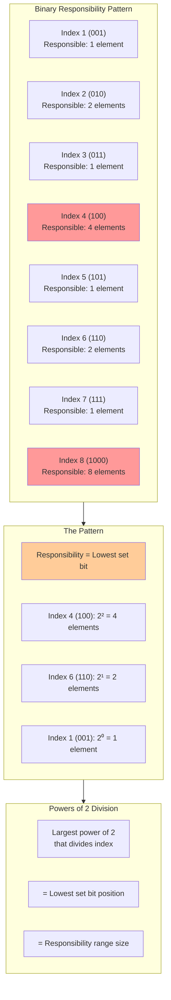

Consider how binary numbers naturally create hierarchical patterns:

- **Index 1** (binary: 001): Responsible for 1 element
- **Index 2** (binary: 010): Responsible for 2 elements
- **Index 3** (binary: 011): Responsible for 1 element
- **Index 4** (binary: 100): Responsible for 4 elements
- **Index 5** (binary: 101): Responsible for 1 element
- **Index 6** (binary: 110): Responsible for 2 elements
- **Index 7** (binary: 111): Responsible for 1 element
- **Index 8** (binary: 1000): Responsible for 8 elements

**The pattern**: The number of elements an index is responsible for equals the largest power of 2 that divides the index.

## The Implicit Tree Structure

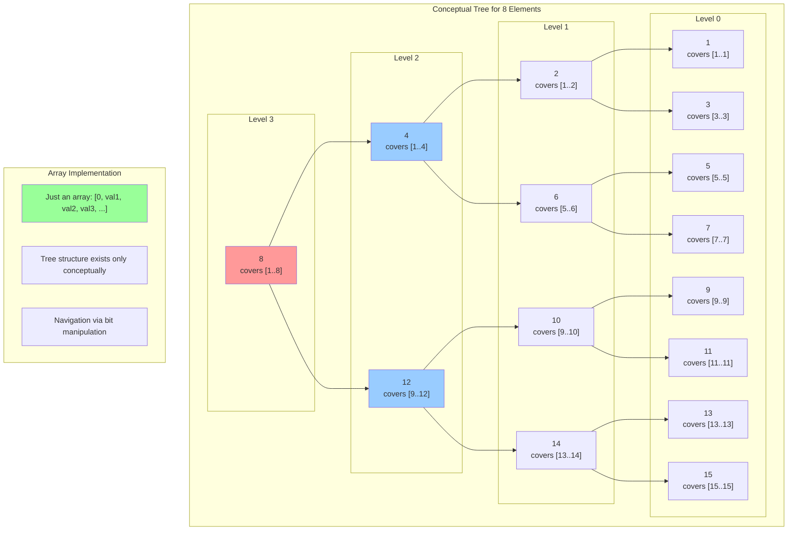

Even though we use a simple array, there's an implicit tree structure based on these binary patterns:

**Array indices and their responsibility ranges**:
- `tree[1]` covers elements [1..1]
- `tree[2]` covers elements [1..2]  
- `tree[3]` covers elements [3..3]
- `tree[4]` covers elements [1..4]
- `tree[5]` covers elements [5..5]
- `tree[6]` covers elements [5..6]
- `tree[7]` covers elements [7..7]
- `tree[8]` covers elements [1..8]

## Why This Works: The Power of Two Property

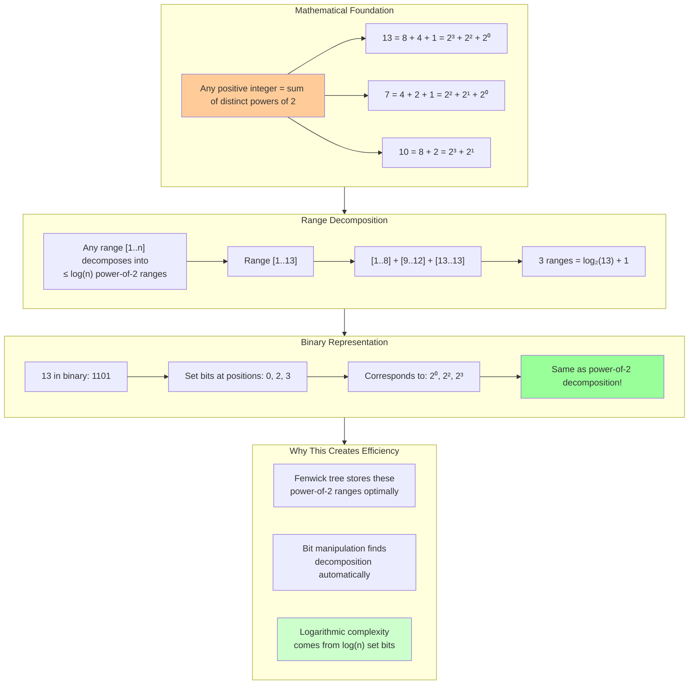

The magic comes from a mathematical property: **any positive integer can be uniquely decomposed into a sum of distinct powers of 2**.

**Examples**:
- 13 = 8 + 4 + 1 = 2³ + 2² + 2⁰
- 7 = 4 + 2 + 1 = 2² + 2¹ + 2⁰  
- 10 = 8 + 2 = 2³ + 2¹

This means any range [1..n] can be decomposed into at most log(n) non-overlapping power-of-2 ranges.

## The Navigation Philosophy

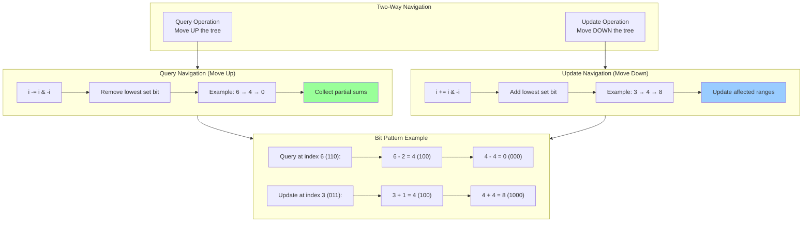

Fenwick Trees use two key operations for navigation:

### Moving Up the Tree (Query Operation)
```rust
fn parent(i: usize) -> usize {
    i - (i & (!i + 1))  // Remove the lowest set bit
}
```

### Moving Down the Tree (Update Operation)  
```rust
fn next(i: usize) -> usize {
    i + (i & (!i + 1))  // Add the lowest set bit
}
```

## The Manager Hierarchy Analogy

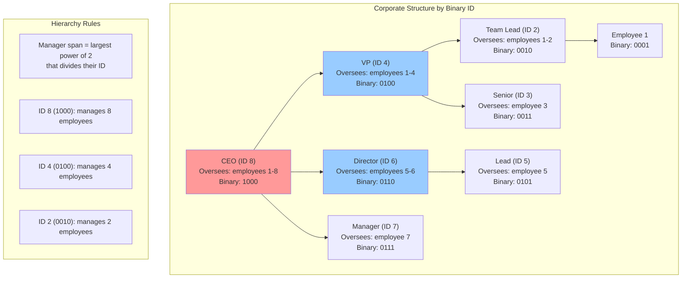

### Getting a Department Total (Query Operation)

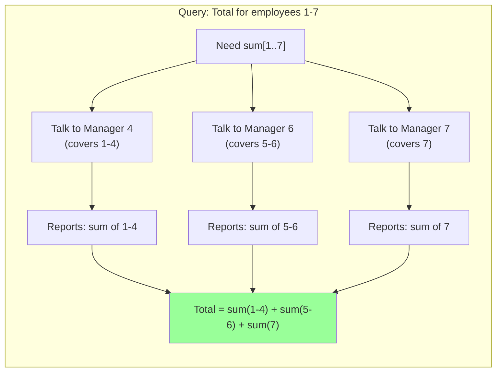

### Updating an Employee's Data (Update Operation)

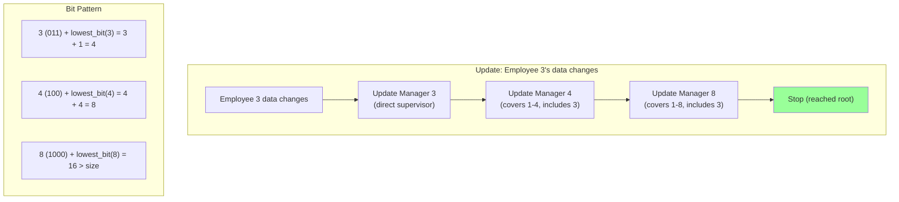

## Prefix Sum Transformation

Fenwick Trees store **prefix sums** rather than individual elements:

```
Original array: [3, 2, -1, 6, 5, 4, -3, 2]

Fenwick Tree array:
tree[1] = sum[1..1] = 3
tree[2] = sum[1..2] = 3 + 2 = 5  
tree[3] = sum[3..3] = -1
tree[4] = sum[1..4] = 3 + 2 + (-1) + 6 = 10
tree[5] = sum[5..5] = 5
tree[6] = sum[5..6] = 5 + 4 = 9
tree[7] = sum[7..7] = -3  
tree[8] = sum[1..8] = 10 + 5 + 4 + (-3) + 2 = 18
```

## Range Query Decomposition

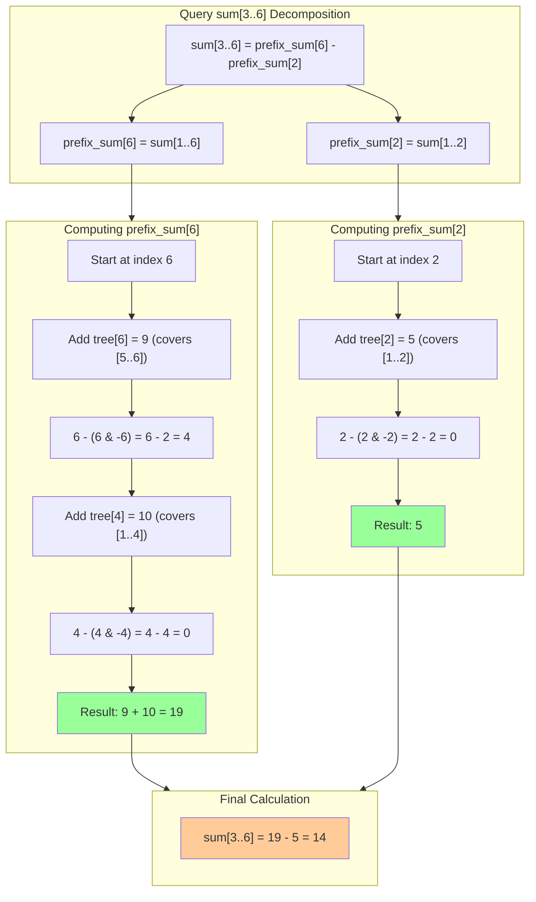

To query sum[i..j], we use the insight: sum[i..j] = prefix_sum[j] - prefix_sum[i-1]

**Example**: Query sum[3..6]:
- = prefix_sum[6] - prefix_sum[2]
- = sum[1..6] - sum[1..2]
- = (tree[4] + tree[6]) - tree[2]
- = (10 + 9) - 5 = 14

## The Elegance of Bit Manipulation

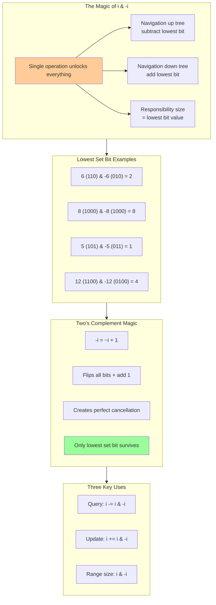

The key operations rely on finding the "lowest set bit":

```rust
fn lowest_set_bit(i: usize) -> usize {
    i & (!i + 1)  // Also written as: i & -i in two's complement
}

// Examples:
// lowest_set_bit(6) = 6 & -6 = 110 & 010 = 010 = 2
// lowest_set_bit(8) = 8 & -8 = 1000 & 1000 = 1000 = 8
// lowest_set_bit(5) = 5 & -5 = 101 & 011 = 001 = 1
```

This single operation allows us to:
- **Navigate up** the implicit tree (subtract lowest set bit)
- **Navigate down** the implicit tree (add lowest set bit)
- **Determine responsibility ranges** (lowest set bit = span size)

## The Philosophical Shift

Traditional data structures ask: "How do we organize data for efficient access?"

Fenwick Trees ask: "How can we encode the organization directly into the indices themselves?"

This leads to:
- **No pointers**: Everything is array-based
- **No explicit tree**: The tree is implicit in binary patterns
- **No complex balancing**: Binary properties automatically maintain balance
- **Minimal memory**: Just one array, same size as input

## The Trade-offs

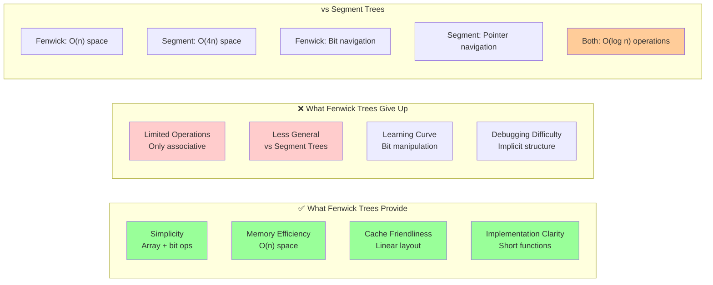

Fenwick Trees make specific trade-offs:

**Gained:**
- **Simplicity**: Just an array with bit operations
- **Memory efficiency**: No overhead beyond the array
- **Cache friendliness**: Linear memory layout
- **Implementation clarity**: Short, focused functions

**Given up:**
- **Flexibility**: Only works for associative operations (sum, XOR, etc.)
- **Generality**: Can't handle arbitrary range functions like Segment Trees
- **Intuition**: Bit manipulation can be harder to understand initially

## The Mental Model

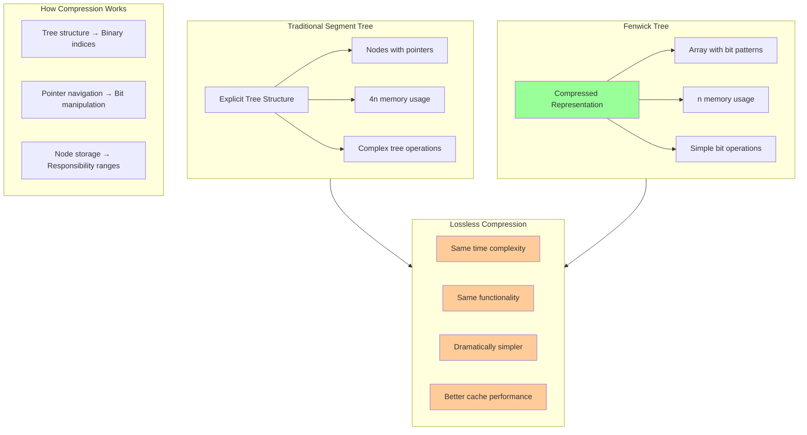

Think of Fenwick Trees as a **compressed representation** of a Segment Tree where:
- **Tree structure** is encoded in binary indices
- **Navigation** uses bit manipulation instead of pointers
- **Each array position** stores exactly what it needs for its responsibility range

This compression is **lossless**—we get the same time complexity with dramatically simplified structure.

The next section explores the key abstractions that make this elegant compression possible.