# Key Abstractions: Implicit Trees, Prefix Sums, and the Low-Bit Operation

## The Three Pillars of Fenwick Trees

```mermaid
flowchart TD
    subgraph Pillars["Three Fundamental Abstractions"]
        A["Implicit Tree Structure<br/>🌳 Array indices encode hierarchy"]
        B["Prefix Sum Storage<br/>💾 Strategic partial sums"]
        C["Low-Bit Operation<br/>⚡ Bit manipulation navigation"]
    end
    
    subgraph Result["Combined Result"]
        D["Elegant Range Queries<br/>🎯 O(log n) time<br/>📦 O(n) space"]
    end
    
    A --> D
    B --> D
    C --> D
    
    subgraph Foundation["Mathematical Foundation"]
        E["Binary representation<br/>encodes hierarchy"]
        F["Power-of-2 decomposition<br/>optimizes ranges"]
        G["Two's complement arithmetic<br/>enables navigation"]
    end
    
    A -.-> E
    B -.-> F
    C -.-> G
    
    style A fill:#ff9999
    style B fill:#99ff99
    style C fill:#99ccff
    style D fill:#ffcc99
```



Fenwick Trees are built on three fundamental abstractions that work together to create efficient range queries:

1. **Implicit Tree Structure**: Tree hierarchy encoded in array indices
2. **Prefix Sum Storage**: Strategic partial sum placement
3. **Low-Bit Operation**: Bit manipulation for navigation

## 1. Implicit Tree Structure: The Invisible Hierarchy


Unlike explicit trees with pointers, Fenwick Trees encode the tree structure directly into array indices using binary patterns.

### The Index-to-Responsibility Mapping


```
Index (binary)  → Responsibility Range
1 (001)         → Covers elements [1..1]
2 (010)         → Covers elements [1..2]
3 (011)         → Covers elements [3..3]
4 (100)         → Covers elements [1..4]
5 (101)         → Covers elements [5..5]
6 (110)         → Covers elements [5..6]
7 (111)         → Covers elements [7..7]
8 (1000)        → Covers elements [1..8]
```

### Visualizing the Implicit Tree

```mermaid
graph TD
    A[tree[8]: sum 1-8] --> B[tree[4]: sum 1-4]
    A --> C[tree[6]: sum 5-6]
    A --> D[tree[7]: sum 7-7]
    
    B --> E[tree[2]: sum 1-2]
    B --> F[tree[3]: sum 3-3]
    
    E --> G[tree[1]: sum 1-1]
    
    C --> H[tree[5]: sum 5-5]
    
    style A fill:#ff9999
    style B fill:#99ccff
    style C fill:#99ccff
    style E fill:#99ff99
    style F fill:#99ff99
    style G fill:#ffff99
    style H fill:#ffff99
    style D fill:#99ff99
```

### Parent-Child Relationships

```mermaid
flowchart TD
    subgraph Navigation["Tree Navigation Rules"]
        A["Move Up (Query)<br/>i -= i & -i<br/>Remove lowest bit"]
        B["Move Down (Update)<br/>i += i & -i<br/>Add lowest bit"]
    end
    
    subgraph QueryExample["Query Navigation: parent(6)"]
        C["Index 6 (110)"]
        C --> D["6 & -6 = 2"]
        D --> E["6 - 2 = 4"]
        E --> F["Parent: Index 4 (100)"]
        
        F --> G["4 & -4 = 4"]
        G --> H["4 - 4 = 0"]
        H --> I["Stop at 0"]
    end
    
    subgraph UpdateExample["Update Navigation: next(3)"]
        J["Index 3 (011)"]
        J --> K["3 & -3 = 1"]
        K --> L["3 + 1 = 4"]
        L --> M["Next: Index 4 (100)"]
        
        M --> N["4 & -4 = 4"]
        N --> O["4 + 4 = 8"]
        O --> P["Next: Index 8 (1000)"]
    end
    
    subgraph BitPattern["Bit Manipulation Examples"]
        Q["6 (110) → parent → 4 (100)"]
        R["3 (011) → parent → 2 (010)"]
        S["2 (010) → next → 4 (100)"]
        T["5 (101) → next → 6 (110)"]
    end
    
    A --> QueryExample
    B --> UpdateExample
    QueryExample --> BitPattern
    UpdateExample --> BitPattern
    
    style C fill:#99ccff
    style F fill:#99ff99
    style J fill:#ff9999
    style M fill:#ffcc99
    style P fill:#ffffcc
```



The tree relationships are determined by bit manipulation:

```rust
// Get parent: remove the lowest set bit
fn parent(i: usize) -> usize {
    i - (i & (!i + 1))
}

// Get next sibling/cousin: add the lowest set bit  
fn next(i: usize) -> usize {
    i + (i & (!i + 1))
}

Examples:
parent(6) = 6 - (6 & -6) = 6 - 2 = 4
parent(3) = 3 - (3 & -3) = 3 - 1 = 2
next(2) = 2 + (2 & -2) = 2 + 2 = 4
next(5) = 5 + (5 & -5) = 5 + 1 = 6
```

## 2. Prefix Sum Storage: Strategic Data Placement


Each index stores the sum of a specific range determined by its binary properties.

### Storage Strategy

```
Original data: [a, b, c, d, e, f, g, h]

Fenwick Tree storage:
tree[1] = a                    (sum of range [1..1])
tree[2] = a + b                (sum of range [1..2])
tree[3] = c                    (sum of range [3..3])
tree[4] = a + b + c + d        (sum of range [1..4])
tree[5] = e                    (sum of range [5..5])
tree[6] = e + f                (sum of range [5..6])
tree[7] = g                    (sum of range [7..7])
tree[8] = a + b + c + d + e + f + g + h  (sum of range [1..8])
```

### Range Decomposition Property


Any prefix sum can be computed by combining at most log(n) stored values:

```
prefix_sum[6] = sum[1..6]
              = tree[4] + tree[6]
              = (a+b+c+d) + (e+f)
              = a + b + c + d + e + f

prefix_sum[7] = sum[1..7]  
              = tree[4] + tree[6] + tree[7]
              = (a+b+c+d) + (e+f) + g
              = a + b + c + d + e + f + g
```

### The Decomposition Algorithm

```rust
fn prefix_sum(tree: &[i32], mut idx: usize) -> i32 {
    let mut sum = 0;
    while idx > 0 {
        sum += tree[idx];
        idx -= idx & (!idx + 1);  // Remove lowest set bit
    }
    sum
}
```

## 3. The Low-Bit Operation: The Navigation Engine


The low-bit operation `i & -i` is the mathematical foundation that makes everything work.

### Understanding Two's Complement

In two's complement representation, `-i` flips all bits of `i` and adds 1:

```
i = 6:     000110
~i:        111001  (flip bits)
~i + 1:    111010  (add 1) = -i
i & -i:    000010  = 2 (lowest set bit)

i = 12:    001100
~i:        110011
~i + 1:    110100 = -i  
i & -i:    000100 = 4 (lowest set bit)
```

### Why This Works: Binary Arithmetic Magic

The operation `i & -i` isolates the rightmost set bit due to how two's complement arithmetic works:

```
When we compute -i:
1. All bits to the right of the lowest set bit become 0
2. The lowest set bit stays 1
3. All bits to the left get flipped

When we AND i with -i:
1. Only the lowest set bit position has 1 in both numbers
2. All other positions have 0 in at least one number
3. Result: only the lowest set bit survives
```

### Navigation Operations


```rust
// The fundamental operations
fn lowest_set_bit(i: usize) -> usize {
    i & (!i + 1)  // Same as i & -i
}

fn remove_lowest_bit(i: usize) -> usize {
    i - (i & (!i + 1))
}

fn add_lowest_bit(i: usize) -> usize {
    i + (i & (!i + 1))
}
```

### Navigation Examples

```
Moving up for prefix_sum[6]:
6 (110) → remove_lowest_bit(6) = 6 - 2 = 4 (100)
4 (100) → remove_lowest_bit(4) = 4 - 4 = 0 (000)
Stop at 0

Path: 6 → 4 → 0
Sum: tree[6] + tree[4]

Moving down for update(3):
3 (011) → add_lowest_bit(3) = 3 + 1 = 4 (100)
4 (100) → add_lowest_bit(4) = 4 + 4 = 8 (1000)
8 (1000) → add_lowest_bit(8) = 8 + 8 = 16 (10000) > array_size

Path: 3 → 4 → 8
Update: tree[3], tree[4], tree[8]
```

## The Corporate Hierarchy Analogy Revisited


Let's map our abstractions to the corporate analogy:

### Implicit Tree Structure = Organization Chart
```
CEO (index 8): Oversees entire company (1-8)
├── VP (index 4): Oversees departments 1-4
│   ├── Manager (index 2): Oversees teams 1-2
│   │   └── Lead (index 1): Oversees employee 1
│   └── Lead (index 3): Oversees employee 3
├── Manager (index 6): Oversees teams 5-6
│   └── Lead (index 5): Oversees employee 5
└── Lead (index 7): Oversees employee 7
```

### Prefix Sum Storage = Cumulative Reports
Each manager stores the **total** for their entire responsibility range, not just direct reports.

### Low-Bit Operation = Organizational Navigation
- **Going up** (reporting): Remove lowest bit to find who you report to
- **Going down** (delegation): Add lowest bit to find who reports to you

## Memory Layout and Cache Efficiency

```mermaid
flowchart TD
    subgraph FenwickMemory["Fenwick Tree Memory Layout"]
        A["Linear Array in Contiguous Memory"]
        A --> B["[tree[1], tree[2], tree[3], tree[4], ...]"]
        B --> C["Sequential memory access"]
        C --> D["Excellent cache locality"]
        D --> E["CPU can prefetch efficiently"]
    end
    
    subgraph ExplicitMemory["Explicit Tree Memory Layout"]
        F["Scattered Nodes with Pointers"]
        F --> G["Node objects in heap"]
        G --> H["Random memory access"]
        H --> I["Poor cache locality"]
        I --> J["Cache misses hurt performance"]
    end
    
    subgraph Comparison["Performance Impact"]
        K["Fenwick: Array[i] → Array[i+1]<br/>Predictable, cache-friendly"]
        L["Explicit: Node→left→parent→right<br/>Unpredictable, cache-hostile"]
    end
    
    subgraph Benefits["Cache Benefits"]
        M["Faster memory access"]
        N["Better CPU utilization"]
        O["Lower memory overhead"]
        P["Simpler memory management"]
    end
    
    FenwickMemory --> K
    ExplicitMemory --> L
    K --> Benefits
    
    style A fill:#99ff99
    style F fill:#ffcccc
    style M fill:#ccffcc
    style N fill:#ccffcc
    style O fill:#ccffcc
    style P fill:#ccffcc
```



The beauty of implicit trees is cache-friendly memory access:

```
Array layout: [tree[1], tree[2], tree[3], tree[4], tree[5], tree[6], tree[7], tree[8]]
Memory:       [Linear array in contiguous memory]

Compare to explicit tree:
Nodes scattered in memory with pointers
Poor cache locality
Higher memory overhead
```

## The Mathematical Foundation

```mermaid
flowchart TD
    subgraph Theorem["Fundamental Theorem"]
        A["Any positive integer n =<br/>sum of distinct powers of 2"]
        A --> B["13 = 8 + 4 + 1 = 2³ + 2² + 2⁰"]
        A --> C["10 = 8 + 2 = 2³ + 2¹"]
        A --> D["7 = 4 + 2 + 1 = 2² + 2¹ + 2⁰"]
    end
    
    subgraph Corollary["Range Decomposition"]
        E["Any range [1..n] decomposes into<br/>≤ ⌊log₂(n)⌋ + 1 power-of-2 ranges"]
        E --> F["Range [1..13] = [1..8] + [9..12] + [13..13]"]
        F --> G["3 ranges = # of set bits in 13"]
    end
    
    subgraph Implementation["Fenwick Tree Magic"]
        H["Low-bit operation finds<br/>power-of-2 components automatically"]
        H --> I["i & -i isolates lowest power"]
        I --> J["Navigation uses binary arithmetic"]
        J --> K["Logarithmic complexity guaranteed"]
    end
    
    subgraph Binary["Binary Connection"]
        L["13 in binary: 1101"]
        L --> M["Set bits at: positions 0, 2, 3"]
        M --> N["Powers: 2⁰=1, 2²=4, 2³=8"]
        N --> O["Sum: 1 + 4 + 8 = 13 ✓"]
    end
    
    Theorem --> Corollary
    Corollary --> Implementation
    Implementation --> Binary
    
    style A fill:#ffcc99
    style E fill:#99ff99
    style H fill:#99ccff
    style O fill:#ccffcc
```



Fenwick Trees work because of this mathematical property:

**Theorem**: Any positive integer n can be uniquely written as a sum of distinct powers of 2.

**Corollary**: Any range [1..n] can be decomposed into at most ⌊log₂(n)⌋ + 1 disjoint ranges, each of size 2ᵏ.

**Implementation**: The low-bit operation finds these power-of-2 components efficiently.

## Complexity Analysis

### Time Complexity
- **Query**: O(log n) - traverse at most log n levels up
- **Update**: O(log n) - traverse at most log n levels down
- **Space**: O(n) - just one array

### Why It's Logarithmic
The number of operations is bounded by the number of set bits in the binary representation, which is at most log₂(n) + 1.

## Limitations and Extensions

### What Fenwick Trees Handle Well
- Range sum queries
- Range XOR queries  
- Any associative and invertible operation

### What They Don't Handle
- Non-associative operations
- Range minimum/maximum queries (without modifications)
- Arbitrary range functions

### Extensions
- **2D Fenwick Trees**: For 2D range sum queries
- **Range Update Fenwick Trees**: Using difference arrays
- **Fenwick Trees with Lazy Propagation**: For range updates

## Key Takeaways

1. **Implicit structure** eliminates the need for explicit tree nodes and pointers
2. **Binary patterns** naturally create hierarchical relationships
3. **Low-bit operation** provides elegant navigation through bit manipulation
4. **Prefix sum storage** enables efficient range decomposition
5. **Mathematical foundation** guarantees logarithmic complexity

These abstractions work together to create a data structure that's both simple to implement and efficient to use.

The next section shows how to build your first Fenwick Tree step by step.