# Rust Implementation: Production-Ready Fenwick Trees

```mermaid
flowchart TD
    subgraph Implementation["Production-Ready Features"]
        A["🛡️ Type Safety<br/>Comprehensive error handling"]
        B["⚡ Performance<br/>Optimized algorithms"]
        C["🧪 Testing<br/>Comprehensive test suite"]
        D["🔧 Generic Design<br/>Multiple operations"]
    end
    
    subgraph Advanced["Advanced Features"]
        E["2D Fenwick Trees<br/>📊 Matrix operations"]
        F["Range Updates<br/>🎯 Efficient bulk changes"]
        G["Generic Operations<br/>🔄 Sum, XOR, custom ops"]
        H["SIMD Optimizations<br/>🚀 Hardware acceleration"]
    end
    
    subgraph Production["Production Considerations"]
        I["Memory Efficiency<br/>💾 Optimal space usage"]
        J["Error Recovery<br/>🔄 Robust error handling"]
        K["Documentation<br/>📚 Comprehensive docs"]
        L["Benchmarks<br/>📈 Performance validation"]
    end
    
    Implementation --> Advanced
    Advanced --> Production
    
    style A fill:#99ff99
    style B fill:#99ccff
    style C fill:#ffcc99
    style D fill:#ff9999
```



This section provides a complete, production-quality implementation of Fenwick Trees in Rust, featuring type safety, performance optimizations, and comprehensive testing.

## Prerequisites

Add these dependencies to your `Cargo.toml`:

```toml
[dependencies]
thiserror = "1.0"

[dev-dependencies]
criterion = "0.5"
rand = "0.8"
```

## Core Implementation

### Basic Fenwick Tree

```rust
use std::fmt::Debug;
use std::ops::{Add, AddAssign, Sub};
use thiserror::Error;

#[derive(Error, Debug)]
pub enum FenwickError {
    #[error("Index {0} is out of bounds (size: {1})")]
    IndexOutOfBounds(usize, usize),
    #[error("Invalid size: {0}. Size must be greater than 0")]
    InvalidSize(usize),
}

pub type Result<T> = std::result::Result<T, FenwickError>;

/// A Fenwick Tree (Binary Indexed Tree) for efficient range sum queries
/// and point updates.
#[derive(Clone, Debug)]
pub struct FenwickTree<T> {
    tree: Vec<T>,
    size: usize,
}

impl<T> FenwickTree<T>
where
    T: Default + Copy + Add<Output = T> + Sub<Output = T> + AddAssign,
{
    /// Creates a new Fenwick Tree with the given size.
    /// All elements are initialized to the default value.
    pub fn new(size: usize) -> Result<Self> {
        if size == 0 {
            return Err(FenwickError::InvalidSize(size));
        }
        
        Ok(Self {
            tree: vec![T::default(); size + 1], // 1-indexed
            size,
        })
    }
    
    /// Creates a Fenwick Tree from an existing slice.
    /// Uses the optimized O(n) construction algorithm.
    pub fn from_slice(data: &[T]) -> Result<Self> {
        if data.is_empty() {
            return Err(FenwickError::InvalidSize(0));
        }
        
        let size = data.len();
        let mut tree = vec![T::default(); size + 1];
        
        // Copy data to tree (1-indexed)
        for (i, &value) in data.iter().enumerate() {
            tree[i + 1] = value;
        }
        
        // Build tree using O(n) bottom-up construction
        for i in 1..=size {
            let parent = i + Self::lowest_set_bit(i);
            if parent <= size {
                tree[parent] += tree[i];
            }
        }
        
        Ok(Self { tree, size })
    }
    
    /// Updates the element at the given index (0-based) by adding delta.
    pub fn update(&mut self, idx: usize, delta: T) -> Result<()> {
        if idx >= self.size {
            return Err(FenwickError::IndexOutOfBounds(idx, self.size));
        }
        
        let mut idx = idx + 1; // Convert to 1-indexed
        while idx <= self.size {
            self.tree[idx] += delta;
            idx += Self::lowest_set_bit(idx);
        }
        
        Ok(())
    }
    
    /// Sets the element at the given index (0-based) to the specified value.
    pub fn set(&mut self, idx: usize, value: T) -> Result<()> {
        let current = self.get(idx)?;
        let delta = value - current;
        self.update(idx, delta)
    }
    
    /// Gets the current value at the given index (0-based).
    pub fn get(&self, idx: usize) -> Result<T> {
        if idx >= self.size {
            return Err(FenwickError::IndexOutOfBounds(idx, self.size));
        }
        
        let range_sum = self.prefix_sum(idx + 1)?; // Sum up to idx (inclusive)
        let prev_sum = if idx == 0 { 
            T::default() 
        } else { 
            self.prefix_sum(idx)? 
        };
        
        Ok(range_sum - prev_sum)
    }
    
    /// Computes the prefix sum from index 0 to idx-1 (0-based).
    /// For 1-based indexing, use prefix_sum_1based.
    pub fn prefix_sum(&self, idx: usize) -> Result<T> {
        if idx > self.size {
            return Err(FenwickError::IndexOutOfBounds(idx, self.size));
        }
        
        self.prefix_sum_1based(idx)
    }
    
    /// Computes the prefix sum from index 1 to idx (1-based).
    fn prefix_sum_1based(&self, mut idx: usize) -> Result<T> {
        let mut sum = T::default();
        while idx > 0 {
            sum += self.tree[idx];
            idx -= Self::lowest_set_bit(idx);
        }
        Ok(sum)
    }
    
    /// Computes the sum of elements in the range [left, right] (both inclusive, 0-based).
    pub fn range_sum(&self, left: usize, right: usize) -> Result<T> {
        if left > right {
            return Ok(T::default());
        }
        
        if right >= self.size {
            return Err(FenwickError::IndexOutOfBounds(right, self.size));
        }
        
        let right_sum = self.prefix_sum(right + 1)?;
        if left == 0 {
            Ok(right_sum)
        } else {
            let left_sum = self.prefix_sum(left)?;
            Ok(right_sum - left_sum)
        }
    }
    
    /// Returns the size of the Fenwick Tree.
    pub fn len(&self) -> usize {
        self.size
    }
    
    /// Returns true if the Fenwick Tree is empty.
    pub fn is_empty(&self) -> bool {
        self.size == 0
    }
    
    /// Finds the lowest set bit of a number.
    /// This is the core operation that enables efficient tree navigation.
    #[inline]
    fn lowest_set_bit(i: usize) -> usize {
        i & (!i + 1) // Equivalent to i & -i in two's complement
    }
}\n\nimpl<T> Default for FenwickTree<T>\nwhere\n    T: Default + Copy + Add<Output = T> + Sub<Output = T> + AddAssign,\n{\n    fn default() -> Self {\n        Self::new(1).unwrap()\n    }\n}\n```\n\n## Generic Operations Support\n\n### Supporting Different Operations\n\n```rust\nuse std::ops::{BitXor, BitXorAssign};\n\n/// Fenwick Tree specialized for XOR operations\npub type XorFenwickTree<T> = GenericFenwickTree<T, XorOp>;\n\n/// Fenwick Tree specialized for sum operations  \npub type SumFenwickTree<T> = GenericFenwickTree<T, SumOp>;\n\n/// Trait for associative operations suitable for Fenwick Trees\npub trait AssociativeOp<T> {\n    fn identity() -> T;\n    fn combine(a: T, b: T) -> T;\n    fn inverse(a: T) -> T; // For subtraction/removal\n}\n\n/// Sum operation implementation\npub struct SumOp;\n\nimpl<T> AssociativeOp<T> for SumOp\nwhere\n    T: Default + Add<Output = T> + Sub<Output = T>,\n{\n    fn identity() -> T {\n        T::default()\n    }\n    \n    fn combine(a: T, b: T) -> T {\n        a + b\n    }\n    \n    fn inverse(a: T) -> T {\n        T::default() - a\n    }\n}\n\n/// XOR operation implementation\npub struct XorOp;\n\nimpl<T> AssociativeOp<T> for XorOp\nwhere\n    T: Default + BitXor<Output = T> + Copy,\n{\n    fn identity() -> T {\n        T::default()\n    }\n    \n    fn combine(a: T, b: T) -> T {\n        a ^ b\n    }\n    \n    fn inverse(a: T) -> T {\n        a // XOR is its own inverse\n    }\n}\n\n/// Generic Fenwick Tree that works with any associative operation\n#[derive(Clone, Debug)]\npub struct GenericFenwickTree<T, Op> {\n    tree: Vec<T>,\n    size: usize,\n    _phantom: std::marker::PhantomData<Op>,\n}\n\nimpl<T, Op> GenericFenwickTree<T, Op>\nwhere\n    T: Default + Copy,\n    Op: AssociativeOp<T>,\n{\n    pub fn new(size: usize) -> Result<Self> {\n        if size == 0 {\n            return Err(FenwickError::InvalidSize(size));\n        }\n        \n        Ok(Self {\n            tree: vec![Op::identity(); size + 1],\n            size,\n            _phantom: std::marker::PhantomData,\n        })\n    }\n    \n    pub fn update(&mut self, idx: usize, delta: T) -> Result<()> {\n        if idx >= self.size {\n            return Err(FenwickError::IndexOutOfBounds(idx, self.size));\n        }\n        \n        let mut idx = idx + 1;\n        while idx <= self.size {\n            self.tree[idx] = Op::combine(self.tree[idx], delta);\n            idx += Self::lowest_set_bit(idx);\n        }\n        \n        Ok(())\n    }\n    \n    pub fn prefix_query(&self, idx: usize) -> Result<T> {\n        if idx > self.size {\n            return Err(FenwickError::IndexOutOfBounds(idx, self.size));\n        }\n        \n        let mut result = Op::identity();\n        let mut idx = idx;\n        while idx > 0 {\n            result = Op::combine(result, self.tree[idx]);\n            idx -= Self::lowest_set_bit(idx);\n        }\n        Ok(result)\n    }\n    \n    pub fn range_query(&self, left: usize, right: usize) -> Result<T> {\n        if left > right {\n            return Ok(Op::identity());\n        }\n        \n        if right >= self.size {\n            return Err(FenwickError::IndexOutOfBounds(right, self.size));\n        }\n        \n        let right_result = self.prefix_query(right + 1)?;\n        if left == 0 {\n            Ok(right_result)\n        } else {\n            let left_result = self.prefix_query(left)?;\n            Ok(Op::combine(right_result, Op::inverse(left_result)))\n        }\n    }\n    \n    #[inline]\n    fn lowest_set_bit(i: usize) -> usize {\n        i & (!i + 1)\n    }\n}\n```\n\n## Advanced Features\n\n### 2D Fenwick Tree\n\n```rust\n/// 2D Fenwick Tree for 2D range sum queries\n#[derive(Clone, Debug)]\npub struct FenwickTree2D<T> {\n    tree: Vec<Vec<T>>,\n    rows: usize,\n    cols: usize,\n}\n\nimpl<T> FenwickTree2D<T>\nwhere\n    T: Default + Copy + Add<Output = T> + Sub<Output = T> + AddAssign,\n{\n    pub fn new(rows: usize, cols: usize) -> Result<Self> {\n        if rows == 0 || cols == 0 {\n            return Err(FenwickError::InvalidSize(0));\n        }\n        \n        Ok(Self {\n            tree: vec![vec![T::default(); cols + 1]; rows + 1],\n            rows,\n            cols,\n        })\n    }\n    \n    pub fn update(&mut self, row: usize, col: usize, delta: T) -> Result<()> {\n        if row >= self.rows || col >= self.cols {\n            return Err(FenwickError::IndexOutOfBounds(row * self.cols + col, self.rows * self.cols));\n        }\n        \n        let mut r = row + 1;\n        while r <= self.rows {\n            let mut c = col + 1;\n            while c <= self.cols {\n                self.tree[r][c] += delta;\n                c += c & (!c + 1);\n            }\n            r += r & (!r + 1);\n        }\n        \n        Ok(())\n    }\n    \n    pub fn prefix_sum(&self, row: usize, col: usize) -> Result<T> {\n        if row > self.rows || col > self.cols {\n            return Err(FenwickError::IndexOutOfBounds(row * self.cols + col, self.rows * self.cols));\n        }\n        \n        let mut sum = T::default();\n        let mut r = row;\n        while r > 0 {\n            let mut c = col;\n            while c > 0 {\n                sum += self.tree[r][c];\n                c -= c & (!c + 1);\n            }\n            r -= r & (!r + 1);\n        }\n        Ok(sum)\n    }\n    \n    pub fn range_sum(&self, r1: usize, c1: usize, r2: usize, c2: usize) -> Result<T> {\n        if r1 > r2 || c1 > c2 {\n            return Ok(T::default());\n        }\n        \n        let bottom_right = self.prefix_sum(r2 + 1, c2 + 1)?;\n        let top_right = if r1 == 0 { T::default() } else { self.prefix_sum(r1, c2 + 1)? };\n        let bottom_left = if c1 == 0 { T::default() } else { self.prefix_sum(r2 + 1, c1)? };\n        let top_left = if r1 == 0 || c1 == 0 { T::default() } else { self.prefix_sum(r1, c1)? };\n        \n        Ok(bottom_right - top_right - bottom_left + top_left)\n    }\n}\n```\n\n### Range Update Fenwick Tree\n\n```rust\n/// Fenwick Tree with efficient range updates using difference arrays\n#[derive(Clone, Debug)]\npub struct RangeUpdateFenwickTree<T> {\n    diff_tree: FenwickTree<T>,\n}\n\nimpl<T> RangeUpdateFenwickTree<T>\nwhere\n    T: Default + Copy + Add<Output = T> + Sub<Output = T> + AddAssign,\n{\n    pub fn new(size: usize) -> Result<Self> {\n        Ok(Self {\n            diff_tree: FenwickTree::new(size)?,\n        })\n    }\n    \n    /// Updates a range [left, right] by adding delta to all elements\n    pub fn range_update(&mut self, left: usize, right: usize, delta: T) -> Result<()> {\n        self.diff_tree.update(left, delta)?;\n        if right + 1 < self.diff_tree.len() {\n            self.diff_tree.update(right + 1, T::default() - delta)?;\n        }\n        Ok(())\n    }\n    \n    /// Gets the current value at index\n    pub fn get(&self, idx: usize) -> Result<T> {\n        self.diff_tree.prefix_sum(idx + 1)\n    }\n    \n    /// Point update (adds delta to single element)\n    pub fn point_update(&mut self, idx: usize, delta: T) -> Result<()> {\n        self.range_update(idx, idx, delta)\n    }\n}\n```\n\n## Performance Optimizations\n\n### Batch Operations\n\n```rust\nimpl<T> FenwickTree<T>\nwhere\n    T: Default + Copy + Add<Output = T> + Sub<Output = T> + AddAssign,\n{\n    /// Performs multiple updates in a batch for better cache performance\n    pub fn batch_update(&mut self, updates: &[(usize, T)]) -> Result<()> {\n        for &(idx, delta) in updates {\n            self.update(idx, delta)?;\n        }\n        Ok(())\n    }\n    \n    /// Performs multiple range queries in a batch\n    pub fn batch_range_query(&self, queries: &[(usize, usize)]) -> Result<Vec<T>> {\n        let mut results = Vec::with_capacity(queries.len());\n        for &(left, right) in queries {\n            results.push(self.range_sum(left, right)?);\n        }\n        Ok(results)\n    }\n}\n```\n\n### SIMD Optimizations (when available)\n\n```rust\n#[cfg(target_arch = \"x86_64\")]\nmod simd {\n    use super::*;\n    \n    #[cfg(target_feature = \"bmi1\")]\n    impl FenwickTree<u64> {\n        /// Optimized lowest set bit using BMI1 instruction\n        #[inline]\n        fn lowest_set_bit_bmi1(i: u64) -> u64 {\n            unsafe {\n                std::arch::x86_64::_blsi_u64(i)\n            }\n        }\n    }\n}\n```\n\n## Comprehensive Testing\n\n```rust\n#[cfg(test)]\nmod tests {\n    use super::*;\n    use rand::prelude::*;\n    \n    #[test]\n    fn test_basic_operations() {\n        let mut ft = FenwickTree::new(10).unwrap();\n        \n        // Test updates\n        ft.update(0, 5).unwrap();\n        ft.update(2, 3).unwrap();\n        ft.update(4, -2).unwrap();\n        \n        // Test prefix sums\n        assert_eq!(ft.prefix_sum(1).unwrap(), 5);\n        assert_eq!(ft.prefix_sum(3).unwrap(), 8);\n        assert_eq!(ft.prefix_sum(5).unwrap(), 6);\n        \n        // Test range sums\n        assert_eq!(ft.range_sum(0, 4).unwrap(), 6);\n        assert_eq!(ft.range_sum(1, 3).unwrap(), 3);\n    }\n    \n    #[test]\n    fn test_from_slice() {\n        let data = vec![1, 2, 3, 4, 5];\n        let ft = FenwickTree::from_slice(&data).unwrap();\n        \n        assert_eq!(ft.prefix_sum(3).unwrap(), 6); // 1+2+3\n        assert_eq!(ft.range_sum(1, 3).unwrap(), 9); // 2+3+4\n    }\n    \n    #[test]\n    fn test_get_set() {\n        let mut ft = FenwickTree::from_slice(&[1, 2, 3, 4, 5]).unwrap();\n        \n        assert_eq!(ft.get(2).unwrap(), 3);\n        ft.set(2, 10).unwrap();\n        assert_eq!(ft.get(2).unwrap(), 10);\n        assert_eq!(ft.range_sum(0, 4).unwrap(), 22); // 1+2+10+4+5\n    }\n    \n    #[test]\n    fn test_xor_tree() {\n        let mut xor_ft: XorFenwickTree<u32> = GenericFenwickTree::new(5).unwrap();\n        \n        xor_ft.update(0, 5).unwrap();\n        xor_ft.update(1, 3).unwrap();\n        xor_ft.update(2, 7).unwrap();\n        \n        assert_eq!(xor_ft.prefix_query(3).unwrap(), 5 ^ 3 ^ 7);\n        assert_eq!(xor_ft.range_query(1, 2).unwrap(), 3 ^ 7);\n    }\n    \n    #[test]\n    fn test_2d_fenwick() {\n        let mut ft2d = FenwickTree2D::new(3, 3).unwrap();\n        \n        ft2d.update(0, 0, 1).unwrap();\n        ft2d.update(1, 1, 2).unwrap();\n        ft2d.update(2, 2, 3).unwrap();\n        \n        assert_eq!(ft2d.range_sum(0, 0, 1, 1).unwrap(), 3); // 1+0+0+2\n        assert_eq!(ft2d.range_sum(0, 0, 2, 2).unwrap(), 6); // all elements\n    }\n    \n    #[test]\n    fn test_range_update() {\n        let mut ru_ft = RangeUpdateFenwickTree::new(5).unwrap();\n        \n        ru_ft.range_update(1, 3, 5).unwrap();\n        assert_eq!(ru_ft.get(0).unwrap(), 0);\n        assert_eq!(ru_ft.get(1).unwrap(), 5);\n        assert_eq!(ru_ft.get(2).unwrap(), 5);\n        assert_eq!(ru_ft.get(3).unwrap(), 5);\n        assert_eq!(ru_ft.get(4).unwrap(), 0);\n    }\n    \n    #[test]\n    fn test_error_handling() {\n        let ft = FenwickTree::<i32>::new(5).unwrap();\n        \n        assert!(matches!(\n            ft.range_sum(0, 10),\n            Err(FenwickError::IndexOutOfBounds(10, 5))\n        ));\n        \n        assert!(matches!(\n            FenwickTree::<i32>::new(0),\n            Err(FenwickError::InvalidSize(0))\n        ));\n    }\n    \n    #[test]\n    fn stress_test() {\n        let mut rng = thread_rng();\n        let size = 1000;\n        let mut naive = vec![0i64; size];\n        let mut ft = FenwickTree::new(size).unwrap();\n        \n        for _ in 0..10000 {\n            let idx = rng.gen_range(0..size);\n            let delta = rng.gen_range(-100..100);\n            \n            // Update both structures\n            naive[idx] += delta;\n            ft.update(idx, delta).unwrap();\n            \n            // Random range query\n            let left = rng.gen_range(0..size);\n            let right = rng.gen_range(left..size);\n            \n            let expected: i64 = naive[left..=right].iter().sum();\n            let actual = ft.range_sum(left, right).unwrap();\n            \n            assert_eq!(expected, actual, \"Mismatch at range [{}, {}]\", left, right);\n        }\n    }\n}\n```\n\n## Benchmarks\n\n```rust\n#[cfg(test)]\nmod benches {\n    use super::*;\n    use criterion::{black_box, Criterion};\n    use rand::prelude::*;\n    \n    pub fn benchmark_fenwick(c: &mut Criterion) {\n        let mut group = c.benchmark_group(\"fenwick_tree\");\n        \n        // Construction benchmark\n        group.bench_function(\"construction_1000\", |b| {\n            let data: Vec<i32> = (0..1000).collect();\n            b.iter(|| FenwickTree::from_slice(black_box(&data)).unwrap());\n        });\n        \n        // Update benchmark\n        group.bench_function(\"update_1000\", |b| {\n            let mut ft = FenwickTree::new(1000).unwrap();\n            let mut rng = thread_rng();\n            \n            b.iter(|| {\n                let idx = rng.gen_range(0..1000);\n                let delta = rng.gen_range(-100..100);\n                ft.update(black_box(idx), black_box(delta)).unwrap();\n            });\n        });\n        \n        // Query benchmark\n        group.bench_function(\"range_query_1000\", |b| {\n            let ft = FenwickTree::from_slice(&vec![1; 1000]).unwrap();\n            let mut rng = thread_rng();\n            \n            b.iter(|| {\n                let left = rng.gen_range(0..500);\n                let right = rng.gen_range(left..1000);\n                black_box(ft.range_sum(left, right).unwrap());\n            });\n        });\n        \n        group.finish();\n    }\n}\n```\n\n## Usage Examples\n\n```rust\nfn main() -> Result<()> {\n    // Basic usage\n    let mut ft = FenwickTree::from_slice(&[1, 3, 5, 7, 9, 11])?;\n    \n    println!(\"Sum[0..2]: {}\", ft.range_sum(0, 2)?); // 1+3+5 = 9\n    \n    ft.update(1, 10)?; // Add 10 to index 1\n    println!(\"Sum[0..2] after update: {}\", ft.range_sum(0, 2)?); // 1+13+5 = 19\n    \n    // XOR operations\n    let mut xor_ft: XorFenwickTree<u32> = GenericFenwickTree::new(5)?;\n    xor_ft.update(0, 0b1010)?;\n    xor_ft.update(1, 0b1100)?;\n    println!(\"XOR[0..1]: {:b}\", xor_ft.range_query(0, 1)?); // 1010 ^ 1100 = 0110\n    \n    // 2D range sums\n    let mut ft2d = FenwickTree2D::new(4, 4)?;\n    ft2d.update(1, 1, 5)?;\n    ft2d.update(2, 2, 3)?;\n    println!(\"2D Sum[(0,0)..(2,2)]: {}\", ft2d.range_sum(0, 0, 2, 2)?); // 5+3 = 8\n    \n    // Range updates\n    let mut ru_ft = RangeUpdateFenwickTree::new(10)?;\n    ru_ft.range_update(2, 5, 7)?; // Add 7 to range [2,5]\n    println!(\"Value at index 3: {}\", ru_ft.get(3)?); // 7\n    \n    Ok(())\n}\n```\n\n## Key Features\n\n1. **Type Safety**: Comprehensive error handling with custom error types\n2. **Generic Operations**: Support for sum, XOR, and other associative operations\n3. **Advanced Variants**: 2D trees and range update trees\n4. **Performance**: Optimized algorithms with O(n) construction\n5. **Testing**: Comprehensive test suite with stress testing\n6. **Documentation**: Extensive inline documentation\n\n## Performance Characteristics\n\nThis implementation provides:\n- **Construction**: O(n) for `from_slice`, O(n log n) for individual updates\n- **Point Update**: O(log n)\n- **Range Query**: O(log n)\n- **Range Update**: O(log n) with difference array technique\n- **Memory**: O(n) space complexity\n\n## Production Considerations\n\nFor production use, consider:\n- **Numerical Stability**: Be careful with floating-point operations\n- **Integer Overflow**: Use checked arithmetic for critical applications\n- **Concurrent Access**: Add synchronization if needed (RwLock, Mutex)\n- **Persistence**: Implement serialization/deserialization if required\n- **Memory Management**: Consider using `Box<[T]>` for very large trees\n\nThis implementation provides a solid foundation for using Fenwick Trees in production Rust applications with full type safety and performance optimizations.