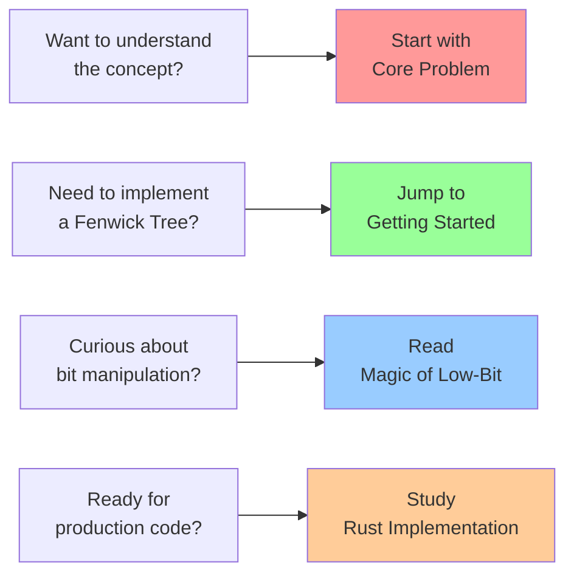
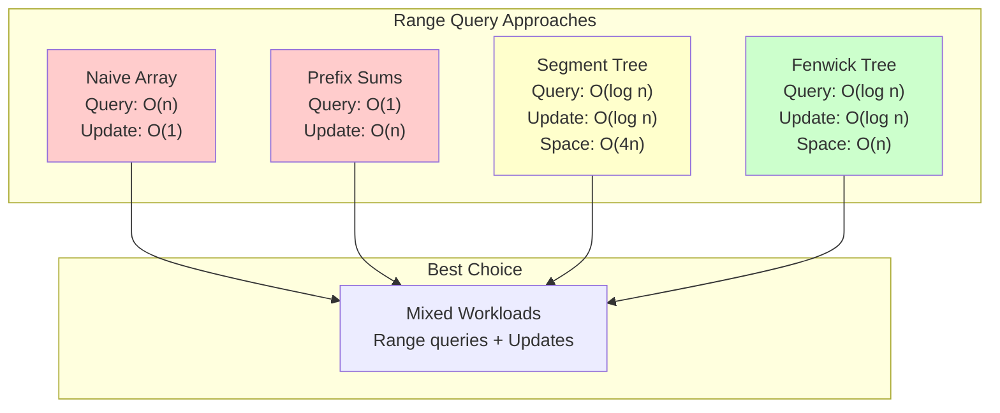

# Fenwick Trees: The Efficient Summation Machine

## Summary

Fenwick Trees (also known as Binary Indexed Trees) solve the same range query problem as Segment Trees but with elegant simplicity. By leveraging binary representation and bit manipulation, they achieve fast range sum queries and point updates using just a simple array and clever indexing. This tutorial explores how Fenwick Trees work, why they're so efficient, and how the "low-bit" operation creates an implicit tree structure.

## Table of Contents

1. [The Core Problem](./01-concepts-01-the-core-problem.md) - Range queries and the quest for simplicity
2. [The Guiding Philosophy](./01-concepts-02-the-guiding-philosophy.md) - Binary representation and hierarchical responsibility
3. [Key Abstractions](./01-concepts-03-key-abstractions.md) - Implicit trees, prefix sums, and the low-bit operation
4. [Getting Started](./02-guides-01-getting-started.md) - Building your first Fenwick Tree
5. [The Magic of Low-Bit](./03-deep-dive-01-the-magic-of-low-bit.md) - Understanding the bit manipulation behind the elegance
6. [Rust Implementation](./04-rust-implementation.md) - Complete working implementation with optimizations

## Quick Start

## Key Takeaways

After completing this tutorial, you'll understand:

- 🎯 **The range query problem** and why naive approaches fail
- ⚖️ **Binary responsibility patterns** that eliminate explicit tree structures
- 🧩 **Three core abstractions**: implicit trees, prefix sums, and low-bit operation
- 🔨 **Practical implementation** from basic concepts to production code
- 🧠 **Mathematical foundations** behind the bit manipulation magic
- ⚙️ **Advanced features** like 2D trees and range updates

## Performance Comparison

## 📈 Next Steps

**Prerequisites for this tutorial:**
- Understanding of binary representation and bit manipulation
- Basic knowledge of arrays and tree concepts
- Familiarity with time complexity analysis

**Difficulty:** Intermediate | **Time:** 2-3 hours

### 🎯 Specialized Learning Paths

#### **Path 1: Advanced Data Structures & Optimization**
- **Next** → [Segment Trees: The Range Query Specialist](../segment-trees-the-range-query-specialist/README.md) - Compare with hierarchical approaches
- **Then** → [Dynamic Programming: The Memoization Master](../dynamic-programming-the-memoization-master/README.md) - Master optimization techniques
- **Advanced** → [Skip Lists: The Probabilistic Search Tree](../skip-lists-the-probabilistic-search-tree/README.md) - Explore probabilistic data structures

#### **Path 2: Systems & Performance Engineering**
- **Next** → [Skip Lists: The Probabilistic Search Tree](../skip-lists-the-probabilistic-search-tree/README.md) - Learn concurrent-friendly structures
- **Then** → [String Matching: The Pattern Detective](../string-matching-the-pattern-detective/README.md) - Understand preprocessing for performance
- **Advanced** → [Suffix Arrays: The String Search Specialist](../suffix-arrays-the-string-search-specialist/README.md) - Master advanced indexing

#### **Path 3: Algorithm Foundations**
- **Next** → [Dynamic Programming: The Memoization Master](../dynamic-programming-the-memoization-master/README.md) - Build optimization thinking
- **Then** → [Dijkstra's Algorithm: The Shortest Path Expert](../dijkstras-algorithm-the-shortest-path-expert/README.md) - Apply to graph problems
- **Advanced** → [Graph Traversal: Navigating the Network](../graph-traversal-navigating-the-network/README.md) - Explore graph algorithms

### 🔄 Alternative Learning Paths

**For Database & Analytics:**
Fenwick Trees → [Segment Trees: The Range Query Specialist](../segment-trees-the-range-query-specialist/README.md) → [Skip Lists: The Probabilistic Search Tree](../skip-lists-the-probabilistic-search-tree/README.md)

**For Bit Manipulation & Low-Level Optimization:**
Fenwick Trees → [Dynamic Programming: The Memoization Master](../dynamic-programming-the-memoization-master/README.md) → [String Matching: The Pattern Detective](../string-matching-the-pattern-detective/README.md)