# The Core Problem: Systematic Exploration of Connected Data

## The Challenge

Imagine you're in a vast library where books are connected by invisible threads—each book references others, creating a web of knowledge. How do you systematically explore this network to find all books related to a specific topic? How do you determine if two books are connected through a chain of references? How do you find the shortest path between them?

This is the fundamental challenge that graph traversal algorithms solve: **systematic exploration of connected data structures**.


**The Question**: How do you systematically explore from Book A to discover all connected knowledge without missing anything or getting lost in cycles?

## Why Random Wandering Fails

The naive approach to exploring a graph—randomly jumping from node to node—fails spectacularly:

1. **Missing Nodes**: You might never discover entire regions of the graph
2. **Infinite Loops**: You could get stuck cycling between the same few nodes
3. **No Guarantees**: You have no assurance of ever reaching your destination
4. **Inefficiency**: You waste time revisiting the same nodes repeatedly

Consider a social network with 1 million users. Random wandering might visit the same 100 users repeatedly while never discovering 999,900 others.


**The Problem**: Random exploration gets trapped in local clusters while vast regions remain undiscovered.

## The Real-World Manifestation

Graph traversal problems appear everywhere in software engineering:


### Deep Dive: Why Structure Matters

**Web Crawling Example**:


**The Common Pattern**: Every domain requires the same fundamental approach—systematic exploration with memory of what's been visited.

## The Fundamental Insight

The breakthrough insight is that **structure matters more than content**. Whether you're exploring:

```mermaid
flowchart TB
    subgraph "Social Network"
        A1[Alice] --- B1[Bob]
        B1 --- C1[Carol]
        C1 --- A1
    end
    
    subgraph "Web Pages"
        A2[index.html] --> B2[about.html]
        B2 --> C2[contact.html]
        C2 --> A2
    end
    
    subgraph "File System"
        A3[/home] --- B3[/docs]
        B3 --- C3[/photos]
        C3 --- A3
    end
    
    subgraph "Dependencies"
        A4[main.js] --> B4[utils.js]
        B4 --> C4[config.js]
        C4 --> A4
    end
    
    style A1 fill:#e3f2fd
    style A2 fill:#e3f2fd
    style A3 fill:#e3f2fd
    style A4 fill:#e3f2fd
```

**The Universal Truth**: The exploration strategy remains identical across all domains. The **pattern of connections** determines the algorithm, not the specific data being connected.

### The Abstraction Layer

```mermaid
flowchart TD
    A["🌐 Domain-Specific Data<br/>(Friends, Pages, Files, etc.)"]
    B["📊 Abstract Graph Structure<br/>(Nodes and Edges)"]
    C["🔍 Traversal Algorithm<br/>(BFS, DFS, etc.)"]
    D["📋 Domain-Specific Results<br/>(Paths, Connections, etc.)"]
    
    A --> B
    B --> C
    C --> D
    
    style B fill:#fff3e0
    style C fill:#e8f5e8
```



**Key Insight**: By abstracting away domain details, we can solve all graph problems with the same fundamental algorithms.

## What We Need to Solve

To systematically explore any graph, we need:

```mermaid
flowchart LR
    subgraph "Requirements"
        A[🎯 Completeness<br/>Visit every reachable node exactly once]
        B[⚡ Efficiency<br/>Avoid unnecessary work and redundant visits]
        C[🔄 Determinism<br/>Produce predictable, repeatable results]
        D[🔧 Flexibility<br/>Handle different graph structures and goals]
    end
    
    subgraph "Solution Space"
        E[🗺️ Frontier Concept<br/>Boundary between explored and unexplored]
        F[📝 Visited Tracking<br/>Memory of what's been processed]
        G[🎯 Systematic Ordering<br/>Predictable exploration strategy]
    end
    
    A --> E
    B --> F
    C --> G
    D --> E
    
    style A fill:#e8f5e8
    style B fill:#fff3e0
    style C fill:#e3f2fd
    style D fill:#f3e5f5
    style E fill:#ffebee
    style F fill:#ffebee
    style G fill:#ffebee
```



## The Eureka Moment

The solution lies in a simple but profound insight: **maintain a clear boundary between what you've explored and what you haven't**.

```mermaid
flowchart TD
    subgraph "The Frontier Insight"
        A[🌟 Start Node]
        B[🏃 Active Frontier<br/>"Nodes discovered but not explored"]
        C[✅ Explored Territory<br/>"Nodes fully processed"]
        D[❓ Unexplored Territory<br/>"Nodes not yet discovered"]
        
        A --> B
        B --> C
        B --> D
        D --> B
    end
    
    style A fill:#4caf50
    style B fill:#ff9800
    style C fill:#2196f3
    style D fill:#9e9e9e
```

**The Breakthrough**: By systematically managing this frontier, we can guarantee completeness, efficiency, and determinism simultaneously.

The next section will explore how the concept of a "frontier" provides the key insight for solving these challenges systematically.