# The Guiding Philosophy: Methodical Frontier Expansion

## The Core Insight: The Frontier Concept

The breakthrough that makes systematic graph traversal possible is the concept of a **frontier**—a clear boundary between the explored and unexplored regions of the graph.


**The Cave System Analogy**:
- **Explored Territory**: Caves you've already mapped and marked
- **The Frontier**: Cave entrances you've discovered but not yet explored  
- **Unexplored Territory**: Everything beyond your current frontier

### The Frontier State Machine


## The Universal Algorithm Pattern

Every graph traversal algorithm follows this fundamental pattern:

```mermaid
flowchart TD
    A["🎯 Initialize<br/>frontier = [start_node]<br/>visited = {}"] --> B{"🔍 Frontier empty?"}
    B -->|No| C["📤 Remove node from frontier<br/>(Order depends on data structure)"]
    C --> D{"🤔 Already visited?"}
    D -->|Yes| B
    D -->|No| E["✅ Mark as visited<br/>⚙️ Process node<br/>📝 Collect results"]
    E --> F["🔎 Get all neighbors"]
    F --> G["➕ Add unvisited neighbors<br/>to frontier"]
    G --> B
    B -->|Yes| H["✨ Done!<br/>All reachable nodes explored"]
    
    style A fill:#e3f2fd
    style B fill:#fff3e0
    style C fill:#f3e5f5
    style D fill:#fff3e0
    style E fill:#e8f5e8
    style F fill:#fce4ec
    style G fill:#e0f2f1
    style H fill:#e8f5e8
```



**The Universal Algorithm Pattern**:
```
1. Start with a frontier containing only the starting node
2. While the frontier is not empty:
   a. Remove a node from the frontier
   b. If this node hasn't been visited:
      - Mark it as visited
      - Process it (check if it's the goal, collect data, etc.)
      - Add all its unvisited neighbors to the frontier
3. Done: All reachable nodes have been explored
```

### The Magic of Data Structure Choice

```mermaid
flowchart LR
    A["🎯 Same Algorithm"] --> B{"🗂️ Frontier Data Structure"}
    B -->|"Queue (FIFO)"| C["🌊 BFS<br/>Breadth-First Search"]
    B -->|"Stack (LIFO)"| D["🏔️ DFS<br/>Depth-First Search"]
    B -->|"Priority Queue"| E["🎯 Dijkstra<br/>Shortest Path"]
    B -->|"Custom Order"| F["🔧 Specialized<br/>Algorithm"]
    
    style A fill:#e3f2fd
    style B fill:#fff3e0
    style C fill:#e8f5e8
    style D fill:#fce4ec
    style E fill:#f3e5f5
    style F fill:#e0f2f1
```



**The Profound Truth**: **Changing how you manage the frontier completely changes the traversal behavior**.

## The Two Fundamental Strategies

### Breadth-First Search (BFS): The Cautious Explorer

BFS uses a **queue** (first-in, first-out) for the frontier:

```mermaid
flowchart TD
    subgraph "BFS: Level-by-Level Exploration"
        A["🎯 Start Node<br/>(Level 0)"]
        B1["📍 Node B<br/>(Level 1)"]
        B2["📍 Node C<br/>(Level 1)"]
        B3["📍 Node D<br/>(Level 1)"]
        C1["📍 Node E<br/>(Level 2)"]
        C2["📍 Node F<br/>(Level 2)"]
        C3["📍 Node G<br/>(Level 2)"]
        D1["📍 Node H<br/>(Level 3)"]
        
        A --> B1
        A --> B2
        A --> B3
        B1 --> C1
        B2 --> C2
        B3 --> C3
        C1 --> D1
        
        style A fill:#1976d2
        style B1 fill:#42a5f5
        style B2 fill:#42a5f5
        style B3 fill:#42a5f5
        style C1 fill:#90caf9
        style C2 fill:#90caf9
        style C3 fill:#90caf9
        style D1 fill:#bbdefb
    end
```



**The BFS Queue Behavior**:


**Philosophy**: "Before I go deeper, let me fully understand my immediate surroundings."

**Analogy**: Like water flooding a landscape—it spreads outward evenly, reaching all areas at distance 1 before any area at distance 2.

### Depth-First Search (DFS): The Bold Explorer

DFS uses a **stack** (last-in, first-out) for the frontier:

```mermaid
flowchart TD
    subgraph "DFS: Deep-First Exploration"
        A["🎯 Start Node"]
        B["📍 Child 1"]
        C["📍 Child 1.1"]
        D["📍 Child 1.1.1"]
        E["📍 Child 1.1.1.1"]
        F["📍 Child 2"]
        G["📍 Child 3"]
        
        A --> B
        A --> F
        A --> G
        B --> C
        C --> D
        D --> E
        
        style A fill:#2e7d32
        style B fill:#43a047
        style C fill:#66bb6a
        style D fill:#81c784
        style E fill:#a5d6a7
        style F fill:#ffab40
        style G fill:#ffab40
    end
```



**The DFS Stack Behavior**:


**Philosophy**: "Let me follow this path as far as possible before trying other options."

**Analogy**: Like an explorer following a single tunnel to its end before backtracking to try other tunnels.

## The Profound Implications

This simple frontier concept has profound implications:

### 1. **Completeness Guarantee**
As long as the frontier isn't empty, there are still unexplored nodes. When it becomes empty, you've found everything reachable.

### 2. **Efficiency Through Bookkeeping**
The "visited" set ensures you never process the same node twice, preventing infinite loops and redundant work.

### 3. **Flexibility Through Data Structure Choice**
- **Queue → BFS**: Finds shortest paths in unweighted graphs
- **Stack → DFS**: Uses less memory, better for deep searches
- **Priority Queue → Dijkstra**: Finds shortest paths in weighted graphs
- **Custom Ordering**: Enables domain-specific optimizations

### 4. **Predictable Resource Usage**
- **BFS**: Memory grows with the "width" of the graph
- **DFS**: Memory grows with the "depth" of the graph

## The Mental Model

Think of graph traversal as painting a map:


**The Painting Algorithm**:


**Visual State Progression**:
```
Step 0: [Start] is gray, everything else is black
Step 1: Pick gray node, paint it white, paint its black neighbors gray
Step 2: Pick gray node, paint it white, paint its black neighbors gray
...
Step N: No gray nodes remain - traversal complete
```

**Key Insight**: The gray nodes (frontier) are the **active boundary** between the known and unknown regions of the graph.

## Why This Philosophy Works

The frontier philosophy works because it:

```mermaid
flowchart TD
    subgraph "Why the Frontier Philosophy Works"
        A["🔐 Maintains Invariants<br/>Clear separation between<br/>explored/unexplored"]
        B["📈 Provides Progress Guarantees<br/>The frontier always shrinks<br/>or stays the same"]
        C["⚡ Enables Optimization<br/>Optimize frontier management<br/>without changing core algorithm"]
        D["🌍 Scales Universally<br/>Works on graphs with 10 nodes<br/>or 10 billion nodes"]
        
        E["🎯 Frontier Philosophy"]
        
        E --> A
        E --> B
        E --> C
        E --> D
        
        style E fill:#1976d2
        style A fill:#4caf50
        style B fill:#ff9800
        style C fill:#9c27b0
        style D fill:#f44336
    end
```



### The Mathematical Foundation

**Invariant Preservation**:
```
At any point in traversal:
- Every node is in exactly one state: {Unexplored, Frontier, Explored}
- All frontier nodes are neighbors of explored nodes
- No explored node will be processed again
```

**Progress Guarantee**:


**Scalability Proof**:
- **Time Complexity**: O(V + E) regardless of graph size
- **Space Complexity**: O(V) for visited set + O(frontier size)
- **Frontier size**: Never exceeds total number of nodes

**The Universal Truth**: This philosophy works identically whether you're exploring:
- A 10-node social network
- A 10-billion-node web graph
- A file system with millions of files
- A circuit with thousands of components

The next section will explore how this philosophy manifests in concrete data structures and abstractions.