# Key Abstractions: The Building Blocks of Graph Traversal

## The Three Pillars

Every graph traversal algorithm rests on three fundamental abstractions:


### 1. The Frontier: Your Exploration Boundary

The frontier is a **container** that holds nodes discovered but not yet explored. It's the most critical abstraction because it determines the traversal order.

```mermaid
flowchart LR
    subgraph "Frontier: The Active Boundary"
        A["🔍 Discovered Nodes<br/>But Not Yet Explored"]
        B{"📄 Data Structure Choice"}
        C["🌊 Queue (FIFO)<br/>Breadth-First"]
        D["🏔️ Stack (LIFO)<br/>Depth-First"]
        E["🎯 Priority Queue<br/>Weighted Shortest Path"]
        F["🔧 Custom Order<br/>Domain-Specific"]
        
        A --> B
        B --> C
        B --> D
        B --> E
        B --> F
        
        style A fill:#fff3e0
        style B fill:#e8f5e8
        style C fill:#e3f2fd
        style D fill:#fce4ec
        style E fill:#f3e5f5
        style F fill:#e0f2f1
    end
```



**Frontier Interface**:
```rust
// The frontier can be implemented with different data structures
type BfsFrontier<T> = VecDeque<T>;    // Queue for BFS
type DfsFrontier<T> = Vec<T>;         // Stack for DFS
type DijkstraFrontier<T> = BinaryHeap<T>; // Priority queue for Dijkstra
```

**Key Properties**:
- **Insertion**: Add newly discovered nodes
- **Removal**: Get the next node to explore  
- **Ordering**: Determines traversal behavior

**Frontier Evolution Visualization**:


### 2. The Visited Set: Your Memory of the Past

The visited set prevents infinite loops and redundant work by remembering which nodes have been fully processed.

```mermaid
flowchart TD
    subgraph "Visited Set: Memory of the Past"
        A["🔍 Node Encountered"]
        B{"🤔 Already Visited?"}
        C["✅ Yes: Skip Processing"]
        D["📝 No: Add to Visited Set"]
        E["⚙️ Process Node"]
        F["🔎 Explore Neighbors"]
        
        A --> B
        B -->|"Found in set"| C
        B -->|"Not in set"| D
        D --> E
        E --> F
        F --> A
        
        style B fill:#fff3e0
        style C fill:#ffcdd2
        style D fill:#c8e6c9
        style E fill:#e3f2fd
        style F fill:#f3e5f5
    end
```



**Implementation Details**:
```rust
use std::collections::HashSet;

type VisitedSet<T> = HashSet<T>;
```

**Key Properties**:
- **Fast Lookup**: O(1) check if a node has been visited
- **Memory Efficient**: Only stores node identifiers, not full node data
- **Prevents Cycles**: Breaks infinite loops in cyclic graphs

**Visited Set Growth Pattern**:


**Memory Efficiency**: Only stores node IDs, not full node data
```
Node: { id: "user123", name: "Alice", friends: [...], posts: [...] }
Visited Set: { "user123" }  // Only stores the ID!
```

### 3. The Traversal Order: Your Path Through the Graph

The traversal order is the sequence in which nodes are visited. It's determined by the frontier's data structure and emerges from the algorithm's execution.

```mermaid
flowchart LR
    subgraph "Traversal Order: The Emerging Path"
        A["📄 Frontier Data Structure"]
        B["📊 Exploration Pattern"]
        C["📋 Traversal Order"]
        
        A --> B
        B --> C
        
        D["🌊 Queue → BFS → Level-by-Level"]
        E["🏔️ Stack → DFS → Deep-First"]
        F["🎯 Priority → Dijkstra → Cost-Ordered"]
        
        A -.-> D
        A -.-> E
        A -.-> F
        
        style A fill:#fff3e0
        style B fill:#e8f5e8
        style C fill:#e3f2fd
        style D fill:#f3e5f5
        style E fill:#fce4ec
        style F fill:#e0f2f1
    end
```



**Implementation**:
```rust
// The traversal order manifests as a sequence
type TraversalOrder<T> = Vec<T>;
```

**Order Comparison**:


## The Cave System Analogy

To understand these abstractions intuitively, imagine exploring a cave system:


### The Frontier: Cave Entrances You've Found

**BFS Frontier (Queue)**:


**DFS Frontier (Stack)**:

```mermaid
flowchart LR
    A["🔢 Cave 1<br/>(Discovered first)"] 
    B["🔣 Cave 2"]
    C["🔤 Cave 3"]
    D["🔥 Cave 4<br/>(Discovered last)"]
    
    E["👉 Explore newest first"]
    D -.-> E
    
    style D fill:#4caf50
    style E fill:#ff9800
```


### The Visited Set: Caves You've Mapped

```mermaid
flowchart TD
    A["🔦 Cave Entrance"]
    B{"📝 Already marked?"}
    C["✅ Skip (Already mapped)"]
    D["🔴 Mark with spray paint"]
    E["🗺️ Map the cave"]
    
    A --> B
    B -->|"Yes"| C
    B -->|"No"| D
    D --> E
    
    style B fill:#fff3e0
    style C fill:#ffcdd2
    style D fill:#c8e6c9
    style E fill:#e3f2fd
```


### The Traversal Order: Your Exploration History


**Key Insight**: The expedition log (traversal order) is a **side effect** of your exploration strategy, not the goal itself.

## Implementation Patterns

### The Generic Traversal Template

```rust
fn traverse<T, F>(
    start: T,
    mut frontier: F,
    mut get_neighbors: impl FnMut(&T) -> Vec<T>,
    mut process: impl FnMut(&T),
) -> Vec<T>
where
    T: Clone + Hash + Eq,
    F: Frontier<T>,
{
    let mut visited = HashSet::new();
    let mut order = Vec::new();
    
    frontier.push(start);
    
    while let Some(current) = frontier.pop() {
        if visited.contains(&current) {
            continue;
        }
        
        visited.insert(current.clone());
        process(&current);
        order.push(current.clone());
        
        for neighbor in get_neighbors(&current) {
            if !visited.contains(&neighbor) {
                frontier.push(neighbor);
            }
        }
    }
    
    order
}
```

### The Frontier Interface

```rust
trait Frontier<T> {
    fn push(&mut self, item: T);
    fn pop(&mut self) -> Option<T>;
    fn is_empty(&self) -> bool;
}
```

## The Power of Abstraction

These abstractions are powerful because they:

### 1. **Separate Concerns**
- **Frontier**: Handles exploration strategy
- **Visited Set**: Handles cycle prevention
- **Traversal Order**: Handles result collection

### 2. **Enable Composition**
You can mix and match different implementations:
- BFS with cycle detection
- DFS with path tracking
- Priority-based traversal with custom ordering

### 3. **Scale Universally**
The same abstractions work for:
- Graphs with 10 nodes or 10 billion nodes
- In-memory graphs or distributed graphs
- Static graphs or dynamic graphs

## Visual Comparison: BFS vs DFS

### BFS: Layer-by-Layer Exploration

```mermaid
flowchart TD
    subgraph "BFS: Level-by-Level Order"
        A["🎯 A (Start)"]
        B["🔵 B (Level 1)"]
        C["🔵 C (Level 1)"]
        D["🔵 D (Level 1)"]
        E["🔴 E (Level 2)"]
        F["🔴 F (Level 2)"]
        G["🔴 G (Level 2)"]
        H["🔶 H (Level 3)"]
        I["🔶 I (Level 3)"]
        J["🔶 J (Level 3)"]
        
        A --> B
        A --> C
        A --> D
        B --> E
        B --> F
        C --> G
        D --> H
        E --> I
        F --> J
        
        style A fill:#1976d2
        style B fill:#42a5f5
        style C fill:#42a5f5
        style D fill:#42a5f5
        style E fill:#90caf9
        style F fill:#90caf9
        style G fill:#90caf9
        style H fill:#bbdefb
        style I fill:#bbdefb
        style J fill:#bbdefb
    end
```


**BFS Frontier Evolution**:
```
Step 1: [A] → Process A → [B,C,D]
Step 2: [B,C,D] → Process B → [C,D,E,F]
Step 3: [C,D,E,F] → Process C → [D,E,F,G]
Step 4: [D,E,F,G] → Process D → [E,F,G,H]
...
```

### DFS: Deep-First Exploration

```mermaid
flowchart TD
    subgraph "DFS: Deep-First Order"
        A["🎯 A (Start)"]
        B["🔵 B (Path 1)"]
        E["🔴 E (Path 1)"]
        H["🔶 H (Path 1)"]
        I["🔶 I (Backtrack)"]
        F["🔴 F (Backtrack)"]
        C["🔵 C (Path 2)"]
        G["🔴 G (Path 2)"]
        J["🔶 J (Path 2)"]
        D["🔵 D (Path 3)"]
        
        A --> B
        A --> C
        A --> D
        B --> E
        B --> F
        C --> G
        D --> H
        E --> I
        F --> J
        
        style A fill:#2e7d32
        style B fill:#43a047
        style E fill:#66bb6a
        style H fill:#81c784
        style I fill:#a5d6a7
        style F fill:#c8e6c9
        style C fill:#43a047
        style G fill:#66bb6a
        style J fill:#81c784
        style D fill:#43a047
    end
```


**DFS Frontier Evolution**:
```
Step 1: [A] → Process A → [B,C,D]
Step 2: [B,C,D] → Process D → [B,C,H] (newest first)
Step 3: [B,C,H] → Process H → [B,C]
Step 4: [B,C] → Process C → [B,G]
...
```

## Memory Patterns

### BFS Memory Growth


**Memory Pattern**: 
```
Level 1: 1 node  in frontier
Level 2: 3 nodes in frontier  
Level 3: 9 nodes in frontier
Level 4: 27 nodes in frontier
```

**Growth Rate**: Memory grows with the **width** of the graph (exponential in branching factor)

### DFS Memory Growth


**Memory Pattern**:
```
Depth 1: 1 node  in frontier
Depth 2: 2 nodes in frontier
Depth 3: 3 nodes in frontier
Depth 4: 4 nodes in frontier
```

**Growth Rate**: Memory grows with the **depth** of the graph (linear in maximum depth)

### Memory Comparison Visualization


**Key Insight**: BFS can use **dramatically** more memory than DFS for wide graphs!

## The Invariant That Guarantees Correctness

The key invariant that makes graph traversal work:


**The Three-State Invariant**:
> **At any point during traversal, every node is in exactly one of three states:**
> 1. **Undiscovered**: Not yet encountered
> 2. **Discovered**: In the frontier, waiting to be explored
> 3. **Explored**: Fully processed and in the visited set

### Invariant Guarantees

```mermaid
flowchart TD
    subgraph "Correctness Guarantees"
        A["🎯 Completeness<br/>Every reachable node will<br/>eventually be explored"]
        B["⏱️ Termination<br/>The algorithm will finish<br/>in finite time"]
        C["✅ Correctness<br/>No node is processed<br/>more than once"]
        
        D["🔐 Three-State Invariant"]
        
        D --> A
        D --> B
        D --> C
        
        style A fill:#4caf50
        style B fill:#ff9800
        style C fill:#2196f3
        style D fill:#9c27b0
    end
```



**Proof Sketch**:
- **Completeness**: Every reachable node will eventually be added to the frontier
- **Termination**: The frontier size is bounded by the number of nodes
- **Correctness**: The visited set prevents duplicate processing

### State Transition Visualization


**Mathematical Foundation**:
```
Invariant: Undiscovered ∩ Discovered ∩ Explored = ∅
Invariant: Undiscovered ∪ Discovered ∪ Explored = All Nodes
Invariant: |Discovered| + |Explored| ≤ |Total Nodes|
```

The next section will show how to implement these abstractions in practice.