# Getting Started: Finding Connections in a Social Network

## The Challenge

Let's solve a real-world problem: **determining if two people are connected in a social network**. This is the foundation of features like "People You May Know" or "Degrees of Separation."

```mermaid
flowchart TD
    subgraph "Real-World Applications"
        A["👥 Social Network Analysis"]
        B["🔍 People You May Know"]
        C["🔗 Degrees of Separation"]
        D["🌐 Network Connectivity"]
        E["📊 Influence Mapping"]
        
        A --> B
        A --> C
        A --> D
        A --> E
        
        style A fill:#2196f3
        style B fill:#4caf50
        style C fill:#ff9800
        style D fill:#9c27b0
        style E fill:#f44336
    end
```



## Prerequisites

- Basic understanding of data structures (vectors, hash maps)
- Familiarity with any programming language (examples in pseudocode)

## The Problem Setup

Imagine a social network represented as a graph:
- **Nodes**: People (identified by their user ID)
- **Edges**: Friendships (bidirectional connections)


**Questions to Explore**:
1. 🤔 Are Alice and Frank connected?
2. 🤔 Are Alice and Eve connected?
3. 📍 What's the shortest path between them?
4. 🔍 How many steps does it take?

**Graph Properties**:


## The Data Structure

First, let's represent our social network:


**Implementation**:
```python
# Adjacency list representation
social_network = {
    'Alice': ['Bob', 'Carol'],
    'Bob': ['Alice', 'David'],
    'Carol': ['Alice', 'David'],
    'David': ['Bob', 'Carol', 'Eve', 'Frank'],
    'Eve': ['David'],
    'Frank': ['David']
}
```

**Why Adjacency Lists?**
- ✅ **Space Efficient**: Only store actual connections
- ✅ **Fast Neighbor Lookup**: O(1) access to friends list
- ✅ **Dynamic**: Easy to add/remove connections
- ✅ **Intuitive**: Natural representation for social networks

## Solution 1: Breadth-First Search (BFS)

BFS explores connections level by level—perfect for finding the shortest path between two people.

```mermaid
flowchart TD
    subgraph "BFS Strategy: Level-by-Level"
        A["🎯 Level 0: Alice (Start)"]
        B["🔵 Level 1: Bob, Carol"]
        C["🔴 Level 2: David"]
        D["🔶 Level 3: Eve, Frank"]
        
        A --> B
        B --> C
        C --> D
        
        style A fill:#1976d2
        style B fill:#42a5f5
        style C fill:#90caf9
        style D fill:#bbdefb
    end
```



**BFS Philosophy**: "Explore all friends, then friends-of-friends, then friends-of-friends-of-friends..."

**Perfect for**: 
- 🎯 Finding shortest path (minimum degrees of separation)
- 🔍 Discovering all connections at a specific distance
- 🌊 "Six degrees of separation" calculations

```python
from collections import deque

def are_connected_bfs(graph, start, target):
    """
    Check if two people are connected using BFS.
    Returns True if connected, False otherwise.
    """
    if start == target:
        return True
    
    # The frontier: people we've discovered but not explored
    frontier = deque([start])
    
    # The visited set: people we've already checked
    visited = set([start])
    
    while frontier:
        # Get the next person to explore
        current_person = frontier.popleft()
        
        # Check all their friends
        for friend in graph.get(current_person, []):
            if friend == target:
                return True  # Found the target!
            
            if friend not in visited:
                visited.add(friend)
                frontier.append(friend)
    
    return False  # No path found
```

### Let's Trace Through It

**Question**: Are Alice and Frank connected?


**Step-by-Step Breakdown**:
```
Step 1: frontier = [Alice], visited = {Alice}
Step 2: Explore Alice's friends [Bob, Carol]
        frontier = [Bob, Carol], visited = {Alice, Bob, Carol}
Step 3: Explore Bob's friends [Alice, David]
        Alice already visited, David is new
        frontier = [Carol, David], visited = {Alice, Bob, Carol, David}
Step 4: Explore Carol's friends [Alice, David]
        Both already visited
        frontier = [David], visited = {Alice, Bob, Carol, David}
Step 5: Explore David's friends [Bob, Carol, Eve, Frank]
        Bob, Carol already visited
        frontier = [Eve, Frank], visited = {Alice, Bob, Carol, David, Eve, Frank}
Step 6: Explore Eve's friends [David]
        David already visited
        frontier = [Frank], visited = {Alice, Bob, Carol, David, Eve, Frank}
Step 7: Explore Frank's friends [David]
        David already visited
        frontier = [], visited = {Alice, Bob, Carol, David, Eve, Frank}
```

**Visual Path Discovery**:


**Result**: ✅ Yes, Alice and Frank are connected! The shortest path is Alice → Bob → David → Frank (3 steps).

## Solution 2: Depth-First Search (DFS)

DFS explores one path as deeply as possible before backtracking.

```mermaid
flowchart TD
    subgraph "DFS Strategy: Deep-First"
        A["🎯 Alice (Start)"]
        B["🔵 Explore one path deeply"]
        C["🔴 Follow friends-of-friends"]
        D["🔶 Backtrack when stuck"]
        E["🔶 Try alternative paths"]
        
        A --> B
        B --> C
        C --> D
        D --> E
        
        style A fill:#2e7d32
        style B fill:#43a047
        style C fill:#66bb6a
        style D fill:#81c784
        style E fill:#a5d6a7
    end
```



**DFS Philosophy**: "Follow this friendship chain as far as possible before trying other options."

**Perfect for**: 
- 🎯 Memory-efficient exploration
- 🔍 Deep relationship analysis
- 🌲 Exploring hierarchical structures

```python
def are_connected_dfs(graph, start, target):
    """
    Check if two people are connected using DFS.
    Returns True if connected, False otherwise.
    """
    if start == target:
        return True
    
    # The frontier: people we've discovered but not explored (stack)
    frontier = [start]
    
    # The visited set: people we've already checked
    visited = set()
    
    while frontier:
        # Get the most recently discovered person
        current_person = frontier.pop()
        
        if current_person in visited:
            continue
        
        visited.add(current_person)
        
        if current_person == target:
            return True
        
        # Add all unvisited friends to the frontier
        for friend in graph.get(current_person, []):
            if friend not in visited:
                frontier.append(friend)
    
    return False
```

### DFS Trace: Alice to Frank

**Question**: Are Alice and Frank connected?


**Step-by-Step Breakdown**:
```
Step 1: frontier = [Alice], visited = {}
Step 2: Explore Alice, add friends [Bob, Carol]
        frontier = [Bob, Carol], visited = {Alice}
Step 3: Explore Carol (most recent), add friends [Alice, David]
        Alice already visited, add David
        frontier = [Bob, David], visited = {Alice, Carol}
Step 4: Explore David (most recent), add friends [Bob, Carol, Eve, Frank]
        Bob not visited, Carol visited, Eve and Frank not visited
        frontier = [Bob, Bob, Eve, Frank], visited = {Alice, Carol, David}
Step 5: Explore Frank (most recent)
        Frank found! Return True
```

**Result**: ✅ Yes, Alice and Frank are connected! DFS found the path Alice → Carol → David → Frank.

### Let's Trace Through It

**Question**: Are Alice and Frank connected?

```
Step 1: frontier = [Alice], visited = {}
Step 2: Explore Alice, add friends [Bob, Carol]
        frontier = [Bob, Carol], visited = {Alice}
Step 3: Explore Carol (most recent), add friends [Alice, David]
        Alice already visited, add David
        frontier = [Bob, David], visited = {Alice, Carol}
Step 4: Explore David (most recent), add friends [Bob, Carol, Eve, Frank]
        Bob not visited, Carol visited, Eve and Frank not visited
        frontier = [Bob, Bob, Eve, Frank], visited = {Alice, Carol, David}
Step 5: Explore Frank (most recent)
        Frank found! Return True
```

**Result**: Yes, Alice and Frank are connected! DFS found the path Alice → Carol → David → Frank.

## Key Differences

```mermaid
flowchart TD
    subgraph "BFS vs DFS Comparison"
        A["🎯 Algorithm Choice"]
        B["🌊 BFS (Breadth-First)"]
        C["🌲 DFS (Depth-First)"]
        
        A --> B
        A --> C
        
        B --> D["📊 Data Structure: Queue (FIFO)"]
        B --> E["📈 Pattern: Level by level"]
        B --> F["💾 Memory: Higher (width-based)"]
        B --> G["🎯 Shortest Path: Guaranteed"]
        
        C --> H["📊 Data Structure: Stack (LIFO)"]
        C --> I["📈 Pattern: Deep first"]
        C --> J["💾 Memory: Lower (depth-based)"]
        C --> K["🎯 Shortest Path: Not guaranteed"]
        
        style B fill:#e3f2fd
        style C fill:#e8f5e8
        style D fill:#bbdefb
        style E fill:#bbdefb
        style F fill:#bbdefb
        style G fill:#bbdefb
        style H fill:#c8e6c9
        style I fill:#c8e6c9
        style J fill:#c8e6c9
        style K fill:#c8e6c9
    end
```



| Aspect | BFS | DFS |
|--------|-----|-----|
| **Data Structure** | Queue (FIFO) | Stack (LIFO) |
| **Exploration Pattern** | Level by level | Deep first |
| **Memory Usage** | Higher (stores all nodes at current level) | Lower (stores only current path) |
| **Shortest Path** | Guarantees shortest path | May find longer paths first |
| **Implementation** | `deque.popleft()` | `list.pop()` |
| **Best for** | Finding shortest paths | Memory-constrained environments |
| **Typical Use** | Social networks, shortest routes | Maze solving, tree traversal |

## Finding the Actual Path

To find the actual path between two people, we need to track how we reached each person:

```python
def find_path_bfs(graph, start, target):
    """
    Find the shortest path between two people using BFS.
    Returns the path as a list, or None if no path exists.
    """
    if start == target:
        return [start]
    
    frontier = deque([start])
    visited = set([start])
    parent = {start: None}  # Track how we reached each person
    
    while frontier:
        current = frontier.popleft()
        
        for friend in graph.get(current, []):
            if friend == target:
                # Reconstruct the path
                path = [target]
                current = current
                while current is not None:
                    path.append(current)
                    current = parent[current]
                return path[::-1]  # Reverse to get start→target
            
            if friend not in visited:
                visited.add(friend)
                parent[friend] = current
                frontier.append(friend)
    
    return None  # No path found
```

## Testing Your Implementation

```python
# Test cases
print(are_connected_bfs(social_network, 'Alice', 'Frank'))  # True
print(are_connected_bfs(social_network, 'Alice', 'Eve'))    # True
print(are_connected_bfs(social_network, 'Bob', 'Frank'))    # True

# Test with isolated person
isolated_network = {
    'Alice': ['Bob'],
    'Bob': ['Alice'],
    'Carol': []  # Carol has no friends
}
print(are_connected_bfs(isolated_network, 'Alice', 'Carol'))  # False

# Find actual paths
print(find_path_bfs(social_network, 'Alice', 'Frank'))  # ['Alice', 'Bob', 'David', 'Frank']
```

## The Mental Model

Think of BFS as **water spreading**:
- Water starts at the source
- It spreads evenly to all immediate neighbors
- Then to all their neighbors, and so on
- The first time water reaches the target, you've found the shortest path

Think of DFS as **exploring a maze**:
- You pick a path and follow it as far as possible
- When you hit a dead end, you backtrack
- You keep exploring until you find the target or run out of paths

## Next Steps

Now that you understand the basics, the next section will dive deeper into when to use BFS vs DFS, and explore more advanced applications like cycle detection and topological sorting.