# Applications and Trade-offs: When to Use BFS vs DFS

## The Decision Matrix

The choice between BFS and DFS isn't arbitrary—it depends on your specific problem and constraints. Here's how to make the right choice:

```mermaid
flowchart TD
    A["🤔 Algorithm Choice Decision"]
    B["🎯 Problem Requirements"]
    C["📊 System Constraints"]
    D["💾 Performance Needs"]
    
    E["🌊 BFS (Breadth-First)"]
    F["🌲 DFS (Depth-First)"]
    
    A --> B
    A --> C
    A --> D
    
    B --> E
    B --> F
    C --> E
    C --> F
    D --> E
    D --> F
    
    E --> G["✅ Shortest Paths<br/>✅ Level Processing<br/>✅ Distance-based queries"]
    F --> H["✅ Cycle Detection<br/>✅ Topological Sort<br/>✅ Memory Efficiency"]
    
    style A fill:#2196f3
    style B fill:#ff9800
    style C fill:#4caf50
    style D fill:#9c27b0
    style E fill:#e3f2fd
    style F fill:#e8f5e8
    style G fill:#c8e6c9
    style H fill:#ffcdd2
```

## When to Use BFS

### 1. **Finding Shortest Paths** (Unweighted Graphs)
BFS **guarantees** the shortest path in unweighted graphs because it explores nodes level by level.


**BFS Guarantee**: The first time BFS reaches a node, it has found the shortest path to that node.

```python
# Web crawler finding shortest link path between pages
def shortest_link_path(start_url, target_url):
    # BFS will find the minimum number of clicks needed
    return bfs_path(web_graph, start_url, target_url)
```

**Real-world applications**:


### 2. **Level-Order Processing**
When you need to process nodes in layers or levels.

```mermaid
flowchart TD
    subgraph "Organizational Hierarchy Processing"
        A["👑 CEO (Level 0)"]
        B1["👥 VP Engineering (Level 1)"]
        B2["👥 VP Marketing (Level 1)"]
        B3["👥 VP Sales (Level 1)"]
        C1["👨‍💻 Senior Engineer (Level 2)"]
        C2["👨‍💻 Senior Engineer (Level 2)"]
        C3["👩‍💼 Marketing Manager (Level 2)"]
        C4["👨‍💼 Sales Manager (Level 2)"]
        
        A --> B1
        A --> B2
        A --> B3
        B1 --> C1
        B1 --> C2
        B2 --> C3
        B3 --> C4
        
        style A fill:#1976d2
        style B1 fill:#42a5f5
        style B2 fill:#42a5f5
        style B3 fill:#42a5f5
        style C1 fill:#90caf9
        style C2 fill:#90caf9
        style C3 fill:#90caf9
        style C4 fill:#90caf9
    end
```

**Level-Order Processing Pattern**:
```python
# Organizational hierarchy: process by management level
def process_org_by_level(ceo):
    queue = deque([ceo])
    level = 0
    
    while queue:
        level_size = len(queue)
        print(f"Level {level} managers:")
        
        for _ in range(level_size):
            manager = queue.popleft()
            print(f"  - {manager.name}")
            queue.extend(manager.direct_reports)
        
        level += 1
```

**Real-world applications**:
```mermaid
flowchart LR
    A["📁 File System<br/>Directory listing by depth"]
    B["🌳 Binary Tree<br/>Level-order traversal"]
    C["🌐 Network Topology<br/>Analysis by hops"]
    D["🏢 Organization<br/>Hierarchy processing"]
    
    style A fill:#fff3e0
    style B fill:#e8f5e8
    style C fill:#e3f2fd
    style D fill:#f3e5f5
```

### 3. **Finding All Nodes at a Specific Distance**
BFS naturally groups nodes by their distance from the source.


**Distance-Based Query Pattern**:
```python
# Find all friends exactly 2 connections away
def friends_at_distance_2(person):
    # BFS will give you all level-2 friends
    return bfs_level(social_graph, person, target_level=2)

# More general: find all nodes at distance N
def nodes_at_distance(graph, start, target_distance):
    if target_distance == 0:
        return [start]
    
    queue = deque([(start, 0)])
    visited = {start}
    nodes_at_target = []
    
    while queue:
        node, distance = queue.popleft()
        
        if distance == target_distance:
            nodes_at_target.append(node)
        elif distance < target_distance:
            for neighbor in graph.get(node, []):
                if neighbor not in visited:
                    visited.add(neighbor)
                    queue.append((neighbor, distance + 1))
    
    return nodes_at_target
```

**Applications**:
- 👥 Social networks: "People you may know"
- 🌐 Web crawling: Pages at specific link distance
- 🎮 Game AI: Moves within N steps
- 📍 Geographic: Places within N miles/kilometers

## When to Use DFS

### 1. **Cycle Detection**
DFS excels at detecting cycles because it maintains a clear "ancestor" relationship.

```mermaid
flowchart TD
    subgraph "Cycle Detection with DFS"
        A["🎯 Start Node"]
        B["🔄 Following path"]
        C["🔄 Following path"]
        D["🔄 Following path"]
        E["⚠️ Back to visited ancestor"]
        F["🚨 Cycle Detected!"]
        
        A --> B
        B --> C
        C --> D
        D --> E
        E --> F
        E -.->|"Back edge"| B
        
        style A fill:#4caf50
        style B fill:#2196f3
        style C fill:#2196f3
        style D fill:#2196f3
        style E fill:#ff9800
        style F fill:#f44336
    end
```

**The DFS Cycle Detection Algorithm**:


**Implementation**:
```python
def has_cycle(graph):
    visited = set()
    rec_stack = set()  # Current recursion path
    
    def dfs(node):
        if node in rec_stack:
            return True  # Back edge = cycle
        
        if node in visited:
            return False
        
        visited.add(node)
        rec_stack.add(node)
        
        for neighbor in graph[node]:
            if dfs(neighbor):
                return True
        
        rec_stack.remove(node)
        return False
    
    for node in graph:
        if node not in visited:
            if dfs(node):
                return True
    return False
```

**Real-world applications**:
```mermaid
flowchart LR
    A["🏗️ Build Systems<br/>Circular dependencies"]
    B["🧵 Concurrent Systems<br/>Deadlock detection"]
    C["📊 Data Processing<br/>DAG validation"]
    D["🔗 Import Systems<br/>Circular imports"]
    
    style A fill:#fff3e0
    style B fill:#e8f5e8
    style C fill:#e3f2fd
    style D fill:#f3e5f5
```

### 2. **Topological Sorting**
DFS provides a natural way to order nodes based on their dependencies.

```mermaid
flowchart TD
    subgraph "Dependency Graph"
        A["📦 main.py"]
        B["🔧 utils.py"]
        C["📊 parser.py"]
        D["🔍 lexer.py"]
        E["🌳 ast.py"]
        
        A --> B
        A --> C
        C --> D
        C --> E
        D --> B
        
        style A fill:#e3f2fd
        style B fill:#fff3e0
        style C fill:#e8f5e8
        style D fill:#f3e5f5
        style E fill:#fce4ec
    end
```

**Topological Sort Output**: `[utils.py, lexer.py, ast.py, parser.py, main.py]`

**DFS Topological Sort Algorithm**:


**Implementation**:
```python
def topological_sort(graph):
    visited = set()
    stack = []
    
    def dfs(node):
        visited.add(node)
        for neighbor in graph[node]:
            if neighbor not in visited:
                dfs(neighbor)
        stack.append(node)  # Add after processing all dependencies
    
    for node in graph:
        if node not in visited:
            dfs(node)
    
    return stack[::-1]  # Reverse for correct order
```

**Why DFS Works for Topological Sort**:
- **Post-order traversal**: Nodes added to result after all dependencies processed
- **Dependency guarantee**: Dependencies always appear before dependents in final order
- **Cycle detection**: Only works on DAGs (Directed Acyclic Graphs)

**Real-world applications**:
```mermaid
flowchart LR
    A["⚙️ Build Systems<br/>Compilation order"]
    B["📚 Course Planning<br/>Prerequisites"]
    C["📊 Data Pipeline<br/>Processing order"]
    D["🔄 Task Scheduling<br/>Dependency resolution"]
    
    style A fill:#fff3e0
    style B fill:#e8f5e8
    style C fill:#e3f2fd
    style D fill:#f3e5f5
```
    
### 3. **Path Finding with Backtracking**
DFS is perfect for exploring all possible paths and backtracking when needed.


**Backtracking Algorithm Pattern**:


**Implementation**:
```python
def find_all_paths(graph, start, target, path=[]):
    path = path + [start]
    
    if start == target:
        return [path]
    
    paths = []
    for neighbor in graph[start]:
        if neighbor not in path:  # Avoid cycles
            new_paths = find_all_paths(graph, neighbor, target, path)
            paths.extend(new_paths)
    
    return paths

# Example: Find all paths in a maze
def solve_maze(maze, start, end):
    def is_valid(pos):
        row, col = pos
        return (0 <= row < len(maze) and 
                0 <= col < len(maze[0]) and 
                maze[row][col] != '#')  # '#' = wall
    
    def get_neighbors(pos):
        row, col = pos
        neighbors = []
        for dr, dc in [(0,1), (1,0), (0,-1), (-1,0)]:
            new_pos = (row + dr, col + dc)
            if is_valid(new_pos):
                neighbors.append(new_pos)
        return neighbors
    
    def dfs(pos, target, path):
        if pos == target:
            return [path + [pos]]
        
        if pos in path:
            return []  # Avoid cycles
        
        all_paths = []
        for neighbor in get_neighbors(pos):
            paths = dfs(neighbor, target, path + [pos])
            all_paths.extend(paths)
        
        return all_paths
    
    return dfs(start, end, [])
```

**Real-world applications**:
```mermaid
flowchart LR
    A["🎮 Game AI<br/>Maze solving"]
    B["🧩 Puzzle Solving<br/>Sudoku, N-Queens"]
    C["🗺️ Route Planning<br/>With constraints"]
    D["🔍 Combinatorial<br/>Optimization"]
    
    style A fill:#fff3e0
    style B fill:#e8f5e8
    style C fill:#e3f2fd
    style D fill:#f3e5f5
```

## Memory Usage Comparison


### BFS Memory Pattern
```mermaid
flowchart TD
    subgraph "BFS Memory Growth (Exponential)"
        A["🎯 Level 0: 1 node"]
        B["🔵 Level 1: 3 nodes"]
        C["🔴 Level 2: 9 nodes"]
        D["🔶 Level 3: 27 nodes"]
        E["🔷 Level 4: 81 nodes"]
        
        A --> B
        B --> C
        C --> D
        D --> E
        
        style A fill:#4caf50
        style B fill:#2196f3
        style C fill:#ff9800
        style D fill:#f44336
        style E fill:#9c27b0
    end
```

**BFS Memory Characteristics**:
- **Growth Pattern**: `O(branching_factor^depth)`
- **Memory Bottleneck**: Wide graphs with high branching factor
- **Peak Usage**: At the widest level of the graph
- **Example**: Social network with many connections per person

### DFS Memory Pattern
```mermaid
flowchart TD
    subgraph "DFS Memory Growth (Linear)"
        A["🎯 Depth 1: 1 node"]
        B["🔵 Depth 2: 2 nodes"]
        C["🔴 Depth 3: 3 nodes"]
        D["🔶 Depth 4: 4 nodes"]
        E["🔷 Depth 5: 5 nodes"]
        
        A --> B
        B --> C
        C --> D
        D --> E
        
        style A fill:#4caf50
        style B fill:#4caf50
        style C fill:#4caf50
        style D fill:#4caf50
        style E fill:#4caf50
    end
```

**DFS Memory Characteristics**:
- **Growth Pattern**: `O(maximum_depth)`
- **Memory Bottleneck**: Deep graphs with long paths
- **Peak Usage**: At the deepest point of recursion
- **Example**: File system with deeply nested directories

### Memory Trade-off Analysis


**Key Insights**:
- **Wide, Shallow Graphs**: DFS uses dramatically less memory
- **Deep, Narrow Graphs**: BFS and DFS use similar memory
- **Memory-Constrained Systems**: DFS is often the better choice
- **Guaranteed Shortest Path**: BFS is worth the memory cost

DFS memory grows **linearly** with the maximum depth. For deep graphs, this is much more efficient.

## Time Complexity: Both Are O(V + E)

Both BFS and DFS have the same time complexity:
- **V**: Number of vertices (nodes)
- **E**: Number of edges (connections)

The difference lies in **when** they process nodes, not **how many** nodes they process.

## Practical Considerations

### BFS Advantages
- **Guaranteed shortest path** in unweighted graphs
- **Level-by-level processing** for hierarchical data
- **Breadth-first exploration** for spreading algorithms

### BFS Disadvantages
- **Higher memory usage** for wide graphs
- **No easy backtracking** for path-finding problems
- **Queue overhead** for simple connectivity checks

### DFS Advantages
- **Lower memory usage** for deep graphs
- **Natural recursion** matches problem structure
- **Easy backtracking** for path exploration
- **Efficient cycle detection**

### DFS Disadvantages
- **No shortest path guarantee** in unweighted graphs
- **Stack overflow risk** for very deep graphs
- **Deeper paths explored first** may be inefficient

## Performance Comparison

```python
import time
from collections import deque

def benchmark_traversal(graph, start, target):
    # BFS benchmark
    start_time = time.time()
    result_bfs = bfs_find(graph, start, target)
    bfs_time = time.time() - start_time
    
    # DFS benchmark
    start_time = time.time()
    result_dfs = dfs_find(graph, start, target)
    dfs_time = time.time() - start_time
    
    return {
        'bfs_time': bfs_time,
        'dfs_time': dfs_time,
        'bfs_result': result_bfs,
        'dfs_result': result_dfs
    }
```

## Decision Framework

Use this comprehensive decision tree to choose the right algorithm:

```mermaid
flowchart TD
    A["🤔 Start: Choose Algorithm"] --> B{"🎯 Need shortest path?"}
    B -->|"Yes"| C["🌊 Use BFS<br/>Guarantees shortest path"]
    B -->|"No"| D{"🔄 Need cycle detection?"}
    D -->|"Yes"| E["🌲 Use DFS<br/>Natural cycle detection"]
    D -->|"No"| F{"📈 Processing by levels?"}
    F -->|"Yes"| G["🌊 Use BFS<br/>Level-order traversal"]
    F -->|"No"| H{"💾 Memory constrained?"}
    H -->|"Yes"| I["🌲 Use DFS<br/>Lower memory usage"]
    H -->|"No"| J{"🔍 Deep graph structure?"}
    J -->|"Yes"| K["🌲 Use DFS<br/>Better for deep exploration"]
    J -->|"No"| L{"🌐 Wide graph structure?"}
    L -->|"Yes"| M["🌲 Use DFS<br/>Avoids exponential memory"]
    L -->|"No"| N["🤷 Either works<br/>Choose based on preference"]
    
    style A fill:#2196f3
    style B fill:#ff9800
    style C fill:#4caf50
    style D fill:#ff9800
    style E fill:#4caf50
    style F fill:#ff9800
    style G fill:#4caf50
    style H fill:#ff9800
    style I fill:#4caf50
    style J fill:#ff9800
    style K fill:#4caf50
    style L fill:#ff9800
    style M fill:#4caf50
    style N fill:#9c27b0
```

### Algorithm Selection Matrix

```mermaid
flowchart LR
    subgraph "Problem Type"
        A["🎯 Shortest Path"]
        B["🔄 Cycle Detection"]
        C["📈 Level Processing"]
        D["🔍 All Paths"]
        E["⚙️ Topological Sort"]
        F["🗺️ Connectivity"]
    end
    
    subgraph "Algorithm Choice"
        G["🌊 BFS"]
        H["🌲 DFS"]
        I["🌊 BFS"]
        J["🌲 DFS"]
        K["🌲 DFS"]
        L["🌊 BFS or DFS"]
    end
    
    A --> G
    B --> H
    C --> I
    D --> J
    E --> K
    F --> L
    
    style A fill:#e3f2fd
    style B fill:#e8f5e8
    style C fill:#fff3e0
    style D fill:#f3e5f5
    style E fill:#fce4ec
    style F fill:#e0f2f1
    style G fill:#bbdefb
    style H fill:#c8e6c9
    style I fill:#ffcc02
    style J fill:#f8bbd9
    style K fill:#f48fb1
    style L fill:#b2dfdb
```

### Performance Characteristics Summary

| Characteristic | BFS | DFS | Winner |
|---|---|---|---|
| **Time Complexity** | O(V + E) | O(V + E) | 🤝 Tie |
| **Space Complexity** | O(V) | O(V) | 🤝 Tie |
| **Memory Usage** | O(width) | O(depth) | 🌲 DFS (usually) |
| **Shortest Path** | ✅ Guaranteed | ❌ Not guaranteed | 🌊 BFS |
| **Cycle Detection** | ✅ Possible | ✅ Natural | 🌲 DFS |
| **Level Processing** | ✅ Natural | ❌ Complex | 🌊 BFS |
| **Implementation** | Queue-based | Stack/Recursion | 🤝 Tie |
| **Cache Performance** | Good locality | Good locality | 🤝 Tie |

## Advanced Variations

### Bidirectional Search
For shortest path problems, you can search from both ends:

```python
def bidirectional_search(graph, start, target):
    # Search from both start and target simultaneously
    # Meet in the middle for better performance
    forward_queue = deque([start])
    backward_queue = deque([target])
    forward_visited = {start}
    backward_visited = {target}
    
    while forward_queue and backward_queue:
        # Check for intersection
        if forward_visited & backward_visited:
            return True  # Path found
        
        # Expand smaller frontier first
        if len(forward_queue) <= len(backward_queue):
            expand_frontier(forward_queue, forward_visited, graph)
        else:
            expand_frontier(backward_queue, backward_visited, graph)
    
    return False
```

### Iterative Deepening
Combines BFS's completeness with DFS's memory efficiency:

```python
def iterative_deepening_search(graph, start, target):
    depth = 0
    while True:
        result = depth_limited_dfs(graph, start, target, depth)
        if result != "cutoff":
            return result
        depth += 1
```

## Real-World Case Studies

### Case Study 1: Social Network Analysis
**Problem**: Find mutual friends between two users
**Solution**: BFS to find all friends at distance 2, then intersect the sets

### Case Study 2: Compiler Dependency Resolution
**Problem**: Determine compilation order for modules
**Solution**: DFS-based topological sort to respect dependencies

### Case Study 3: Web Crawling
**Problem**: Discover all pages within N clicks of a starting page
**Solution**: BFS with depth limit to respect the constraint

### Case Study 4: Game AI Pathfinding
**Problem**: Find path for AI character in a game world
**Solution**: BFS for shortest path, DFS for exploring all possible routes

## The Bottom Line

- **BFS**: Choose when you need the shortest path or level-by-level processing
- **DFS**: Choose when you need cycle detection, topological sorting, or have memory constraints
- **Both**: Have the same time complexity but different memory and result characteristics

Understanding these trade-offs will help you make the right choice for your specific use case.