# Rust Implementation: Production-Ready Graph Traversal

## Overview

This section provides a complete, production-ready implementation of graph traversal algorithms in Rust. We'll build a flexible, type-safe library that demonstrates the concepts from previous sections.

```mermaid
flowchart TD
    subgraph "Rust Implementation Architecture"
        A["🧑‍💻 Type Safety<br/>Compile-time guarantees"]
        B["💾 Memory Safety<br/>Zero-cost abstractions"]
        C["🚀 Performance<br/>Systems programming speed"]
        D["🔧 Flexibility<br/>Generic design patterns"]
        
        E["📊 Graph Data Structure"]
        F["🗺️ Traversal Algorithms"]
        G["🔍 Advanced Features"]
        H["🧵 Production Ready"]
        
        A --> E
        B --> F
        C --> G
        D --> H
        
        style A fill:#e3f2fd
        style B fill:#e8f5e8
        style C fill:#fff3e0
        style D fill:#f3e5f5
        style E fill:#fce4ec
        style F fill:#e0f2f1
        style G fill:#fff8e1
        style H fill:#f1f8e9
    end
```



**Why Rust for Graph Algorithms?**
- ✅ **Zero-cost abstractions**: No runtime overhead from our generic design
- ✅ **Memory safety**: No segfaults or memory leaks
- ✅ **Thread safety**: Built-in concurrency support
- ✅ **Performance**: Competitive with C/C++ implementations
- ✅ **Expressiveness**: Rich type system for clear APIs

## Project Setup

First, create a new Rust project:

```bash
cargo new graph_traversal
cd graph_traversal
```

Add dependencies to `Cargo.toml`:

```toml
[dependencies]
petgraph = "0.6"          # Advanced graph algorithms
serde = { version = "1.0", features = ["derive"] }  # Serialization
serde_json = "1.0"        # JSON support
rayon = "1.7"              # Parallel processing
thiserror = "1.0"          # Error handling
```

**Dependency Rationale**:

```mermaid
flowchart LR
    A["📊 petgraph<br/>Advanced algorithms"]
    B["💾 serde<br/>Serialization"]
    C["📝 serde_json<br/>JSON support"]
    D["⚡ rayon<br/>Parallelism"]
    E["⚠️ thiserror<br/>Error handling"]
    
    style A fill:#e3f2fd
    style B fill:#e8f5e8
    style C fill:#fff3e0
    style D fill:#f3e5f5
    style E fill:#fce4ec
```


## Core Data Structures

### Graph Representation


**Design Decisions**:
- **HashMap**: O(1) average case lookup for neighbors
- **Vec**: Dynamic arrays for neighbor lists
- **Generic**: Works with any type implementing our traits
- **Clone + Hash + Eq**: Necessary for HashMap keys and comparison

```rust
use std::collections::{HashMap, HashSet, VecDeque};
use std::hash::Hash;
use std::fmt::Debug;

/// A simple graph implementation using adjacency lists
/// Generic over node type T with required trait bounds
#[derive(Debug, Clone)]
pub struct Graph<T> {
    adjacency_list: HashMap<T, Vec<T>>,
    node_count: usize,
    edge_count: usize,
}

/// Errors that can occur during graph operations
#[derive(Debug, thiserror::Error)]
pub enum GraphError {
    #[error("Node not found in graph")]
    NodeNotFound,
    #[error("Edge already exists")]
    EdgeAlreadyExists,
    #[error("Graph is empty")]
    EmptyGraph,
}

impl<T> Graph<T>
where
    T: Clone + Hash + Eq,
{
    pub fn new() -> Self {
        Graph {
            adjacency_list: HashMap::new(),
            node_count: 0,
            edge_count: 0,
        }
    }

    /// Add a node to the graph
    pub fn add_node(&mut self, node: T) -> bool {
        let is_new = !self.adjacency_list.contains_key(&node);
        if is_new {
            self.adjacency_list.entry(node).or_insert_with(Vec::new);
            self.node_count += 1;
        }
        is_new
    }

    /// Add an undirected edge between two nodes
    pub fn add_edge(&mut self, from: T, to: T) -> Result<(), GraphError> {
        // Ensure both nodes exist
        self.add_node(from.clone());
        self.add_node(to.clone());
        
        // Check if edge already exists
        if let Some(neighbors) = self.adjacency_list.get(&from) {
            if neighbors.contains(&to) {
                return Err(GraphError::EdgeAlreadyExists);
            }
        }
        
        // Add edge in both directions for undirected graph
        self.adjacency_list
            .entry(from.clone())
            .or_insert_with(Vec::new)
            .push(to.clone());
        
        self.adjacency_list
            .entry(to)
            .or_insert_with(Vec::new)
            .push(from);
        
        self.edge_count += 1;
        Ok(())
    }

    /// Add a directed edge from one node to another
    pub fn add_directed_edge(&mut self, from: T, to: T) -> Result<(), GraphError> {
        // Ensure both nodes exist
        self.add_node(from.clone());
        self.add_node(to.clone());
        
        // Check if edge already exists
        if let Some(neighbors) = self.adjacency_list.get(&from) {
            if neighbors.contains(&to) {
                return Err(GraphError::EdgeAlreadyExists);
            }
        }
        
        self.adjacency_list
            .entry(from)
            .or_insert_with(Vec::new)
            .push(to);
        
        self.edge_count += 1;
        Ok(())
    }

    /// Get neighbors of a node
    pub fn neighbors(&self, node: &T) -> Option<&Vec<T>> {
        self.adjacency_list.get(node)
    }

    /// Get all nodes in the graph
    pub fn nodes(&self) -> impl Iterator<Item = &T> {
        self.adjacency_list.keys()
    }

    /// Get the number of nodes
    pub fn node_count(&self) -> usize {
        self.node_count
    }

    /// Get the number of edges
    pub fn edge_count(&self) -> usize {
        self.edge_count
    }

    /// Check if the graph is empty
    pub fn is_empty(&self) -> bool {
        self.node_count == 0
    }

    /// Remove a node and all its edges
    pub fn remove_node(&mut self, node: &T) -> Result<Vec<T>, GraphError> {
        if !self.adjacency_list.contains_key(node) {
            return Err(GraphError::NodeNotFound);
        }
        
        // Get neighbors before removal
        let neighbors = self.adjacency_list.get(node).unwrap().clone();
        
        // Remove all edges pointing to this node
        for neighbor in &neighbors {
            if let Some(neighbor_list) = self.adjacency_list.get_mut(neighbor) {
                neighbor_list.retain(|n| n != node);
                self.edge_count -= 1;
            }
        }
        
        // Remove the node itself
        self.adjacency_list.remove(node);
        self.node_count -= 1;
        
        Ok(neighbors)
    }
}
```

### Frontier Trait: The Heart of Algorithm Choice

```mermaid
flowchart TD
    subgraph "Frontier Trait Design"
        A["🗺️ Frontier<T><br/>Common interface"]
        B["📊 Queue (VecDeque)<br/>BFS implementation"]
        C["📊 Stack (Vec)<br/>DFS implementation"]
        D["📊 Priority Queue<br/>Dijkstra implementation"]
        E["🔧 Custom<br/>Domain-specific"]
        
        A --> B
        A --> C
        A --> D
        A --> E
        
        style A fill:#e3f2fd
        style B fill:#e8f5e8
        style C fill:#fff3e0
        style D fill:#f3e5f5
        style E fill:#fce4ec
    end
```



**Trait Design Philosophy**:
- **Minimal Interface**: Only essential operations
- **Zero-cost Abstractions**: No runtime overhead
- **Composable**: Easy to plug into algorithms
- **Testable**: Each frontier can be tested independently

```rust
/// Trait for different frontier implementations
/// This abstraction allows us to change algorithm behavior
/// by simply swapping the frontier implementation
pub trait Frontier<T> {
    /// Add an item to the frontier
    fn push(&mut self, item: T);
    
    /// Remove and return the next item from the frontier
    /// Returns None if the frontier is empty
    fn pop(&mut self) -> Option<T>;
    
    /// Check if the frontier is empty
    fn is_empty(&self) -> bool;
    
    /// Get the current size of the frontier (optional)
    fn len(&self) -> usize {
        // Default implementation - can be overridden for efficiency
        0
    }
    
    /// Peek at the next item without removing it (optional)
    fn peek(&self) -> Option<&T> {
        // Default implementation - not all frontiers support this
        None
    }
}

/// BFS Frontier - uses a queue (FIFO)
/// Memory usage: O(width of graph)
/// Best for: Shortest paths, level-order processing
#[derive(Debug, Clone)]
pub struct BfsFrontier<T> {
    queue: VecDeque<T>,
}

impl<T> BfsFrontier<T> {
    pub fn new() -> Self {
        BfsFrontier {
            queue: VecDeque::new(),
        }
    }
    
    pub fn with_capacity(capacity: usize) -> Self {
        BfsFrontier {
            queue: VecDeque::with_capacity(capacity),
        }
    }
}

impl<T> Frontier<T> for BfsFrontier<T> {
    fn push(&mut self, item: T) {
        self.queue.push_back(item);
    }
    
    fn pop(&mut self) -> Option<T> {
        self.queue.pop_front()
    }
    
    fn is_empty(&self) -> bool {
        self.queue.is_empty()
    }
    
    fn len(&self) -> usize {
        self.queue.len()
    }
    
    fn peek(&self) -> Option<&T> {
        self.queue.front()
    }
}

/// DFS Frontier - uses a stack (LIFO)
/// Memory usage: O(depth of graph)
/// Best for: Cycle detection, topological sorting
#[derive(Debug, Clone)]
pub struct DfsFrontier<T> {
    stack: Vec<T>,
}

impl<T> DfsFrontier<T> {
    pub fn new() -> Self {
        DfsFrontier {
            stack: Vec::new(),
        }
    }
    
    pub fn with_capacity(capacity: usize) -> Self {
        DfsFrontier {
            stack: Vec::with_capacity(capacity),
        }
    }
}

impl<T> Frontier<T> for DfsFrontier<T> {
    fn push(&mut self, item: T) {
        self.stack.push(item);
    }
    
    fn pop(&mut self) -> Option<T> {
        self.stack.pop()
    }
    
    fn is_empty(&self) -> bool {
        self.stack.is_empty()
    }
    
    fn len(&self) -> usize {
        self.stack.len()
    }
    
    fn peek(&self) -> Option<&T> {
        self.stack.last()
    }
}

/// Priority-based frontier for weighted graphs
/// Memory usage: O(frontier size)
/// Best for: Dijkstra's algorithm, A* search
use std::collections::BinaryHeap;
use std::cmp::Reverse;

#[derive(Debug, Clone)]
pub struct PriorityFrontier<T> {
    heap: BinaryHeap<Reverse<T>>,
}

impl<T> PriorityFrontier<T> 
where
    T: Ord,
{
    pub fn new() -> Self {
        PriorityFrontier {
            heap: BinaryHeap::new(),
        }
    }
}

impl<T> Frontier<T> for PriorityFrontier<T>
where
    T: Ord,
{
    fn push(&mut self, item: T) {
        self.heap.push(Reverse(item));
    }
    
    fn pop(&mut self) -> Option<T> {
        self.heap.pop().map(|Reverse(item)| item)
    }
    
    fn is_empty(&self) -> bool {
        self.heap.is_empty()
    }
    
    fn len(&self) -> usize {
        self.heap.len()
    }
}

impl<T> Frontier<T> for BfsFrontier<T> {
    fn push(&mut self, item: T) {
        self.queue.push_back(item);
    }

    fn pop(&mut self) -> Option<T> {
        self.queue.pop_front()
    }

    fn is_empty(&self) -> bool {
        self.queue.is_empty()
    }
}

/// DFS Frontier - uses a stack (LIFO)
pub struct DfsFrontier<T> {
    stack: Vec<T>,
}

impl<T> DfsFrontier<T> {
    pub fn new() -> Self {
        DfsFrontier {
            stack: Vec::new(),
        }
    }
}

impl<T> Frontier<T> for DfsFrontier<T> {
    fn push(&mut self, item: T) {
        self.stack.push(item);
    }

    fn pop(&mut self) -> Option<T> {
        self.stack.pop()
    }

    fn is_empty(&self) -> bool {
        self.stack.is_empty()
    }
}
```

## Generic Traversal Engine

```rust
#[derive(Debug, Clone)]
pub struct TraversalResult<T> {
    pub path: Vec<T>,
    pub visited: HashSet<T>,
    pub found: bool,
}

impl<T> TraversalResult<T>
where
    T: Clone + Hash + Eq,
{
    pub fn new() -> Self {
        TraversalResult {
            path: Vec::new(),
            visited: HashSet::new(),
            found: false,
        }
    }
}

pub struct GraphTraverser<T> {
    graph: Graph<T>,
}

impl<T> GraphTraverser<T>
where
    T: Clone + Hash + Eq + std::fmt::Debug,
{
    pub fn new(graph: Graph<T>) -> Self {
        GraphTraverser { graph }
    }

    /// Generic traversal method that works with any frontier
    pub fn traverse<F>(&self, start: T, mut frontier: F) -> TraversalResult<T>
    where
        F: Frontier<T>,
    {
        let mut result = TraversalResult::new();
        
        if !self.graph.adjacency_list.contains_key(&start) {
            return result;
        }

        frontier.push(start);

        while !frontier.is_empty() {
            if let Some(current) = frontier.pop() {
                if result.visited.contains(&current) {
                    continue;
                }

                result.visited.insert(current.clone());
                result.path.push(current.clone());

                if let Some(neighbors) = self.graph.neighbors(&current) {
                    for neighbor in neighbors {
                        if !result.visited.contains(neighbor) {
                            frontier.push(neighbor.clone());
                        }
                    }
                }
            }
        }

        result.found = true;
        result
    }

    /// Find path between two nodes using BFS (shortest path)
    pub fn find_path_bfs(&self, start: T, target: T) -> Option<Vec<T>> {
        if start == target {
            return Some(vec![start]);
        }

        let mut frontier = BfsFrontier::new();
        let mut visited = HashSet::new();
        let mut parent: HashMap<T, T> = HashMap::new();

        frontier.push(start.clone());
        visited.insert(start.clone());

        while !frontier.is_empty() {
            if let Some(current) = frontier.pop() {
                if let Some(neighbors) = self.graph.neighbors(&current) {
                    for neighbor in neighbors {
                        if neighbor == &target {
                            // Reconstruct path
                            let mut path = vec![target.clone()];
                            let mut current = current.clone();
                            
                            while let Some(p) = parent.get(&current) {
                                path.push(current.clone());
                                current = p.clone();
                            }
                            path.push(start.clone());
                            
                            path.reverse();
                            return Some(path);
                        }

                        if !visited.contains(neighbor) {
                            visited.insert(neighbor.clone());
                            parent.insert(neighbor.clone(), current.clone());
                            frontier.push(neighbor.clone());
                        }
                    }
                }
            }
        }

        None
    }

    /// Check if two nodes are connected
    pub fn are_connected(&self, start: T, target: T) -> bool {
        self.find_path_bfs(start, target).is_some()
    }

    /// Detect cycles using DFS
    pub fn has_cycle(&self) -> bool {
        let mut visited = HashSet::new();
        let mut rec_stack = HashSet::new();

        for node in self.graph.nodes() {
            if !visited.contains(node) {
                if self.dfs_cycle_helper(node, &mut visited, &mut rec_stack) {
                    return true;
                }
            }
        }

        false
    }

    fn dfs_cycle_helper(
        &self,
        node: &T,
        visited: &mut HashSet<T>,
        rec_stack: &mut HashSet<T>,
    ) -> bool {
        visited.insert(node.clone());
        rec_stack.insert(node.clone());

        if let Some(neighbors) = self.graph.neighbors(node) {
            for neighbor in neighbors {
                if !visited.contains(neighbor) {
                    if self.dfs_cycle_helper(neighbor, visited, rec_stack) {
                        return true;
                    }
                } else if rec_stack.contains(neighbor) {
                    return true; // Back edge found - cycle detected
                }
            }
        }

        rec_stack.remove(node);
        false
    }

    /// Topological sort using DFS
    pub fn topological_sort(&self) -> Option<Vec<T>> {
        if self.has_cycle() {
            return None; // Cannot topologically sort a cyclic graph
        }

        let mut visited = HashSet::new();
        let mut stack = Vec::new();

        for node in self.graph.nodes() {
            if !visited.contains(node) {
                self.topological_sort_helper(node, &mut visited, &mut stack);
            }
        }

        stack.reverse();
        Some(stack)
    }

    fn topological_sort_helper(
        &self,
        node: &T,
        visited: &mut HashSet<T>,
        stack: &mut Vec<T>,
    ) {
        visited.insert(node.clone());

        if let Some(neighbors) = self.graph.neighbors(node) {
            for neighbor in neighbors {
                if !visited.contains(neighbor) {
                    self.topological_sort_helper(neighbor, visited, stack);
                }
            }
        }

        stack.push(node.clone());
    }
}
```

## Usage Examples

### Basic Usage

```rust
fn main() {
    // Create a social network graph
    let mut graph = Graph::new();
    
    // Add people
    graph.add_node("Alice");
    graph.add_node("Bob");
    graph.add_node("Carol");
    graph.add_node("David");
    graph.add_node("Eve");
    graph.add_node("Frank");
    
    // Add friendships
    graph.add_edge("Alice", "Bob");
    graph.add_edge("Alice", "Carol");
    graph.add_edge("Bob", "David");
    graph.add_edge("Carol", "David");
    graph.add_edge("David", "Eve");
    graph.add_edge("David", "Frank");
    
    let traverser = GraphTraverser::new(graph);
    
    // Test connectivity
    println!("Alice and Frank connected: {}", 
             traverser.are_connected("Alice", "Frank"));
    
    // Find shortest path
    if let Some(path) = traverser.find_path_bfs("Alice", "Frank") {
        println!("Path from Alice to Frank: {:?}", path);
    }
    
    // BFS traversal
    let bfs_result = traverser.traverse("Alice", BfsFrontier::new());
    println!("BFS traversal: {:?}", bfs_result.path);
    
    // DFS traversal
    let dfs_result = traverser.traverse("Alice", DfsFrontier::new());
    println!("DFS traversal: {:?}", dfs_result.path);
}
```

### Dependency Graph Example

```rust
fn dependency_example() {
    let mut graph = Graph::new();
    
    // Add modules
    let modules = vec!["main", "utils", "parser", "lexer", "ast"];
    for module in &modules {
        graph.add_node(*module);
    }
    
    // Add dependencies (directed edges)
    graph.add_directed_edge("main", "utils");
    graph.add_directed_edge("main", "parser");
    graph.add_directed_edge("parser", "lexer");
    graph.add_directed_edge("parser", "ast");
    graph.add_directed_edge("lexer", "utils");
    
    let traverser = GraphTraverser::new(graph);
    
    // Check for cycles
    println!("Has cycles: {}", traverser.has_cycle());
    
    // Get compilation order
    if let Some(order) = traverser.topological_sort() {
        println!("Compilation order: {:?}", order);
    }
}
```

### Performance Benchmarking

```rust
use std::time::Instant;

fn benchmark_traversal() {
    // Create a large graph
    let mut graph = Graph::new();
    
    // Add 1000 nodes
    for i in 0..1000 {
        graph.add_node(i);
    }
    
    // Add edges (each node connects to next 10 nodes)
    for i in 0..990 {
        for j in 1..=10 {
            graph.add_edge(i, i + j);
        }
    }
    
    let traverser = GraphTraverser::new(graph);
    
    // Benchmark BFS
    let start = Instant::now();
    let bfs_result = traverser.traverse(0, BfsFrontier::new());
    let bfs_duration = start.elapsed();
    
    // Benchmark DFS
    let start = Instant::now();
    let dfs_result = traverser.traverse(0, DfsFrontier::new());
    let dfs_duration = start.elapsed();
    
    println!("BFS: {} nodes visited in {:?}", 
             bfs_result.visited.len(), bfs_duration);
    println!("DFS: {} nodes visited in {:?}", 
             dfs_result.visited.len(), dfs_duration);
}
```

## Testing

```rust
#[cfg(test)]
mod tests {
    use super::*;

    #[test]
    fn test_connectivity() {
        let mut graph = Graph::new();
        graph.add_edge("A", "B");
        graph.add_edge("B", "C");
        
        let traverser = GraphTraverser::new(graph);
        
        assert!(traverser.are_connected("A", "C"));
        assert!(traverser.are_connected("C", "A"));
        assert!(!traverser.are_connected("A", "D"));
    }

    #[test]
    fn test_path_finding() {
        let mut graph = Graph::new();
        graph.add_edge("A", "B");
        graph.add_edge("B", "C");
        graph.add_edge("C", "D");
        
        let traverser = GraphTraverser::new(graph);
        
        let path = traverser.find_path_bfs("A", "D").unwrap();
        assert_eq!(path, vec!["A", "B", "C", "D"]);
    }

    #[test]
    fn test_cycle_detection() {
        let mut graph = Graph::new();
        graph.add_directed_edge("A", "B");
        graph.add_directed_edge("B", "C");
        graph.add_directed_edge("C", "A"); // Creates cycle
        
        let traverser = GraphTraverser::new(graph);
        
        assert!(traverser.has_cycle());
    }

    #[test]
    fn test_topological_sort() {
        let mut graph = Graph::new();
        graph.add_directed_edge("A", "B");
        graph.add_directed_edge("B", "C");
        graph.add_directed_edge("A", "C");
        
        let traverser = GraphTraverser::new(graph);
        
        let order = traverser.topological_sort().unwrap();
        let a_pos = order.iter().position(|&x| x == "A").unwrap();
        let b_pos = order.iter().position(|&x| x == "B").unwrap();
        let c_pos = order.iter().position(|&x| x == "C").unwrap();
        
        assert!(a_pos < b_pos);
        assert!(b_pos < c_pos);
        assert!(a_pos < c_pos);
    }
}
```

## Running the Code

To run the examples:

```bash
cargo run
```

To run the tests:

```bash
cargo test
```

## Key Features

1. **Type Safety**: Leverages Rust's type system to prevent runtime errors
2. **Generic Design**: Works with any type that implements `Clone + Hash + Eq`
3. **Memory Safety**: No risk of segfaults or memory leaks
4. **Performance**: Zero-cost abstractions and efficient data structures
5. **Flexibility**: Easy to extend with new traversal strategies
6. **Comprehensive**: Includes path finding, cycle detection, and topological sorting

## Extensions

You can extend this implementation with:

- **Weighted graphs** using priority queues
- **Parallel traversal** using Rayon
- **Persistence** using serde for serialization
- **Visualization** using graphviz output
- **More algorithms** like A* pathfinding

This implementation demonstrates how the theoretical concepts translate into production-ready code with proper error handling, testing, and performance considerations.