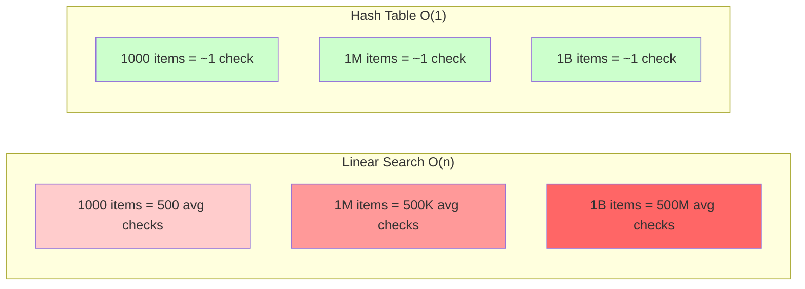
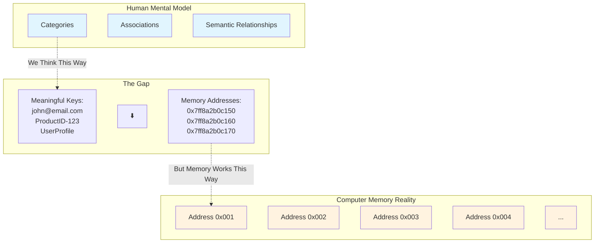
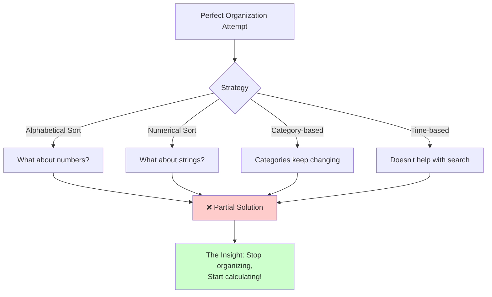

# The Core Problem: Finding a Needle in an Infinite Haystack

Imagine you're tasked with organizing a massive government archive containing millions of documents. Every day, officials rush in asking for specific files: "I need the birth certificate for John Smith born in 1985," or "Where's the tax record for company ABC-123?" 

In a traditional filing system, you'd have two choices, both terrible:

1. **Sequential Search**: Start from the first file and check every single document until you find the right one. For millions of documents, this could take *hours*.

2. **Maintain a Separate Index**: Keep a sorted list of all documents with their locations. But now you have two problems: the original filing problem *plus* maintaining this index as documents are added or removed.

This is exactly the challenge that software faces when dealing with data. Whether it's:
- Finding a user's profile in a database with millions of users
- Locating a cached web page among thousands stored in memory  
- Retrieving a specific object from a distributed storage system

The fundamental problem is: **How do you find specific data without examining every piece of data you have?**

## The Scale of the Problem

To understand why this matters, consider these real-world scenarios:

```mermaid
graph TD
    A[User Request] --> B{Data Search Strategy}
    B -->|Linear Search| C[Check Every Record]
    B -->|Hash Table| D[Calculate Location]
    
    C --> E[O(n) Time]
    D --> F[O(1) Time]
    
    E --> G[Seconds/Minutes]
    F --> H[Milliseconds]
    
    G --> I[❌ Poor User Experience]
    H --> J[✅ Excellent User Experience]
    
    style C fill:#ffcccc
    style D fill:#ccffcc
    style I fill:#ff9999
    style J fill:#99ff99
```

**Real-World Impact:**

- **Web Browsers**: Chrome keeps thousands of cached pages. When you visit a website, it needs to instantly determine if that page is already cached.
- **Databases**: PostgreSQL might store millions of customer records. When you search for a customer by email, it can't afford to scan every record.
- **Programming Languages**: Python's dictionaries, JavaScript's objects, and Java's HashMap all face this same core challenge.

### Performance at Scale



In each case, the difference between a solution that takes milliseconds versus one that takes seconds can make or break user experience.

## Why This Problem is Hard

The challenge isn't just about speed—it's about the fundamental nature of computer memory and storage:



**The Three Core Challenges:**

1. **Computer Memory is Linear**: Unlike our mental model of "categories" and "associations," computer memory is essentially a giant numbered list. Position 1, Position 2, Position 3, and so on.

2. **Arbitrary Keys**: We want to use meaningful identifiers like email addresses, product names, or user IDs—but computers only understand numbers and positions.

3. **Dynamic Requirements**: Data is constantly being added, removed, and modified. Any solution must handle this gracefully without rebuilding the entire system.

### The Impossibility of Perfect Organization



The ingenious insight that solves this problem is hashing: instead of searching for data, we *calculate* where it should be.

## The Breakthrough Insight

Rather than asking "Where did I put this item?" we ask "Where *should* this item go?"

```mermaid
graph LR
    subgraph "Traditional Approach: Search"
        A1[Question: Where is X?] --> A2[Search Strategy]
        A2 --> A3[Check location 1]
        A3 --> A4[Check location 2]
        A4 --> A5[Check location 3]
        A5 --> A6[... keep searching]
        A6 --> A7[Finally found!]
    end
    
    subgraph "Hashing Approach: Calculate"
        B1[Question: Where should X be?] --> B2[Hash Function]
        B2 --> B3[hash(X) = location]
        B3 --> B4[Go directly there]
        B4 --> B5[Found immediately!]
    end
    
    style A2 fill:#ffcccc
    style A3 fill:#ffcccc
    style A4 fill:#ffcccc
    style A5 fill:#ffcccc
    style A6 fill:#ffcccc
    style B2 fill:#ccffcc
    style B3 fill:#ccffcc
    style B4 fill:#ccffcc
    style B5 fill:#99ff99
```

### The Magic Filing Clerk Analogy

```mermaid
graph TD
    A[Person walks in with document] --> B[Shows name to clerk]
    B --> C{Traditional Clerk}
    B --> D{Hash Function Clerk}
    
    C --> E[Searches through<br/>filing system]
    E --> F[Eventually finds<br/>correct location]
    
    D --> G[Instantly calculates:<br/>name → cabinet number]
    G --> H[Points directly to<br/>exact location]
    
    F --> I[Slow: O(n) time]
    H --> J[Fast: O(1) time]
    
    style C fill:#ffcccc
    style D fill:#ccffcc
    style E fill:#ffcccc
    style G fill:#ccffcc
    style I fill:#ff9999
    style J fill:#99ff99
```

This shift from searching to calculating is the conceptual leap that makes hashing revolutionary. Instead of maintaining complex indices or scanning through data, we use a mathematical function to transform any piece of data into a direct memory address.

**The Mathematical Magic:**
```
Input: "john@email.com"
Hash Function: f(x) = (sum of ASCII values) % table_size
Output: Memory address 42

Every time we hash "john@email.com", we get 42.
No searching required—just pure calculation!
```

This is the core insight behind every hash table, dictionary, and key-value store in modern computing.