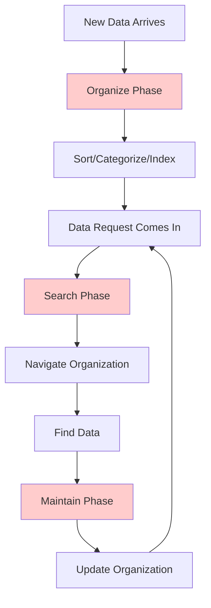
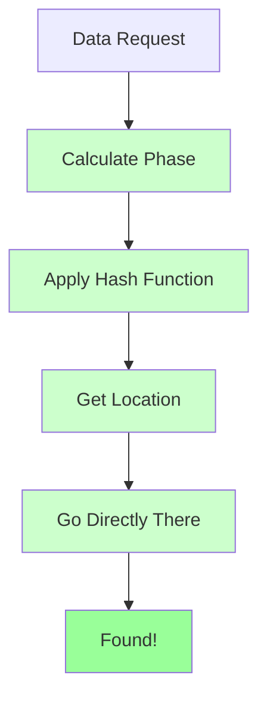
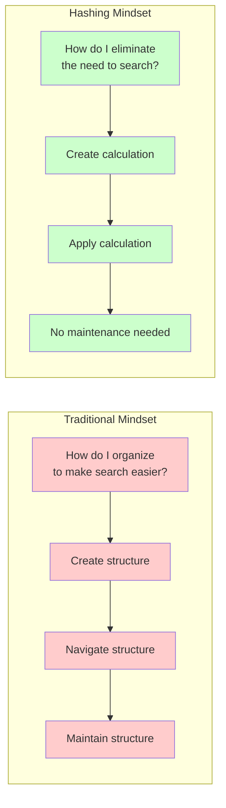
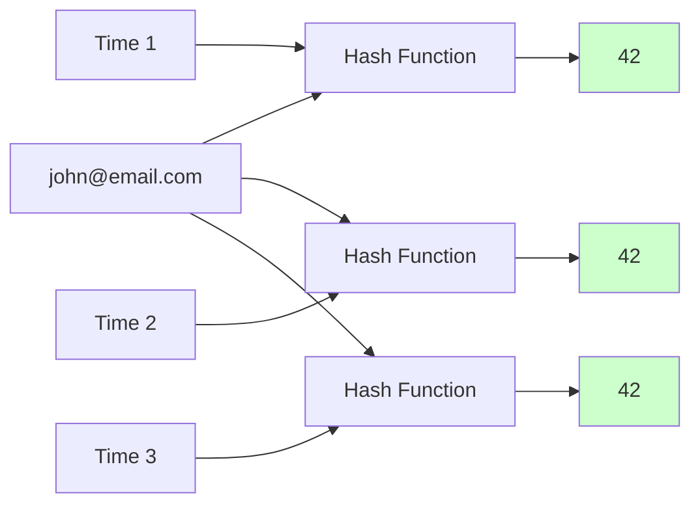
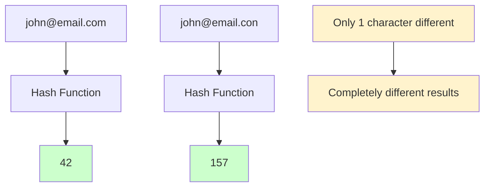

# The Guiding Philosophy: Calculate, Don't Search

The philosophical breakthrough behind hashing is deceptively simple: **instead of organizing data to make searching easier, we calculate exactly where data should go**.

This represents a fundamental shift in thinking about data organization—from *reactive* to *proactive*.

## The Traditional Approach: Organize Then Search



Most data organization strategies follow this pattern:
1. **Organize**: Sort data, create categories, build indices
2. **Search**: Use the organization to find what you need
3. **Maintain**: Keep the organization up-to-date as data changes

This works well for humans (think of libraries with card catalogs), but computers can do something much more powerful.

## The Hashing Philosophy: Calculate the Location



Hashing flips this entirely:
1. **Calculate**: Use a function to determine where data belongs
2. **Go There**: Use the calculated location directly
3. **Done**: No searching required

### The Philosophical Revolution



It's like having a mathematical GPS for your data.

## Core Principles

```mermaid
graph TD
    A[Hash Function Requirements] --> B[Determinism]
    A --> C[Uniformity]
    A --> D[Efficiency]
    A --> E[Avalanche Effect]
    
    B --> B1[Same input → Same output<br/>Always reliable]
    C --> C1[Even distribution<br/>Avoid clustering]
    D --> D1[Fast computation<br/>O(1) time]
    E --> E1[Small changes → Big differences<br/>Prevent clustering]
    
    style B fill:#e8f5e8
    style C fill:#e8f5e8
    style D fill:#e8f5e8
    style E fill:#e8f5e8
```

### 1. Determinism: Same Input, Same Output



```
hash("john@email.com") → 42
hash("john@email.com") → 42  // Always 42, every time
```

The hash function must be completely predictable. Given the same input, it must always produce the same output. This reliability is what makes the entire system work.

### 2. Uniformity: Spread Things Out

```mermaid
graph TD
    subgraph "Good Distribution"
        A1[alice@email.com → 15]
        A2[bob@email.com → 73]
        A3[carol@email.com → 31]
        A4[dave@email.com → 8]
    end
    
    subgraph "Bad Distribution (Clustering)"
        B1[alice@email.com → 15]
        B2[bob@email.com → 15]
        B3[carol@email.com → 16]
        B4[dave@email.com → 15]
    end
    
    style A1 fill:#ccffcc
    style A2 fill:#ccffcc
    style A3 fill:#ccffcc
    style A4 fill:#ccffcc
    style B1 fill:#ffcccc
    style B2 fill:#ffcccc
    style B3 fill:#ffcccc
    style B4 fill:#ffcccc
```

```
hash("alice@email.com") → 15
hash("bob@email.com")   → 73  
hash("carol@email.com") → 31
```

A good hash function distributes data evenly across available space. If everyone's data ended up in the same location, we'd be back to linear searching.

### 3. Efficiency: Fast to Calculate

```mermaid
graph LR
    A[Key Input] --> B{Hash Function Speed}
    
    B -->|Fast O(1)| C[✅ Instant Result]
    B -->|Slow O(n)| D[❌ Defeats Purpose]
    
    C --> E[Hash table advantage maintained]
    D --> F[Slower than linear search!]
    
    style C fill:#ccffcc
    style D fill:#ffcccc
    style E fill:#ccffcc
    style F fill:#ffcccc
```

```
// Fast
hash(key) → result in O(1) time

// Defeats the purpose
hash(key) → result in O(n) time after complex calculation
```

The hash calculation itself must be lightning-fast. If computing the hash takes longer than searching, we've gained nothing.

### 4. Avalanche Effect: Small Change, Big Difference



```
hash("john@email.com") → 42
hash("john@email.con") → 157  // Single character change → completely different result
```

Tiny changes in input should create dramatically different outputs. This ensures that similar keys don't cluster together.

## The Trade-offs We Accept

Hashing isn't magic—it comes with inherent trade-offs that we consciously accept:

### Memory for Speed


```
Traditional Array: 
[item1, item2, item3, item4]  // 4 slots, 100% full

Hash Table:
[_, _, item1, _, _, item2, _, item3, _, item4, _, _]  // 12 slots, 33% full
```

Hash tables typically use more memory than needed to maintain good performance. This extra space prevents collisions and keeps operations fast.

### Approximate Uniformity
```
Perfect Distribution (impossible):
Bucket 0: 1 item
Bucket 1: 1 item  
Bucket 2: 1 item

Real Distribution (acceptable):
Bucket 0: 0 items
Bucket 1: 2 items
Bucket 2: 1 item
```

We can't achieve perfect distribution, but we aim for "good enough." The goal is to avoid worst-case scenarios, not to achieve mathematical perfection.

### Collision Handling Complexity
```
Ideal World:
hash("key") → unique location every time

Real World:
hash("key1") → location 5
hash("key2") → location 5  // Collision! Now what?
```

When different keys produce the same hash value (collisions), we need strategies to handle them. This adds complexity but enables the entire system to work.

## The Philosophical Shift

Traditional data structures answer: "How do I organize data to make finding it easier?"

Hash tables answer: "How do I eliminate the need to find data by knowing exactly where it is?"

This shift from *finding* to *knowing* is what makes hash tables one of the most fundamental and powerful abstractions in computer science.

## Mental Model: The Oracle Clerk

Think of a hash function as an oracle clerk in a cosmic filing system:

- **You hand them any document** → They instantly tell you the exact cabinet number
- **They never need to look anything up** → They calculate the answer
- **They're incredibly fast** → The calculation is instantaneous  
- **They're perfectly consistent** → The same document always goes to the same cabinet
- **They spread things out** → Documents don't all end up in one cabinet

This oracle clerk is the hash function, and the filing system is your hash table. The magic isn't in the filing cabinets—it's in the clerk's ability to calculate the perfect location for anything.