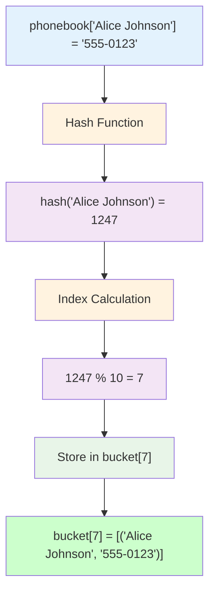
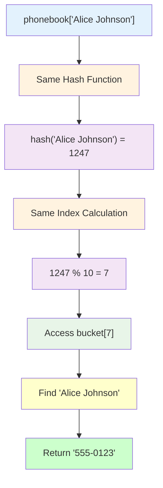

# Getting Started: Building Your First Hash Table Phonebook

Let's build something concrete: a simple phonebook using hash tables. This guide will give you hands-on experience with the core concepts and show you how different programming languages implement the same idea.

## Prerequisites

- Basic programming knowledge in any language
- Understanding of arrays/lists
- Familiarity with basic data types (strings, numbers)

## The Problem: A Digital Phonebook

We want to build a phonebook that can:
- Store names and phone numbers
- Look up phone numbers by name instantly
- Add new contacts
- Remove contacts

Let's see how hash tables make this trivial.

## Implementation in Different Languages

### Python: Using Built-in Dictionary

```python
# Python's dict is a hash table under the hood
phonebook = {}

# Adding contacts - O(1) average time
phonebook["Alice Johnson"] = "555-0123"
phonebook["Bob Smith"] = "555-0456" 
phonebook["Carol Davis"] = "555-0789"

# Looking up numbers - O(1) average time
alice_number = phonebook["Alice Johnson"]
print(f"Alice's number: {alice_number}")

# Checking if contact exists
if "Bob Smith" in phonebook:
    print(f"Bob's number: {phonebook['Bob Smith']}")

# Removing a contact
del phonebook["Carol Davis"]

# Iterating through all contacts
for name, number in phonebook.items():
    print(f"{name}: {number}")
```

### JavaScript: Using Built-in Map

```javascript
// JavaScript's Map is a hash table
const phonebook = new Map();

// Adding contacts
phonebook.set("Alice Johnson", "555-0123");
phonebook.set("Bob Smith", "555-0456");
phonebook.set("Carol Davis", "555-0789");

// Looking up numbers
const aliceNumber = phonebook.get("Alice Johnson");
console.log(`Alice's number: ${aliceNumber}`);

// Checking if contact exists
if (phonebook.has("Bob Smith")) {
    console.log(`Bob's number: ${phonebook.get("Bob Smith")}`);
}

// Removing a contact
phonebook.delete("Carol Davis");

// Iterating through all contacts
phonebook.forEach((number, name) => {
    console.log(`${name}: ${number}`);
});
```

### Java: Using HashMap

```java
import java.util.HashMap;
import java.util.Map;

public class Phonebook {
    public static void main(String[] args) {
        // Java's HashMap is a hash table
        Map<String, String> phonebook = new HashMap<>();
        
        // Adding contacts
        phonebook.put("Alice Johnson", "555-0123");
        phonebook.put("Bob Smith", "555-0456");
        phonebook.put("Carol Davis", "555-0789");
        
        // Looking up numbers
        String aliceNumber = phonebook.get("Alice Johnson");
        System.out.println("Alice's number: " + aliceNumber);
        
        // Checking if contact exists
        if (phonebook.containsKey("Bob Smith")) {
            System.out.println("Bob's number: " + phonebook.get("Bob Smith"));
        }
        
        // Removing a contact
        phonebook.remove("Carol Davis");
        
        // Iterating through all contacts
        for (Map.Entry<String, String> entry : phonebook.entrySet()) {
            System.out.println(entry.getKey() + ": " + entry.getValue());
        }
    }
}
```

## What's Happening Under the Hood

When you write `phonebook["Alice Johnson"] = "555-0123"`, here's what actually happens:



```
1. Hash Function Calculation:
   hash("Alice Johnson") → 1247 (example value)

2. Array Index Calculation:
   1247 % table_size → 7 (if table has 10 buckets)

3. Storage:
   buckets[7] = [("Alice Johnson", "555-0123")]
```

When you look up `phonebook["Alice Johnson"]`:



```
1. Same Hash Calculation:
   hash("Alice Johnson") → 1247

2. Same Index Calculation:
   1247 % table_size → 7

3. Direct Bucket Access:
   Look in buckets[7] for key "Alice Johnson"
   Return value "555-0123"
```

## Building a Simple Hash Table from Scratch

Let's implement a basic hash table to understand the mechanics:

```python
class SimplePhonebook:
    def __init__(self, size=10):
        self.size = size
        self.buckets = [[] for _ in range(size)]
    
    def _hash(self, key):
        """Simple hash function - sum of character codes"""
        return sum(ord(char) for char in key) % self.size
    
    def add_contact(self, name, number):
        """Add a new contact"""
        bucket_index = self._hash(name)
        bucket = self.buckets[bucket_index]
        
        # Check if contact already exists
        for i, (existing_name, _) in enumerate(bucket):
            if existing_name == name:
                bucket[i] = (name, number)  # Update existing
                return
        
        # Add new contact
        bucket.append((name, number))
    
    def get_number(self, name):
        """Look up a phone number by name"""
        bucket_index = self._hash(name)
        bucket = self.buckets[bucket_index]
        
        for existing_name, number in bucket:
            if existing_name == name:
                return number
        
        return None  # Contact not found
    
    def remove_contact(self, name):
        """Remove a contact"""
        bucket_index = self._hash(name)
        bucket = self.buckets[bucket_index]
        
        for i, (existing_name, _) in enumerate(bucket):
            if existing_name == name:
                del bucket[i]
                return True
        
        return False  # Contact not found

# Usage example
phonebook = SimplePhonebook()

# Add some contacts
phonebook.add_contact("Alice Johnson", "555-0123")
phonebook.add_contact("Bob Smith", "555-0456")
phonebook.add_contact("Carol Davis", "555-0789")

# Look up numbers
print(phonebook.get_number("Alice Johnson"))  # "555-0123"
print(phonebook.get_number("Unknown Person"))  # None

# Remove a contact
phonebook.remove_contact("Bob Smith")
print(phonebook.get_number("Bob Smith"))  # None
```

## Testing Hash Distribution

Let's see how our hash function distributes names across buckets:

```python
def analyze_distribution():
    phonebook = SimplePhonebook(size=5)
    names = ["Alice", "Bob", "Carol", "David", "Eve", "Frank", "Grace", "Henry"]
    
    for name in names:
        phonebook.add_contact(name, "555-0000")
    
    # Show distribution across buckets
    for i, bucket in enumerate(phonebook.buckets):
        print(f"Bucket {i}: {[name for name, _ in bucket]}")

analyze_distribution()
```

Output might look like:
```
Bucket 0: ['Bob', 'Eve']
Bucket 1: ['Alice', 'David']  
Bucket 2: ['Carol']
Bucket 3: ['Frank', 'Henry']
Bucket 4: ['Grace']
```

Notice how names are distributed across different buckets. This is the hash function spreading data out to avoid clustering.

## Performance Comparison

Let's compare our hash table with a simple list approach:

```python
import time

# Hash table approach
def test_hash_table():
    phonebook = {}
    for i in range(1000):
        phonebook[f"Person{i}"] = f"555-{i:04d}"
    
    start = time.time()
    for _ in range(1000):
        number = phonebook["Person500"]  # Always look up same person
    end = time.time()
    
    return end - start

# List approach (linear search)
def test_list():
    phonebook = []
    for i in range(1000):
        phonebook.append((f"Person{i}", f"555-{i:04d}"))
    
    start = time.time()
    for _ in range(1000):
        for name, number in phonebook:
            if name == "Person500":
                break
    end = time.time()
    
    return end - start

hash_time = test_hash_table()
list_time = test_list()

print(f"Hash table time: {hash_time:.6f} seconds")
print(f"List search time: {list_time:.6f} seconds")
print(f"Hash table is {list_time/hash_time:.1f}x faster")
```

## Key Takeaways

1. **Hash Tables are Everywhere**: Python dicts, JavaScript objects/Maps, Java HashMaps—they're all hash tables.

2. **Instant Lookup**: Once you provide a key, the hash function calculates exactly where to find the value.

3. **Trade-offs**: Hash tables use extra memory for speed, and handle collisions with additional complexity.

4. **Not Magic**: The "instant" lookup is really just very fast math followed by array access.

## Next Steps

Now that you've seen hash tables in action, you're ready to dive deeper into:
- How collision resolution actually works
- Why load factor matters for performance
- How hash tables resize themselves
- Advanced hash functions and their properties

The foundation you've built here—understanding keys, values, hash functions, and buckets—will serve you well as we explore the more sophisticated aspects of this fundamental data structure.