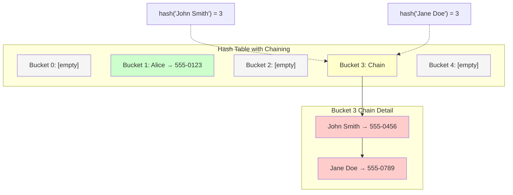
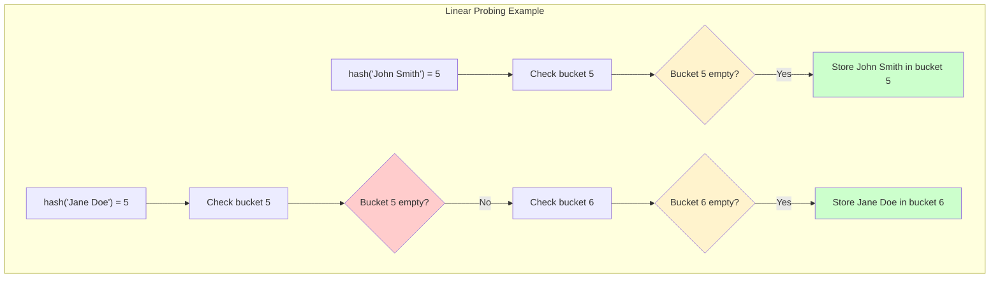

# Collision Resolution: When Two Keys Want the Same Home

No matter how good your hash function, collisions are inevitable. Think of it like a busy post office: even with the best addressing system, sometimes two pieces of mail end up assigned to the same P.O. Box. The question isn't *if* collisions will happen, but *how* you'll handle them when they do.

## Understanding Collisions

A collision occurs when two different keys produce the same hash value:

```
hash("John Smith") → 5
hash("Jane Doe")   → 5  // Collision!
```

Both keys want to live in bucket 5, but there's only one bucket 5. This is where collision resolution strategies come into play.

## Why Collisions are Inevitable

### The Pigeonhole Principle
If you have more pigeons than pigeonholes, at least one hole must contain multiple pigeons. Similarly:
- **Keys**: Potentially infinite (all possible strings, numbers, etc.)
- **Buckets**: Finite (limited by memory and practical size)
- **Result**: Collisions are mathematically guaranteed

### Birthday Paradox
Even with good distribution, collisions happen sooner than you'd expect. With just 23 people in a room, there's a 50% chance two share the same birthday. Similarly, with a hash table of size 365, you'll likely see collisions after inserting just 23 items.

## Strategy 1: Chaining (Separate Chaining)

**Concept**: Each bucket contains a list of all key-value pairs that hash to that location.

**Analogy**: Like having multiple mailboxes at the same street address—each resident gets their own mailbox, but they all share the same address number.

### Visual Representation



```
Bucket 0: []
Bucket 1: [("Alice", "555-0123")]
Bucket 2: []
Bucket 3: [("John Smith", "555-0456"), ("Jane Doe", "555-0789")]  // Collision resolved with chaining
Bucket 4: []
```

### Implementation
```python
class ChainedHashTable:
    def __init__(self, size=10):
        self.size = size
        self.buckets = [[] for _ in range(size)]
    
    def _hash(self, key):
        return hash(key) % self.size
    
    def put(self, key, value):
        bucket_index = self._hash(key)
        bucket = self.buckets[bucket_index]
        
        # Check if key already exists
        for i, (existing_key, _) in enumerate(bucket):
            if existing_key == key:
                bucket[i] = (key, value)  # Update existing
                return
        
        # Add new key-value pair
        bucket.append((key, value))
    
    def get(self, key):
        bucket_index = self._hash(key)
        bucket = self.buckets[bucket_index]
        
        # Search through the chain
        for existing_key, value in bucket:
            if existing_key == key:
                return value
        
        raise KeyError(key)
    
    def delete(self, key):
        bucket_index = self._hash(key)
        bucket = self.buckets[bucket_index]
        
        for i, (existing_key, _) in enumerate(bucket):
            if existing_key == key:
                del bucket[i]
                return
        
        raise KeyError(key)
```

### Chaining Performance Analysis
- **Best Case**: O(1) - no collisions, direct access
- **Average Case**: O(1 + α) where α is the load factor (n/m)
- **Worst Case**: O(n) - all keys hash to same bucket

### Chaining Pros and Cons
**Pros**:
- Simple to implement and understand
- Never runs out of space (can always add more items)
- Good performance with reasonable load factors

**Cons**:
- Extra memory overhead for storing pointers
- Cache unfriendly (linked list traversal)
- Performance degrades as chains get longer

## Strategy 2: Open Addressing

**Concept**: All key-value pairs are stored directly in the bucket array. When a collision occurs, we probe for the next available slot.

**Analogy**: Like a parking lot where if your assigned spot is taken, you follow a systematic rule to find the next available space.

### Linear Probing
When a collision occurs, check the next slot, then the next, until you find an empty one.



```
hash("John Smith") → 5 (occupied)
Try 6 → empty! Store here.

hash("Jane Doe") → 5 (occupied by John Smith)
Try 6 → (occupied by previous collision)
Try 7 → empty! Store here.
```

### Implementation with Linear Probing
```python
class OpenAddressingHashTable:
    def __init__(self, size=10):
        self.size = size
        self.keys = [None] * size
        self.values = [None] * size
        self.deleted = [False] * size  # Track deleted slots
    
    def _hash(self, key):
        return hash(key) % self.size
    
    def _find_slot(self, key):
        """Find the slot for a given key"""
        index = self._hash(key)
        original_index = index
        
        while self.keys[index] is not None:
            if self.keys[index] == key and not self.deleted[index]:
                return index  # Found existing key
            
            index = (index + 1) % self.size  # Linear probing
            
            if index == original_index:
                raise Exception("Hash table is full")
        
        return index  # Found empty slot
    
    def put(self, key, value):
        index = self._find_slot(key)
        self.keys[index] = key
        self.values[index] = value
        self.deleted[index] = False
    
    def get(self, key):
        index = self._hash(key)
        original_index = index
        
        while self.keys[index] is not None:
            if (self.keys[index] == key and not self.deleted[index]):
                return self.values[index]
            
            index = (index + 1) % self.size
            
            if index == original_index:
                break
        
        raise KeyError(key)
    
    def delete(self, key):
        index = self._hash(key)
        original_index = index
        
        while self.keys[index] is not None:
            if (self.keys[index] == key and not self.deleted[index]):
                self.deleted[index] = True
                return
            
            index = (index + 1) % self.size
            
            if index == original_index:
                break
        
        raise KeyError(key)
```

### Quadratic Probing
Instead of checking consecutive slots, jump by increasing squares: +1², +2², +3², etc.

```python
def quadratic_probe(self, key):
    index = self._hash(key)
    i = 0
    
    while self.keys[index] is not None:
        if self.keys[index] == key:
            return index
        
        i += 1
        index = (self._hash(key) + i*i) % self.size
    
    return index
```

### Double Hashing
Use a second hash function to determine the step size:

```python
def double_hash_probe(self, key):
    index = self._hash(key)
    step = self._hash2(key)  # Second hash function
    
    while self.keys[index] is not None:
        if self.keys[index] == key:
            return index
        
        index = (index + step) % self.size
    
    return index

def _hash2(self, key):
    # Common choice: 7 - (hash(key) % 7)
    return 7 - (hash(key) % 7)
```

## Comparison: Chaining vs Open Addressing

| Aspect | Chaining | Open Addressing |
|--------|----------|-----------------|
| Memory Usage | Higher (pointers) | Lower (compact array) |
| Cache Performance | Poor (pointer chasing) | Good (array locality) |
| Load Factor | Can exceed 1.0 | Must stay < 1.0 |
| Deletion | Simple | Complex (tombstones) |
| Implementation | Easier | More complex |
| Resize Necessity | Less urgent | More critical |

## Advanced Collision Resolution: Robin Hood Hashing

**Concept**: Minimize the maximum displacement by "stealing from the rich to give to the poor."

When inserting, if you encounter an element that's closer to its ideal position than you are to yours, swap places and continue inserting the displaced element.

```python
class RobinHoodHashTable:
    def __init__(self, size=10):
        self.size = size
        self.keys = [None] * size
        self.values = [None] * size
        self.distances = [0] * size  # Track displacement distance
    
    def _distance(self, key, index):
        """Calculate how far a key is from its ideal position"""
        ideal = self._hash(key)
        return (index - ideal) % self.size
    
    def put(self, key, value):
        index = self._hash(key)
        distance = 0
        
        while self.keys[index] is not None:
            existing_distance = self.distances[index]
            
            if self.keys[index] == key:
                self.values[index] = value  # Update existing
                return
            
            # Robin Hood: steal from the rich
            if distance > existing_distance:
                # Swap the current element with the one we're inserting
                key, self.keys[index] = self.keys[index], key
                value, self.values[index] = self.values[index], value
                distance, self.distances[index] = self.distances[index], distance
            
            index = (index + 1) % self.size
            distance += 1
        
        # Found empty slot
        self.keys[index] = key
        self.values[index] = value
        self.distances[index] = distance
```

## Choosing the Right Strategy

### Use Chaining When:
- You expect high load factors
- Memory usage isn't critical
- Deletion is frequent
- Implementation simplicity is important

### Use Open Addressing When:
- Cache performance is critical
- Memory usage must be minimized
- Load factors will stay reasonable
- You can handle the complexity of deletions

### Use Robin Hood When:
- You need predictable worst-case performance
- Variance in lookup times is unacceptable
- You're willing to handle the implementation complexity

## Real-World Examples

- **Python dictionaries**: Use open addressing with random probing
- **Java HashMap**: Uses chaining with tree conversion for long chains
- **Rust HashMap**: Uses Robin Hood hashing with SIMD optimizations
- **Go map**: Uses open addressing with linear probing

The choice of collision resolution strategy fundamentally shapes the performance characteristics of your hash table, making it crucial to understand the trade-offs for your specific use case.