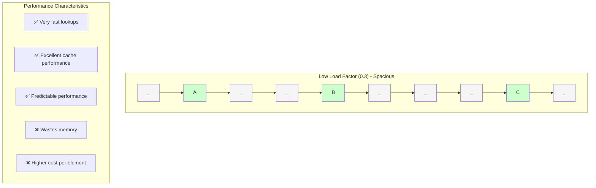
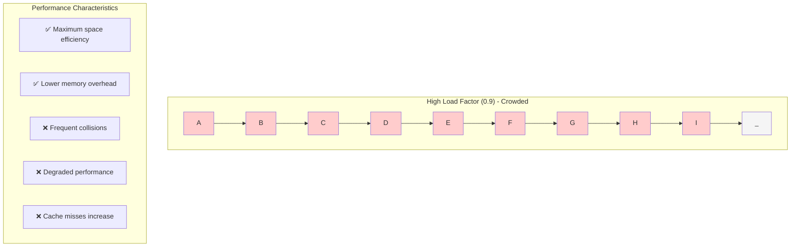
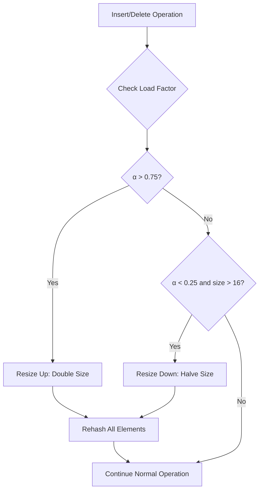

# Load Factor and Resizing: The Art of Balanced Performance

The load factor is the single most important metric that determines your hash table's performance. Think of it as the occupancy rate of a hotel: too empty and you're wasting space, too full and service quality plummets. Understanding load factor and resizing is crucial for building production-ready hash tables.

## Understanding Load Factor

**Load Factor (α) = Number of Elements / Number of Buckets**

```
Examples:
- 5 elements in 10 buckets → α = 0.5 (50% full)
- 8 elements in 10 buckets → α = 0.8 (80% full)  
- 12 elements in 10 buckets → α = 1.2 (120% full, only possible with chaining)
```

## The Performance-Space Trade-off

### Low Load Factor (α < 0.5): The Spacious Hotel



```
Buckets: [_, A, _, _, B, _, _, _, C, _]
Load Factor: 0.3
```

**Pros**:
- Very fast lookups (fewer collisions)
- Excellent cache performance
- Predictable performance

**Cons**:
- Wastes memory
- Higher cost per element stored

### Moderate Load Factor (0.5 ≤ α ≤ 0.75): The Sweet Spot
```
Buckets: [A, B, _, C, D, _, E, F, _, _]
Load Factor: 0.6
```

**Pros**:
- Good balance of speed and space
- Reasonable collision rates
- Industry standard range

**Cons**:
- Requires careful monitoring
- Performance starts to degrade at upper end

### High Load Factor (α > 0.75): The Crowded Hotel



```
Buckets: [A, B, C, D, E, F, G, H, I, _]
Load Factor: 0.9
```

**Pros**:
- Maximum space efficiency
- Lower memory overhead

**Cons**:
- Frequent collisions
- Degraded performance
- Cache misses increase dramatically

## Performance Analysis by Load Factor

### Theoretical Analysis
For a hash table with uniform distribution:

**Average Probe Distance (Chaining)**:
- Expected chain length = α
- Worst case still O(n) but rare

**Average Probe Distance (Open Addressing)**:
- Successful search: ½(1 + 1/(1-α))
- Unsuccessful search: ½(1 + 1/(1-α)²)

### Real Performance Data
```python
import time
import random

def measure_performance():
    sizes = [0.25, 0.5, 0.75, 0.9, 0.95, 0.99]
    table_size = 1000
    
    for load_factor in sizes:
        num_elements = int(table_size * load_factor)
        
        # Build hash table
        table = {}
        for i in range(num_elements):
            table[f"key_{i}"] = f"value_{i}"
        
        # Measure lookup time
        start = time.time()
        for _ in range(10000):
            key = f"key_{random.randint(0, num_elements-1)}"
            _ = table[key]
        end = time.time()
        
        print(f"Load Factor {load_factor}: {(end-start)*1000:.2f}ms")

# Typical output:
# Load Factor 0.25: 2.1ms
# Load Factor 0.5: 2.3ms  
# Load Factor 0.75: 2.8ms
# Load Factor 0.9: 4.2ms
# Load Factor 0.95: 6.7ms
# Load Factor 0.99: 15.4ms
```

## When to Resize: The Critical Thresholds

### Industry Standard Thresholds
```python
class ResizingHashTable:
    def __init__(self, initial_size=16):
        self.size = initial_size
        self.count = 0
        self.buckets = [[] for _ in range(self.size)]
        
        # Critical thresholds
        self.max_load_factor = 0.75  # Resize up when exceeded
        self.min_load_factor = 0.25  # Resize down when below (optional)
    
    def load_factor(self):
        return self.count / self.size
    
    def needs_resize_up(self):
        return self.load_factor() > self.max_load_factor
    
    def needs_resize_down(self):
        # Only resize down if table is large enough
        return (self.load_factor() < self.min_load_factor and 
                self.size > 16)
```

### The Resize Decision Tree


## The Resizing Process: Rehashing

When you resize a hash table, you can't just copy elements to a bigger array—you must **rehash** everything because the hash function depends on table size.

```python
def resize(self, new_size):
    """Resize the hash table and rehash all elements"""
    # Save old data
    old_buckets = self.buckets
    
    # Create new table
    self.size = new_size
    self.buckets = [[] for _ in range(new_size)]
    self.count = 0  # Will be rebuilt during insertion
    
    # Rehash all elements
    for bucket in old_buckets:
        for key, value in bucket:
            self.put(key, value)  # This will use new hash function
```

### Why Rehashing is Necessary
```python
# Example: Why we can't just copy elements
old_size = 8
new_size = 16

key = "example"
old_hash = hash(key) % old_size    # = 3
new_hash = hash(key) % new_size    # = 11

# Element that was in bucket 3 now belongs in bucket 11!
```

## Advanced Resizing Strategies

### Incremental Resizing
Instead of rehashing everything at once, spread the work across multiple operations:

```python
class IncrementalResizeHashTable:
    def __init__(self):
        self.old_table = None
        self.new_table = []
        self.resize_position = 0
        self.resizing = False
    
    def incremental_rehash(self, steps=1):
        """Rehash a few buckets at a time"""
        if not self.resizing:
            return
        
        for _ in range(steps):
            if self.resize_position >= len(self.old_table):
                # Resizing complete
                self.old_table = None
                self.resizing = False
                break
            
            # Move one bucket from old to new table
            bucket = self.old_table[self.resize_position]
            for key, value in bucket:
                self._insert_new(key, value)
            
            self.resize_position += 1
    
    def get(self, key):
        # Check both tables during resize
        if self.resizing:
            self.incremental_rehash(1)  # Do a bit of work
            
            # Try new table first, then old table
            try:
                return self._get_from_new(key)
            except KeyError:
                return self._get_from_old(key)
        else:
            return self._get_from_new(key)
```

### Consistent Hashing for Distributed Systems
When hash tables are distributed across multiple machines, resizing becomes more complex:

```python
import hashlib

class ConsistentHashRing:
    def __init__(self, nodes=None):
        self.ring = {}
        self.sorted_keys = []
        
        if nodes:
            for node in nodes:
                self.add_node(node)
    
    def _hash(self, key):
        return int(hashlib.md5(key.encode()).hexdigest(), 16)
    
    def add_node(self, node):
        """Add a node to the ring"""
        for i in range(3):  # Virtual nodes for better distribution
            virtual_key = f"{node}:{i}"
            hash_key = self._hash(virtual_key)
            self.ring[hash_key] = node
            self.sorted_keys.append(hash_key)
        
        self.sorted_keys.sort()
    
    def remove_node(self, node):
        """Remove a node from the ring"""
        for i in range(3):
            virtual_key = f"{node}:{i}"
            hash_key = self._hash(virtual_key)
            del self.ring[hash_key]
            self.sorted_keys.remove(hash_key)
    
    def get_node(self, key):
        """Find which node should handle this key"""
        if not self.ring:
            return None
        
        hash_key = self._hash(key)
        
        # Find the first node clockwise
        for ring_key in self.sorted_keys:
            if hash_key <= ring_key:
                return self.ring[ring_key]
        
        # Wrap around to first node
        return self.ring[self.sorted_keys[0]]
```

## Memory and Performance Considerations

### Memory Overhead During Resize
```python
def calculate_memory_usage():
    """During resize, memory usage temporarily doubles"""
    elements = 1000000
    
    # Normal operation
    normal_memory = elements * 64  # 64 bytes per element (example)
    
    # During resize
    resize_memory = normal_memory * 2  # Old + new table
    
    print(f"Normal: {normal_memory / 1024 / 1024:.1f} MB")
    print(f"During resize: {resize_memory / 1024 / 1024:.1f} MB")
    
    # Output:
    # Normal: 61.0 MB
    # During resize: 122.0 MB
```

### Amortized Time Complexity
Although individual resize operations are expensive O(n), they happen infrequently:

```
Operations between resizes: n
Cost of resize: O(n)
Amortized cost per operation: O(n)/n = O(1)
```

## Real-World Load Factor Strategies

### Python dict
- Resize when load factor exceeds 2/3 (≈0.67)
- Use open addressing with random probing
- Maintain minimum size of 8

### Java HashMap  
- Default load factor: 0.75
- Initial capacity: 16
- Resize by doubling when threshold exceeded

### Rust HashMap
- Target load factor: 7/8 (0.875)
- Uses Robin Hood hashing
- Aggressive optimization for cache performance

### Redis
- Resize at load factor 1.0 for normal operation
- Allows higher load factors during background save operations
- Uses incremental resizing to avoid blocking

## Best Practices for Load Factor Management

1. **Choose Conservative Thresholds**: Better to resize early than suffer performance degradation

2. **Monitor in Production**: Track load factor and resize frequency in your applications

3. **Consider Memory Constraints**: In memory-limited environments, you might accept higher load factors

4. **Plan for Resize Spikes**: Ensure your system can handle temporary memory doubling

5. **Use Incremental Resizing**: For large tables or latency-sensitive applications

The load factor is your hash table's vital sign—monitor it carefully, and it will serve you well at scale.