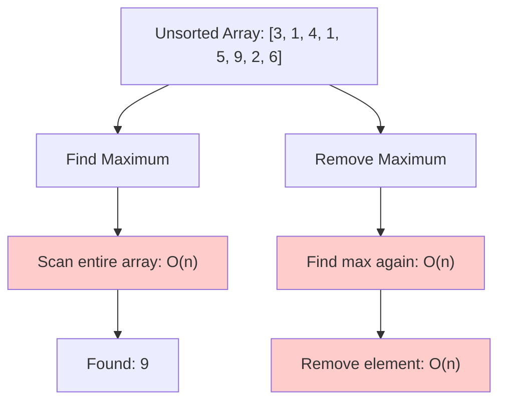
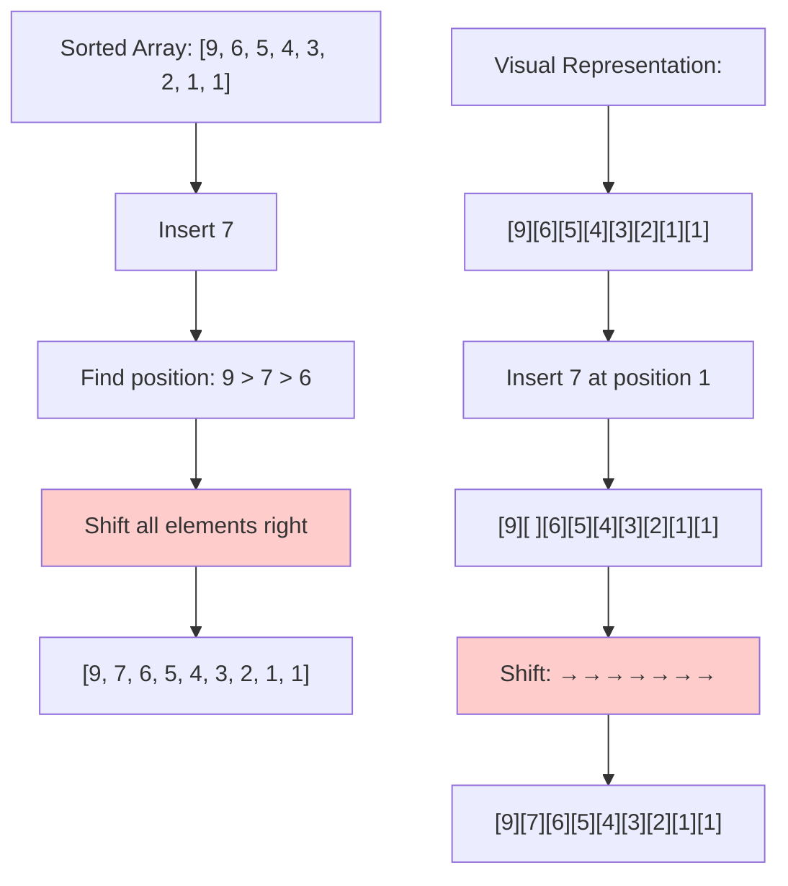
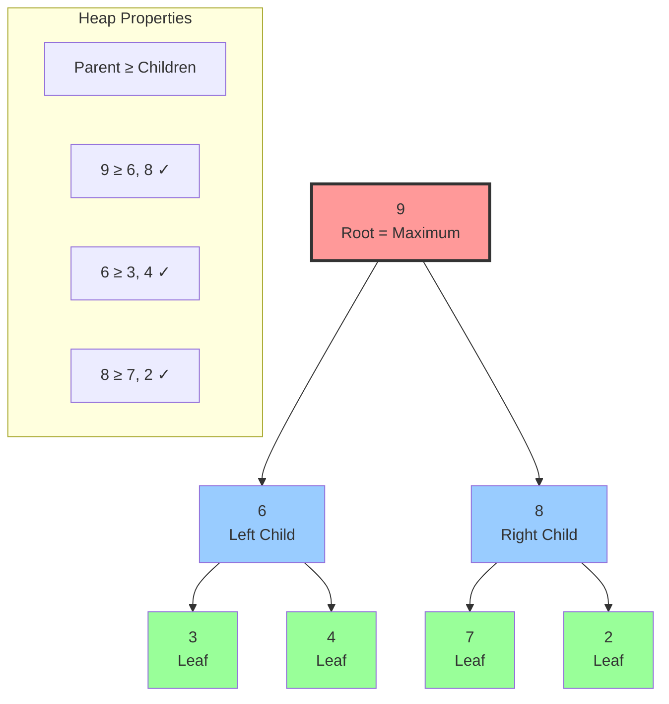
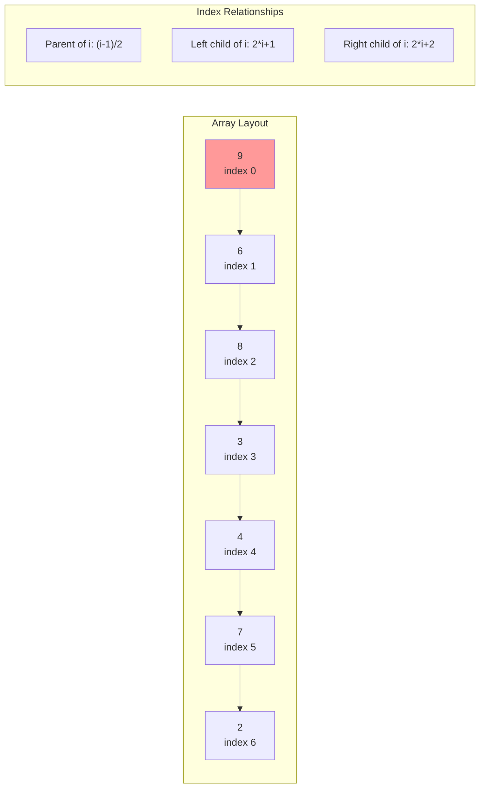
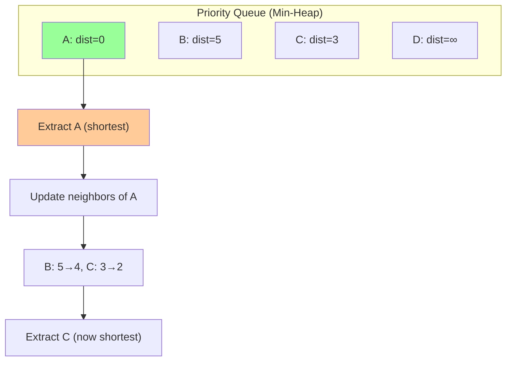
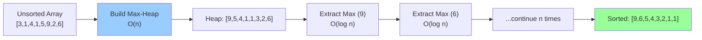
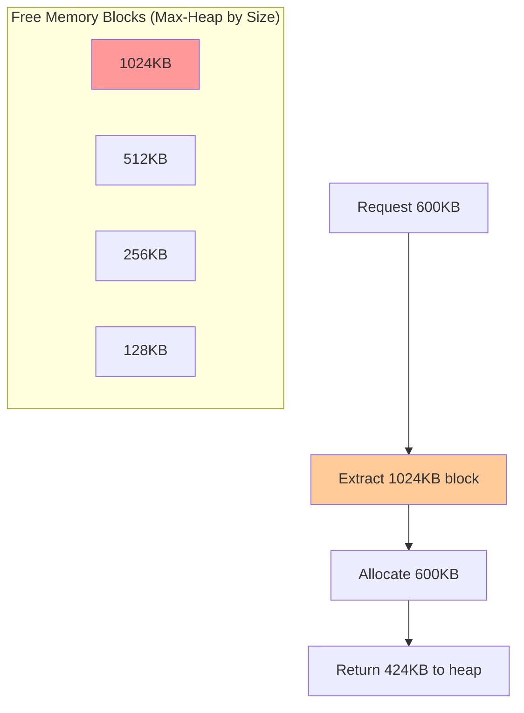

# The Core Problem: Dynamic Priority Access

## The Priority Challenge

Imagine you're building an operating system's task scheduler. At any moment, you need to:
- **Find** the highest priority task instantly
- **Remove** that task when it starts executing
- **Add** new tasks with their priorities
- **Update** task priorities dynamically

This is the fundamental **priority access problem**: efficiently managing a dynamic collection where you frequently need the "most important" item.

## Why This Problem Is Everywhere

### Operating System Scheduling
```
Tasks waiting to run:
- Video decoder: Priority 9 (real-time)
- File backup: Priority 2 (background)
- User input: Priority 8 (interactive)
- Network packet: Priority 7 (time-sensitive)

Question: Which task runs next?
Answer: Video decoder (highest priority: 9)
```

### Emergency Room Triage
```
Patients waiting:
- Heart attack: Priority 1 (critical)
- Broken arm: Priority 4 (urgent) 
- Common cold: Priority 8 (non-urgent)
- Car accident: Priority 2 (emergency)

Question: Who gets treated next?
Answer: Heart attack (highest priority: 1 = most critical)
```

### Event-Driven Simulation
```
Future events scheduled:
- Customer arrives: Time 10.5
- Server finishes: Time 8.2
- System backup: Time 15.0
- Order completes: Time 9.1

Question: What happens next?
Answer: Server finishes (earliest time: 8.2)
```

## Naive Approaches Fall Short

### Approach 1: Unsorted Array



```python
priorities = [3, 1, 4, 1, 5, 9, 2, 6]

def get_max():
    return max(priorities)  # O(n) - scan entire array

def remove_max():
    max_val = max(priorities)  # O(n) - find maximum
    priorities.remove(max_val)  # O(n) - find and remove

Total cost per operation: O(n)
```

**Problem**: Finding the maximum requires scanning the entire array every time. With 10,000 elements, every operation touches all 10,000 values.

### Approach 2: Sorted Array (Descending)



```python
priorities = [9, 6, 5, 4, 3, 2, 1, 1]  # Always sorted

def get_max():
    return priorities[0]  # O(1) - maximum is at front

def remove_max():
    return priorities.pop(0)  # O(1) - remove from front

def insert(value):
    # Find correct position and insert
    for i, val in enumerate(priorities):
        if value > val:
            priorities.insert(i, value)  # O(n) - shift elements
            return
    priorities.append(value)  # O(1) - smallest element

Total cost: Get O(1), Remove O(1), Insert O(n)
```

**Problem**: Maintaining sorted order makes insertions expensive. Each insertion requires shifting up to n elements.

### Approach 3: Sorted Array (Ascending)
```python
priorities = [1, 1, 2, 3, 4, 5, 6, 9]  # Always sorted

def get_max():
    return priorities[-1]  # O(1) - maximum is at back

def remove_max():
    return priorities.pop()  # O(1) - remove from back

def insert(value):
    # Binary search + insert
    position = binary_search(priorities, value)  # O(log n)
    priorities.insert(position, value)  # O(n) - shift elements

Total cost: Get O(1), Remove O(1), Insert O(n)
```

**Problem**: Even with binary search, insertion still requires shifting O(n) elements.

## The Fundamental Trade-off

Traditional approaches force a choice:
- **Fast access** (sorted) → **Slow updates** (O(n) insertions)
- **Fast updates** (unsorted) → **Slow access** (O(n) search)

## Real-World Performance Requirements

### Web Server Request Handling
```
Scenario: 10,000 concurrent requests with different priorities
- VIP users: Priority 1
- Regular users: Priority 5  
- Background tasks: Priority 10

Requirements:
- Serve highest priority request: < 1ms
- Add new request: < 1ms
- Handle 1000 operations/second

Sorted array approach: 10,000 element shifts per insert = unacceptable
```

### Gaming Engine
```
Scenario: Game event processing
- Player input: Priority 1 (immediate)
- AI decisions: Priority 3 (important)
- Sound effects: Priority 5 (noticeable)
- Background loading: Priority 10 (deferrable)

Requirements:
- Process next event: < 0.1ms (60 FPS = 16.67ms per frame)
- Schedule new event: < 0.1ms
- Handle hundreds of events per frame

Linear search approach: 300 events × O(n) = frame drops
```

## What We Really Need

The insight: **We don't need full sorting—we just need to know the maximum efficiently.**

Consider this corporate analogy:
- You need to know who the CEO is (highest priority)
- You don't need to know the exact ranking of every employee
- When the CEO leaves, you need to quickly identify the new CEO
- When new executives join, you need to efficiently place them

This suggests a **partial ordering** approach where:
- The most important element is instantly accessible
- Insertions and deletions are efficient
- We maintain "just enough" order for our needs

## The Heap Insight

Heaps solve this by maintaining a **weak ordering** property:
- **Parent ≥ Children** (in a max-heap)
- **Root = Maximum** element (always)
- **Tree structure** enables O(log n) operations
- **Array implementation** provides cache efficiency



**Array representation**: `[9, 6, 8, 3, 4, 7, 2]`



## The Key Insight: Balanced Compromise

Heaps achieve the optimal balance:
- **Access maximum**: O(1) - always at root
- **Remove maximum**: O(log n) - restructure tree
- **Insert element**: O(log n) - find correct position
- **Space overhead**: O(1) - just the array

This makes heaps perfect for priority queues where you frequently need the "most important" item but don't need full sorted order.

## Applications in the Wild

### Dijkstra's Algorithm (Shortest Path)


**Performance**: `O((V + E) log V)` instead of `O(V²)` with arrays

### Heap Sort


**Total**: O(n log n) guaranteed, in-place sorting

### Memory Management


- **Find largest block**: O(1) - always at root
- **Allocate/Free**: O(log n) - maintain heap property

## The Challenge Ahead

The beauty of heaps is in their implementation:
- How do we maintain the heap property efficiently?
- Why use an array instead of explicit tree nodes?
- What are the fundamental operations (sift-up, sift-down)?

The next section explores the philosophy behind heap design and the elegant properties that make them so effective.