# The Guiding Philosophy: Weak Ordering and the Heap Property

## The Central Philosophy: "Just Enough" Order

Heaps embody a profound insight: **perfect order is often unnecessary and expensive**. Instead of maintaining complete sorted order, heaps maintain just enough structure to efficiently answer the question: "What's the most important item?"

This philosophy leads to a **weak ordering** approach that's both elegant and efficient.

## The Heap Property: The Organizing Principle

The heap property is beautifully simple yet powerful:

### Max-Heap Property
**Every parent node is greater than or equal to its children**


**Array representation**: `[15, 10, 12, 8, 9, 5, 7]`

### Min-Heap Property  
**Every parent node is less than or equal to its children**


**Array representation**: `[2, 4, 3, 8, 6, 9, 5]`

## Why This Property Is Brilliant

### 1. Root Guarantee
The heap property **guarantees** that the root contains the extreme value:
- Max-heap: Root = maximum element
- Min-heap: Root = minimum element

This provides O(1) access to the most important item.

### 2. Local Consistency
The property only constrains **parent-child relationships**, not siblings or cousins. This local constraint is much easier to maintain than global sorting.

```
Siblings can be in any order:
        15
       /  \
      8    12    ← 8 < 12, but that's fine!
     / \   / \
    3   7 5   9  ← Any order among siblings is valid
```

### 3. Flexible Structure
Unlike sorted arrays, heaps allow multiple valid arrangements for the same data:


**Key insight**: Heaps prioritize **ordering constraint** over **unique arrangement**. Multiple valid structures exist for the same data.

## The Corporate Hierarchy Analogy

Think of a heap as a corporate org chart organized by salary:


### The Rules
1. **Every manager earns more than their direct reports** (Parent ≥ Children)
2. **The CEO (root) has the highest salary** (Root = Maximum)
3. **Managers at the same level can earn different amounts** (Siblings can be in any order)
4. **You don't know the exact salary ranking beyond direct relationships** (Weak ordering)

### Key Insights
- **Instant CEO identification**: No search needed
- **Local authority**: Each manager knows they outrank their reports
- **Flexible organization**: CTO and VP Sales can earn similar amounts
- **Efficient restructuring**: When CEO leaves, promote the highest-earning VP

## Maintaining the Heap Property: Core Operations

The heap property must be preserved through two fundamental operations:

### Sift-Up (Bubble-Up): Promoting Elements

When a new element is added or an element's priority increases:

```mermaid
flowchart TD
    subgraph Step1["Step 1: Add at end"]
        A1["15"] --> B1["10"]
        A1 --> C1["12"]
        B1 --> D1["8"]
        B1 --> E1["9"]
        C1 --> F1["7"]
        C1 --> G1["20"]
        
        style G1 fill:#ffcccc,stroke:#ff0000,stroke-width:3px
        note1["Added 20 at end - violates heap property"]
    end
    
    subgraph Step2["Step 2: Compare with parent (12)"]
        A2["15"] --> B2["10"]
        A2 --> C2["12"]
        B2 --> D2["8"]
        B2 --> E2["9"]
        C2 --> F2["7"]
        C2 --> G2["20"]
        
        style G2 fill:#ffcccc,stroke:#ff0000,stroke-width:3px
        style C2 fill:#ffffcc,stroke:#ff8800,stroke-width:2px
        note2["20 > 12, so swap needed"]
    end
    
    subgraph Step3["Step 3: Swap (20 ↔ 12)"]
        A3["15"] --> B3["10"]
        A3 --> C3["20"]
        B3 --> D3["8"]
        B3 --> E3["9"]
        C3 --> F3["7"]
        C3 --> G3["12"]
        
        style C3 fill:#ffcccc,stroke:#ff0000,stroke-width:3px
        style A3 fill:#ffffcc,stroke:#ff8800,stroke-width:2px
        note3["20 > 15, continue upward"]
    end
    
    subgraph Step4["Step 4: Final swap (20 ↔ 15)"]
        A4["20"] --> B4["10"]
        A4 --> C4["15"]
        B4 --> D4["8"]
        B4 --> E4["9"]
        C4 --> F4["7"]
        C4 --> G4["12"]
        
        style A4 fill:#99ff99,stroke:#00aa00,stroke-width:3px
        note4["Heap property restored!"]
    end
    
    Step1 --> Step2 --> Step3 --> Step4
```



**Algorithm**: Element "bubbles up" by repeatedly comparing with parent and swapping if larger, until heap property is satisfied.

### Sift-Down (Heapify): Demoting Elements

When the root is removed or an element's priority decreases:

```mermaid
flowchart TD
    subgraph Step1["Step 1: Replace root with last element"]
        A1["7"] --> B1["10"]
        A1 --> C1["12"]
        B1 --> D1["8"]
        B1 --> E1["9"]
        
        style A1 fill:#ffcccc,stroke:#ff0000,stroke-width:3px
        note1["Removed 15, moved 7 to root<br/>Violates heap property"]
    end
    
    subgraph Step2["Step 2: Compare with children (10, 12)"]
        A2["7"] --> B2["10"]
        A2 --> C2["12"]
        B2 --> D2["8"]
        B2 --> E2["9"]
        
        style A2 fill:#ffcccc,stroke:#ff0000,stroke-width:3px
        style B2 fill:#ffffcc,stroke:#ff8800,stroke-width:2px
        style C2 fill:#ffffcc,stroke:#ff8800,stroke-width:2px
        note2["7 < max(10, 12)<br/>Swap with larger child (12)"]
    end
    
    subgraph Step3["Step 3: Swap with larger child (7 ↔ 12)"]
        A3["12"] --> B3["10"]
        A3 --> C3["7"]
        B3 --> D3["8"]
        B3 --> E3["9"]
        
        style C3 fill:#99ff99,stroke:#00aa00,stroke-width:3px
        note3["7 is now a leaf - heap property restored"]
    end
    
    subgraph Final["Final Heap"]
        A4["12"] --> B4["10"]
        A4 --> C4["7"]
        B4 --> D4["8"]
        B4 --> E4["9"]
        
        style A4 fill:#99ff99,stroke:#00aa00,stroke-width:3px
        note4["Valid max-heap: 12 ≥ 10,7 and 10 ≥ 8,9"]
    end
    
    Step1 --> Step2 --> Step3 --> Final
```



**Algorithm**: Element "sinks down" by comparing with children and swapping with the larger child until heap property is restored.

## The Balance of Order and Efficiency

### What Heaps Guarantee
- **Root access**: O(1) to maximum/minimum
- **Structural balance**: Complete tree ensures O(log n) height
- **Local consistency**: Parent-child relationships maintained

### What Heaps Don't Guarantee
- **Global ordering**: Siblings can be in any order
- **Sorted traversal**: In-order traversal won't yield sorted sequence
- **Search efficiency**: Finding arbitrary elements still takes O(n)

## Types of Heaps and Their Trade-offs

### Binary Heap (Most Common)
- **Structure**: Each parent has at most 2 children
- **Height**: ⌊log₂ n⌋, guaranteeing O(log n) operations
- **Implementation**: Perfect fit for array representation

### D-ary Heap
- **Structure**: Each parent has at most d children
- **Trade-off**: Shorter tree (faster sift-down) vs wider nodes (slower sift-up)
- **Use case**: When removals are more frequent than insertions

### Fibonacci Heap
- **Structure**: Forest of trees with sophisticated merging rules
- **Trade-off**: Complex implementation vs better amortized bounds
- **Use case**: Algorithms requiring frequent decrease-key operations

## The Philosophy in Practice

### Priority Queue Design Decisions


```rust
// Design question: Should we use min-heap or max-heap?

// Option 1: Min-heap with negated priorities
min_heap.push(-priority);  // Higher priority = more negative

// Option 2: Max-heap with direct priorities  
max_heap.push(priority);   // Higher priority = larger value

// Option 3: Custom comparator
heap.push_with_comparator(item, |a, b| a.priority.cmp(&b.priority));
```

### Memory Layout Philosophy

```
Array representation philosophy:
[15, 10, 12, 8, 9, 7, 5]
 0   1   2  3  4  5  6

Why this layout?
- Cache-friendly: Sequential memory access
- Simple arithmetic: No pointers needed
- Space-efficient: No overhead for tree structure
- Fast traversal: Parent/child calculations are O(1)
```

## The Mathematical Foundation

### Complete Binary Tree Property

```mermaid
flowchart TD
    subgraph Complete["Complete Binary Tree"]
        subgraph L0["Level 0: 1 node"]
            A["1"]
        end
        subgraph L1["Level 1: 2 nodes"]
            B["2"]
            C["3"]
        end
        subgraph L2["Level 2: 4 nodes"]
            D["4"]
            E["5"]
            F["6"]
            G["7"]
        end
        subgraph L3["Level 3: Partially filled (left-to-right)"]
            H["8"]
            I["9"]
            J["..."] 
        end
        
        A --> B
        A --> C
        B --> D
        B --> E
        C --> F
        C --> G
        D --> H
        D --> I
    end
    
    subgraph Properties["Complete Tree Properties"]
        P1["✅ All levels filled except last"]
        P2["✅ Last level filled left-to-right"]
        P3["✅ Height = ⌊log₂ n⌋"]
        P4["✅ No gaps in array representation"]
    end
    
    style A fill:#ff9999
    style B fill:#99ccff
    style C fill:#99ccff
```



### Height Analysis

```mermaid
graph LR
    subgraph Growth["Heap Growth Pattern"]
        A["n=1<br/>h=0"] --> B["n=3<br/>h=1"]
        B --> C["n=7<br/>h=2"]
        C --> D["n=15<br/>h=3"]
        D --> E["n=2^k-1<br/>h=k-1"]
    end
    
    subgraph Analysis["Height Bounds"]
        F["For n elements:"]
        G["Minimum height: ⌊log₂ n⌋"]
        H["Maximum height: ⌊log₂ n⌋ + 1"]
        I["Average path: O(log n)"]
        
        F --> G --> H --> I
    end
    
    style E fill:#99ff99
```



**Why this matters**: Logarithmic height ensures all operations (insert, extract, peek) are O(log n), making heaps scalable.

## Design Patterns and Mental Models

### The "Promotion" Mental Model


### The "Tournament" Mental Model

```mermaid
flowchart TD
    subgraph Tournament["Single Elimination Tournament"]
        A["🏆 Champion<br/>(Root)"]
        A --> B["🥈 Runner-up 1"]
        A --> C["🥈 Runner-up 2"]
        B --> D["Quarterfinalist"]
        B --> E["Quarterfinalist"]
        C --> F["Quarterfinalist"]
        C --> G["Quarterfinalist"]
    end
    
    subgraph Properties["Tournament Properties"]
        H["🏆 Champion always at top"]
        I["📈 Local victories determine placement"]
        J["🔄 When champion leaves, runners-up compete"]
        K["⚖️ Only adjacent levels compete"]
    end
    
    style A fill:#ffd700,stroke:#333,stroke-width:3px
    style B fill:#c0c0c0
    style C fill:#c0c0c0
```


**Key insight**: Both models emphasize **local comparisons** leading to **global ordering**.

## The Elegant Compromise

Heaps represent an elegant engineering compromise:

**Gained:**
- O(1) access to priority element
- O(log n) insertions and deletions
- Simple, cache-friendly implementation
- Balanced performance across all operations

**Given up:**
- Global sorted order
- Efficient arbitrary element search  
- Sorted iteration without destroying the heap

```mermaid
flowchart LR
    subgraph Gained["✅ What Heaps Provide"]
        A["O(1) Priority Access"]
        B["O(log n) Insert/Delete"]
        C["Cache-Friendly Layout"]
        D["Simple Implementation"]
    end
    
    subgraph Given["❌ What Heaps Give Up"]
        E["Global Sorted Order"]
        F["Arbitrary Element Search"]
        G["Sorted Iteration"]
        H["Full Ordering Information"]
    end
    
    subgraph Perfect["🎯 Perfect For"]
        I["Priority Queues"]
        J["Event Scheduling"]
        K["Top-K Problems"]
        L["Graph Algorithms"]
    end
    
    style A fill:#99ff99
    style B fill:#99ff99
    style C fill:#99ff99
    style D fill:#99ff99
    style E fill:#ffcccc
    style F fill:#ffcccc
    style G fill:#ffcccc
    style H fill:#ffcccc
```



This trade-off makes heaps perfect for priority queues, where you frequently need the "most important" item but rarely need arbitrary access or sorted traversal.

The next section explores the key abstractions that make heap operations both simple and efficient.