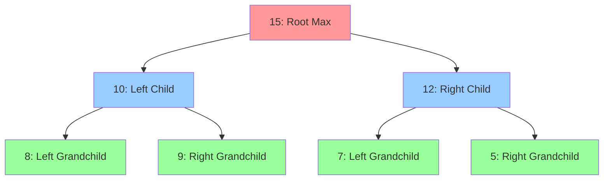

# Key Abstractions: Heap Property, Sift Operations, and Tree Arithmetic

## The Three Pillars of Heap Implementation

Heaps are built on three fundamental abstractions that work together to create an efficient priority data structure:

1. **Heap Property**: The ordering constraint that defines heap structure
2. **Sift Operations**: The algorithms that maintain heap property
3. **Tree Arithmetic**: The index mathematics that enable array-based trees

## 1. The Heap Property: The Invariant

The heap property is an **invariant**—a condition that must always be true for the data structure to function correctly.

### Formal Definition

For a **max-heap** at any node `i`:
```
heap[i] ≥ heap[left_child(i)]
heap[i] ≥ heap[right_child(i)]
```

For a **min-heap** at any node `i`:
```
heap[i] ≤ heap[left_child(i)]
heap[i] ≤ heap[right_child(i)]
```

### Visual Representation



### Property Verification

```rust
fn verify_max_heap_property(heap: &[i32], index: usize) -> bool {
    let left_child = 2 * index + 1;
    let right_child = 2 * index + 2;
    
    // Check left child
    if left_child < heap.len() && heap[index] < heap[left_child] {
        return false;
    }
    
    // Check right child  
    if right_child < heap.len() && heap[index] < heap[right_child] {
        return false;
    }
    
    true
}
```

## 2. Sift Operations: The Maintenance Algorithms

Sift operations are the core algorithms that restore heap property when it's violated.

### Sift-Up (Bubble-Up): Upward Restoration

Used when a child becomes larger than its parent (max-heap case).

#### Algorithm
```rust
fn sift_up(heap: &mut [i32], mut index: usize) {
    while index > 0 {
        let parent_index = (index - 1) / 2;
        
        // If heap property is satisfied, we're done
        if heap[parent_index] >= heap[index] {
            break;
        }
        
        // Swap with parent and continue
        heap.swap(parent_index, index);
        index = parent_index;
    }
}
```

#### Step-by-Step Example

```
Insert 20 into heap [15, 10, 12, 8, 9, 7, 5]:

Step 1: Add to end
[15, 10, 12, 8, 9, 7, 5, 20]
                           ↑
                      index=7

Step 2: Compare with parent (index 3: value 8)
20 > 8, so swap:
[15, 10, 12, 20, 9, 7, 5, 8]
             ↑
         index=3

Step 3: Compare with parent (index 1: value 10)  
20 > 10, so swap:
[15, 20, 12, 10, 9, 7, 5, 8]
     ↑
 index=1

Step 4: Compare with parent (index 0: value 15)
20 > 15, so swap:
[20, 15, 12, 10, 9, 7, 5, 8]
 ↑
index=0 (root - done!)
```

### Sift-Down (Heapify): Downward Restoration

Used when a parent becomes smaller than its children (max-heap case).

#### Algorithm
```rust
fn sift_down(heap: &mut [i32], mut index: usize) {
    let len = heap.len();
    
    loop {
        let left_child = 2 * index + 1;
        let right_child = 2 * index + 2;
        let mut largest = index;
        
        // Find the largest among parent and children
        if left_child < len && heap[left_child] > heap[largest] {
            largest = left_child;
        }
        
        if right_child < len && heap[right_child] > heap[largest] {
            largest = right_child;
        }
        
        // If parent is largest, heap property is satisfied
        if largest == index {
            break;
        }
        
        // Swap with larger child and continue
        heap.swap(index, largest);
        index = largest;
    }
}
```

#### Step-by-Step Example

```
Remove root from heap [20, 15, 12, 10, 9, 7, 5]:

Step 1: Replace root with last element, remove last
[5, 15, 12, 10, 9, 7]
 ↑
index=0

Step 2: Compare with children (15, 12)
Largest child is 15, and 5 < 15, so swap:
[15, 5, 12, 10, 9, 7]
     ↑
 index=1

Step 3: Compare with children (10, 9)  
Largest child is 10, and 5 < 10, so swap:
[15, 10, 12, 5, 9, 7]
             ↑
         index=3

Step 4: No children (leaf node), done!
```

## 3. Tree Arithmetic: Index Mathematics

The elegance of heaps comes from representing a tree structure using simple array indices and arithmetic.

### Index Relationships

For any element at index `i`:

```rust
// Parent index (for i > 0)
fn parent(i: usize) -> usize {
    (i - 1) / 2
}

// Left child index
fn left_child(i: usize) -> usize {
    2 * i + 1
}

// Right child index  
fn right_child(i: usize) -> usize {
    2 * i + 2
}

// Check if node has children
fn has_left_child(i: usize, len: usize) -> bool {
    left_child(i) < len
}

fn has_right_child(i: usize, len: usize) -> bool {
    right_child(i) < len
}
```

### Index Mapping Visualization

```
Array: [A, B, C, D, E, F, G]
Index:  0  1  2  3  4  5  6

Tree representation:
        A(0)
       /    \
    B(1)    C(2)
   /  \     /  \
 D(3) E(4) F(5) G(6)

Relationships:
- A's children: B(1), C(2) → indices 1, 2
- B's children: D(3), E(4) → indices 3, 4  
- C's children: F(5), G(6) → indices 5, 6
- D's parent: B(1) → index (3-1)/2 = 1
```

### Why This Arithmetic Works

The magic comes from **complete binary tree** properties:

#### Level-by-Level Layout
```
Level 0: 1 node  (indices 0)
Level 1: 2 nodes (indices 1-2)  
Level 2: 4 nodes (indices 3-6)
Level 3: 8 nodes (indices 7-14)
...
Level k: 2^k nodes
```

#### Mathematical Properties
```
For node at index i:
- Level = ⌊log₂(i+1)⌋
- Left child = 2i + 1 (next level, first available)
- Right child = 2i + 2 (next level, second available)  
- Parent = ⌊(i-1)/2⌋ (previous level, responsible node)
```

### Complete Binary Tree Invariant

The **complete** property ensures efficient array utilization:

```rust
fn is_complete_binary_tree(len: usize) -> bool {
    // A complete binary tree with n nodes uses indices 0 to n-1
    // with no gaps in the array
    true // Array representation guarantees this!
}

fn height(len: usize) -> usize {
    if len == 0 { 0 } else { (len as f64).log2().floor() as usize }
}

fn max_nodes_at_height(h: usize) -> usize {
    2_usize.pow(h as u32)
}
```

## Combining the Abstractions: Core Operations

### Insert Operation

```rust
fn insert(heap: &mut Vec<i32>, value: i32) {
    // Step 1: Add to end (maintains complete tree property)
    heap.push(value);
    
    // Step 2: Restore heap property with sift-up
    let last_index = heap.len() - 1;
    sift_up(heap, last_index);
}
```

### Extract-Max Operation

```rust
fn extract_max(heap: &mut Vec<i32>) -> Option<i32> {
    if heap.is_empty() {
        return None;
    }
    
    if heap.len() == 1 {
        return heap.pop();
    }
    
    // Step 1: Save the maximum (root)
    let max_value = heap[0];
    
    // Step 2: Replace root with last element
    heap[0] = heap.pop().unwrap();
    
    // Step 3: Restore heap property with sift-down
    sift_down(heap, 0);
    
    Some(max_value)
}
```

### Build Heap (Heapify Array)

```rust
fn build_heap(arr: &mut [i32]) {
    let len = arr.len();
    
    // Start from last non-leaf node and sift down
    for i in (0..len/2).rev() {
        sift_down(arr, i);
    }
}
```

## Advanced Abstractions

### Heap Decorators: Custom Priorities

```rust
#[derive(Debug)]
struct PriorityItem<T> {
    value: T,
    priority: i32,
}

impl<T> PartialOrd for PriorityItem<T> {
    fn partial_cmp(&self, other: &Self) -> Option<std::cmp::Ordering> {
        self.priority.partial_cmp(&other.priority)
    }
}

impl<T> Ord for PriorityItem<T> {
    fn cmp(&self, other: &Self) -> std::cmp::Ordering {
        self.priority.cmp(&other.priority)
    }
}
```

### Index Mapping for Different Tree Types

```rust
// Binary heap (d=2)
fn binary_parent(i: usize) -> usize { (i - 1) / 2 }
fn binary_child(i: usize, child_num: usize) -> usize { 2 * i + 1 + child_num }

// D-ary heap (d children per node)
fn d_ary_parent(i: usize, d: usize) -> usize { (i - 1) / d }
fn d_ary_child(i: usize, d: usize, child_num: usize) -> usize { d * i + 1 + child_num }

// Ternary heap (d=3)
fn ternary_parent(i: usize) -> usize { (i - 1) / 3 }
fn ternary_child(i: usize, child_num: usize) -> usize { 3 * i + 1 + child_num }
```

## Performance Analysis Through Abstractions

### Time Complexity
- **Sift-up/Sift-down**: O(log n) - height of complete binary tree
- **Insert**: O(log n) - sift-up operation
- **Extract**: O(log n) - sift-down operation
- **Build heap**: O(n) - mathematical proof using level analysis

### Space Complexity
- **Storage**: O(n) - just the array
- **Auxiliary**: O(1) - no additional data structures needed

### Cache Performance
- **Sequential access**: Array layout provides excellent cache locality
- **Predictable patterns**: Parent/child calculations are branch-free
- **Memory efficiency**: No pointer overhead

## Mental Models for the Abstractions

### The Restoration Metaphor

Think of sift operations as **restoring order** after disruption:
- **Sift-up**: Someone got promoted beyond their level, bubble them up to where they belong
- **Sift-down**: Someone lost their qualification, demote them to appropriate level

### The Address System Metaphor

Think of tree arithmetic as a **postal address system**:
- **Position determines address**: Array index is like house number
- **Neighborhood relationships**: Arithmetic determines who lives nearby (parent/children)
- **Systematic layout**: Complete tree ensures no gaps in the neighborhood

## Key Insights

1. **Heap property** provides the **ordering constraint** without full sorting
2. **Sift operations** provide **local repair** mechanisms that are globally sufficient  
3. **Tree arithmetic** provides **efficient navigation** without explicit pointers
4. **Complete tree structure** ensures **balanced performance** and **optimal array usage**

These abstractions work together to create a data structure that's both conceptually simple and highly efficient, making heaps one of the most elegant solutions in computer science.

The next section shows how to implement these abstractions in practice by building a priority queue from scratch.