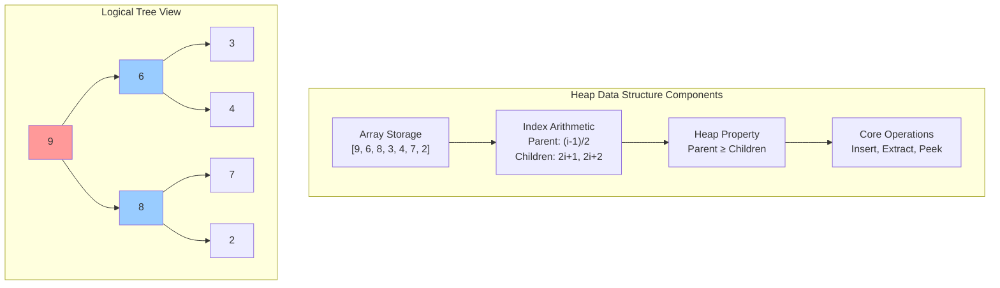
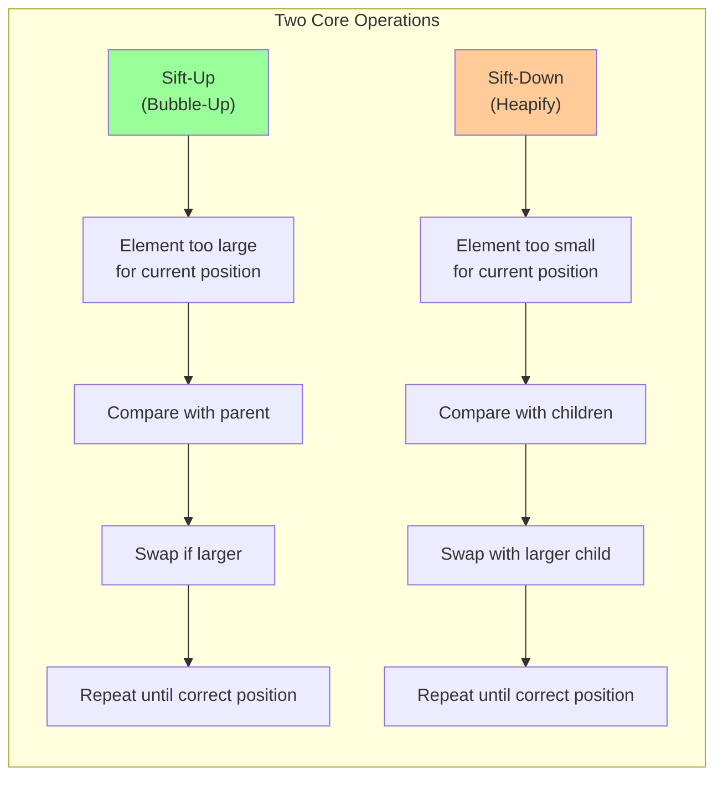
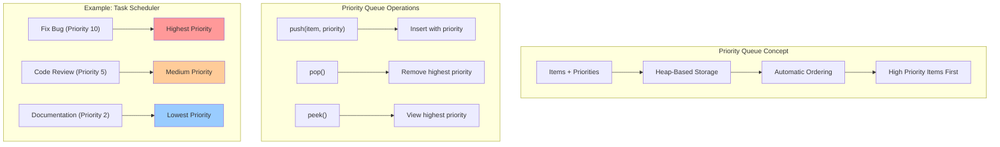
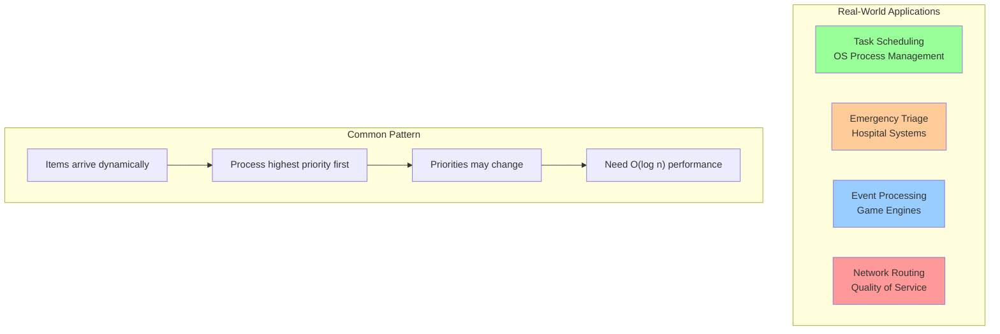

# Building a Priority Queue: From Theory to Practice

This guide walks you through implementing a complete priority queue using heaps, showing each operation step by step with visual examples and working code.

## Prerequisites

Basic understanding of:
- Arrays and indexing
- Basic comparison operations
- Tree concepts (parent, child relationships)

## Step 1: Basic Heap Structure



Let's start with a simple max-heap implementation:

```python
class MaxHeap:
    def __init__(self):
        self.heap = []
    
    def size(self):
        return len(self.heap)
    
    def is_empty(self):
        return len(self.heap) == 0
    
    def peek(self):
        """Return the maximum element without removing it."""
        if self.is_empty():
            raise IndexError("Heap is empty")
        return self.heap[0]
    
    # Helper methods for tree navigation
    def _parent_index(self, index):
        return (index - 1) // 2
    
    def _left_child_index(self, index):
        return 2 * index + 1
    
    def _right_child_index(self, index):
        return 2 * index + 2
    
    def _has_parent(self, index):
        return self._parent_index(index) >= 0
    
    def _has_left_child(self, index):
        return self._left_child_index(index) < len(self.heap)
    
    def _has_right_child(self, index):
        return self._right_child_index(index) < len(self.heap)
```

## Step 2: Understanding Sift Operations



### Sift-Up (Bubble-Up) Implementation

```python
def _sift_up(self, index):
    """Move element up until heap property is satisfied."""
    while (self._has_parent(index) and 
           self.heap[self._parent_index(index)] < self.heap[index]):
        
        # Swap with parent
        parent_idx = self._parent_index(index)
        self.heap[index], self.heap[parent_idx] = \
            self.heap[parent_idx], self.heap[index]
        
        # Move up to parent position
        index = parent_idx
```

### Visualizing Sift-Up

```python
def insert_with_trace(self, value):
    """Insert value and show each step of sift-up."""
    print(f"Inserting {value}")
    print(f"Before: {self.heap}")
    
    # Step 1: Add to end
    self.heap.append(value)
    index = len(self.heap) - 1
    print(f"Added at index {index}: {self.heap}")
    
    # Step 2: Sift up with visualization
    step = 1
    while (self._has_parent(index) and 
           self.heap[self._parent_index(index)] < self.heap[index]):
        
        parent_idx = self._parent_index(index)
        parent_val = self.heap[parent_idx]
        
        print(f"Step {step}: Compare {value} at index {index} with parent {parent_val} at index {parent_idx}")
        print(f"         {value} > {parent_val}, so swap")
        
        # Swap
        self.heap[index], self.heap[parent_idx] = \
            self.heap[parent_idx], self.heap[index]
        
        index = parent_idx
        print(f"         After swap: {self.heap}")
        step += 1
    
    print(f"Final: {self.heap}")
    print()
```

### Sift-Down (Heapify) Implementation

```python
def _sift_down(self, index):
    """Move element down until heap property is satisfied."""
    while self._has_left_child(index):
        # Find the larger child
        larger_child_idx = self._left_child_index(index)
        
        if (self._has_right_child(index) and 
            self.heap[self._right_child_index(index)] > 
            self.heap[larger_child_idx]):
            larger_child_idx = self._right_child_index(index)
        
        # If heap property is satisfied, we're done
        if self.heap[index] >= self.heap[larger_child_idx]:
            break
        
        # Swap with larger child
        self.heap[index], self.heap[larger_child_idx] = \
            self.heap[larger_child_idx], self.heap[index]
        
        # Move down to child position
        index = larger_child_idx
```

### Visualizing Sift-Down

```python
def extract_max_with_trace(self):
    """Extract maximum and show each step of sift-down."""
    if self.is_empty():
        raise IndexError("Heap is empty")
    
    print("Extracting maximum")
    print(f"Before: {self.heap}")
    
    # Step 1: Save max and replace with last element
    max_val = self.heap[0]
    last_val = self.heap.pop()
    
    if self.is_empty():
        print(f"Extracted {max_val}, heap now empty")
        return max_val
    
    self.heap[0] = last_val
    print(f"Replaced root with last element {last_val}: {self.heap}")
    
    # Step 2: Sift down with visualization
    index = 0
    step = 1
    
    while self._has_left_child(index):
        left_idx = self._left_child_index(index)
        right_idx = self._right_child_index(index)
        
        # Find larger child
        larger_child_idx = left_idx
        if (self._has_right_child(index) and 
            self.heap[right_idx] > self.heap[left_idx]):
            larger_child_idx = right_idx
        
        larger_child_val = self.heap[larger_child_idx]
        current_val = self.heap[index]
        
        print(f"Step {step}: Compare {current_val} at index {index} with larger child {larger_child_val} at index {larger_child_idx}")
        
        # If heap property is satisfied, we're done
        if current_val >= larger_child_val:
            print(f"         {current_val} >= {larger_child_val}, heap property satisfied")
            break
        
        print(f"         {current_val} < {larger_child_val}, so swap")
        
        # Swap with larger child
        self.heap[index], self.heap[larger_child_idx] = \
            self.heap[larger_child_idx], self.heap[index]
        
        index = larger_child_idx
        print(f"         After swap: {self.heap}")
        step += 1
    
    print(f"Final: {self.heap}")
    print(f"Extracted: {max_val}")
    print()
    return max_val
```

## Step 3: Complete MaxHeap Implementation

```python
class MaxHeap:
    def __init__(self, initial_data=None):
        if initial_data:
            self.heap = initial_data.copy()
            self._build_heap()
        else:
            self.heap = []
    
    def insert(self, value):
        """Insert a new value into the heap."""
        self.heap.append(value)
        self._sift_up(len(self.heap) - 1)
    
    def extract_max(self):
        """Remove and return the maximum element."""
        if self.is_empty():
            raise IndexError("Heap is empty")
        
        if len(self.heap) == 1:
            return self.heap.pop()
        
        # Save max, replace with last element, then sift down
        max_val = self.heap[0]
        self.heap[0] = self.heap.pop()
        self._sift_down(0)
        return max_val
    
    def peek(self):
        """Return the maximum element without removing it."""
        if self.is_empty():
            raise IndexError("Heap is empty")
        return self.heap[0]
    
    def size(self):
        return len(self.heap)
    
    def is_empty(self):
        return len(self.heap) == 0
    
    def _build_heap(self):
        """Convert array to heap in O(n) time."""
        # Start from last non-leaf node and sift down
        for i in range(len(self.heap) // 2 - 1, -1, -1):
            self._sift_down(i)
    
    def _sift_up(self, index):
        while (self._has_parent(index) and 
               self.heap[self._parent_index(index)] < self.heap[index]):
            parent_idx = self._parent_index(index)
            self.heap[index], self.heap[parent_idx] = \
                self.heap[parent_idx], self.heap[index]
            index = parent_idx
    
    def _sift_down(self, index):
        while self._has_left_child(index):
            larger_child_idx = self._left_child_index(index)
            
            if (self._has_right_child(index) and 
                self.heap[self._right_child_index(index)] > 
                self.heap[larger_child_idx]):
                larger_child_idx = self._right_child_index(index)
            
            if self.heap[index] >= self.heap[larger_child_idx]:
                break
            
            self.heap[index], self.heap[larger_child_idx] = \
                self.heap[larger_child_idx], self.heap[index]
            index = larger_child_idx
    
    # Helper methods
    def _parent_index(self, index):
        return (index - 1) // 2
    
    def _left_child_index(self, index):
        return 2 * index + 1
    
    def _right_child_index(self, index):
        return 2 * index + 2
    
    def _has_parent(self, index):
        return self._parent_index(index) >= 0
    
    def _has_left_child(self, index):
        return self._left_child_index(index) < len(self.heap)
    
    def _has_right_child(self, index):
        return self._right_child_index(index) < len(self.heap)
    
    def __str__(self):
        return f"MaxHeap({self.heap})"
```

## Step 4: Priority Queue Implementation



Now let's build a priority queue that handles items with priorities:

```python
from dataclasses import dataclass
from typing import Any

@dataclass
class PriorityItem:
    priority: int
    item: Any
    
    def __lt__(self, other):
        return self.priority < other.priority
    
    def __le__(self, other):
        return self.priority <= other.priority
    
    def __gt__(self, other):
        return self.priority > other.priority
    
    def __ge__(self, other):
        return self.priority >= other.priority
    
    def __eq__(self, other):
        return self.priority == other.priority

class PriorityQueue:
    def __init__(self, max_priority=True):
        self.max_priority = max_priority
        self.heap = []
    
    def push(self, item, priority):
        """Add an item with given priority."""
        # For min-priority queue, negate the priority
        adjusted_priority = priority if self.max_priority else -priority
        priority_item = PriorityItem(adjusted_priority, item)
        
        self.heap.append(priority_item)
        self._sift_up(len(self.heap) - 1)
    
    def pop(self):
        """Remove and return the highest priority item."""
        if self.is_empty():
            raise IndexError("Priority queue is empty")
        
        if len(self.heap) == 1:
            return self.heap.pop().item
        
        # Extract the highest priority item
        max_item = self.heap[0].item
        self.heap[0] = self.heap.pop()
        self._sift_down(0)
        return max_item
    
    def peek(self):
        """Return the highest priority item without removing it."""
        if self.is_empty():
            raise IndexError("Priority queue is empty")
        return self.heap[0].item
    
    def peek_priority(self):
        """Return the priority of the highest priority item."""
        if self.is_empty():
            raise IndexError("Priority queue is empty")
        priority = self.heap[0].priority
        return priority if self.max_priority else -priority
    
    def is_empty(self):
        return len(self.heap) == 0
    
    def size(self):
        return len(self.heap)
    
    # Copy sift methods from MaxHeap, but compare PriorityItems
    def _sift_up(self, index):
        while (self._has_parent(index) and 
               self.heap[self._parent_index(index)] < self.heap[index]):
            parent_idx = self._parent_index(index)
            self.heap[index], self.heap[parent_idx] = \
                self.heap[parent_idx], self.heap[index]
            index = parent_idx
    
    def _sift_down(self, index):
        while self._has_left_child(index):
            larger_child_idx = self._left_child_index(index)
            
            if (self._has_right_child(index) and 
                self.heap[self._right_child_index(index)] > 
                self.heap[larger_child_idx]):
                larger_child_idx = self._right_child_index(index)
            
            if self.heap[index] >= self.heap[larger_child_idx]:
                break
            
            self.heap[index], self.heap[larger_child_idx] = \
                self.heap[larger_child_idx], self.heap[index]
            index = larger_child_idx
    
    def _parent_index(self, index):
        return (index - 1) // 2
    
    def _left_child_index(self, index):
        return 2 * index + 1
    
    def _right_child_index(self, index):
        return 2 * index + 2
    
    def _has_parent(self, index):
        return self._parent_index(index) >= 0
    
    def _has_left_child(self, index):
        return self._left_child_index(index) < len(self.heap)
    
    def _has_right_child(self, index):
        return self._right_child_index(index) < len(self.heap)
```

## Step 5: Practical Examples



### Example 1: Task Scheduling

```python
def task_scheduling_example():
    # Create a priority queue for task scheduling
    scheduler = PriorityQueue(max_priority=True)
    
    # Add tasks with priorities
    tasks = [
        ("Send email", 3),
        ("Fix critical bug", 10),
        ("Update documentation", 2),
        ("Deploy to production", 9),
        ("Code review", 5),
        ("Team meeting", 4)
    ]
    
    print("Adding tasks to scheduler:")
    for task, priority in tasks:
        scheduler.push(task, priority)
        print(f"  Added: {task} (priority {priority})")
    
    print("\nExecuting tasks in priority order:")
    while not scheduler.is_empty():
        task = scheduler.pop()
        priority = scheduler.peek_priority() if not scheduler.is_empty() else "N/A"
        print(f"  Executing: {task}")
        if not scheduler.is_empty():
            print(f"  Next priority: {priority}")

# Output:
# Adding tasks to scheduler:
#   Added: Send email (priority 3)
#   Added: Fix critical bug (priority 10)
#   Added: Update documentation (priority 2)
#   Added: Deploy to production (priority 9)
#   Added: Code review (priority 5)
#   Added: Team meeting (priority 4)
# 
# Executing tasks in priority order:
#   Executing: Fix critical bug
#   Next priority: 9
#   Executing: Deploy to production
#   Next priority: 5
#   Executing: Code review
#   Next priority: 4
#   Executing: Team meeting
#   Next priority: 3
#   Executing: Send email
#   Next priority: 2
#   Executing: Update documentation
```

### Example 2: Emergency Room Triage

```python
def emergency_room_example():
    # Create min-priority queue (lower numbers = higher priority)
    triage = PriorityQueue(max_priority=False)
    
    # Add patients (priority 1 = critical, 5 = non-urgent)
    patients = [
        ("John Doe - Chest pain", 1),
        ("Jane Smith - Broken arm", 3),
        ("Bob Johnson - Common cold", 5),
        ("Alice Brown - Car accident", 1),
        ("Charlie Wilson - Sprained ankle", 4),
        ("Eva Davis - Severe headache", 2)
    ]
    
    print("Patients arriving at ER:")
    for patient, priority in patients:
        triage.push(patient, priority)
        print(f"  {patient} - Priority {priority}")
    
    print("\nTreatment order:")
    position = 1
    while not triage.is_empty():
        patient = triage.pop()
        print(f"  {position}. {patient}")
        position += 1

# Output:
# Patients arriving at ER:
#   John Doe - Chest pain - Priority 1
#   Jane Smith - Broken arm - Priority 3
#   Bob Johnson - Common cold - Priority 5
#   Alice Brown - Car accident - Priority 1
#   Charlie Wilson - Sprained ankle - Priority 4
#   Eva Davis - Severe headache - Priority 2
# 
# Treatment order:
#   1. John Doe - Chest pain
#   2. Alice Brown - Car accident
#   3. Eva Davis - Severe headache
#   4. Jane Smith - Broken arm
#   5. Charlie Wilson - Sprained ankle
#   6. Bob Johnson - Common cold
```

## Step 6: Testing and Validation

```python
def test_heap_properties():
    """Test that our heap maintains the heap property."""
    
    def verify_max_heap_property(heap_array):
        """Verify that array satisfies max-heap property."""
        for i in range(len(heap_array)):
            left_child = 2 * i + 1
            right_child = 2 * i + 2
            
            if left_child < len(heap_array):
                if heap_array[i] < heap_array[left_child]:
                    return False, f"Parent {heap_array[i]} < left child {heap_array[left_child]} at indices {i}, {left_child}"
            
            if right_child < len(heap_array):
                if heap_array[i] < heap_array[right_child]:
                    return False, f"Parent {heap_array[i]} < right child {heap_array[right_child]} at indices {i}, {right_child}"
        
        return True, "Heap property satisfied"
    
    # Test with random operations
    import random
    heap = MaxHeap()
    
    # Insert random values
    values = [random.randint(1, 100) for _ in range(20)]
    print(f"Inserting values: {values}")
    
    for value in values:
        heap.insert(value)
        is_valid, message = verify_max_heap_property(heap.heap)
        if not is_valid:
            print(f"FAIL after inserting {value}: {message}")
            return
    
    print(f"Heap after insertions: {heap.heap}")
    print("✓ All insertions maintain heap property")
    
    # Extract all values and verify they come out in descending order
    extracted = []
    while not heap.is_empty():
        max_val = heap.extract_max()
        extracted.append(max_val)
        
        if not heap.is_empty():
            is_valid, message = verify_max_heap_property(heap.heap)
            if not is_valid:
                print(f"FAIL after extracting {max_val}: {message}")
                return
    
    print(f"Extracted values: {extracted}")
    print(f"Are extracted values in descending order? {extracted == sorted(extracted, reverse=True)}")
    print("✓ All extractions maintain heap property")

def performance_comparison():
    """Compare heap operations with naive approaches."""
    import time
    import random
    
    # Generate test data
    data = [random.randint(1, 1000) for _ in range(10000)]
    
    # Test 1: Finding maximum repeatedly (heap vs max())
    print("Test 1: Finding maximum 1000 times")
    
    # Heap approach
    heap = MaxHeap(data)
    start_time = time.time()
    for _ in range(1000):
        max_val = heap.peek()
    heap_time = time.time() - start_time
    
    # Naive approach
    data_copy = data.copy()
    start_time = time.time()
    for _ in range(1000):
        max_val = max(data_copy)
    naive_time = time.time() - start_time
    
    print(f"  Heap approach: {heap_time:.4f} seconds")
    print(f"  Naive approach: {naive_time:.4f} seconds")
    print(f"  Speedup: {naive_time/heap_time:.1f}x")
    
    # Test 2: Priority queue operations
    print("\nTest 2: 1000 mixed insert/extract operations")
    
    pq = PriorityQueue()
    start_time = time.time()
    
    for i in range(1000):
        if random.random() < 0.7:  # 70% inserts
            pq.push(f"task_{i}", random.randint(1, 100))
        elif not pq.is_empty():  # 30% extracts
            pq.pop()
    
    heap_pq_time = time.time() - start_time
    print(f"  Priority queue time: {heap_pq_time:.4f} seconds")
    print(f"  Operations per second: {1000/heap_pq_time:.0f}")

if __name__ == "__main__":
    # Run examples
    task_scheduling_example()
    print("\n" + "="*50 + "\n")
    emergency_room_example()
    print("\n" + "="*50 + "\n")
    
    # Run tests
    test_heap_properties()
    print("\n" + "="*50 + "\n")
    performance_comparison()
```

## Key Takeaways

1. **Heap Property**: The fundamental invariant that makes heaps work
2. **Sift Operations**: Local repairs that maintain global heap property  
3. **Array Implementation**: Simple arithmetic enables efficient tree navigation
4. **Priority Queues**: Heaps naturally solve priority-based problems
5. **Performance**: O(log n) operations with excellent cache behavior

## Common Pitfalls

1. **Off-by-one errors**: Remember array is 0-indexed, but tree math assumes this
2. **Empty heap operations**: Always check for empty heap before peek/extract
3. **Comparison direction**: Max-heap uses `>`, min-heap uses `<`
4. **Priority queue direction**: Be clear about whether higher numbers mean higher priority

## Extensions

- **d-ary heaps**: More than 2 children per node
- **Fibonacci heaps**: Better amortized bounds for some operations
- **Indexed priority queues**: Support for changing priorities
- **Persistent heaps**: Immutable versions for functional programming

This implementation gives you a solid foundation for understanding and using heaps in practice. The next section explores why the array representation is so elegant and efficient.