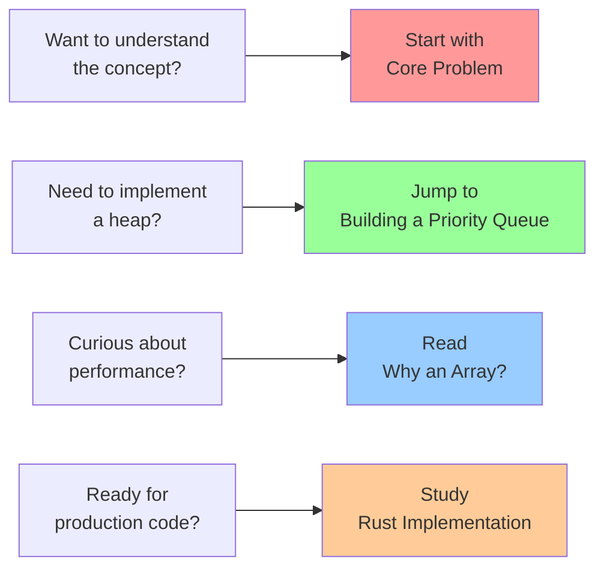

# Heap Data Structures: The Priority Expert

## Summary

Heaps are specialized tree-based data structures that efficiently maintain priority ordering. Unlike fully sorted structures, heaps maintain just enough order to guarantee instant access to the highest (or lowest) priority element. Implemented as arrays with simple arithmetic for navigation, heaps power priority queues, heap sort, and numerous algorithms requiring efficient priority management.

## Table of Contents

1. [The Core Problem](./01-concepts-01-the-core-problem.md) - Dynamic priority access and why sorting isn't enough
2. [The Guiding Philosophy](./01-concepts-02-the-guiding-philosophy.md) - Weak ordering and the heap property
3. [Key Abstractions](./01-concepts-03-key-abstractions.md) - Heap property, sift operations, and tree arithmetic
4. [Building a Priority Queue](./02-guides-01-building-a-priority-queue.md) - Implementing heaps step by step
5. [Why an Array?](./03-deep-dive-01-why-an-array.md) - The elegance of array-based tree representation
6. [Rust Implementation](./04-rust-implementation.md) - Production-ready heap implementations with optimizations

## Quick Start

## Key Takeaways

After completing this tutorial, you'll understand:

- 🎯 **The priority access problem** and why heaps are the optimal solution
- ⚖️ **Weak ordering philosophy** that enables O(log n) operations
- 🧩 **Three core abstractions**: heap property, sift operations, and tree arithmetic
- 🔨 **Practical implementation** from basic heap to production priority queue
- 🧐 **Array representation elegance** and its performance benefits
- ⚙️ **Production-ready code** with error handling and optimizations

## 📈 Next Steps

### 🎯 Recommended Learning Path
**Based on your interests and goals:**

#### For Algorithm Fundamentals
- **Next**: [Sorting: Creating Order from Chaos](../sorting-creating-order-from-chaos/README.md) - Heap sort and comparison with other algorithms
- **Then**: [Graph Traversal: Navigating the Network](../graph-traversal-navigating-the-network/README.md) - Dijkstra's algorithm using heaps
- **Advanced**: [Dynamic Programming: The Memoization Master](../dynamic-programming-the-memoization-master/README.md) - Optimization techniques

#### For Data Structure Mastery
- **Next**: [B-trees](../b-trees/README.md) - Hierarchical data organization beyond heaps
- **Then**: [Segment Trees: The Range Query Specialist](../segment-trees-the-range-query-specialist/README.md) - Advanced tree structures
- **Advanced**: [Fenwick Trees: The Efficient Summation Machine](../fenwick-trees-the-efficient-summation-machine/README.md) - Specialized tree operations

#### For Systems Engineering
- **Next**: [Caching](../caching/README.md) - Priority-based cache eviction strategies
- **Then**: [Message Queues: The Asynchronous Mailbox](../message-queues-the-asynchronous-mailbox/README.md) - Priority queue applications
- **Advanced**: [Rate Limiting: The Traffic Controller](../rate-limiting-the-traffic-controller/README.md) - Priority-based traffic management

### 🔗 Alternative Learning Paths
- **Foundations**: [Trie Structures: The Autocomplete Expert](../trie-structures-the-autocomplete-expert/README.md) - String processing structures
- **Advanced Trees**: [Skip Lists: The Probabilistic Search Tree](../skip-lists-the-probabilistic-search-tree/README.md) - Alternative to balanced trees
- **Graph Algorithms**: [Dijkstra's Algorithm: The Shortest Path Expert](../dijkstras-algorithm-the-shortest-path-expert/README.md) - Priority queue applications

### 📚 Prerequisites for Advanced Topics
- **Prerequisites**: [Data Structures & Algorithms 101](../data-structures-algorithms-101/README.md) ✅ (assumed complete)
- **Difficulty Level**: Beginner → Intermediate
- **Estimated Time**: 1-2 weeks per next tutorial