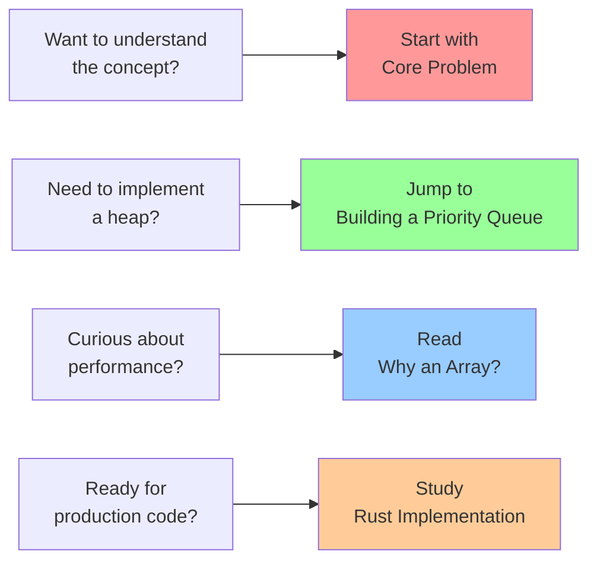

# Heap Data Structures: The Priority Expert

## Summary

Heaps are specialized tree-based data structures that efficiently maintain priority ordering. Unlike fully sorted structures, heaps maintain just enough order to guarantee instant access to the highest (or lowest) priority element. Implemented as arrays with simple arithmetic for navigation, heaps power priority queues, heap sort, and numerous algorithms requiring efficient priority management.

## Table of Contents

1. [The Core Problem](./01-concepts-01-the-core-problem.md) - Dynamic priority access and why sorting isn't enough
2. [The Guiding Philosophy](./01-concepts-02-the-guiding-philosophy.md) - Weak ordering and the heap property
3. [Key Abstractions](./01-concepts-03-key-abstractions.md) - Heap property, sift operations, and tree arithmetic
4. [Building a Priority Queue](./02-guides-01-building-a-priority-queue.md) - Implementing heaps step by step
5. [Why an Array?](./03-deep-dive-01-why-an-array.md) - The elegance of array-based tree representation
6. [Rust Implementation](./04-rust-implementation.md) - Production-ready heap implementations with optimizations

## Quick Start

## Key Takeaways

After completing this tutorial, you'll understand:

- 🎯 **The priority access problem** and why heaps are the optimal solution
- ⚖️ **Weak ordering philosophy** that enables O(log n) operations
- 🧩 **Three core abstractions**: heap property, sift operations, and tree arithmetic
- 🔨 **Practical implementation** from basic heap to production priority queue
- 🧐 **Array representation elegance** and its performance benefits
- ⚙️ **Production-ready code** with error handling and optimizations