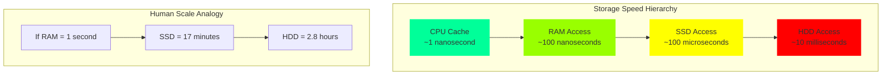
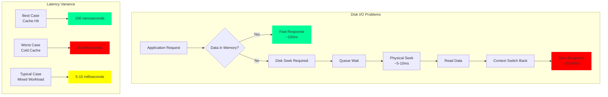
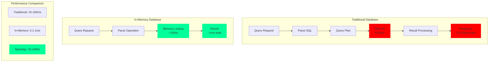
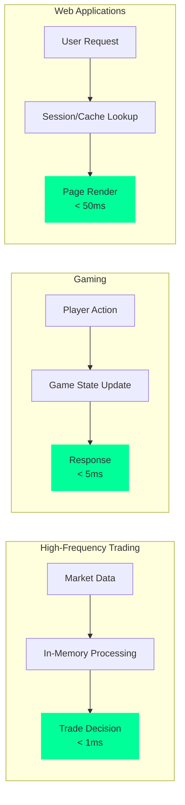

# The Core Problem: Disk is the Enemy of Speed

## The Fundamental Speed Barrier

Imagine you're a surgeon in the middle of a complex operation. You need a specific instrument—do you want your assistant to hand it to you from the tray beside you, or would you prefer they walk to the supply room three floors down? The answer is obvious: proximity to critical resources determines operational speed.

This same principle governs modern computing systems. The speed difference between memory (RAM) and disk storage is not incremental—it's astronomical.

## The Numbers That Matter

Here's the reality of storage performance in terms that make the scale clear:

**The Raw Numbers:**
- **CPU Cache**: ~1 nanosecond 
- **RAM access**: ~100 nanoseconds (0.0001 milliseconds)
- **SSD access**: ~100 microseconds (0.1 milliseconds) 
- **Traditional HDD**: ~10 milliseconds

**Performance Ratios:**
- RAM is **1,000x faster** than SSD
- RAM is **100,000x faster** than HDD
- SSD is **100x faster** than HDD

To put this in human terms: if RAM access took 1 second, an SSD would take 17 minutes, and a traditional hard drive would take 2.8 hours.

## Where This Becomes Critical

### Real-Time Systems
When systems need to respond in microseconds—high-frequency trading, gaming servers, real-time analytics—even a single disk I/O operation can blow your entire response time budget.

### Interactive Applications
Users expect web applications to respond instantly. When you click "search," you don't want to wait for disk seeks. You want results **now**.

### High-Throughput Workloads
Processing millions of transactions per second means every nanosecond counts. Systems like Redis can handle 100,000+ operations per second precisely because they eliminate disk I/O from the critical path.

## The Hidden Costs of Disk I/O

Beyond raw speed, disk I/O introduces other problems:

**The Cascade of Problems:**

- **Unpredictable latency**: Disk operations have high variance—sometimes they're fast (cache hit), sometimes they block for milliseconds (cache miss + disk seek)
- **Context switching overhead**: Waiting for disk often means the CPU switches to other tasks, adding scheduling overhead and losing CPU cache locality
- **Limited concurrency**: Spinning disks can only seek to one location at a time, creating bottlenecks under concurrent load
- **Queue buildup**: Multiple requests waiting for disk create cascading delays
- **Memory pressure**: OS caches compete with application memory, creating complex performance interactions

## The Traditional "Solution" and Its Limits

Operating systems try to solve this with caching—keeping frequently accessed data in RAM. But this creates a new problem: cache misses. When the data you need isn't cached, you're back to disk speeds.

Think of it like having a small desk (cache) next to a huge filing cabinet (disk). If what you need is on your desk, great. If not, you're walking to the filing cabinet.

## Why In-Memory Storage Changes Everything

In-memory storage systems eliminate the fundamental problem: they keep all data in RAM, all the time. No cache misses. No disk seeks. No waiting.

It's like having every document you might need spread out on a massive desk. Finding anything takes the same small amount of time, every time.

## The Real-World Impact

Systems that embrace this approach achieve transformative performance:

**Transformative Performance Characteristics:**

- **Sub-millisecond response times** for complex queries (vs. 10-100ms for disk-based)
- **Linear scalability** without I/O bottlenecks constraining throughput
- **Predictable performance** under load—no cache misses causing latency spikes
- **Higher concurrency** support due to elimination of disk contention
- **Better user experience** with instant feedback loops

**Real-World Success Stories:**

**The Economic Reality:**

The cost? Memory is expensive and volatile. But for many applications, this trade-off—paying more for hardware to gain orders of magnitude in performance—is not just worthwhile, it's essential for competitive advantage.

**Cost-Benefit Analysis:**
- **Memory cost**: ~$10-50 per GB
- **Performance gain**: 10-1000x faster operations
- **Revenue impact**: Milliseconds can mean millions in competitive industries
- **User experience**: Instant responses vs. waiting indicators

Understanding this fundamental speed barrier is the first step toward building systems that truly perform at the speed of thought.