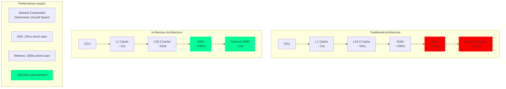
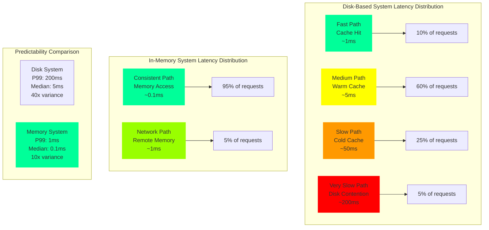

# The Guiding Philosophy: Trading Durability for Speed

## The Core Trade-off

Every engineering decision involves trade-offs. In-memory storage makes one of the most dramatic trades in computer science: it sacrifices the durability and vast capacity of disk storage for the raw, uncompromising speed of memory access.

This isn't a compromise—it's a conscious choice to optimize for one dimension at the expense of others.

## Speed Above All

The philosophy is simple: **eliminate the slowest component from the critical path**. In most systems, that component is disk I/O.



**The Architectural Transformation:**

Traditional systems follow this hierarchy:
```
CPU → Cache → RAM → Disk → Network Storage
```

In-memory systems compress this to:
```
CPU → Cache → RAM → Network RAM
```

By removing mechanical storage from the equation entirely, we eliminate the primary source of latency variance and achieve predictable, blazing-fast performance. The slowest component in the chain now operates at memory speeds, not disk speeds.

## The Memory-First Mindset

This philosophy requires a fundamental shift in how we think about data:

### From "Store Everything" to "Store What Matters"
Traditional databases try to be universal—they'll store any amount of data you throw at them. In-memory systems force you to be selective. You keep what you need for speed and let everything else live elsewhere.

### From "Optimize for Space" to "Optimize for Time"
Disk storage encourages compression, normalization, and space-efficient representations. Memory storage encourages denormalization, redundancy, and time-efficient representations.

### From "Eventually Consistent" to "Immediately Available"
When data lives in memory, you can afford to keep multiple copies, pre-computed aggregations, and denormalized views because space is limited but access is instant.

## The Tolerance for Volatility

Perhaps the most crucial philosophical shift is accepting volatility. Traditional systems treat data persistence as sacred—data written must never be lost. In-memory systems embrace a different model:

**Data in motion is more valuable than data at rest.**

This doesn't mean abandoning durability entirely, but it means being strategic about it. Critical data still gets persisted, but through careful design, not automatic writes to disk for every operation.

## The Predictability Principle

One of the most underappreciated benefits of in-memory storage is performance predictability. 



**Why Disk I/O is Inherently Unpredictable:**
- **Cache hits are fast, misses are slow** - creates bimodal distribution
- **Disk contention creates variable latency** - multiple processes competing
- **Background processes introduce jitter** - OS maintenance, garbage collection
- **Physical seek times vary** - depends on disk head position
- **Queue depths fluctuate** - requests pile up during peak load

**Why Memory Access is Remarkably Consistent:**
- **Uniform access patterns** - no seek time variance
- **Predictable cache behavior** - CPU caches are fast and consistent
- **No mechanical delays** - purely electronic operations
- **Controlled concurrency** - software-managed access patterns

The 99th percentile latency in memory systems is often very close to the median latency. This predictability is often more valuable than raw speed for user-facing applications.

## Designing for Memory Patterns

This philosophy extends to how we structure data and algorithms:

### Prefer Sequential Access
Memory is fastest when accessed sequentially. This favors array-like structures over pointer-heavy tree structures.

### Embrace Data Locality
Keep related data physically close in memory. This maximizes cache efficiency and minimizes memory bus traffic.

### Accept Redundancy
In disk-based systems, normalization saves space. In memory systems, denormalization saves time. Store the same data in multiple formats if it enables faster access patterns.

## The Economic Model

The philosophy also requires rethinking economics:

- **Memory costs more per byte** than disk storage
- **But memory reduces operational costs** through simplified architecture and faster response times
- **The total cost of ownership often favors memory** when you factor in the value of speed

## When This Philosophy Applies

This approach isn't universally applicable. It works best when:

- **Latency is more important than cost** (real-time systems, financial trading)
- **Working set fits in available memory** (even if total data doesn't)
- **Read patterns are predictable** (caching, session storage)
- **Temporary data has high value** (analytics, search indexes)

## The Modern Reality

Today's servers can have terabytes of RAM. What seemed impossible a decade ago—keeping entire databases in memory—is now routine. The philosophy that seemed extreme has become practical.

This philosophical shift—from storage-centric to speed-centric design—underlies the success of systems like Redis, Memcached, and countless in-memory analytics platforms. It's not just about technology; it's about fundamentally rethinking what data storage should optimize for in a world where memory is abundant and speed is everything.