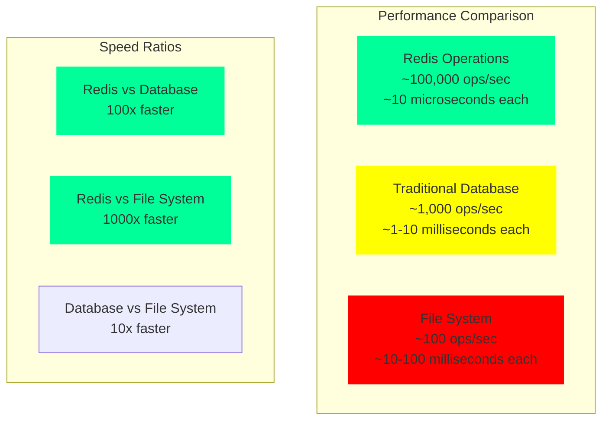

# Getting Started: Your First In-Memory Database

This guide will walk you through setting up Redis—the most popular in-memory database—and demonstrate the speed difference that makes it so compelling.

## Prerequisites

- A computer with terminal access (Linux, macOS, or Windows with WSL)
- Basic familiarity with command-line operations
- 5 minutes of your time

## Installation

### macOS (using Homebrew)
```bash
brew install redis
```

### Ubuntu/Debian
```bash
sudo apt update
sudo apt install redis-server
```

### Windows (using WSL or Docker)
```bash
# Using Docker (recommended for Windows)
docker run -d --name redis-demo -p 6379:6379 redis:latest
```

## Starting Redis

```bash
# Start the Redis server
redis-server

# In another terminal, start the Redis client
redis-cli
```

You should see:
```
127.0.0.1:6379>
```

## Your First Speed Test

Let's demonstrate the speed difference between in-memory and disk-based operations.

### Basic Operations
```bash
# Set a key-value pair
127.0.0.1:6379> SET user:1 "Alice"
OK

# Get the value back
127.0.0.1:6379> GET user:1
"Alice"

# Check how long this took
127.0.0.1:6379> SET user:2 "Bob"
OK
```

### Measuring Performance

Let's run a simple benchmark to see Redis in action:

```bash
# Benchmark 10,000 SET operations
redis-benchmark -t set -n 10000 -q
SET: 71428.57 requests per second

# Benchmark 10,000 GET operations  
redis-benchmark -t get -n 10000 -q
GET: 76923.08 requests per second

# More comprehensive benchmark
redis-benchmark -t ping,set,get,incr,lpush,rpush,lpop,rpop -n 100000 -q
PING_INLINE: 140845.07 requests per second
PING_BULK: 142857.14 requests per second
SET: 125000.00 requests per second
GET: 140845.07 requests per second
INCR: 140845.07 requests per second
LPUSH: 131578.95 requests per second
RPUSH: 140845.07 requests per second
LPOP: 140845.07 requests per second
RPOP: 131578.95 requests per second
```



**Breaking Down These Numbers:**
- **70,000+ operations per second** = **14 microseconds per operation**
- Compare this to a typical database query: **1-10 milliseconds**
- Redis is roughly **100-1000x faster** for simple operations
- **Consistent performance** - notice how all operations are in the same order of magnitude

## Understanding What Just Happened

### The Magic of Memory
Every operation you just performed happened entirely in RAM:
1. Your command went to Redis over a network socket
2. Redis looked up the key in its in-memory hash table
3. Redis returned the result immediately—no disk I/O

### The Speed Comparison
Let's contrast this with a traditional database:

```bash
# Simulate a traditional database operation
time sqlite3 test.db "CREATE TABLE IF NOT EXISTS users(id INTEGER, name TEXT); INSERT INTO users VALUES(1, 'Alice');"

# vs Redis
time redis-cli SET user:1 "Alice"
```

The Redis operation completes in microseconds while the SQLite operation takes milliseconds.

## Practical Examples

### Caching Expensive Computations
```bash
# Simulate storing the result of an expensive calculation
127.0.0.1:6379> SET expensive_computation "result_of_complex_calculation" EX 3600
OK

# The EX 3600 means this will expire in 1 hour
# Check the TTL (time to live)
127.0.0.1:6379> TTL expensive_computation
(integer) 3599
```

### Session Storage
```bash
# Store user session data
127.0.0.1:6379> HSET session:abc123 user_id 42 username "alice" last_seen "2024-01-15"
(integer) 3

# Retrieve session data
127.0.0.1:6379> HGETALL session:abc123
1) "user_id"
2) "42"
3) "username"
4) "alice"
5) "last_seen"
6) "2024-01-15"
```

### Real-time Counters
```bash
# Track page views
127.0.0.1:6379> INCR page:home:views
(integer) 1

127.0.0.1:6379> INCR page:home:views
(integer) 2

# Get current count
127.0.0.1:6379> GET page:home:views
"2"
```

## The Instant Feedback Loop

What you're experiencing is the instant feedback loop that makes in-memory storage so addictive for developers:

1. **Think of an operation** → Type command
2. **Execute instantly** → See result immediately  
3. **No waiting** → No coffee breaks during queries

This immediate responsiveness changes how you think about data operations. Complex queries that would take seconds in traditional databases complete in milliseconds.

## Data Types Showcase

Redis supports multiple data types, all stored in memory:

```bash
# Strings
127.0.0.1:6379> SET temperature "23.5"

# Lists (like arrays)
127.0.0.1:6379> LPUSH recent_visitors "alice" "bob" "charlie"
127.0.0.1:6379> LRANGE recent_visitors 0 -1
1) "charlie"
2) "bob" 
3) "alice"

# Sets (unique items)
127.0.0.1:6379> SADD unique_countries "USA" "Canada" "Mexico" "USA"
127.0.0.1:6379> SMEMBERS unique_countries
1) "Mexico"
2) "Canada"
3) "USA"

# Sorted sets (ranked data)
127.0.0.1:6379> ZADD leaderboard 100 "alice" 85 "bob" 92 "charlie"
127.0.0.1:6379> ZREVRANGE leaderboard 0 -1 WITHSCORES
1) "alice"
2) "100"
3) "charlie"  
4) "92"
5) "bob"
6) "85"
```

## Memory Usage Monitoring

Check how much memory Redis is using:

```bash
127.0.0.1:6379> INFO memory
# Memory
used_memory:1026944
used_memory_human:1002.88K
used_memory_rss:7999488
used_memory_rss_human:7.63M
```

## What's Next?

You've just experienced the fundamental appeal of in-memory storage:
- **Instant operations** that complete in microseconds
- **Simple data model** that's easy to understand  
- **Predictable performance** under load
- **Rich data types** beyond simple key-value

In the next sections, we'll explore how to handle the persistence challenge and dive deep into the trade-offs that make this speed possible.

For now, try experimenting with the commands above. Notice how every operation feels immediate—that's the power of keeping your data in memory.