# The Core Problem: Finding Needles in Haystacks

Imagine you're looking for a specific book in a massive library. Without any organization system, you'd have to walk through every single aisle, check every shelf, and examine every book until you find the one you need. This exhausting process is exactly what happens when a database searches through a table without an index.

## The Linear Search Nightmare

When you run a query like `SELECT * FROM users WHERE email = 'jane@example.com'` on a table with millions of rows, here's what happens without an index:

```mermaid
sequenceDiagram
    participant Q as Query Engine
    participant T as Table Scanner
    participant D as Disk Storage
    
    Q->>T: Find email = 'jane@example.com'
    T->>D: Read Row 1
    D-->>T: email = 'alice@example.com' ❌
    T->>D: Read Row 2
    D-->>T: email = 'bob@example.com' ❌
    T->>D: Read Row 3
    D-->>T: email = 'charlie@example.com' ❌
    Note over T,D: Continue for 847,290 more rows...
    T->>D: Read Row 847,293
    D-->>T: email = 'jane@example.com' ✅
    T->>Q: Found it! (After 847,293 checks)
```

1. **Start at row 1**: Check if `email = 'jane@example.com'`
2. **Move to row 2**: Check if `email = 'jane@example.com'`
3. **Continue to row 3, 4, 5...**: Keep checking every single row
4. **Maybe find it at row 847,293**: Finally! But you've already read 847,292 unnecessary rows
5. **Or maybe it's the last row**: In the worst case, you scan the entire table

This is called a **full table scan**, and it's brutally inefficient. The time complexity is O(n) - as your table grows, search time grows proportionally.

```mermaid
graph LR
    A[Table Size] --> B[1,000 rows → 1ms]
    A --> C[10,000 rows → 10ms]
    A --> D[100,000 rows → 100ms]
    A --> E[1,000,000 rows → 1 second]
    A --> F[10,000,000 rows → 10 seconds]
    
    style F fill:#ff9999
```

## Why This Matters

Consider the real-world impact:

**Resource consumption breakdown**:

Each row examination involves:
- **Reading data from storage** (potentially slow disk I/O) - 60% of time
- **Loading the row into memory** - 25% of time
- **Comparing the target column value** - 10% of time
- **Moving to the next row** - 5% of time

**Scaling problems**:

For a busy application with thousands of queries per second, this becomes unsustainable quickly.

## The Fundamental Trade-off

The core problem isn't just about speed - it's about the fundamental tension in data storage:

**Storage Order vs. Query Patterns**

```mermaid
flowchart LR
    subgraph "How Data is Stored"
        A1[By Insertion Order]
        A2[By Primary Key]
        A3[Sequential on Disk]
    end
    
    subgraph "How Data is Queried"
        B1[By Email Address]
        B2[By Customer Name]
        B3[By Date Range]
        B4[By Status]
    end
    
    A1 --> C[❌ Mismatch]
    A2 --> C
    A3 --> C
    B1 --> C
    B2 --> C
    B3 --> C
    B4 --> C
    
    C --> D[Every query becomes linear search]
    
    style C fill:#ff9999
    style D fill:#ff9999
```

- Data is typically stored in the order it was inserted (or by primary key)
- But queries often search by completely different columns
- There's no way to physically organize data to optimize for all possible query patterns simultaneously

**The impossibility of perfect organization**:

This mismatch between storage order and access patterns is what makes indexing necessary. Without indexes, every non-primary-key query becomes a needle-in-a-haystack problem.

## The Real-World Analogy

Think of a phone book (remember those?). It's organized alphabetically by last name, making it incredibly fast to find "Smith, John." But what if you need to find everyone who lives on "Oak Street"? You'd have to flip through every single page, reading every address - exactly like a full table scan.

An index is like having a separate mini-phone book organized by street address, where each entry points you to the page number in the original phone book. Now finding all Oak Street residents becomes instant.

This simple analogy captures the essence of database indexing: create a sorted shortcut that points to the real data.