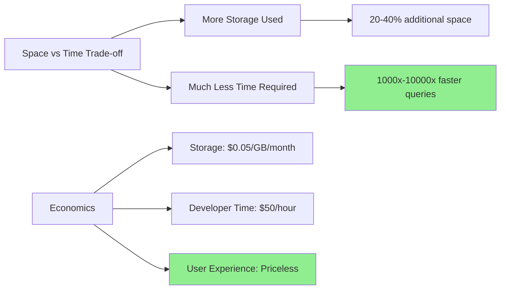
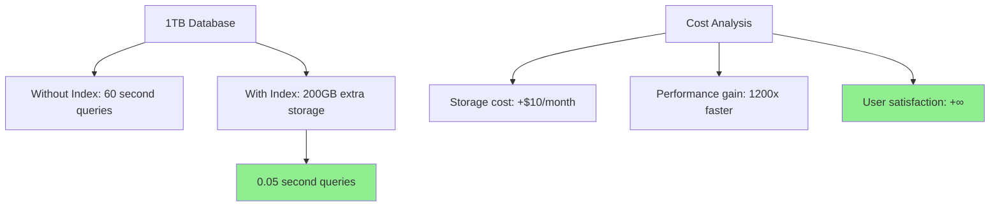
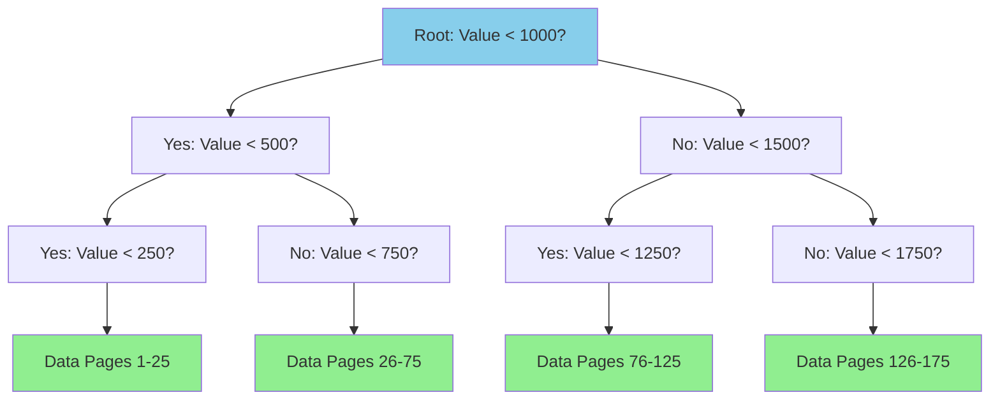
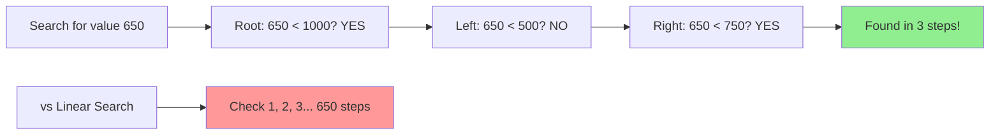
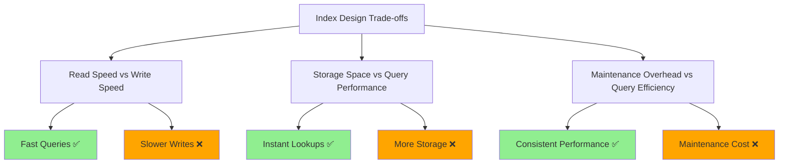
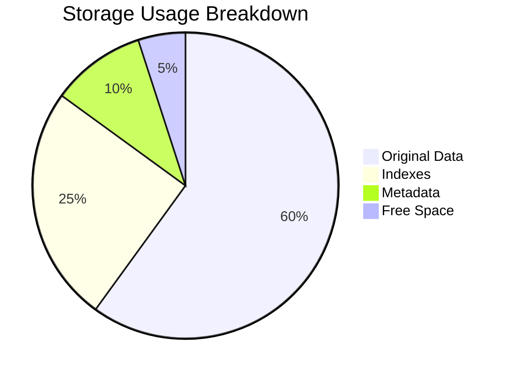

# The Guiding Philosophy: Building Smart Shortcuts

The philosophy behind database indexing is elegantly simple: **create a separate, sorted data structure that acts as a roadmap to your actual data**. Instead of searching through the haystack, we build a map that tells us exactly where each needle is located.

```mermaid
graph TD
    A[Database Indexing Philosophy] --> B[Build Smart Shortcuts]
    B --> C[Separate Sorted Structure]
    C --> D[Roadmap to Data]
    
    E[Haystack Problem] --> F[Search Every Item]
    F --> G[O(n) Linear Time]
    
    H[Index Solution] --> I[Consult Map First]
    I --> J[Direct to Location]
    J --> K[O(log n) or O(1) Time]
    
    style G fill:#ff9999
    style K fill:#90EE90
```

## The Index as a Shortcut

An index operates on a fundamental principle: **trade space for time**. We're willing to use additional storage to dramatically reduce query time. This trade-off is almost always worthwhile because:



- **Storage is relatively cheap**: Disk space costs continue to fall ($0.05/GB/month)
- **Time is expensive**: User experience and application performance matter more
- **The math works out**: A small amount of extra space can eliminate massive amounts of computation

**Real-world example**:



Think of it like this: You could memorize every fact you might need, or you could keep a well-organized reference book. The reference book takes up space, but it saves enormous amounts of time when you need specific information.

## The B-Tree: The Dominant Architecture

Most database indexes use **B-Trees** (or their variants) as the underlying data structure. Here's why:

```mermaid
graph TD
    A[B-Tree Advantages] --> B[Sorted Order]
    A --> C[Disk-Friendly Design]
    A --> D[Balanced Structure]
    
    B --> E[Binary Search: O(log n)]
    B --> F[Range Queries Efficient]
    B --> G[Ordered Results]
    
    C --> H[High Branching Factor]
    C --> I[Minimized Disk Reads]
    C --> J[Sequential Leaf Access]
    
    D --> K[All Leaves Same Depth]
    D --> L[Consistent Performance]
    D --> M[Guaranteed Balance]
    
    style E fill:#90EE90
    style F fill:#90EE90
    style L fill:#90EE90
```

### Sorted Order
B-Trees maintain sorted order of indexed values, enabling:
- **Binary search**: O(log n) lookup time instead of O(n)
- **Range queries**: Finding all values between X and Y becomes efficient
- **Ordered results**: Getting sorted results without additional sorting

### Disk-Friendly Design
B-Trees are optimized for storage systems:
- **High branching factor**: Each node contains many keys, minimizing disk reads
- **Balanced structure**: All leaf nodes are at the same depth, guaranteeing consistent performance
- **Sequential leaf access**: Range scans read consecutive disk blocks

### The Mental Model: A Decision Tree

Imagine a B-Tree index as a series of increasingly specific questions:



**Search efficiency visualization**:



Each internal node acts as a decision point, efficiently routing the search to the correct subset of data.

## Core Design Trade-offs

Database indexes require making explicit trade-offs. Understanding these helps you make informed decisions about when and how to use indexes.



### 1. Read Speed vs. Write Speed
**The Choice**: Optimize for reads at the expense of writes

```mermaid
graph LR
    A[Without Index] --> B[Reads: O(n) - Slow]
    A --> C[Writes: O(1) - Fast]
    
    D[With Index] --> E[Reads: O(log n) - Fast]
    D --> F[Writes: O(log n) - Slower]
    
    G[Application Pattern] --> H[Reads: 90% of operations]
    G --> I[Writes: 10% of operations]
    
    style B fill:#ff9999
    style E fill:#90EE90
    style H fill:#87CEEB
```

- **Benefit**: Queries become dramatically faster (O(log n) vs O(n))
- **Cost**: Every INSERT, UPDATE, or DELETE must also update indexes
- **Rationale**: Most applications read data far more often than they write it

### 2. Storage Space vs. Query Performance
**The Choice**: Use additional storage for better performance



- **Benefit**: Near-instant lookups on indexed columns
- **Cost**: Indexes can consume 10-50% additional storage space
- **Rationale**: Storage is cheap; user waiting time is expensive

### 3. Maintenance Overhead vs. Query Efficiency
**The Choice**: Accept ongoing maintenance for consistent performance

```mermaid
graph TD
    A[Index Maintenance Activities] --> B[Rebalancing B-Trees]
    A --> C[Updating Statistics]
    A --> D[Reorganizing Pages]
    
    B --> E[Ensures O(log n) performance]
    C --> F[Optimizes query planning]
    D --> G[Reduces fragmentation]
    
    H[Cost] --> I[CPU cycles during operations]
    H --> J[Brief locks during rebalancing]
    
    style E fill:#90EE90
    style F fill:#90EE90
    style G fill:#90EE90
```

- **Benefit**: Queries remain fast as data grows
- **Cost**: Database must continuously rebalance and reorganize indexes
- **Rationale**: Automated maintenance prevents performance degradation

## The Query Planner's Perspective

Database systems include sophisticated **query planners** that decide whether to use an index. The planner considers:

- **Selectivity**: How many rows will the query return?
- **Index coverage**: Does an index exist for the query's WHERE clause?
- **Statistics**: How is data distributed across the indexed column?
- **Cost estimation**: Is using the index actually faster than a table scan?

For example, if you're searching for all records where `status = 'active'` and 95% of records are active, the query planner might skip the index entirely. Reading the entire table sequentially could be faster than making thousands of random index lookups.

## The Philosophical Foundation

At its heart, indexing embodies a key principle of computer science: **precomputation**. Instead of doing expensive work at query time, we do it ahead of time during data modification. This is similar to:

- **Caching**: Storing computed results for future use
- **Materialized views**: Pre-calculating complex aggregations
- **Compilation**: Translating source code to machine code once, not every execution

The index is essentially a **precomputed answer to the question**: "Where can I find all rows with this value in this column?"

This philosophy guides all indexing decisions: identify the questions your application asks frequently, then build data structures that answer those questions instantly.