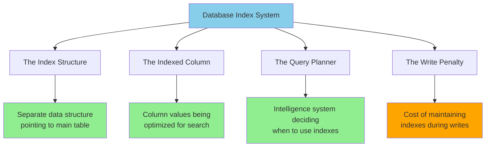
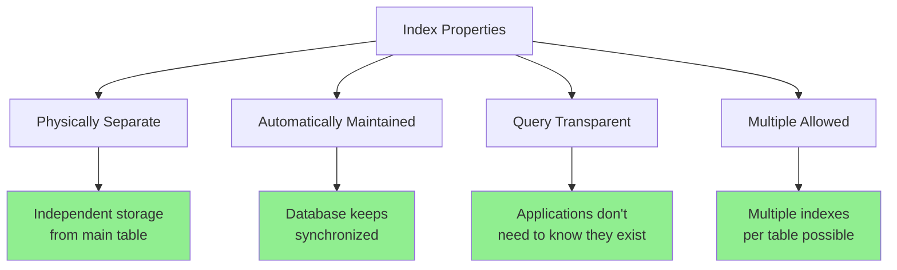
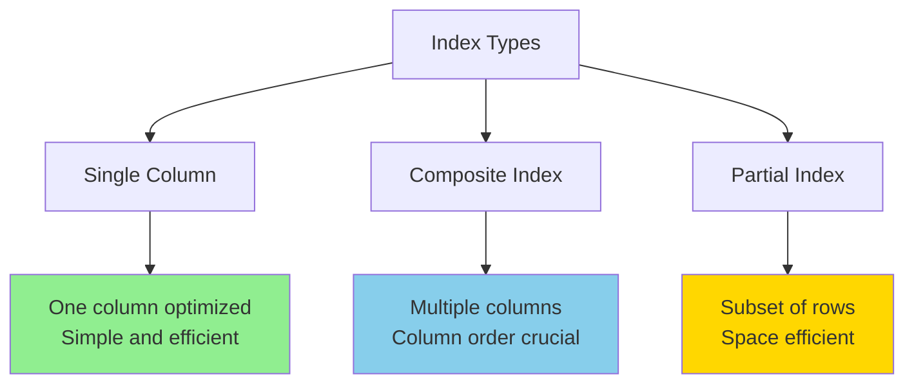
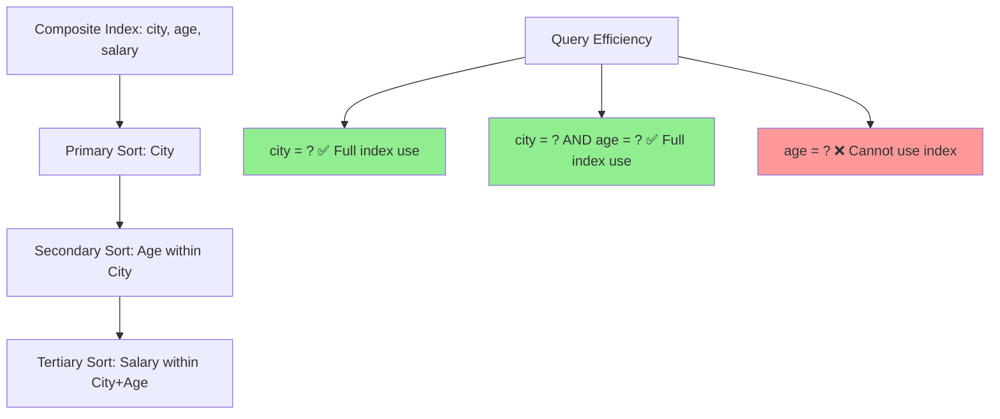
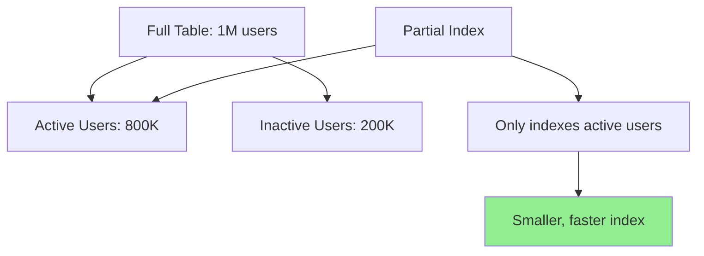
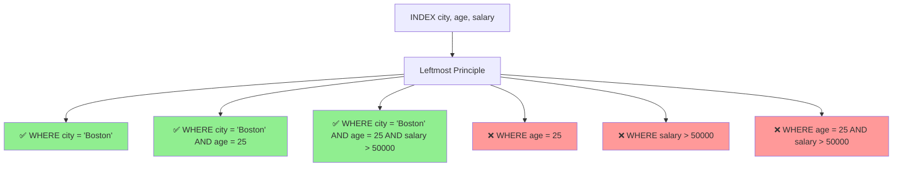
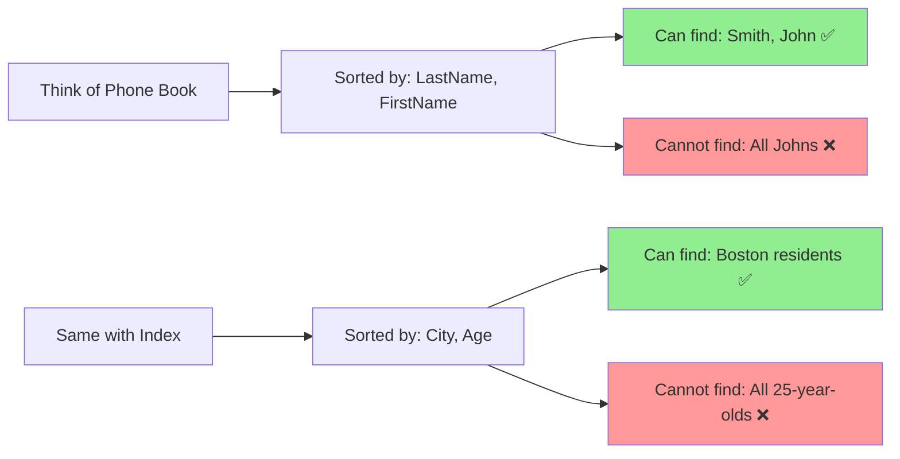
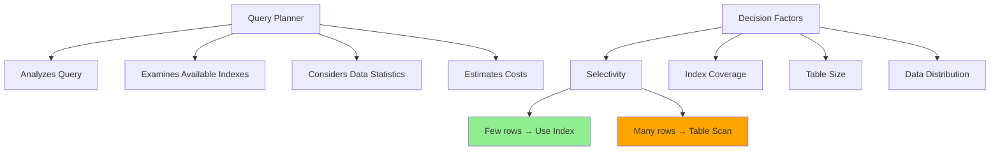
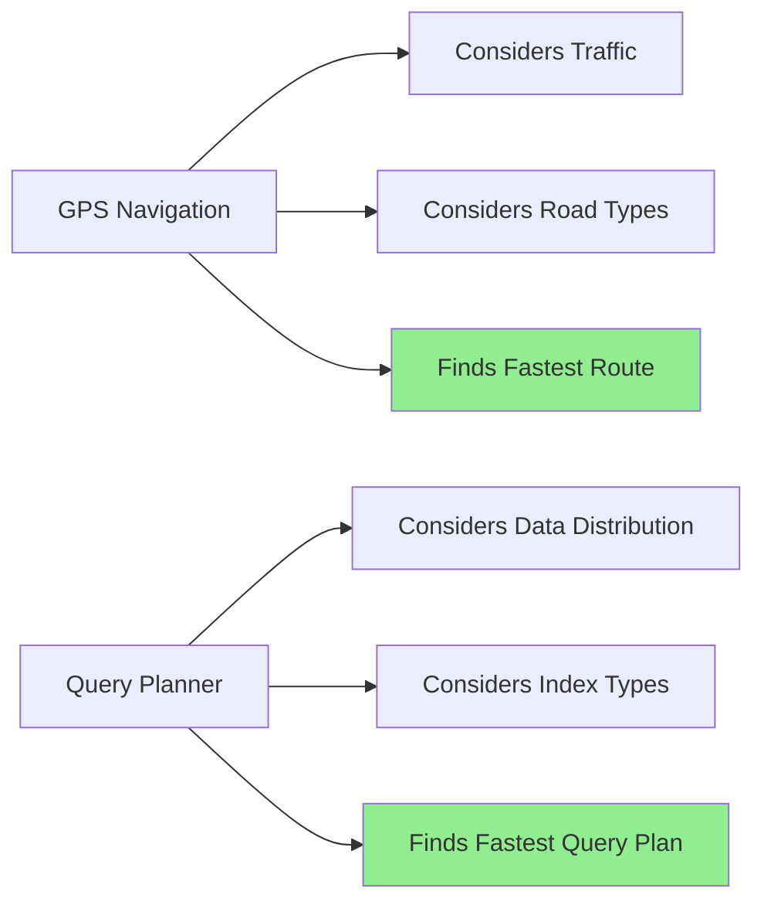

# Key Abstractions: The Building Blocks of Fast Queries

Understanding indexing requires mastering four fundamental abstractions that work together to transform slow table scans into lightning-fast lookups.



## 1. The Index: A Parallel Universe of Your Data

**Definition**: An index is a separate data structure that maintains a sorted copy of one or more columns from a table, along with pointers back to the original rows.

```mermaid
graph LR
    subgraph "Main Table (Physical Storage Order)"
        A[Row 1: id=1001, email=zoe@example.com]
        B[Row 2: id=1002, email=alice@example.com]
        C[Row 3: id=1003, email=bob@example.com]
        A --> B --> C
    end
    
    subgraph "Email Index (Logical Sorted Order)"
        D[alice@example.com → Row 2]
        E[bob@example.com → Row 3]
        F[zoe@example.com → Row 1]
        D --> E --> F
    end
    
    D -.-> B
    E -.-> C
    F -.-> A
    
    style D fill:#90EE90
    style E fill:#90EE90
    style F fill:#90EE90
```

**The Mental Model**: Think of an index as a specialized phone book. While your main table is like a chronological list of when people signed up, the index is like an alphabetically sorted directory that tells you exactly which page of the chronological list to find each person.



**Example Structure Visualization**:
```mermaid
graph TD
    subgraph "Main Table Storage"
        M1[Row 1: Zoe, zoe@example.com]
        M2[Row 2: Alice, alice@example.com]
        M3[Row 3: Bob, bob@example.com]
    end
    
    subgraph "Email Index (B-Tree)"
        I1[alice@example.com]
        I2[bob@example.com] 
        I3[zoe@example.com]
    end
    
    I1 --> M2
    I2 --> M3
    I3 --> M1
    
    Q[Query: WHERE email = 'bob@example.com'] --> I2
    I2 --> R[Direct to Row 3]
    
    style R fill:#90EE90
```

## 2. The Indexed Column: The Searchable Highway

**Definition**: The specific column(s) that an index organizes and makes searchable.

**The Mental Model**: If your table is a parking garage, the indexed column is like having numbered parking spaces. Without indexes, finding a car means searching every level and row. With an index on license plate numbers, you can go directly to the right spot.



### Single Column Index
```mermaid
graph LR
    A[CREATE INDEX idx_email ON users(email)] --> B[Email Column]
    B --> C[Sorted B-Tree Structure]
    C --> D[Fast email lookups]
    
    style D fill:#90EE90
```
- Indexes one column: `CREATE INDEX idx_email ON users(email)`
- Best for queries filtering by that specific column
- Simple and efficient

### Composite Index

- Indexes multiple columns: `CREATE INDEX idx_city_age ON users(city, age)`
- Column order matters crucially
- Effective for queries filtering by the leftmost columns

### Partial Index

- Indexes only rows meeting a condition: `CREATE INDEX idx_active_users ON users(email) WHERE status = 'active'`
- Saves space when you only query a subset of data

**Column Order in Composite Indexes - Visual Guide**:



**Why column order matters**:


## 3. The Query Planner: The Strategic Decision Maker

**Definition**: The database component that analyzes queries and decides the most efficient execution strategy, including whether to use indexes.



**The Mental Model**: Think of the query planner as a GPS navigation system. Just as GPS considers traffic, road types, and distance to find the fastest route, the query planner considers data distribution, available indexes, and query patterns to find the fastest execution path.



**Decision Factors**:

### Selectivity Analysis
```sql
-- High selectivity (few results) → Use index
SELECT * FROM users WHERE email = 'john@example.com'

-- Low selectivity (many results) → Maybe skip index  
SELECT * FROM users WHERE country = 'USA'  -- if 80% of users are in USA
```

### Cost Estimation
The planner estimates costs for different approaches:
- **Index scan cost**: Number of index pages + number of data pages to fetch
- **Table scan cost**: Number of table pages to read sequentially
- **Memory usage**: How much RAM is needed for each approach

### Statistics Utilization
Modern databases maintain statistics about:
- **Cardinality**: How many distinct values exist in each column
- **Data distribution**: How values are spread across the column
- **Table size**: Total number of rows and pages
- **Index selectivity**: How effectively each index narrows results

## 4. The Write Penalty: The Price of Speed

**Definition**: The additional computational cost incurred during INSERT, UPDATE, and DELETE operations due to index maintenance.

**The Mental Model**: Imagine maintaining both a chronological filing system and an alphabetical filing system for the same documents. Every time you add, remove, or modify a document, you must update both systems. The alphabetical system makes finding documents faster, but filing new documents takes twice as long.

**Components of Write Penalty**:

### Insert Operations
```sql
INSERT INTO users (email, name) VALUES ('new@example.com', 'New User');
```
**Additional work required**:
1. Find correct position in email index B-tree
2. Insert new entry, potentially splitting B-tree nodes
3. Update index statistics
4. Maintain B-tree balance

### Update Operations
```sql
UPDATE users SET email = 'updated@example.com' WHERE id = 1001;
```
**Additional work required**:
1. Remove old email from index
2. Insert new email at correct position
3. Potentially rebalance B-tree structure
4. Update all indexes containing the email column

### Delete Operations
```sql
DELETE FROM users WHERE id = 1001;
```
**Additional work required**:
1. Remove entries from all indexes
2. Merge B-tree nodes if they become too sparse
3. Update statistics and cardinality estimates

**Quantifying the Penalty**:
- **Rule of thumb**: Each additional index adds ~10-30% overhead to write operations
- **Composite indexes**: Generally less overhead than multiple single-column indexes
- **Highly selective indexes**: Often worth the penalty despite write costs

## How The Abstractions Work Together

These four abstractions form a cohesive system:

1. **Application**: Issues query with WHERE clause
2. **Query Planner**: Analyzes available indexes and chooses optimal strategy
3. **Index**: Provides sorted access path to relevant data
4. **Database Engine**: Balances query performance against write penalty

**The Feedback Loop**:
- Query patterns influence which indexes to create
- Index effectiveness influences query planner decisions  
- Write penalty influences how many indexes to maintain
- Performance monitoring guides index optimization

Understanding these abstractions allows you to think strategically about indexing: you're not just adding "speed-up magic" to columns, you're architecting a parallel access system that fundamentally changes how your database processes queries.