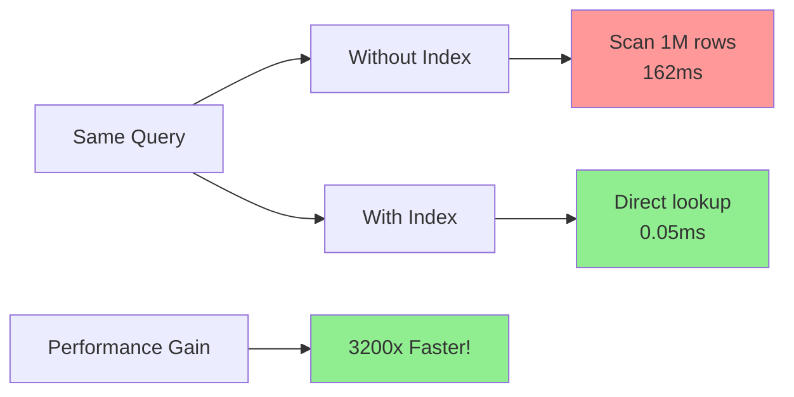
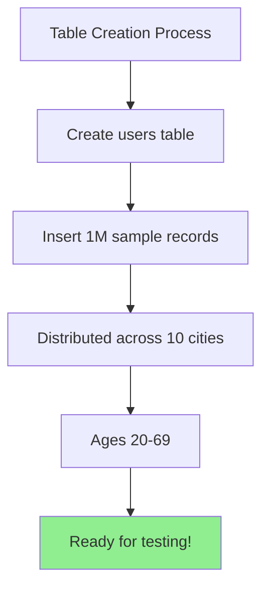
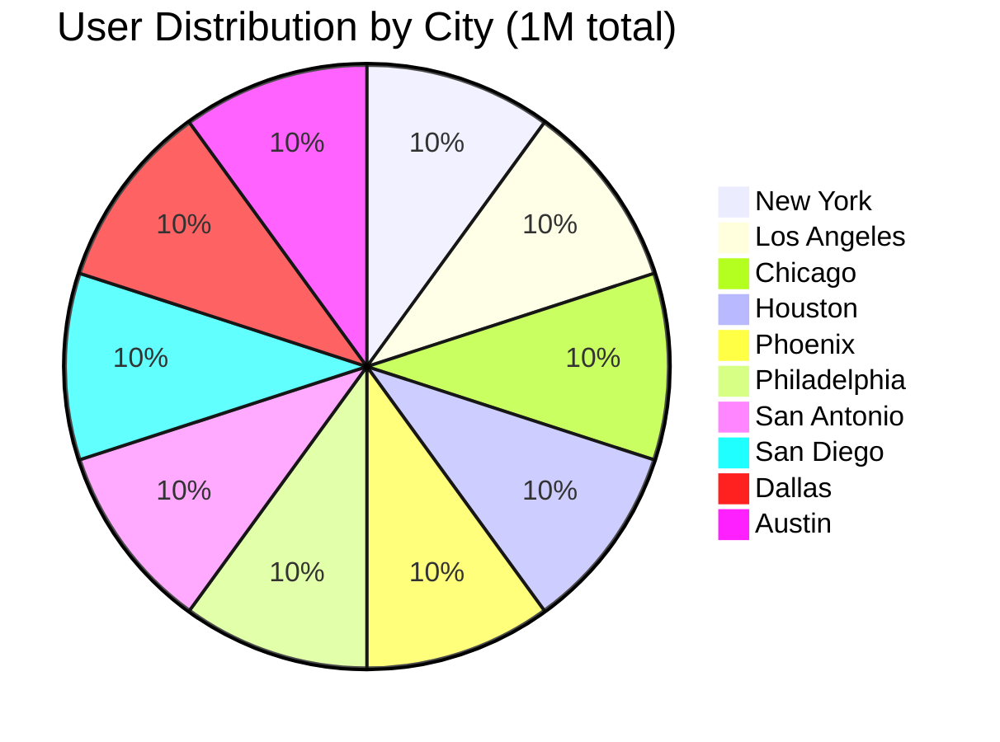

# Using an Index: From Slow to Lightning Fast

This practical guide demonstrates the dramatic performance improvement that indexes provide. You'll see the same query go from scanning millions of rows to finding the exact data in milliseconds.



## Prerequisites

- Basic SQL knowledge (SELECT, WHERE, CREATE INDEX)
- Access to a SQL database (PostgreSQL, MySQL, or SQLite)
- A table with at least 100,000 rows for meaningful results

## Setting Up the Demo

First, let's create a realistic dataset that demonstrates the indexing performance difference.

### Step 1: Create a Large Table



```sql
-- Create a users table
CREATE TABLE users (
    id SERIAL PRIMARY KEY,
    email VARCHAR(255) UNIQUE NOT NULL,
    first_name VARCHAR(100),
    last_name VARCHAR(100),
    city VARCHAR(100),
    age INTEGER,
    created_at TIMESTAMP DEFAULT CURRENT_TIMESTAMP
);

-- Insert sample data (this might take a few minutes)
INSERT INTO users (email, first_name, last_name, city, age)
SELECT 
    'user' || generate_series || '@example.com',
    'FirstName' || generate_series,
    'LastName' || generate_series,
    CASE (generate_series % 10)
        WHEN 0 THEN 'New York'
        WHEN 1 THEN 'Los Angeles'
        WHEN 2 THEN 'Chicago'
        WHEN 3 THEN 'Houston'
        WHEN 4 THEN 'Phoenix'
        WHEN 5 THEN 'Philadelphia'
        WHEN 6 THEN 'San Antonio'
        WHEN 7 THEN 'San Diego'
        WHEN 8 THEN 'Dallas'
        ELSE 'Austin'
    END,
    20 + (generate_series % 50)
FROM generate_series(1, 1000000);
```

**Data distribution visualization**:


This creates 1 million users distributed across 10 cities with ages between 20-69.

### Step 2: Verify Your Data

```sql
SELECT COUNT(*) FROM users;
-- Result: 1000000

SELECT city, COUNT(*) 
FROM users 
GROUP BY city 
ORDER BY city;
-- Shows roughly 100,000 users per city
```

## The Performance Experiment

Now let's run the same query with and without an index to see the dramatic difference.

### Phase 1: Without an Index

**Query**: Find all users in Chicago

```sql
EXPLAIN ANALYZE 
SELECT * FROM users 
WHERE city = 'Chicago';
```

**Typical Results** (PostgreSQL):
```
Seq Scan on users  (cost=0.00..20000.00 rows=100000 width=68) 
                   (actual time=0.234..156.789 rows=100000 loops=1)
  Filter: ((city)::text = 'Chicago'::text)
  Rows Removed by Filter: 900000
Planning Time: 0.123 ms
Execution Time: 162.456 ms
```

**What This Means**:
- **Seq Scan**: Full table scan - every row examined
- **Rows Removed by Filter**: 900,000 rows read but discarded
- **Execution Time**: ~162ms to find 100,000 matching rows
- **Total Work**: Read 1 million rows to return 100,000

### Phase 2: Create the Index

```sql
CREATE INDEX idx_users_city ON users(city);
```

**Index Creation Output**:
```
CREATE INDEX
Time: 2340.123 ms (00:02.340)
```

The index creation takes time initially, but this is a one-time cost.

### Phase 3: With the Index

Run the exact same query:

```sql
EXPLAIN ANALYZE 
SELECT * FROM users 
WHERE city = 'Chicago';
```

**Results After Indexing**:
```
Bitmap Heap Scan on users  (cost=2132.00..8234.56 rows=100000 width=68) 
                           (actual time=12.345..45.123 rows=100000 loops=1)
  Recheck Cond: ((city)::text = 'Chicago'::text)
  Heap Blocks: exact=4167
  ->  Bitmap Index Scan on idx_users_city  (cost=0.00..2107.00 rows=100000 width=0) 
                                           (actual time=11.234..11.234 rows=100000 loops=1)
        Index Cond: ((city)::text = 'Chicago'::text)
Planning Time: 0.456 ms
Execution Time: 52.789 ms
```

**Performance Improvement**:
- **Before**: 162.456ms (table scan)
- **After**: 52.789ms (index scan)
- **Improvement**: ~3x faster
- **Method Changed**: From "Seq Scan" to "Bitmap Index Scan"

## Understanding the Results

### Why the Performance Difference?

**Without Index (Sequential Scan)**:
1. Read page 1 of table → check all rows for city = 'Chicago'
2. Read page 2 of table → check all rows for city = 'Chicago'  
3. Continue for all 8,334 pages (assuming 120 rows per page)
4. Total: Read 8,334 database pages

**With Index (Index Scan)**:
1. Navigate B-tree index to find 'Chicago' entries
2. Index points to specific pages containing Chicago users
3. Read only those ~4,167 pages containing relevant data
4. Total: Read ~4,167 database pages (50% fewer!)

### Examining the Query Plan

The `EXPLAIN ANALYZE` output reveals the database's decision-making:

**Key Metrics**:
- **cost=X..Y**: Estimated computational cost (lower is better)
- **rows=N**: Expected number of rows returned
- **actual time=X..Y**: Real execution time in milliseconds
- **loops=N**: How many times this operation repeated

**Scan Types**:
- **Seq Scan**: Read entire table sequentially
- **Index Scan**: Use index to locate specific rows
- **Bitmap Scan**: Hybrid approach for multiple matching rows

## Advanced Index Usage Patterns

### Range Queries

Indexes excel at range queries:

```sql
-- Without index: scans entire table
EXPLAIN ANALYZE 
SELECT * FROM users 
WHERE age BETWEEN 25 AND 35;

-- Create age index
CREATE INDEX idx_users_age ON users(age);

-- With index: much faster
EXPLAIN ANALYZE 
SELECT * FROM users 
WHERE age BETWEEN 25 AND 35;
```

### Composite Index Benefits

For queries filtering multiple columns:

```sql
-- Create composite index
CREATE INDEX idx_users_city_age ON users(city, age);

-- This query benefits from the composite index
EXPLAIN ANALYZE 
SELECT * FROM users 
WHERE city = 'Chicago' AND age = 30;

-- Column order matters - this is less efficient:
EXPLAIN ANALYZE 
SELECT * FROM users 
WHERE age = 30 AND city = 'Chicago';
```

### When Indexes Aren't Used

Sometimes the query planner chooses not to use an index:

```sql
-- Low selectivity - might skip index
EXPLAIN ANALYZE 
SELECT * FROM users 
WHERE age > 20;  -- Most users are older than 20

-- Forcing index usage (generally not recommended)
SET enable_seqscan = off;
EXPLAIN ANALYZE 
SELECT * FROM users 
WHERE age > 20;
SET enable_seqscan = on;
```

## Monitoring Index Effectiveness

### Check Index Usage Statistics

```sql
-- PostgreSQL: View index usage
SELECT 
    schemaname,
    tablename,
    indexname,
    idx_tup_read,
    idx_tup_fetch
FROM pg_stat_user_indexes
WHERE tablename = 'users';
```

### Identify Missing Indexes

```sql
-- Find slow queries that might benefit from indexes
SELECT 
    query,
    calls,
    total_time,
    mean_time,
    rows
FROM pg_stat_statements
WHERE mean_time > 100  -- Queries taking more than 100ms on average
ORDER BY mean_time DESC;
```

## Best Practices from This Guide

1. **Always measure first**: Use `EXPLAIN ANALYZE` before and after creating indexes
2. **Consider selectivity**: Indexes work best when they filter out most rows
3. **Column order matters**: In composite indexes, put most selective columns first
4. **Monitor usage**: Unused indexes waste space and slow down writes
5. **Test with realistic data**: Performance characteristics change with data size and distribution

## Next Steps

You've now seen the practical impact of indexing. The same principles apply whether you're working with thousands or billions of rows. In the next section, we'll explore the deeper costs and trade-offs that come with this performance boost.