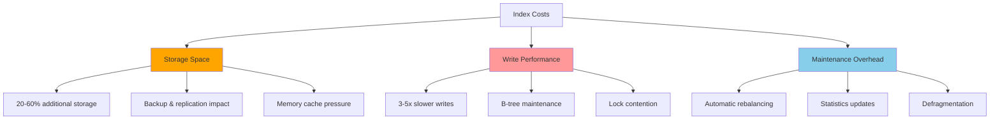
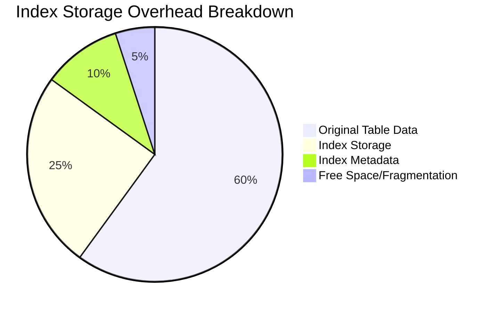
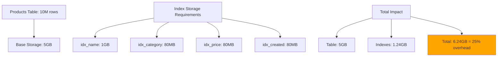
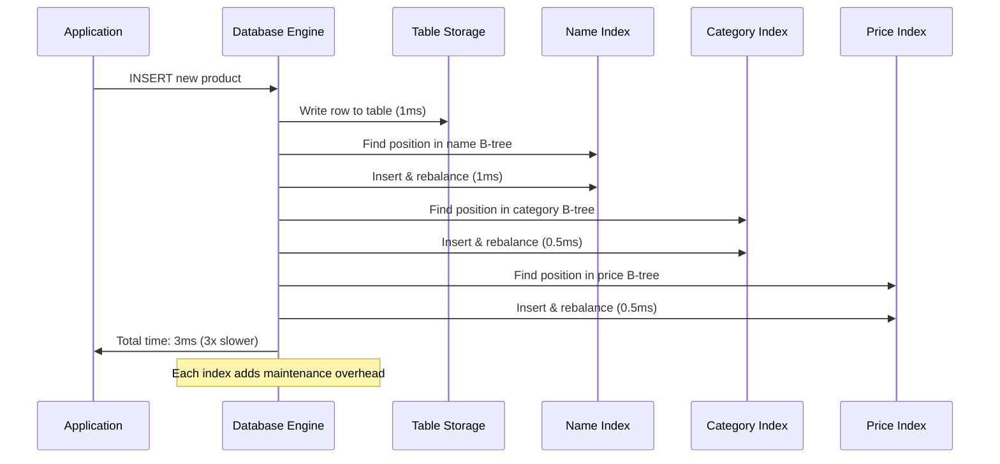
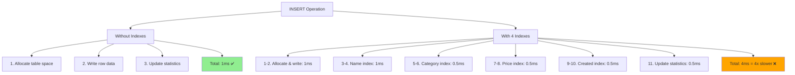
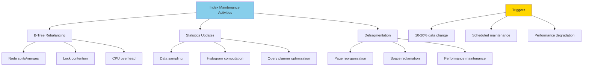
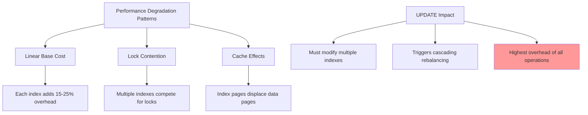
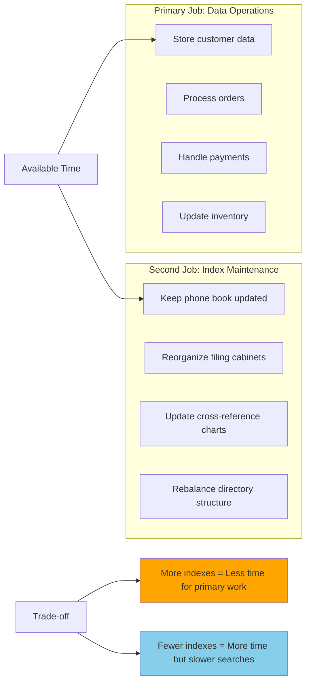
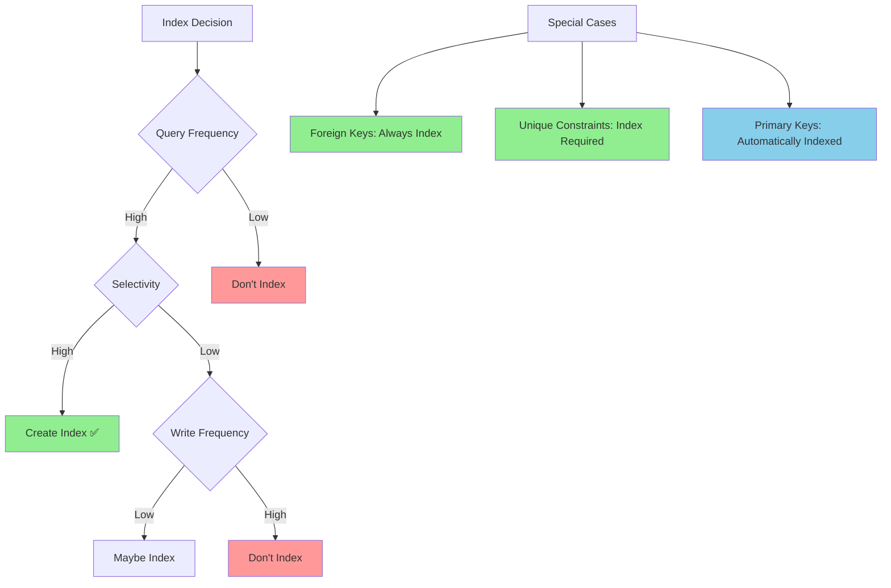

# The Cost of Indexing: There's No Such Thing as a Free Lunch

While indexes provide dramatic query performance improvements, they come with real costs that compound over time. Understanding these trade-offs is crucial for making intelligent indexing decisions rather than simply "adding indexes everywhere."

## The Three Dimensions of Cost



### 1. Storage Space: The Physical Footprint

Indexes require additional disk space proportional to the indexed data. The exact overhead depends on the index type and column characteristics.



**Typical Storage Overhead**:
- **Single column index**: 20-40% of the original column size
- **Composite index**: 30-60% of the combined column sizes  
- **Unique index**: Slightly more due to uniqueness checking overhead
- **Partial index**: Less space, but only covers a subset of rows

**Real-World Example Storage Analysis**:



```sql
-- Table with 10 million rows, 500 bytes per row = ~5GB
CREATE TABLE products (
    id BIGINT PRIMARY KEY,           -- 8 bytes
    name VARCHAR(200),               -- ~100 bytes average
    description TEXT,                -- ~300 bytes average
    category_id INTEGER,             -- 4 bytes
    price DECIMAL(10,2),            -- 8 bytes
    created_at TIMESTAMP            -- 8 bytes
);

-- Index overhead calculations:
CREATE INDEX idx_name ON products(name);           -- ~1GB (20% of table)
CREATE INDEX idx_category ON products(category_id); -- ~80MB (4 bytes × 10M rows)
CREATE INDEX idx_price ON products(price);         -- ~80MB
CREATE INDEX idx_created ON products(created_at);  -- ~80MB

-- Total: ~5GB table + ~1.24GB indexes = 25% storage overhead
```

**The Hidden Costs**:
- **Backup size**: Indexes must be backed up, increasing backup time and storage
- **Replication bandwidth**: Indexes replicate to standby servers
- **Cache pressure**: Indexes compete with data for precious RAM buffer space

### 2. Write Performance: The Maintenance Penalty

Every data modification triggers index maintenance, and this overhead multiplies with each additional index.



**Insert Operation Breakdown**:



```sql
INSERT INTO products (name, category_id, price, created_at) 
VALUES ('New Product', 5, 29.99, NOW());
```

**Without indexes**: 
1. Allocate space in table
2. Write row data
3. Update table statistics
**Time**: ~1ms

**With 4 indexes**:
1. Allocate space in table  
2. Write row data
3. **Find insertion point in name index B-tree**
4. **Insert into name index, potentially splitting nodes**
5. **Find insertion point in category_id index**
6. **Insert into category_id index**  
7. **Find insertion point in price index**
8. **Insert into price index**
9. **Find insertion point in created_at index**
10. **Insert into created_at index**
11. Update all statistics
**Time**: ~3-5ms (3-5x slower)

**Update Operations Are Worse**:
```sql
UPDATE products SET category_id = 10 WHERE id = 12345;
```

**Index maintenance required**:
1. **Remove old category_id value from index**
2. **Insert new category_id value at correct position**
3. **Potentially rebalance B-tree structure**

If the update changes multiple indexed columns, each index requires maintenance.

**Delete Operations Cause Fragmentation**:
```sql
DELETE FROM products WHERE id = 12345;
```

**Index impact**:
1. **Remove entries from all indexes**
2. **B-tree nodes may become sparse**
3. **Database may defer rebalancing to avoid immediate overhead**
4. **Index fragmentation accumulates over time**

### 3. Maintenance Overhead: The Hidden Operational Cost

Indexes require ongoing maintenance that happens automatically but consumes system resources.



**Automatic Maintenance Operations**:

#### B-Tree Rebalancing
When nodes become too full or too sparse:

```mermaid
graph LR
    subgraph "Before Split: Overflowing Node"
        A1[A|B|C|D|E|F|G|H|I]
    end
    
    subgraph "After Split: Balanced Structure"
        B1[A|B|C|D] --> P[Parent: D|H]
        B2[E|F|G|H|I] --> P
    end
    
    A1 --> B1
    A1 --> B2
    
    style A1 fill:#ff9999
    style B1 fill:#90EE90
    style B2 fill:#90EE90
    style P fill:#87CEEB
```

**Cost**: CPU time, temporary locks, potential blocking of other operations

#### Statistics Updates
Database maintains histograms of data distribution:
```sql
-- PostgreSQL automatically runs (simplified):
ANALYZE products;  -- Updates column statistics for query planner
```

**Frequency**: Triggered by percentage of data changes (typically 10-20%)
**Cost**: I/O to sample table data, CPU to compute statistics

#### Index Defragmentation
Over time, B-tree pages become partially empty:
```sql
-- Manual defragmentation (PostgreSQL)
REINDEX INDEX idx_products_name;

-- Automatic defragmentation
-- Most databases handle this during low-usage periods
```

## Quantifying the Performance Impact

### Write Performance Degradation

```mermaid
xyCh
    title "Write Performance vs Number of Indexes"
    x-axis [0, 2, 5, 10]
    y-axis "Time (ms)" 0 --> 8
    line "INSERT" [1.2, 2.1, 3.8, 7.2]
    line "UPDATE" [0.8, 1.4, 2.6, 4.9]
    line "DELETE" [0.5, 0.9, 1.7, 3.1]
```

**Benchmark Results** (PostgreSQL, 1M row table):

| Number of Indexes | INSERT Time | UPDATE Time | DELETE Time |
|-------------------|-------------|-------------|-------------|
| 0 (Primary key only) | 1.2ms | 0.8ms | 0.5ms |
| 2 indexes | 2.1ms | 1.4ms | 0.9ms |
| 5 indexes | 3.8ms | 2.6ms | 1.7ms |
| 10 indexes | 7.2ms | 4.9ms | 3.1ms |



**Key Observations**:
- Each additional index adds ~15-25% write overhead
- UPDATE operations suffer most when indexed columns change
- The overhead is non-linear due to lock contention and cache effects

### Bulk Load Performance

**Real-World Scenario**: Loading 10 million rows

```sql
-- Strategy 1: Load with indexes present
INSERT INTO products SELECT ... FROM staging_table;
-- Time: 45 minutes (slow due to index maintenance)

-- Strategy 2: Drop indexes, load, recreate indexes  
DROP INDEX idx_products_name;
DROP INDEX idx_products_category;
INSERT INTO products SELECT ... FROM staging_table;  -- Time: 12 minutes
CREATE INDEX idx_products_name ON products(name);    -- Time: 8 minutes
CREATE INDEX idx_products_category ON products(category_id); -- Time: 3 minutes
-- Total time: 23 minutes (48% faster)
```

## The Mental Model: Index as a Second Job

Think of maintaining indexes like having a second job alongside your primary work:



**Your Primary Job** (Table Operations):
- Store customer data
- Process orders  
- Handle payments

**Your Second Job** (Index Maintenance):
- Keep the phone book updated
- Reorganize filing cabinets
- Update all cross-reference charts

The second job makes finding information much faster, but it takes time away from your primary work. The more "second jobs" (indexes) you have, the less time you can spend on your primary work (actual data operations).

## Decision Framework: When the Cost Is Worth It



### High-Value Indexes
**Create these without hesitation**:
- Indexes on frequently queried columns with high selectivity
- Foreign key indexes (prevent lock escalation)
- Unique constraint indexes (enforce data integrity)

```sql
-- High-value examples:
CREATE INDEX idx_users_email ON users(email);        -- Login queries
CREATE INDEX idx_orders_user_id ON orders(user_id);  -- User order history  
CREATE INDEX idx_products_sku ON products(sku);      -- Product lookups
```

### Questionable Indexes
**Evaluate carefully**:
- Indexes on columns that change frequently
- Indexes with low selectivity (many duplicate values)
- Indexes rarely used by queries

```sql
-- Questionable examples:
CREATE INDEX idx_users_status ON users(status);      -- If 95% have status='active'
CREATE INDEX idx_audit_log_timestamp ON audit_log(timestamp); -- If you never query old data
CREATE INDEX idx_temp_data_flag ON temp_data(processed); -- If data is short-lived
```

### Index Anti-Patterns
**Avoid these**:
- Indexing every column "just in case"
- Creating redundant indexes
- Indexing small tables (< 1000 rows)

```sql
-- Anti-patterns:
CREATE INDEX idx_users_id ON users(id);              -- Redundant with PRIMARY KEY
CREATE INDEX idx_users_name ON users(first_name, last_name);
CREATE INDEX idx_users_fname ON users(first_name);   -- Redundant with composite index
```

## Monitoring and Optimization Strategies

### Identify Unused Indexes

```sql
-- PostgreSQL: Find indexes that are never used
SELECT 
    schemaname,
    tablename,
    indexname,
    idx_tup_read,
    idx_tup_fetch
FROM pg_stat_user_indexes
WHERE idx_tup_read = 0 AND idx_tup_fetch = 0
  AND indexname NOT LIKE '%_pkey';  -- Exclude primary keys
```

### Monitor Write Performance Impact

```sql
-- Track average write times
SELECT 
    query,
    calls,
    total_time / calls as avg_time_ms,
    rows / calls as avg_rows_affected
FROM pg_stat_statements
WHERE query LIKE 'INSERT%' OR query LIKE 'UPDATE%' OR query LIKE 'DELETE%'
ORDER BY avg_time_ms DESC;
```

### Index Size Analysis

```sql
-- PostgreSQL: Index size compared to table size
SELECT 
    t.tablename,
    pg_size_pretty(pg_total_relation_size(t.schemaname||'.'||t.tablename)) as table_size,
    i.indexname,
    pg_size_pretty(pg_relation_size(i.schemaname||'.'||i.indexname)) as index_size
FROM pg_tables t
JOIN pg_indexes i ON t.tablename = i.tablename
WHERE t.schemaname = 'public'
ORDER BY pg_relation_size(i.schemaname||'.'||i.indexname) DESC;
```

## The Strategic Approach

Effective indexing requires treating indexes as a strategic resource, not a tactical quick-fix:

1. **Profile first**: Identify actual query patterns before creating indexes
2. **Measure impact**: Monitor both read and write performance changes
3. **Regular maintenance**: Review and remove unused indexes quarterly
4. **Composite over multiple**: Prefer fewer composite indexes over many single-column indexes
5. **Consider alternatives**: Sometimes application-level caching or query restructuring is better than indexing

Remember: The goal isn't to make every query fast—it's to make your most important queries fast while keeping the overall system performant and maintainable.