# SQL Examples: Mastering Index Creation and Optimization

This section provides comprehensive, copy-paste-ready SQL examples for creating, optimizing, and managing indexes across different database systems. Each example includes the reasoning behind the index design and performance expectations.

## Database Setup

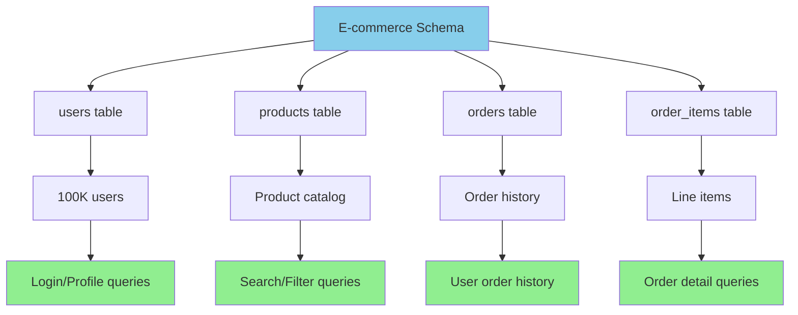

### Sample Schema

```sql
-- E-commerce database schema for examples
CREATE TABLE users (
    id SERIAL PRIMARY KEY,
    email VARCHAR(255) UNIQUE NOT NULL,
    username VARCHAR(50) UNIQUE NOT NULL,
    first_name VARCHAR(100),
    last_name VARCHAR(100),
    date_of_birth DATE,
    city VARCHAR(100),
    country VARCHAR(100),
    status VARCHAR(20) DEFAULT 'active',
    created_at TIMESTAMP DEFAULT CURRENT_TIMESTAMP,
    last_login TIMESTAMP
);

CREATE TABLE products (
    id SERIAL PRIMARY KEY,
    sku VARCHAR(50) UNIQUE NOT NULL,
    name VARCHAR(200) NOT NULL,
    description TEXT,
    category_id INTEGER,
    price DECIMAL(10,2),
    stock_quantity INTEGER,
    is_active BOOLEAN DEFAULT true,
    created_at TIMESTAMP DEFAULT CURRENT_TIMESTAMP,
    updated_at TIMESTAMP DEFAULT CURRENT_TIMESTAMP
);

CREATE TABLE orders (
    id SERIAL PRIMARY KEY,
    user_id INTEGER NOT NULL,
    order_number VARCHAR(50) UNIQUE NOT NULL,
    status VARCHAR(20) DEFAULT 'pending',
    total_amount DECIMAL(12,2),
    shipping_address TEXT,
    created_at TIMESTAMP DEFAULT CURRENT_TIMESTAMP,
    shipped_at TIMESTAMP,
    delivered_at TIMESTAMP
);

CREATE TABLE order_items (
    id SERIAL PRIMARY KEY,
    order_id INTEGER NOT NULL,
    product_id INTEGER NOT NULL,
    quantity INTEGER NOT NULL,
    unit_price DECIMAL(10,2),
    total_price DECIMAL(12,2)
);

-- Sample data insertion
INSERT INTO users (email, username, first_name, last_name, city, country) 
SELECT 
    'user' || i || '@example.com',
    'user' || i,
    'First' || i,
    'Last' || i,
    CASE (i % 5) 
        WHEN 0 THEN 'New York'
        WHEN 1 THEN 'London'
        WHEN 2 THEN 'Tokyo'
        WHEN 3 THEN 'Paris'
        ELSE 'Berlin'
    END,
    CASE (i % 3)
        WHEN 0 THEN 'USA'
        WHEN 1 THEN 'UK'
        ELSE 'Germany'
    END
FROM generate_series(1, 100000) AS i;
```

## Essential Index Patterns

```mermaid
graph TD
    A[Index Patterns] --> B[Single Column]
    A --> C[Composite]
    A --> D[Covering]
    A --> E[Partial]
    
    B --> F[One column optimized<br/>Simple & efficient]
    C --> G[Multiple columns<br/>Order matters]
    D --> H[Include extra columns<br/>Avoid table lookups]
    E --> I[Subset of rows<br/>Space efficient]
    
    J[Performance Impact] --> K[Single: O(log n)]
    J --> L[Composite: O(log n) + selectivity]
    J --> M[Covering: Index-only scan]
    J --> N[Partial: Smaller footprint]
    
    style K fill:#90EE90
    style L fill:#90EE90
    style M fill:#87CEEB
    style N fill:#FFD700
```

### 1. Single Column Indexes

**Use Case**: Queries filtering by one column

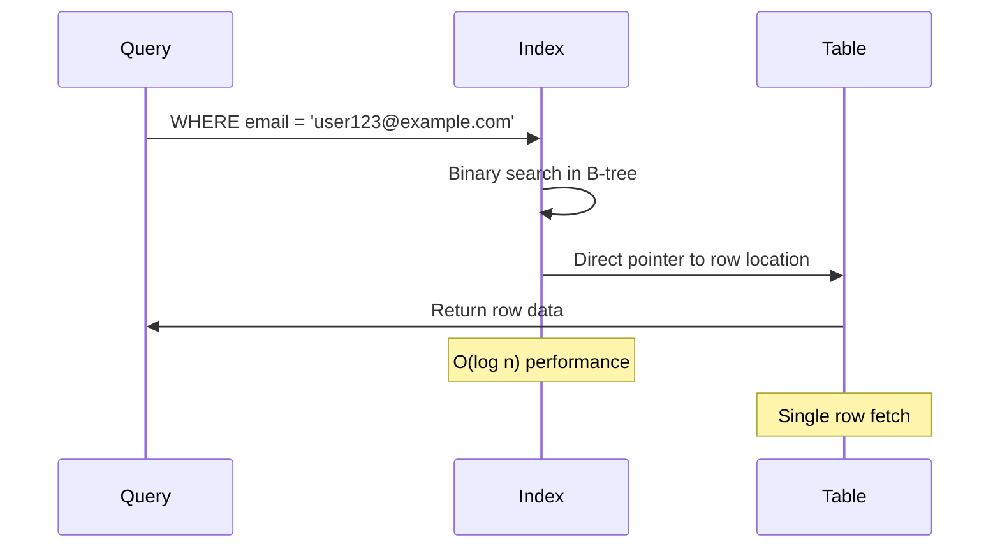

```sql
-- Fast user lookup by email (login functionality)
CREATE INDEX idx_users_email ON users(email);

-- Query this optimizes:
SELECT * FROM users WHERE email = 'user123@example.com';

-- Performance expectation: O(log n) vs O(n) without index
-- Typical improvement: 100x faster for large tables
```

```sql
-- Product lookups by SKU (inventory management)
CREATE INDEX idx_products_sku ON products(sku);

-- Query this optimizes:
SELECT * FROM products WHERE sku = 'LAPTOP-15-001';
```

```sql
-- Order history by user (customer portal)
CREATE INDEX idx_orders_user_id ON orders(user_id);

-- Query this optimizes:
SELECT * FROM orders WHERE user_id = 12345 ORDER BY created_at DESC;
```

### 2. Composite Indexes

**Use Case**: Queries filtering by multiple columns

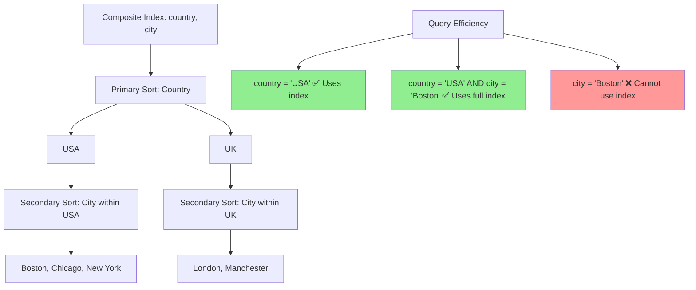

```sql
-- User search by location (city + country)
CREATE INDEX idx_users_location ON users(country, city);

-- Efficient queries:
SELECT * FROM users WHERE country = 'USA' AND city = 'New York';
SELECT * FROM users WHERE country = 'USA';  -- Can use leftmost column

-- Inefficient query (cannot use index):
SELECT * FROM users WHERE city = 'New York';  -- Missing leftmost column
```

```sql
-- Order status tracking with date range
CREATE INDEX idx_orders_status_created ON orders(status, created_at);

-- Query this optimizes:
SELECT * FROM orders 
WHERE status = 'shipped' 
  AND created_at >= '2024-01-01' 
  AND created_at < '2024-02-01';
```

```sql
-- Product catalog filtering
CREATE INDEX idx_products_category_price ON products(category_id, price);

-- Efficient for:
SELECT * FROM products 
WHERE category_id = 5 
  AND price BETWEEN 100.00 AND 500.00;
```

### 3. Covering Indexes

**Use Case**: Include additional columns to avoid table lookups

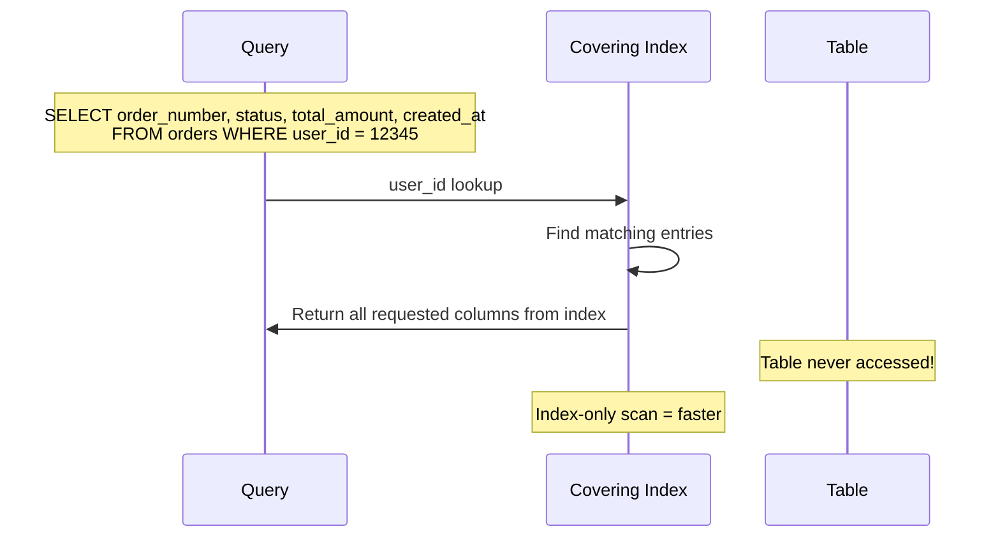

```sql
-- Order summary without touching main table
CREATE INDEX idx_orders_user_covering 
ON orders(user_id) 
INCLUDE (order_number, status, total_amount, created_at);

-- Query returns all needed data from index:
SELECT order_number, status, total_amount, created_at 
FROM orders 
WHERE user_id = 12345;
```

```sql
-- Product listing with minimal data
CREATE INDEX idx_products_active_covering 
ON products(is_active) 
INCLUDE (name, price) 
WHERE is_active = true;

-- Fast product catalog query:
SELECT name, price 
FROM products 
WHERE is_active = true;
```

### 4. Partial Indexes

**Use Case**: Index only relevant subset of data

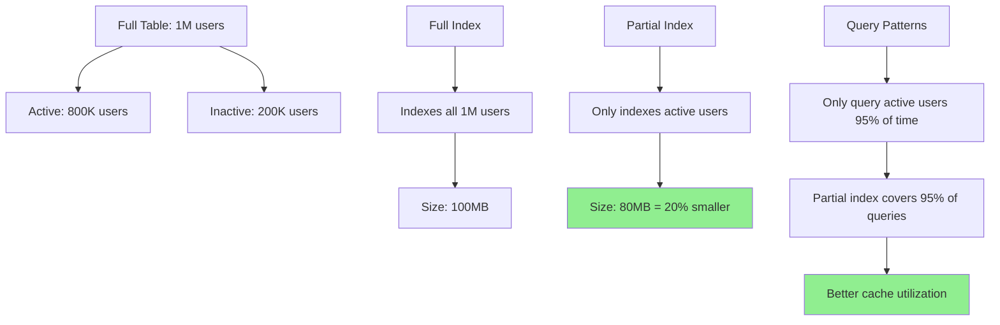

```sql
-- Index only active users
CREATE INDEX idx_users_active_email 
ON users(email) 
WHERE status = 'active';

-- Smaller index, faster for:
SELECT * FROM users 
WHERE email = 'user@example.com' 
  AND status = 'active';
```

```sql
-- Index only pending orders
CREATE INDEX idx_orders_pending_created 
ON orders(created_at) 
WHERE status = 'pending';

-- Efficient for order processing:
SELECT * FROM orders 
WHERE status = 'pending' 
  AND created_at < (NOW() - INTERVAL '1 hour');
```

```sql
-- Index only high-value orders
CREATE INDEX idx_orders_high_value 
ON orders(created_at) 
WHERE total_amount > 1000.00;

-- Fast VIP order tracking:
SELECT * FROM orders 
WHERE total_amount > 1000.00 
ORDER BY created_at DESC;
```

## Performance Optimization Examples

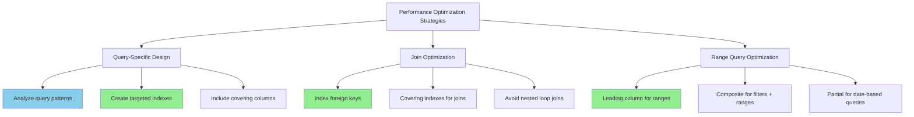

### 5. Query-Specific Index Design

**Scenario**: Frequently run analytics query

```sql
-- Original slow query:
SELECT 
    country,
    COUNT(*) as user_count,
    AVG(EXTRACT(YEAR FROM AGE(date_of_birth))) as avg_age
FROM users 
WHERE status = 'active' 
GROUP BY country;

-- Optimized index:
CREATE INDEX idx_users_analytics 
ON users(status, country) 
INCLUDE (date_of_birth);

-- Query now uses index scan instead of table scan
-- Performance improvement: 10-50x faster
```

**Scenario**: Complex join query optimization

```sql
-- Original query joining orders and users:
SELECT 
    u.email,
    u.first_name,
    u.last_name,
    o.order_number,
    o.total_amount
FROM orders o
JOIN users u ON o.user_id = u.id
WHERE o.status = 'shipped'
  AND o.created_at >= '2024-01-01';

-- Required indexes for optimal performance:
CREATE INDEX idx_orders_status_date ON orders(status, created_at);
CREATE INDEX idx_orders_user_lookup ON orders(user_id) 
    INCLUDE (order_number, total_amount);
CREATE INDEX idx_users_contact_info ON users(id) 
    INCLUDE (email, first_name, last_name);
```

### 6. Range Query Optimization

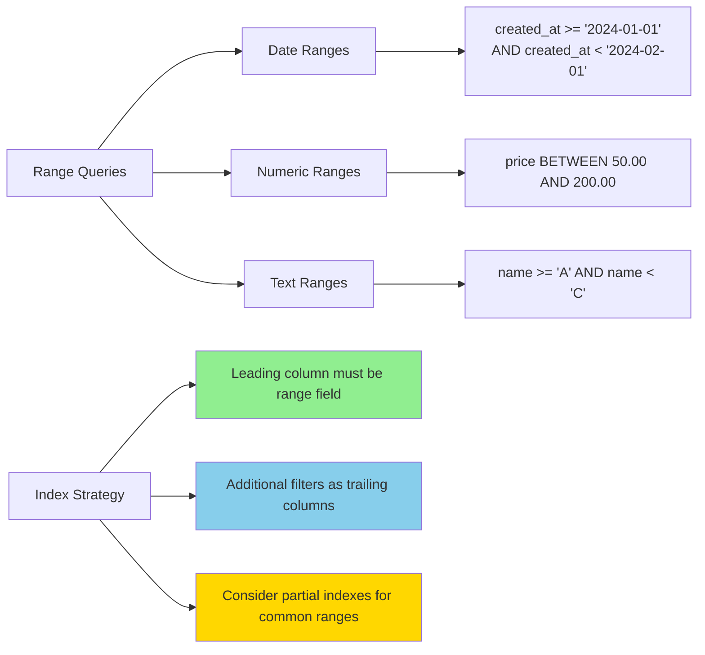

```sql
-- Date range queries (common in reporting)
CREATE INDEX idx_orders_date_range ON orders(created_at, status);

-- Efficient queries:
SELECT COUNT(*) FROM orders 
WHERE created_at >= '2024-01-01' 
  AND created_at < '2024-02-01';

SELECT * FROM orders 
WHERE created_at >= CURRENT_DATE - INTERVAL '7 days' 
  AND status IN ('pending', 'processing');
```

```sql
-- Numeric range optimization
CREATE INDEX idx_products_price_range ON products(price, category_id) 
WHERE is_active = true;

-- Fast price filtering:
SELECT * FROM products 
WHERE price BETWEEN 50.00 AND 200.00 
  AND is_active = true
ORDER BY price;
```

## Index Maintenance Examples

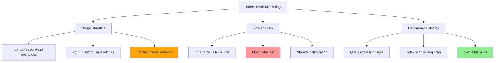

### 7. Index Health Monitoring

```sql
-- PostgreSQL: Check index usage statistics
SELECT 
    schemaname,
    tablename,
    indexname,
    idx_tup_read,
    idx_tup_fetch,
    pg_size_pretty(pg_relation_size(indexrelid)) as index_size
FROM pg_stat_user_indexes
WHERE schemaname = 'public'
ORDER BY idx_tup_read DESC;
```

```sql
-- Find unused indexes (candidates for removal)
SELECT 
    schemaname,
    tablename,
    indexname,
    pg_size_pretty(pg_relation_size(indexrelid)) as wasted_space
FROM pg_stat_user_indexes
WHERE idx_tup_read = 0 
  AND idx_tup_fetch = 0
  AND indexname NOT LIKE '%_pkey'  -- Exclude primary keys
ORDER BY pg_relation_size(indexrelid) DESC;
```

```sql
-- Index bloat detection
SELECT 
    schemaname,
    tablename,
    indexname,
    pg_size_pretty(pg_relation_size(indexrelid)) as current_size,
    CASE 
        WHEN pg_relation_size(indexrelid) > 100 * 1024 * 1024 -- 100MB
        THEN 'Consider REINDEX'
        ELSE 'OK'
    END as recommendation
FROM pg_stat_user_indexes
WHERE schemaname = 'public';
```

### 8. Index Rebuilding and Maintenance

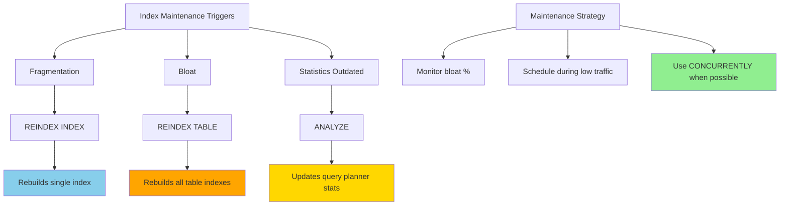

```sql
-- Rebuild fragmented index (PostgreSQL)
REINDEX INDEX idx_users_email;

-- Rebuild all indexes on a table
REINDEX TABLE users;

-- Update table statistics after bulk operations
ANALYZE users;
ANALYZE products;
ANALYZE orders;
```

```sql
-- MySQL equivalents
ALTER TABLE users DROP INDEX idx_users_email;
ALTER TABLE users ADD INDEX idx_users_email (email);

-- Update statistics
ANALYZE TABLE users;
```

### 9. Bulk Load Optimization

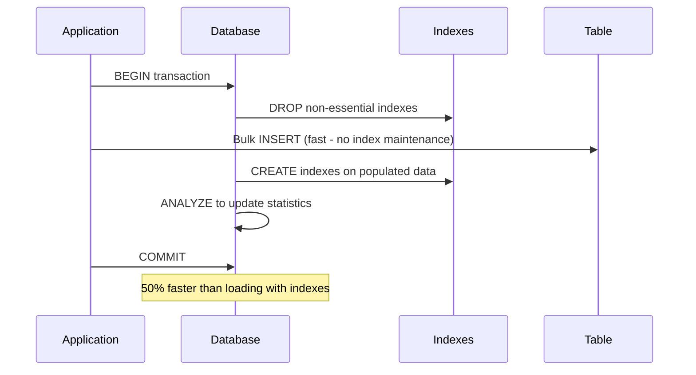

```sql
-- Strategy for large data imports
BEGIN;

-- 1. Drop non-essential indexes
DROP INDEX IF EXISTS idx_users_location;
DROP INDEX IF EXISTS idx_users_analytics;

-- 2. Perform bulk insert
INSERT INTO users (email, username, first_name, last_name, city, country)
SELECT ... FROM staging_table;

-- 3. Recreate indexes
CREATE INDEX idx_users_location ON users(country, city);
CREATE INDEX idx_users_analytics ON users(status, country) 
    INCLUDE (date_of_birth);

-- 4. Update statistics
ANALYZE users;

COMMIT;
```

## Advanced Index Techniques

```mermaid
graph TD
    A[Advanced Index Techniques] --> B[Functional Indexes]
    A --> C[Text Search Indexes]
    A --> D[JSON Indexes]
    
    B --> E[LOWER(email) for case-insensitive]
    B --> F[EXTRACT(YEAR FROM date) for year queries]
    B --> G[Complex expressions]
    
    C --> H[Full-text search]
    C --> I[GIN indexes for text]
    C --> J[Multiple language support]
    
    D --> K[JSONB column indexing]
    D --> L[Specific JSON field access]
    D --> M[JSON path expressions]
    
    style E fill:#87CEEB
    style H fill:#90EE90
    style K fill:#FFD700
```

### 10. Functional Indexes

```sql
-- Case-insensitive email search
CREATE INDEX idx_users_email_lower ON users(LOWER(email));

-- Query using the functional index:
SELECT * FROM users WHERE LOWER(email) = LOWER('User@Example.Com');
```

```sql
-- Date-based partitioning index
CREATE INDEX idx_orders_month ON orders(EXTRACT(YEAR FROM created_at), 
                                        EXTRACT(MONTH FROM created_at));

-- Monthly reporting queries:
SELECT COUNT(*), SUM(total_amount) 
FROM orders 
WHERE EXTRACT(YEAR FROM created_at) = 2024 
  AND EXTRACT(MONTH FROM created_at) = 1;
```

### 11. Text Search Indexes

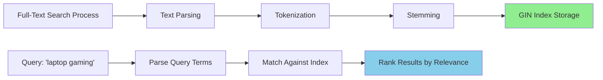

```sql
-- PostgreSQL full-text search
CREATE INDEX idx_products_fulltext ON products 
USING gin(to_tsvector('english', name || ' ' || description));

-- Full-text search query:
SELECT * FROM products 
WHERE to_tsvector('english', name || ' ' || description) 
      @@ to_tsquery('english', 'laptop & gaming');
```

### 12. JSON Column Indexing

```mermaid
graph TD
    A[JSONB Column] --> B[{'theme': 'dark', 'lang': 'en'}]
    
    C[Index Types] --> D[GIN Index on entire column]
    C --> E[Index on specific field: theme]
    C --> F[Index on nested path]
    
    G[Query Patterns] --> H[preferences->>'theme' = 'dark']
    G --> I[preferences @> {'theme': 'dark'}]
    G --> J[Complex JSON path queries]
    
    style D fill:#87CEEB
    style E fill:#90EE90
    style H fill:#90EE90
```

```sql
-- JSON column with user preferences
ALTER TABLE users ADD COLUMN preferences JSONB;

-- Index specific JSON fields
CREATE INDEX idx_users_preferences_theme 
ON users USING gin((preferences->'theme'));

-- Query JSON data efficiently:
SELECT * FROM users 
WHERE preferences->>'theme' = 'dark';
```

## Best Practices Summary

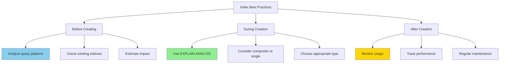

### Index Creation Checklist

```sql
-- 1. Analyze query patterns first
EXPLAIN ANALYZE SELECT * FROM users WHERE email = 'test@example.com';

-- 2. Create targeted index
CREATE INDEX idx_users_email ON users(email);

-- 3. Verify improvement
EXPLAIN ANALYZE SELECT * FROM users WHERE email = 'test@example.com';

-- 4. Monitor usage over time
SELECT * FROM pg_stat_user_indexes WHERE indexname = 'idx_users_email';
```

### Common Anti-Patterns to Avoid

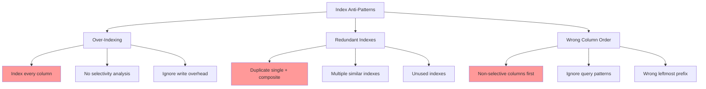

```sql
-- DON'T: Index every column
-- This creates unnecessary overhead
CREATE INDEX idx_users_first_name ON users(first_name);  -- Low selectivity
CREATE INDEX idx_users_last_name ON users(last_name);    -- Low selectivity
CREATE INDEX idx_users_city ON users(city);              -- Low selectivity

-- DO: Create composite index for actual query patterns
CREATE INDEX idx_users_search ON users(last_name, first_name, city);
```

```sql
-- DON'T: Duplicate indexes
CREATE INDEX idx_users_email ON users(email);
CREATE INDEX idx_users_login ON users(email, status);  -- email part is redundant

-- DO: Use covering index that serves multiple purposes
CREATE INDEX idx_users_login_optimized ON users(email) INCLUDE (status);
```

These examples provide a comprehensive foundation for implementing effective indexing strategies in production systems. Remember to always measure before and after creating indexes to ensure they provide the expected performance benefits.