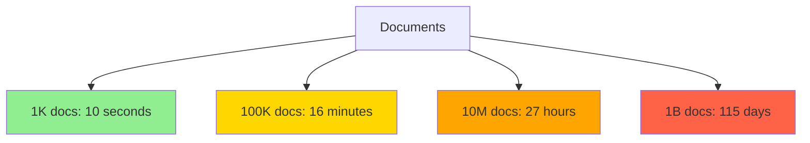
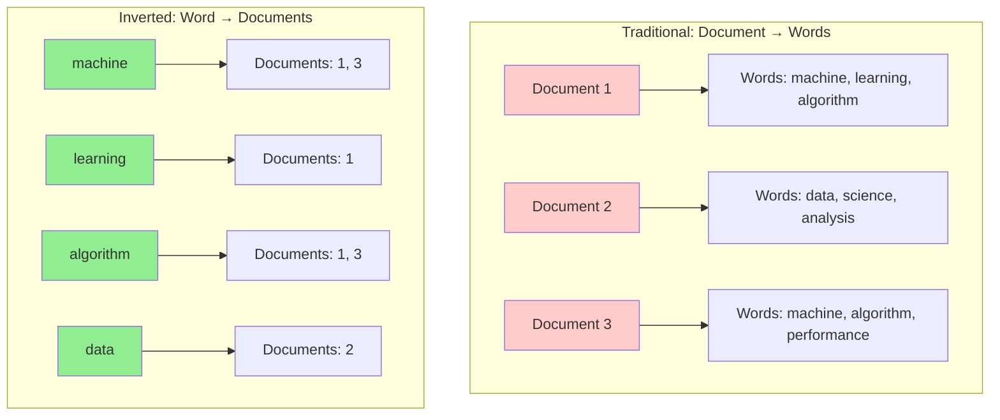
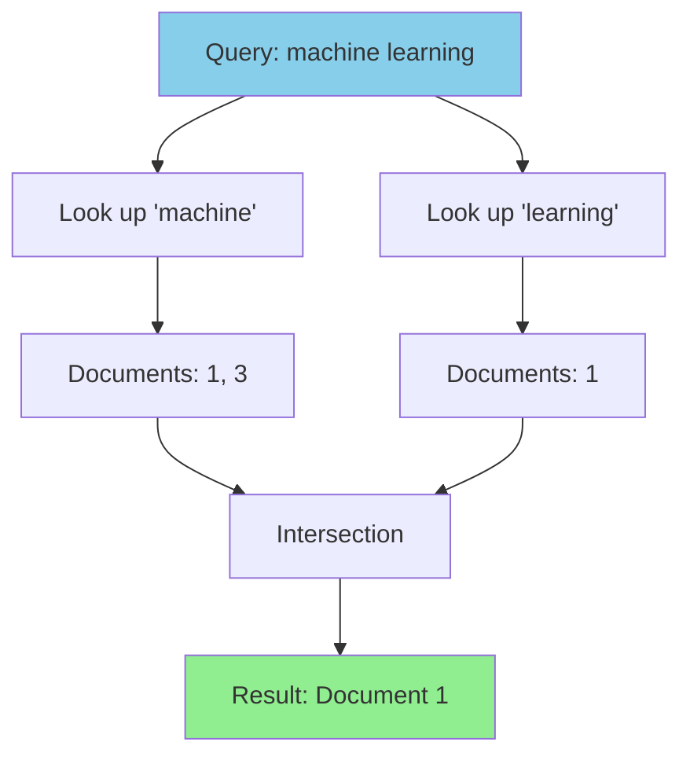

# The Core Problem: Finding Words in an Ocean of Text

Imagine you're looking for every book in the world that mentions "quantum physics." Without a systematic approach, you'd have to open every single book and read through every page - a task that would take multiple lifetimes. This is exactly the challenge that search engines face when trying to find documents containing specific words across billions of web pages.

## The Naive Approach: Sequential Scanning

When a user searches for "machine learning" on a search engine, the most straightforward approach would be:

1. **Take the first document**: Read through the entire content
2. **Check every word**: Does it contain "machine" and "learning"?
3. **Record the result**: If yes, add it to results list
4. **Move to next document**: Repeat for document 2, 3, 4...
5. **Continue forever**: Until you've checked all documents

For a search engine indexing billions of documents, this approach is catastrophically slow:

- **Google indexes ~130 trillion web pages**
- **Reading each page takes ~10ms** (including network and parsing time)
- **Total time**: 130 trillion × 10ms = 41 million years

Even with massive parallelization, this approach cannot deliver the sub-second response times users expect.

## The Mathematical Reality

The fundamental problem is **time complexity**. Sequential scanning has O(n×m) complexity where:
- **n** = number of documents 
- **m** = average length of each document

As the web grows, search time grows proportionally. This doesn't scale.

```mermaid
graph LR
    A[Query: "machine learning"] --> B[Start Sequential Scan]
    B --> C[Document 1]
    C --> D[Read entire document]
    D --> E[Check every word]
    E --> F[Document 2]
    F --> G[Read entire document]
    G --> H[Check every word]
    H --> I[Document 3...]
    I --> J[Continue for ALL documents]
    
    style C fill:#ffcccc
    style F fill:#ffcccc
    style I fill:#ffcccc
    style J fill:#ff9999
```

**Real-world example**:
```
Small blog (1,000 documents):     ~10 seconds per search
Medium website (100,000 docs):    ~16 minutes per search  
Large corpus (10 million docs):   ~27 hours per search
Web-scale (1 billion docs):       ~115 days per search
```

**The scaling nightmare visualized**:



## Why the Problem is Hard

### 1. Vocabulary Size Explosion

Natural language contains an enormous vocabulary:
- **English**: ~170,000 current words, ~1 million total words ever used
- **Technical terms**: Constantly growing (blockchain, cryptocurrency, NFT, etc.)
- **Proper nouns**: Infinite (names, places, brands, products)
- **Misspellings**: Users frequently make typos

A search system must handle this explosive vocabulary while maintaining speed.

### 2. Content Volume Growth

The amount of searchable content grows exponentially:
- **Web pages**: 63 billion indexed by Google (2023)
- **Documents**: Trillions of PDFs, Word docs, presentations
- **Social media**: Billions of posts created daily
- **Code**: Millions of repositories, billions of lines

Each new piece of content potentially contains new vocabulary combinations.

### 3. Query Frequency and Latency Expectations

Modern search systems handle:
- **Google**: ~8.5 billion searches per day
- **Peak load**: ~100,000 queries per second
- **Expected response time**: <200ms for 95% of queries
- **Concurrent users**: Millions simultaneously

The system must deliver consistent performance under extreme load.

### 4. Multi-term Queries

Real queries are complex:
- **"machine learning python tutorial"** (4 terms)
- **"best restaurants near me open now"** (6 terms)
- **"how to fix laptop battery not charging"** (8 terms)

Finding documents that contain ALL terms requires intersecting multiple result sets efficiently.

## The Storage-Access Mismatch

Traditional document storage optimizes for different access patterns than search requires:

```mermaid
graph TD
    subgraph "Document Storage (Sequential)"
        D1[Document 1: "The quick brown fox jumps..."]
        D2[Document 2: "Machine learning is transforming..."]
        D3[Document 3: "The weather today is sunny..."]
        D4[Document 4: "Learning algorithms improve..."]
        D1 --> D2 --> D3 --> D4
    end
    
    subgraph "Search Access Pattern (By Words)"
        Q1[Find: "the"] -.-> D1
        Q1 -.-> D3
        Q2[Find: "machine"] -.-> D2
        Q3[Find: "learning"] -.-> D2
        Q3 -.-> D4
    end
    
    style Q1 fill:#ffcccc
    style Q2 fill:#ffcccc
    style Q3 fill:#ffcccc
```

**The fundamental mismatch**:
- **Storage**: Organized by document order (when created)
- **Access**: Needed by word occurrence (what contains specific terms)

```mermaid
flowchart LR
    A[User Query: "machine learning"] --> B{Storage Organization}
    B --> C[Sequential by Document ID]
    B --> D[What we actually need: By Word]
    
    C --> E[Must scan ALL documents]
    D --> F[Direct lookup by term]
    
    style C fill:#ff9999
    style E fill:#ff9999
    style D fill:#90EE90
    style F fill:#90EE90
```

## The Analogy: Library Without a Card Catalog

Consider a massive library with 10 million books but no card catalog system:

**Finding books about "artificial intelligence"**:
1. Go to shelf 1, pull out book 1
2. Read the entire book looking for "artificial intelligence"
3. Put book back, pull out book 2
4. Repeat for all 10 million books

**With a card catalog (inverted index)**:
1. Look up "artificial intelligence" in the catalog
2. Get a list of exactly which books contain those terms
3. Go directly to those specific books

The card catalog represents the fundamental insight behind inverted indexes: **pre-organize information by the way you'll access it**.

## The Core Insight

The problem isn't just about finding text - it's about **reorganizing how we think about text storage**. Instead of storing:



**The transformation**:
```
Document → [List of Words it Contains]
            ↓ INVERT ↓
Word → [List of Documents that Contain It]
```

This inversion - from document-centric to word-centric organization - is the key insight that makes web-scale search possible.



## Real-World Impact

Without efficient text search:
- **Web search** would be impossible
- **Database queries** would be too slow
- **Code search** across repositories would take hours
- **Email search** would be impractical
- **Document management** would rely on manual organization

Every system that needs to find information quickly in large text collections faces this fundamental challenge.

The solution requires rethinking how we organize data: instead of optimizing for storage, we optimize for retrieval. This is the foundational problem that inverted indexes solve.