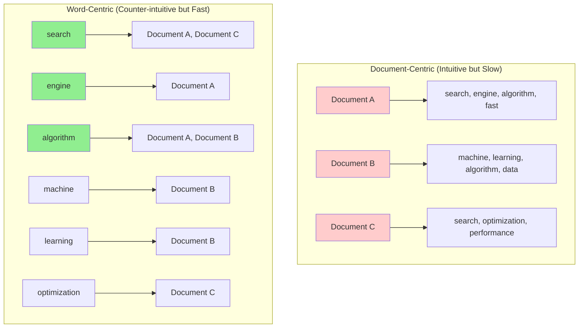
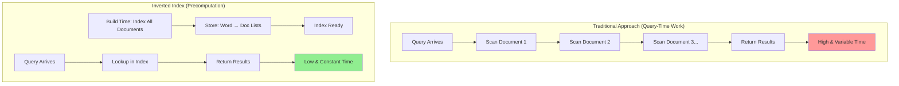
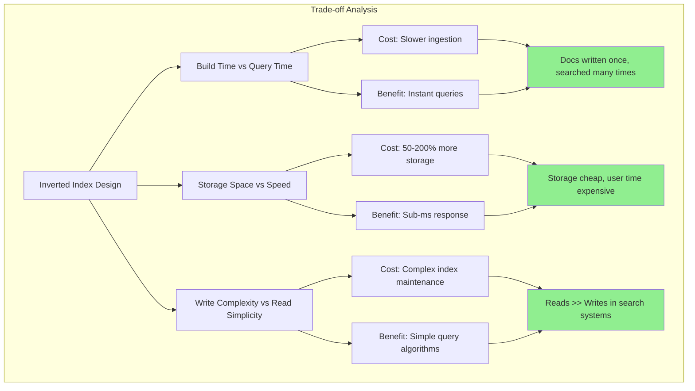
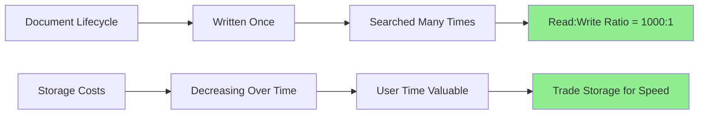

# The Guiding Philosophy: Invert to Accelerate

The core philosophy behind inverted indexes represents a fundamental paradigm shift in how we organize information. Instead of asking "What words are in this document?", we ask "What documents contain this word?" This inversion transforms an impossible search problem into a trivial lookup operation.

## The Inversion Principle

Traditional document organization follows our intuitive mental model:



**The performance difference**:

```mermaid
flowchart LR
    Q[Query: "search"] --> A{Organization Type}
    
    A --> B[Document-Centric]
    A --> C[Word-Centric]
    
    B --> D[Read Document A]
    D --> E[Check every word]
    E --> F[Read Document B]
    F --> G[Check every word]
    G --> H[Read Document C...]
    H --> I[O(n×m) complexity]
    
    C --> J[Hash lookup "search"]
    J --> K[Return: Document A, C]
    K --> L[O(1) complexity]
    
    style I fill:#ff9999
    style L fill:#90EE90
```

## The Mathematical Foundation

The inversion provides dramatic complexity improvements:

**Without Inversion (Sequential Scan)**:
- Time complexity: O(D × W) where D = documents, W = words per document
- Space complexity: O(D × W) 
- Query time: Linear in total corpus size

**With Inversion (Inverted Index)**:
- Build time: O(D × W) (same as sequential, but done once)
- Space complexity: O(V × D_avg) where V = vocabulary size, D_avg = average documents per term
- Query time: O(1) for single terms, O(T × log T) for multi-term queries (T = terms in query)

The key insight: **we pay the organization cost once during indexing to get instant lookups forever**.

## The Precomputation Philosophy

Inverted indexes embody the principle of **precomputation**: do expensive work ahead of time to make real-time operations cheap.



**The time trade-off**:

```mermaid
gantt
    title Precomputation Strategy
    dateFormat X
    axisFormat %s
    
    section Traditional
    Query 1 Processing : 0, 10
    Query 2 Processing : 10, 20
    Query 3 Processing : 20, 30
    
    section Inverted Index
    Index Building     : 0, 5
    Query 1 Lookup     : 5, 6
    Query 2 Lookup     : 6, 7
    Query 3 Lookup     : 7, 8
```



This mirrors other precomputation strategies in computer science:
- **Caching**: Precompute expensive calculations
- **Database indexes**: Precompute sorted access paths
- **Compiled code**: Precompute machine instructions from source
- **CDNs**: Precompute content delivery to edge locations

## The Philosophy of Trade-offs

Inverted indexes make explicit trade-offs aligned with real-world usage patterns:



**Real-world usage patterns that justify these trade-offs**:



## The Mental Model: The Library Card Catalog

The best analogy for understanding inverted indexes is the traditional library card catalog system:

**Physical Books** (Documents):
- Stored on shelves by acquisition order or call number
- Each book contains many topics
- Finding books by topic requires knowing exactly where to look

**Card Catalog** (Inverted Index):
- Small cards organized alphabetically by subject
- Each card lists all books containing that subject
- Finding books by topic requires only finding the right card

**The Inversion**:
- Books organize: Location → Contents
- Catalog organizes: Subject → Locations

This physical analogy reveals why inversion works: it matches the access pattern (finding by topic) to the organization pattern (organized by topic).

## The Architectural Philosophy

Inverted indexes reflect several core architectural principles:

### Locality of Reference
**Principle**: Related data should be stored together.
**Application**: All documents containing "machine learning" are listed together, enabling efficient sequential access to the most relevant results.

### Separation of Concerns
**Principle**: Decouple storage from access patterns.
**Application**: Original documents remain unchanged; the index provides an alternative access path without modifying the source data.

### Data Structure Specialization
**Principle**: Use specialized data structures for specific access patterns.
**Application**: Hash tables for exact term lookup, sorted arrays for range queries, bit vectors for boolean operations.

## The Scale Philosophy

Inverted indexes embody a scalability mindset:

### Scale-Up Strategy
- **Single-term queries**: O(1) lookup regardless of corpus size
- **Multi-term queries**: Intersection of small lists, not scanning large corpus
- **Memory efficiency**: Only load relevant posting lists, not entire corpus

### Scale-Out Strategy
- **Horizontal partitioning**: Split index by terms (term partitioning) or documents (document partitioning)
- **Distributed intersection**: Compute query results across multiple machines
- **Fault tolerance**: Replicate critical posting lists

## The User Experience Philosophy

The inversion isn't just about technical efficiency - it fundamentally changes what's possible from a user experience perspective:

**Before Inverted Indexes**:
- Users had to know exactly where information was stored
- Queries were slow and resource-intensive
- Search was a luxury, not an expectation

**After Inverted Indexes**:
- Users can find information without knowing its location
- Instant feedback enables exploratory search
- Search becomes the primary interface to information

## Design Implications

This philosophy drives specific design decisions:

### Vocabulary-First Design
Build the index around the vocabulary, not the documents. Terms are first-class entities with their own data structures and optimization strategies.

### Query-Optimized Storage
Store data in the format that makes queries fast, even if it makes ingestion more complex. The index structure should mirror common query patterns.

### Incremental Sophistication
Start with simple exact-match lookups, then add features like fuzzy matching, ranking, and phrase queries as additional layers on the core inverted structure.

## The Broader Principle

The inversion principle extends beyond search engines:

- **Databases**: Index tables by column values, not row order
- **Recommendation systems**: Index items by user preferences, not item attributes  
- **Social networks**: Index posts by hashtags, not chronological order
- **Version control**: Index commits by changed files, not commit order

The universal insight: **organize data by how you'll access it, not by how you'll store it**.

This philosophical foundation explains why inverted indexes are not just a clever optimization, but a fundamental rethinking of the relationship between data organization and data access patterns.