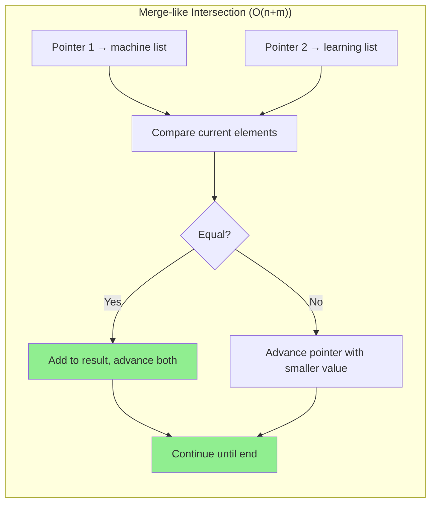
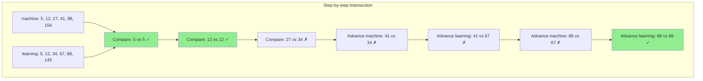
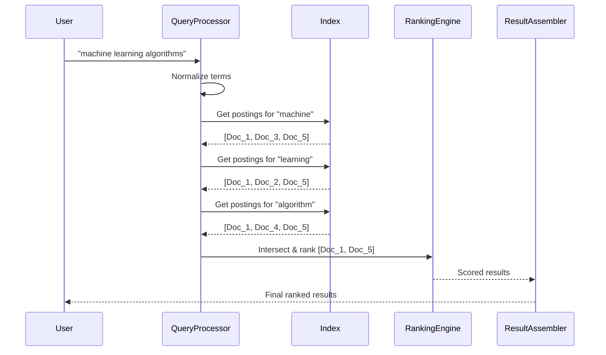

# Key Abstractions: The Building Blocks of Search

Understanding inverted indexes requires mastering three fundamental abstractions that work together to transform text search from an impossible problem into a simple lookup operation. These abstractions form the conceptual foundation of every search engine.

## 1. The Term: Words as First-Class Citizens

**Definition**: A term is a normalized, searchable unit extracted from text. It's the atomic element that users search for and that the index organizes around.

**The Mental Model**: Think of terms as the "atoms" of search. Just as chemistry organizes elements by their atomic properties rather than which molecules they appear in, search engines organize information by individual terms rather than by documents.

### From Raw Text to Terms

The transformation from raw text to searchable terms involves several processing steps:

```mermaid
graph TD
    A[Raw Text: "The Machine-Learning Algorithm's Performance!"] --> B[Tokenization]
    B --> C[The, Machine-Learning, Algorithm's, Performance!]
    C --> D[Normalization]
    D --> E[the, machine-learning, algorithm's, performance!]
    E --> F[Stemming]
    F --> G[the, machine-learn, algorithm, perform]
    G --> H[Stop Word Removal]
    H --> I[machine-learn, algorithm, perform]
    
    style A fill:#87CEEB
    style I fill:#90EE90
```

**Processing pipeline breakdown**:


### Term Processing Decisions

Each processing step involves trade-offs:

**Case Sensitivity**:
- **Preserve**: "Apple" (company) vs "apple" (fruit) are different
- **Normalize**: "URGENT" and "urgent" should match
- **Common choice**: Normalize to lowercase for most applications

**Punctuation Handling**:
- **"machine-learning"** → One term or two terms?
- **"Dr."** → Keep period or remove?
- **"@username"** → Treat as single term for social media search

**Language-Specific Processing**:
- **English**: "running" → "run" (stemming)
- **German**: "Donaudampfschifffahrt" → compound word splitting
- **Chinese**: No spaces between words, requires segmentation
- **Arabic**: Right-to-left script, complex morphology

### Term Uniqueness and Vocabulary

**The Vocabulary**: The complete set of unique terms across all documents.

```
Document 1: "machine learning algorithm"
Document 2: "learning new algorithms" 
Document 3: "machine learning tutorial"

Vocabulary: ["machine", "learning", "algorithm", "algorithms", "new", "tutorial"]
```

**Vocabulary Size Characteristics**:
- **Small collections**: ~1,000-10,000 unique terms
- **Medium collections**: ~100,000-1,000,000 unique terms  
- **Web-scale**: ~50-100 million unique terms
- **Growth pattern**: Follows Zipf's law - most terms are rare

## 2. The Document: Units of Retrieval

**Definition**: A document is the unit of information that gets returned to users. It's the granular piece of content that the search system considers indivisible for ranking and retrieval purposes.

**The Mental Model**: Think of documents as "answers" to search queries. The search engine's job is to find which answers are most relevant to each question.

### Document Abstraction Levels

The definition of "document" varies by application:

**Web Search**:
- Document = Individual web page
- Granularity: URL level
- Examples: Home page, blog post, product page

**Enterprise Search**:
- Document = File or database record
- Granularity: File level or record level
- Examples: PDF document, email message, database row

**Code Search**:
- Document = Function, class, or file
- Granularity: Semantic code unit
- Examples: Python function, Java class, entire source file

**Academic Search**:
- Document = Research paper or section
- Granularity: Paper level or section level
- Examples: Complete paper, abstract, individual section

### Document Identification

Each document needs a unique, stable identifier:

**Requirements**:
- **Uniqueness**: No two documents share the same ID
- **Stability**: ID doesn't change when document content changes
- **Efficiency**: Fast to store and compare

**Common Schemes**:
```
URLs:          https://example.com/article/123
File Paths:    /documents/reports/2024/q1-summary.pdf
Database IDs:  user_profiles:12345
Hashes:        sha256:a1b2c3d4e5f6...
UUIDs:         550e8400-e29b-41d4-a716-446655440000
```

### Document Metadata

Beyond the document ID, search systems often store additional metadata:

**Core Metadata**:
- **Title**: Display name for search results
- **URL**: Link back to original content
- **Timestamp**: When document was created/modified
- **Size**: Content length in bytes or words

**Search-Specific Metadata**:
- **Language**: For language-specific processing
- **Authority**: Domain authority, page rank, trust score
- **Category**: Content type classification
- **Freshness**: How recently content was updated

## 3. The Postings List: The Heart of the Index

**Definition**: A postings list is an ordered collection of documents that contain a specific term. It's the data structure that makes fast search possible.

**The Mental Model**: Think of a postings list as a "guest list" for each term. When a term "throws a party," its postings list tells you exactly which documents are invited (i.e., contain that term).

### Basic Postings List Structure

```
Term: "machine"
Postings List: [Doc_5, Doc_12, Doc_27, Doc_41, Doc_88, Doc_156, ...]

Term: "learning"  
Postings List: [Doc_5, Doc_12, Doc_34, Doc_67, Doc_88, Doc_145, ...]

Term: "algorithm"
Postings List: [Doc_12, Doc_27, Doc_41, Doc_67, Doc_123, Doc_178, ...]
```

### Multi-term Query Processing

The magic happens when combining postings lists for multi-term queries:

```mermaid
graph TD
    A[Query: "machine learning"] --> B[Get Postings for "machine"]
    A --> C[Get Postings for "learning"]
    
    B --> D["machine": Doc_5, Doc_12, Doc_27, Doc_41, Doc_88, Doc_156]
    C --> E["learning": Doc_5, Doc_12, Doc_34, Doc_67, Doc_88, Doc_145]
    
    D --> F[Intersection Algorithm]
    E --> F
    
    F --> G[Result: Doc_5, Doc_12, Doc_88]
    
    style A fill:#87CEEB
    style F fill:#FFD700
    style G fill:#90EE90
```

**Efficient intersection algorithm**:



**Visual intersection process**:



### Enhanced Postings Lists

Basic postings lists only store document IDs, but real search engines store additional information:

**Position Information**:
```
Term: "machine"
Postings: [
    Doc_5: [positions: 15, 67, 143],
    Doc_12: [positions: 8, 91],
    Doc_88: [positions: 23]
]
```
**Use case**: Phrase queries like "machine learning" (terms must be adjacent)

**Frequency Information**:
```
Term: "algorithm"
Postings: [
    Doc_12: [frequency: 5, positions: 8, 23, 45, 67, 89],
    Doc_27: [frequency: 2, positions: 12, 78],
    Doc_41: [frequency: 1, positions: 34]
]
```
**Use case**: Term frequency (TF) for relevance scoring

**Field Information**:
```
Term: "python"
Postings: [
    Doc_15: [title: 1, body: 3, tags: 1],
    Doc_23: [title: 0, body: 7, tags: 0],
    Doc_41: [title: 2, body: 1, tags: 2]
]
```
**Use case**: Boost matches in title vs body content

### Postings List Storage Optimizations

**Delta Compression**:
Instead of storing absolute document IDs:
```
Uncompressed: [Doc_5, Doc_12, Doc_27, Doc_41, Doc_88]
Delta Encoded: [5, +7, +15, +14, +47]
```
**Benefit**: Smaller storage, faster I/O

**Block-based Storage**:
```
Block 1: [Doc_1 to Doc_1000]    → Stored on disk
Block 2: [Doc_1001 to Doc_2000] → Stored on disk  
Block 3: [Doc_2001 to Doc_3000] → Cached in memory
```
**Benefit**: Only load relevant portions of long postings lists

## How the Abstractions Work Together

### The Complete Search Process

```mermaid
graph TD
    A[User Query: "machine learning algorithms"] --> B[Query Processing]
    
    B --> C[Terms: machine, learning, algorithm]
    
    C --> D[Postings Retrieval]
    D --> E[machine → Doc_1, Doc_3, Doc_5]
    D --> F[learning → Doc_1, Doc_2, Doc_5]
    D --> G[algorithm → Doc_1, Doc_4, Doc_5]
    
    E --> H[Set Operations]
    F --> H
    G --> H
    
    H --> I[Intersection: Doc_1, Doc_5]
    
    I --> J[Ranking & Scoring]
    J --> K[TF-IDF, Authority, Freshness]
    
    K --> L[Result Assembly]
    L --> M[Ranked Results with Metadata]
    
    style A fill:#87CEEB
    style M fill:#90EE90
```

**Detailed workflow**:



### The Index Structure

```
Inverted Index = {
    "machine":   Postings([Doc_5, Doc_12, Doc_88, ...]),
    "learning":  Postings([Doc_5, Doc_12, Doc_67, ...]),
    "algorithm": Postings([Doc_12, Doc_27, Doc_41, ...]),
    "python":    Postings([Doc_15, Doc_23, Doc_41, ...]),
    ...
}
```

**Access Pattern**: 
- **Key**: Term (string)
- **Value**: Postings list (sorted array of document references)
- **Operations**: Lookup term → get postings → intersect with other postings

## Real-World Complexity

### Scale Challenges

**Large Vocabularies**:
- Google indexes ~130 trillion web pages
- Estimated vocabulary: ~50-100 million unique terms
- Average postings list length: ~1,000-10,000 documents

**Memory Management**:
- Complete index too large for RAM
- Must decide which postings lists to cache
- Popular terms (high-frequency) vs rare terms (low-frequency) trade-offs

### Distribution Challenges

**Term Partitioning**:
```
Server 1: Terms A-F
Server 2: Terms G-L  
Server 3: Terms M-R
Server 4: Terms S-Z
```

**Document Partitioning**:
```
Server 1: Documents 1-1M
Server 2: Documents 1M-2M
Server 3: Documents 2M-3M  
```

Each approach has different trade-offs for query processing and load balancing.

These three abstractions - terms, documents, and postings lists - form the conceptual foundation that makes web-scale search possible. Understanding how they interact is key to grasping both the power and complexity of modern search engines.