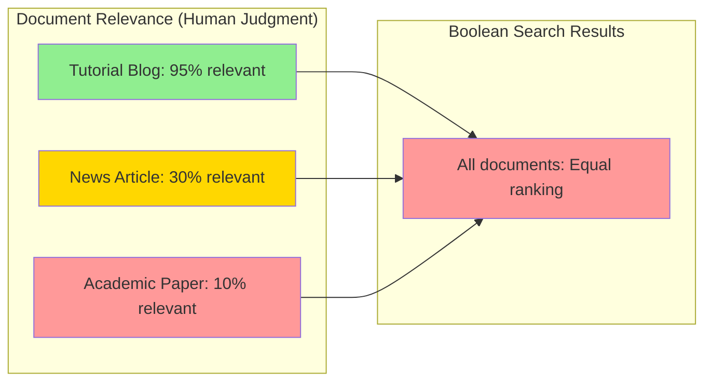
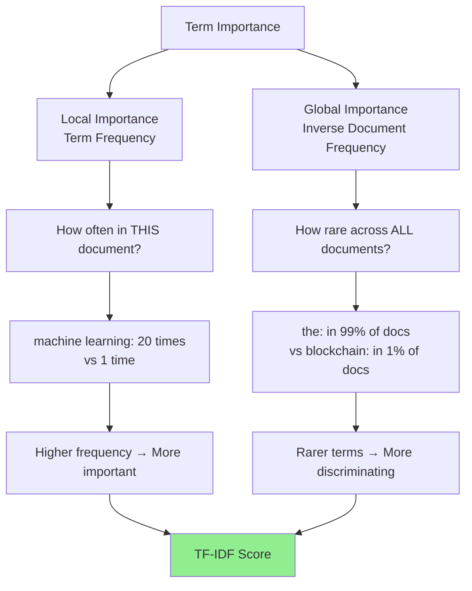
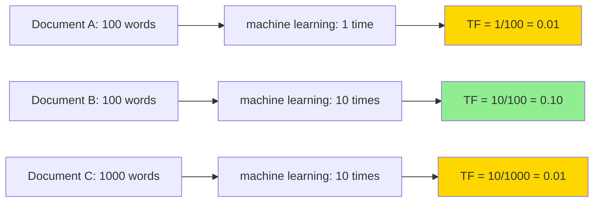
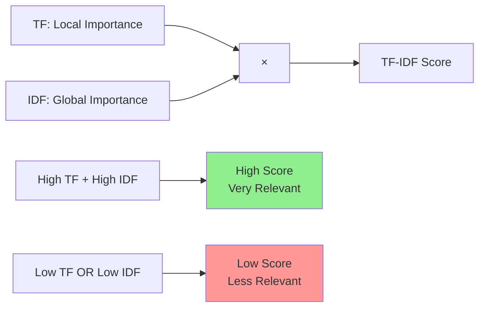
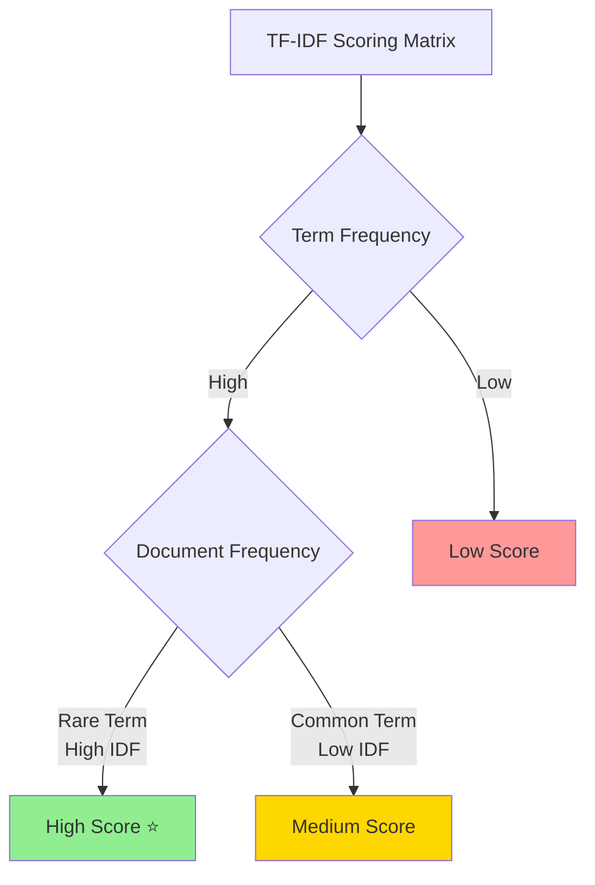
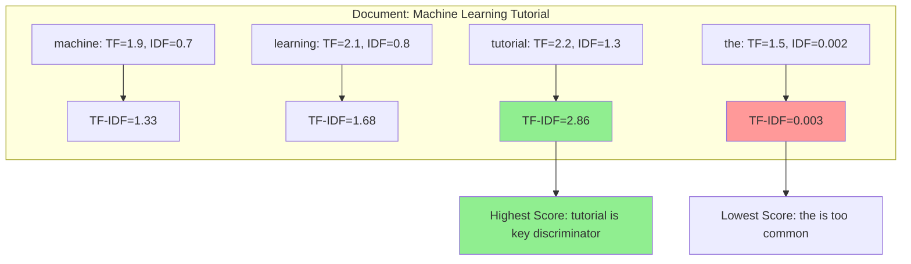

# Beyond Presence: Ranking with TF-IDF

An inverted index tells you *which* documents contain your search terms, but it doesn't tell you which documents are most *relevant*. This is where ranking algorithms transform a simple lookup system into an intelligent search engine that understands the nuanced relationship between queries and content.

## The Limitation of Boolean Search

Basic inverted indexes return binary results: a document either contains a term or it doesn't. But consider this query: **"machine learning tutorial"**

```mermaid
graph TD
    Q[Query: "machine learning tutorial"] --> A[Boolean Search Results]
    
    A --> B[Academic Paper<br/>5000 words, 1 mention]
    A --> C[Tutorial Blog<br/>2000 words, 47 mentions]
    A --> D[News Article<br/>800 words, 3 mentions]
    
    B --> E[Equal Ranking ❌]
    C --> E
    D --> E
    
    E --> F[User wants Tutorial Blog first!]
    
    style C fill:#90EE90
    style E fill:#ff9999
    style F fill:#87CEEB
```

**The problem visualized**:



Boolean search returns all three documents equally, but clearly the tutorial blog is most relevant to the user's intent. We need a way to measure and rank relevance.

## The Fundamental Insight: Term Importance

Not all term occurrences are equal. A term's importance depends on two key factors:



### 1. Local Importance (Term Frequency)
**How often does the term appear in this specific document?**



**Intuition**: If a document mentions "machine learning" 20 times, it's probably more about machine learning than a document that mentions it once.

**But there's a catch**: Raw frequency isn't enough. Document B is more focused on "machine learning" than Document C, despite having the same raw count.

### 2. Global Importance (Inverse Document Frequency)  
**How rare is this term across the entire collection?**

```mermaid
graph TD
    A[1000 Document Collection] --> B[Term: the]
    A --> C[Term: algorithm]
    A --> D[Term: photosynthesis]
    
    B --> E[Appears in: 995 docs]
    C --> F[Appears in: 100 docs]
    D --> G[Appears in: 5 docs]
    
    E --> H[IDF = log(1000/995) ≈ 0.002]
    F --> I[IDF = log(1000/100) = 1.0]
    G --> J[IDF = log(1000/5) ≈ 2.3]
    
    style H fill:#ff9999
    style I fill:#FFD700
    style J fill:#90EE90
```

**Intuition**: Common words like "the" or "and" appear in almost every document, so they don't help distinguish relevance. Rare, specific words like "photosynthesis" or "blockchain" are much more meaningful when they appear.

## Term Frequency (TF): Measuring Local Importance

Term Frequency quantifies how much a document "cares about" a specific term.

### Raw Term Frequency
The simplest approach:
```
TF(term, document) = count(term in document)
```

**Example**:
- Document A: "machine learning" appears 5 times → TF = 5
- Document B: "machine learning" appears 2 times → TF = 2

### Normalized Term Frequency
Raw counts favor longer documents unfairly. Better approach:
```
TF(term, document) = count(term in document) / total_words(document)
```

**Example**:
- Document A: 5 occurrences in 1000 words → TF = 0.005
- Document B: 2 occurrences in 200 words → TF = 0.010

Document B is actually more focused on "machine learning" despite having fewer raw mentions.

### Logarithmic Term Frequency
Linear frequency scaling can be too aggressive. Many systems use:
```
TF(term, document) = 1 + log(count(term in document))
```

**Benefits**:
- Diminishing returns: 10 vs 20 occurrences matters less than 1 vs 2 occurrences
- Never zero: Even single occurrences get positive weight
- Smoother scaling: Reduces impact of artificially inflated term counts

### Comparative Example

**Document Analysis**:
```
Doc A: "machine" appears 1 time in 100 words
Doc B: "machine" appears 4 times in 100 words  
Doc C: "machine" appears 16 times in 100 words
```

**Different TF calculations**:
```
             Raw TF    Normalized TF    Log TF
Doc A:         1         0.01          1.00
Doc B:         4         0.04          1.60  
Doc C:        16         0.16          2.77
```

Notice how log TF prevents Document C from dominating just because it spam-mentions the term.

## Inverse Document Frequency (IDF): Measuring Global Importance

IDF captures how "special" or discriminating a term is across the entire collection.

### The Core Formula
```
IDF(term) = log(total_documents / documents_containing_term)
```

### Understanding IDF Values

**Example Collection**: 1000 documents

```
Term: "the"
- Appears in: 995 documents  
- IDF = log(1000/995) = log(1.005) ≈ 0.002
- Interpretation: Nearly worthless for ranking

Term: "algorithm"  
- Appears in: 100 documents
- IDF = log(1000/100) = log(10) ≈ 1.0
- Interpretation: Moderately selective

Term: "photosynthesis"
- Appears in: 5 documents
- IDF = log(1000/5) = log(200) ≈ 2.3  
- Interpretation: Highly selective
```

### IDF Intuition

IDF embodies a key insight: **rare terms are more informative than common terms**.

**The Mental Model**: Think of IDF as measuring "surprise value". If a document contains a rare term, that's surprising and meaningful. If it contains a common term, that's expected and less informative.

**Real-world analogy**: In a library, finding "machine learning" in the computer science section isn't surprising. Finding "machine learning" in the poetry section would be highly significant.

### Edge Cases and Smoothing

**Zero frequency problem**: What if a term appears in 0 documents?
```
IDF = log(1000/0) = undefined (division by zero)
```

**Solution**: Add smoothing
```
IDF(term) = log(total_documents / (1 + documents_containing_term))
```

**Very common terms**: Terms appearing in all documents get IDF ≈ 0, effectively removing them from ranking.

## TF-IDF: Combining Local and Global Importance

TF-IDF multiplies term frequency by inverse document frequency:



### The Mathematical Intuition



**High TF-IDF scores occur when**:
- Term appears frequently in the document (high TF), AND
- Term is rare across the collection (high IDF)

**Low TF-IDF scores occur when**:
- Term appears rarely in the document (low TF), OR  
- Term is common across the collection (low IDF)

**Visual example**:



### Worked Example

**Collection**: 1000 documents
**Query**: "machine learning tutorial"
**Candidate Document**: A machine learning tutorial with 500 words

**Term analysis**:
```
Term: "machine"
- Count in document: 8
- Documents containing "machine": 200
- TF = 1 + log(8) = 1.90
- IDF = log(1000/200) = 0.70
- TF-IDF = 1.90 × 0.70 = 1.33

Term: "learning"  
- Count in document: 12
- Documents containing "learning": 150
- TF = 1 + log(12) = 2.08
- IDF = log(1000/150) = 0.82
- TF-IDF = 2.08 × 0.82 = 1.71

Term: "tutorial"
- Count in document: 15
- Documents containing "tutorial": 50  
- TF = 1 + log(15) = 2.18
- IDF = log(1000/50) = 1.30
- TF-IDF = 2.18 × 1.30 = 2.83
```

**Document's total score**: 1.33 + 1.71 + 2.83 = 5.87

Notice how "tutorial" contributes most to the score because it's both frequent in the document AND rare in the collection.

## Advanced TF-IDF Variations

### Sublinear TF Scaling
Some systems use more aggressive diminishing returns:
```
TF(term, doc) = 1 + log(1 + log(raw_count))
```

### Augmented Term Frequency
Normalize by the most frequent term in the document:
```
TF(term, doc) = 0.5 + (0.5 × raw_count / max_count_in_doc)
```

This prevents documents with one extremely frequent term from dominating.

### Smoothed IDF
Add smoothing to handle edge cases:
```
IDF(term) = log((1 + total_docs) / (1 + docs_containing_term)) + 1
```

## Multi-Document Ranking

For multi-term queries, TF-IDF enables sophisticated ranking strategies:

### Vector Space Model
Represent documents and queries as vectors in TF-IDF space:

```
Query: "machine learning"
Query Vector: [TF-IDF("machine"), TF-IDF("learning")]

Document Vectors:
Doc A: [1.2, 0.8]  
Doc B: [2.1, 1.5]
Doc C: [0.3, 2.2]
```

**Ranking**: Use cosine similarity between query vector and document vectors.

### Additive Scoring
Simply sum TF-IDF scores for all query terms:
```
Score(doc, query) = Σ TF-IDF(term, doc) for term in query
```

### Weighted Queries
Give different importance to different query terms:
```
Score(doc, query) = Σ weight(term) × TF-IDF(term, doc)
```

## TF-IDF in Practice: A Complete Example

Let's trace through a realistic ranking scenario:

**Collection**: 10,000 web pages about technology
**Query**: "python web framework"

**Candidate Documents**:
1. **Django Documentation**: Complete guide to Django web framework in Python
2. **General Python Tutorial**: Covers all aspects of Python programming  
3. **Flask vs Django**: Comparison of Python web frameworks
4. **JavaScript Framework Guide**: Mentions Python briefly in comparison

**TF-IDF Analysis**:

```
Document 1 (Django Docs):
- "python": TF=1.5, IDF=0.8, TF-IDF=1.2
- "web": TF=2.1, IDF=1.1, TF-IDF=2.3  
- "framework": TF=2.8, IDF=1.3, TF-IDF=3.6
- Total Score: 7.1

Document 2 (Python Tutorial):
- "python": TF=2.9, IDF=0.8, TF-IDF=2.3
- "web": TF=0.4, IDF=1.1, TF-IDF=0.4
- "framework": TF=0.1, IDF=1.3, TF-IDF=0.1  
- Total Score: 2.8

Document 3 (Flask vs Django):
- "python": TF=1.8, IDF=0.8, TF-IDF=1.4
- "web": TF=1.9, IDF=1.1, TF-IDF=2.1
- "framework": TF=2.2, IDF=1.3, TF-IDF=2.9
- Total Score: 6.4

Document 4 (JavaScript Guide):  
- "python": TF=0.2, IDF=0.8, TF-IDF=0.2
- "web": TF=1.1, IDF=1.1, TF-IDF=1.2
- "framework": TF=1.9, IDF=1.3, TF-IDF=2.5
- Total Score: 3.9
```

**Ranking**: Django Docs (7.1) > Flask vs Django (6.4) > JavaScript Guide (3.9) > Python Tutorial (2.8)

This ranking makes intuitive sense: documents that focus on Python web frameworks rank highest, while general tutorials rank lower.

## Limitations and Modern Improvements

### TF-IDF Limitations

**No semantic understanding**: "car" and "automobile" are treated as completely different terms.

**Position ignorance**: Terms in titles aren't weighted differently than terms in footnotes.

**No query context**: User intent and search history aren't considered.

**Linear combination**: Assumes term contributions are independent and additive.

### Modern Improvements

**BM25**: More sophisticated term frequency normalization that handles document length better.

**Learning to Rank**: Machine learning models that consider hundreds of ranking factors.

**Neural Models**: BERT, word2vec, and other models that understand semantic similarity.

**Click-through Data**: User behavior signals that indicate actual relevance.

**Personalization**: Ranking adjusted based on user history and preferences.

## Implementation Considerations

### Storage Efficiency
TF-IDF scores can be precomputed and stored in the inverted index:

```
Postings List for "machine":
[
  (doc_1, tf_idf=1.2),
  (doc_5, tf_idf=2.1), 
  (doc_12, tf_idf=0.8),
  ...
]
```

### Update Complexity
Adding new documents changes IDF values for all terms, requiring index updates. Solutions:
- **Batch updates**: Recompute IDF periodically
- **Approximation**: Use stable IDF estimates that don't change frequently
- **Incremental updates**: Sophisticated algorithms that update IDF efficiently

### Memory vs Computation Trade-offs
- **Precompute**: Store TF-IDF scores (more memory, faster queries)
- **Compute on-demand**: Calculate during queries (less memory, slower queries)

TF-IDF represents the foundational leap from simple text matching to intelligent relevance ranking. While modern search engines use far more sophisticated algorithms, the core insight remains: combine local term importance with global term rarity to measure document relevance. This principle underlies virtually all text ranking systems, from Google's original PageRank (which added link analysis to TF-IDF) to modern neural ranking models.