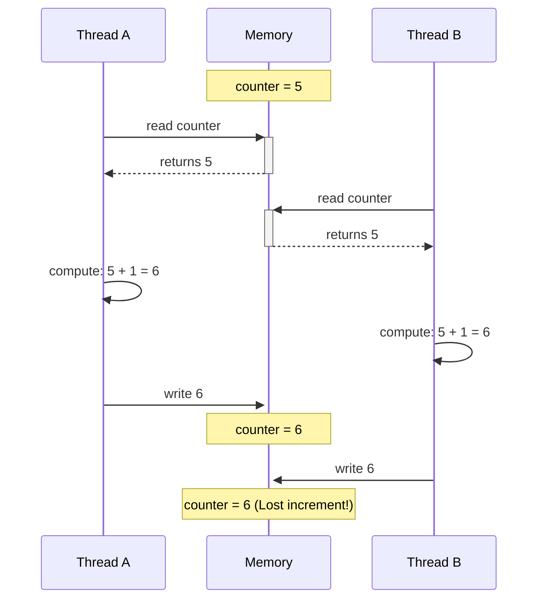
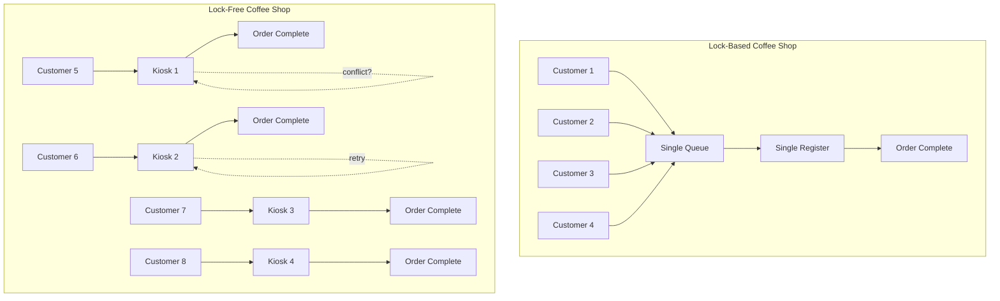

# The Core Problem: Why Traditional Locking Falls Short

## The Fundamental Challenge

In multi-threaded applications, shared data creates a race condition problem. When multiple threads access the same memory location simultaneously, the results become unpredictable. Consider this simple scenario:



**The Lost Update Problem**: Thread B's increment is lost because both threads based their calculation on the same stale value.

## Traditional Solution: Locks

The conventional approach uses mutexes, semaphores, or other locking primitives:

```rust
// Pseudocode with locks
acquire_lock(counter_mutex);
counter = counter + 1;
release_lock(counter_mutex);
```

This ensures only one thread can modify the counter at a time. Problem solved, right?

## Why Locks Are Problematic

### 1. Performance Bottlenecks
- **Thread blocking**: When one thread holds a lock, others must wait
- **Cache coherency overhead**: Lock acquisition involves expensive memory synchronization
- **Priority inversion**: Lower priority threads can block higher priority ones

### 2. Deadlock Potential
```
Thread A: acquire(lock1) → acquire(lock2)
Thread B: acquire(lock2) → acquire(lock1)
Result: Both threads wait forever
```

### 3. Composability Issues
Lock-based code doesn't compose well. Combining two thread-safe functions doesn't guarantee the combination is thread-safe.

### 4. Real-World Impact
Consider a web server handling 10,000 concurrent requests. If each request needs to update a shared counter protected by a lock:

```mermaid
gantt
    title Lock-Based vs Lock-Free Request Processing
    dateFormat X
    axisFormat %s
    
    section Lock-Based
    Request 1    :done, r1, 0, 1
    Request 2    :done, r2, 1, 2
    Request 3    :done, r3, 2, 3
    Request 4    :done, r4, 3, 4
    Requests 5-10000 :crit, waiting, 4, 10000
    
    section Lock-Free
    All Requests :done, concurrent, 0, 100
```



- **Lock-based**: Serial execution, 9,999 requests wait
- **Lock-free**: Concurrent execution with occasional retries
- **Latency impact**: 100x improvement in contended scenarios

## The Lock-Free Alternative

What if we could update shared data without ever blocking threads? What if failed updates simply retried instead of waiting?

This is the promise of lockless data structures: **concurrency without waiting**.

The key insight: instead of preventing conflicts (pessimistic approach), we detect and handle them gracefully (optimistic approach).

## Real-World Analogy: The Coffee Shop Model

**Traditional Locking**: 
Imagine a coffee shop with one register and one cashier. Every customer must wait in a single line, even if they just want to grab a pre-made sandwich. The register becomes a bottleneck.

**Lock-Free Programming**: 
Now imagine a modern coffee shop with:
- Multiple self-service kiosks
- Customers try to complete orders simultaneously
- If a conflict occurs (item out of stock), the system suggests alternatives
- No waiting for the "privilege" to attempt an order



The next section explores how atomic hardware instructions make this possible.