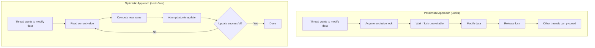
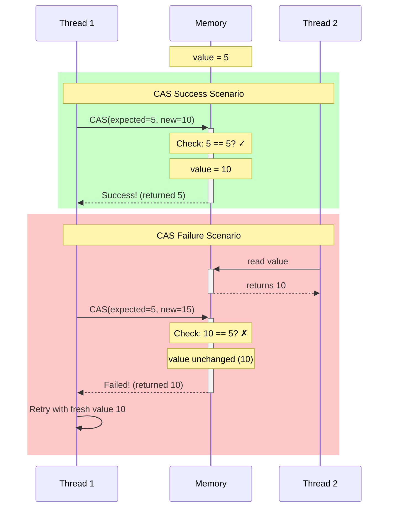
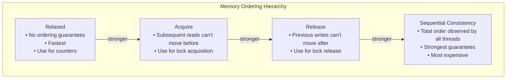
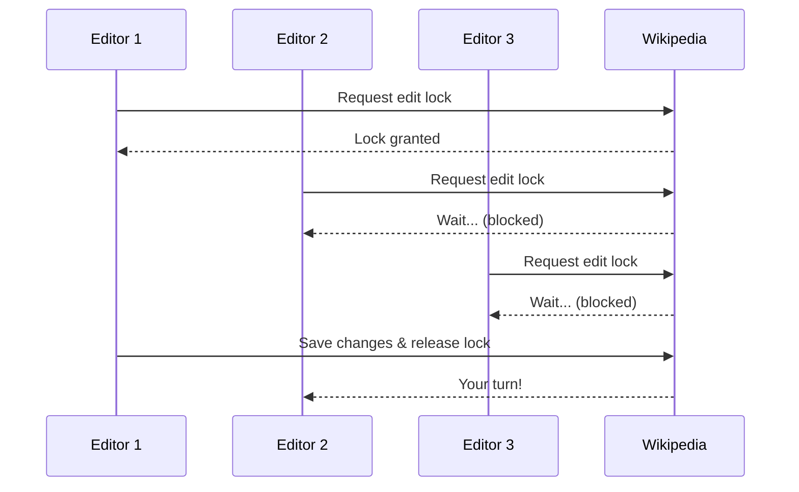
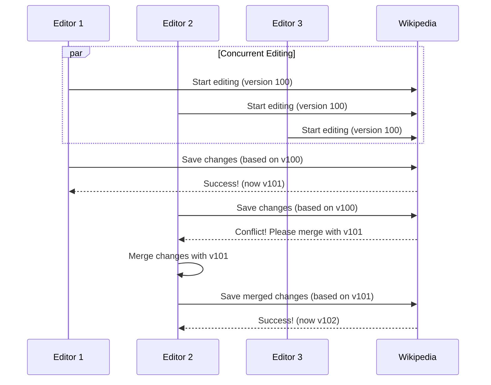

# The Guiding Philosophy: Optimistic Concurrency with Atomic Operations

## The Fundamental Shift

Lock-free programming represents a philosophical shift from **pessimistic** to **optimistic** concurrency:



- **Pessimistic (Locks)**: "Assume conflict will happen, prevent it"
- **Optimistic (Lock-free)**: "Assume no conflict, detect and retry if wrong"

## The Hardware Foundation: Atomic Operations

Modern CPUs provide special instructions that execute atomically—they complete entirely or not at all, with no visible intermediate state.

### Key Atomic Operations

1. **Load/Store**: Read or write a value atomically
2. **Compare-And-Swap (CAS)**: The cornerstone operation
3. **Fetch-And-Add**: Atomically add and return previous value
4. **Test-And-Set**: Atomically set a bit and return previous value

## Compare-And-Swap: The Heart of Lock-Free Programming

CAS is the Swiss Army knife of atomic operations:

```rust
fn compare_and_swap(address: *mut T, expected: T, new: T) -> T {
    // Atomically:
    // 1. Read current value at address
    // 2. If it equals 'expected', write 'new'
    // 3. Return the actual value that was there
}
```

### CAS in Action: The Atomic Dance



**Success**: Memory contained expected value, update performed  
**Failure**: Memory changed by another thread, retry needed

## The Retry Loop Pattern

Lock-free algorithms follow this general pattern:

```rust
loop {
    let current = atomic_load(&shared_data);
    let new_value = compute_new_value(current);
    
    if compare_and_swap(&shared_data, current, new_value) == current {
        break; // Success!
    }
    // CAS failed, another thread modified data. Retry.
}
```

## Why This Works: The Optimistic Bet

The philosophy bets that:
1. **Conflicts are rare** in well-designed systems
2. **Retry cost < lock overhead** for most workloads
3. **Progress is guaranteed** (at least one thread always succeeds)

## Memory Ordering: The Subtle Art of Synchronization

Atomic operations must specify memory ordering to prevent CPU/compiler reordering:



### Memory Ordering in Practice

```rust
// Relaxed: No synchronization, just atomicity
counter.fetch_add(1, Ordering::Relaxed);

// Acquire-Release: Synchronizes with other threads
if flag.compare_exchange(false, true, Ordering::Acquire, Ordering::Relaxed).is_ok() {
    // Critical section
    flag.store(false, Ordering::Release);
}
```

## Real-World Analogy: The Wikipedia Model

Imagine collaborative editing of a Wikipedia article:

**Lock-based approach (Traditional CMS)**: 


**Lock-free approach (Modern Wikipedia)**:


**Key insight**: No waiting for permission to try, just intelligent conflict resolution when needed.

## The Trade-Off: Understanding the Cost

```mermaid
radar
    title Lock-Free vs Lock-Based Trade-offs
    options
        x-axis ["Performance", "Simplicity", "Predictability", "Debugging", "Composability", "Scalability"]
    
    data
        Lock-Free [8, 3, 5, 2, 4, 9]
        Lock-Based [5, 8, 7, 8, 7, 4]
```

Lock-free programming trades:
- **Simplicity** for **performance** (complex algorithms for speed)
- **Predictable timing** for **better average case** (retries vs blocking)
- **Easy reasoning** for **subtle correctness concerns** (ABA, memory ordering)
- **Debugging ease** for **scalability** (race conditions vs bottlenecks)

### When to Choose Lock-Free:
- High contention scenarios
- Real-time systems requiring bounded latency
- Systems where blocking is unacceptable
- Performance-critical paths with simple operations

### When to Choose Locks:
- Complex critical sections
- Low contention scenarios
- Rapid prototyping
- Systems where correctness > performance

The next section explores the key abstractions that make lock-free programming manageable.