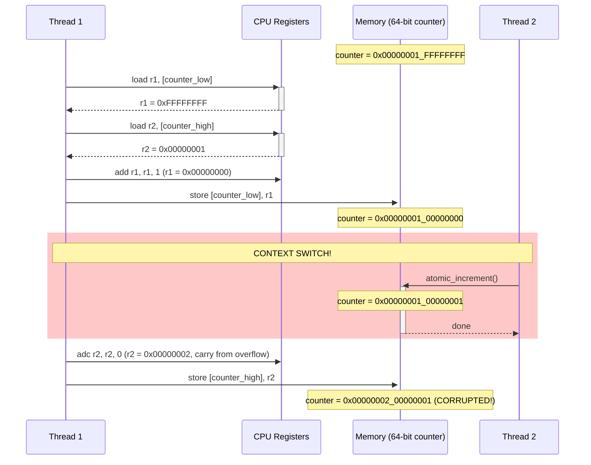
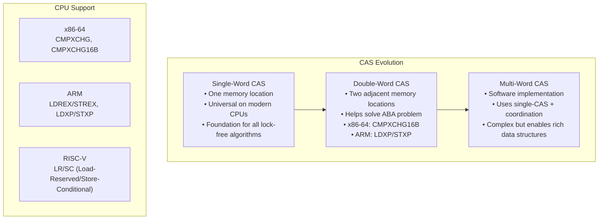
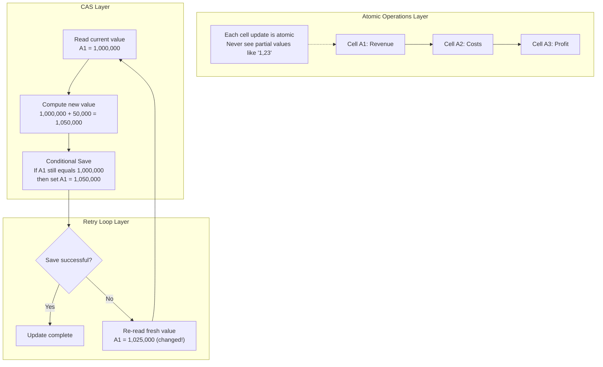
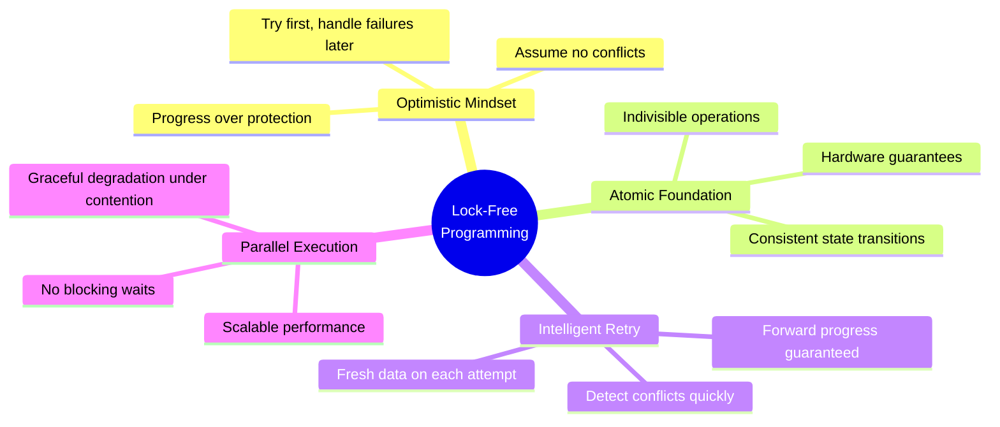

# Key Abstractions: The Building Blocks of Lock-Free Programming

## The Essential Trio

Lock-free programming revolves around three core abstractions:

1. **Atomic Operations** - The hardware primitives
2. **Compare-And-Swap (CAS)** - The fundamental synchronization mechanism  
3. **Retry Loops** - The control flow pattern

## 1. Atomic Operations: The Foundation

Atomic operations provide the basic guarantee: **indivisible execution**. No other thread can observe a partial state.

```rust
// These operations happen "all at once"
let value = atomic_load(&counter);           // Atomic read
atomic_store(&counter, 42);                 // Atomic write
let old = atomic_fetch_add(&counter, 1);    // Atomic increment
```

### Why Atomicity Matters: The Instruction-Level Race

Without atomicity, even simple operations can be corrupted:



**Result**: The counter should be `0x00000001_00000002` but ends up as `0x00000002_00000001`!

Atomic operations eliminate these races by executing as indivisible units at the hardware level.

## 2. Compare-And-Swap: The Universal Primitive

CAS is Turing-complete for synchronization—any lock-free algorithm can be built with it.

### The CAS Contract

```rust
fn cas(location: &AtomicT, expected: T, new: T) -> Result<T, T> {
    // Atomically:
    if *location == expected {
        *location = new;
        Ok(expected)  // Success: returned old value
    } else {
        Err(*location)  // Failure: returned actual value
    }
}
```

### CAS Variants: Hardware Evolution



Different architectures provide different flavors, but the concept remains consistent.

## 3. The Retry Loop: Persistence Until Success

The standard pattern for lock-free updates:

```rust
fn lock_free_update<T, F>(atomic_var: &AtomicT, update_fn: F) 
where F: Fn(T) -> T {
    loop {
        let current = atomic_var.load(Ordering::Acquire);
        let new_value = update_fn(current);
        
        match atomic_var.compare_exchange_weak(
            current, 
            new_value, 
            Ordering::Release,
            Ordering::Relaxed
        ) {
            Ok(_) => break,  // Success!
            Err(_) => continue,  // Retry with fresh value
        }
    }
}
```

### Why `compare_exchange_weak`?

Some architectures (like ARM) have "weak" CAS that can fail spuriously even when values match. Using `weak` variants allows for better performance on these platforms.

## Advanced Abstraction: Memory Reclamation

Lock-free data structures face a unique problem: **memory reclamation**. How do you safely free memory when other threads might still be accessing it?

### Common Solutions

1. **Epoch-Based Reclamation**: Track global epochs, defer frees
2. **Hazard Pointers**: Threads declare what they're accessing
3. **Reference Counting**: Atomic reference counts (with overhead)

## The Collaborative Spreadsheet: A Complete Mental Model

Imagine a shared Google Sheets document where multiple financial analysts update a real-time dashboard:



### The Analyst Workflow:
1. **Atomic**: Each number appears completely or not at all
2. **CAS**: "Update revenue to $1.05M, but only if it's still $1M"
3. **Retry**: "Oops, someone updated it to $1.025M, let me recalculate: $1.025M + $0.05M = $1.075M"

### Why This Works:
- **No corruption**: Never see $1,00X,XXX (partial update)
- **No lost updates**: All changes eventually apply
- **No blocking**: Everyone works simultaneously
- **Eventual consistency**: Final result is correct

## The Complete Mental Model: Lock-Free as Optimistic Collaboration



### Core Principles:
1. **Optimistic editing** of shared state (assume success)
2. **Atomic building blocks** ensuring consistency (hardware level)
3. **Intelligent retry** when conflicts occur (learn and adapt)
4. **No waiting** for other threads to finish (parallel progress)
5. **Graceful degradation** under high contention (performance degrades gradually, doesn't collapse)

### The Lock-Free Promise:
> "Every thread makes progress, conflicts are temporary setbacks, not permanent blocks."

This foundation enables building complex data structures without traditional locking mechanisms.

The next section demonstrates these concepts with a practical lock-free counter implementation.