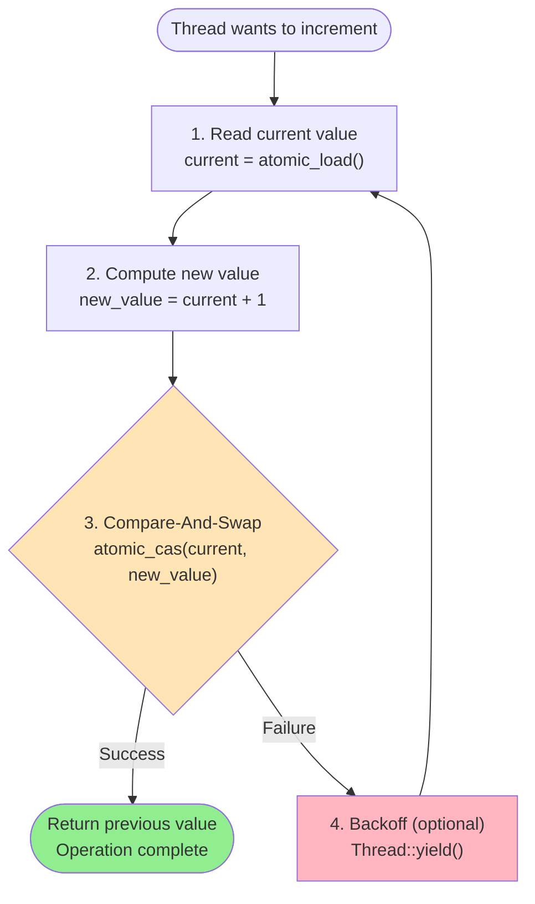
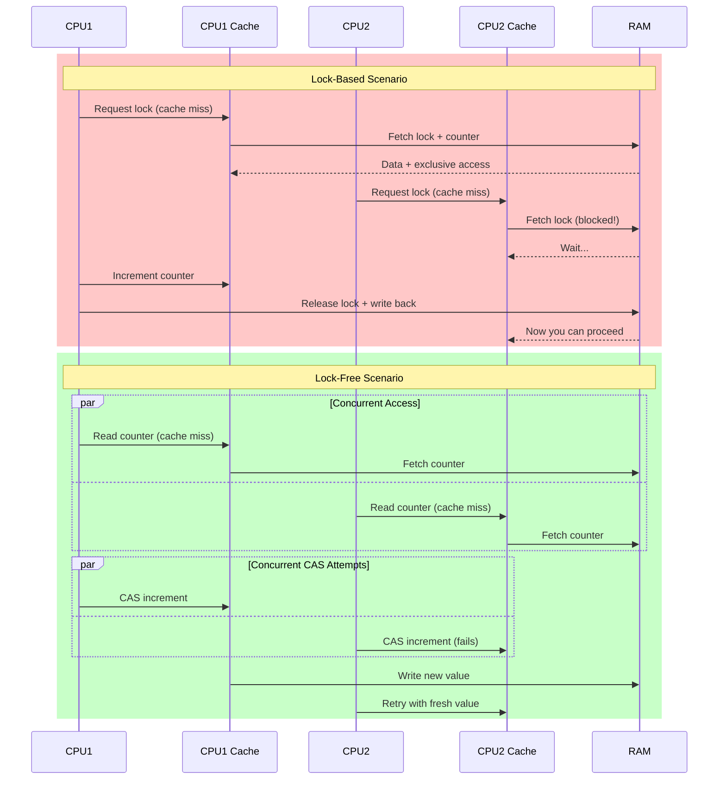
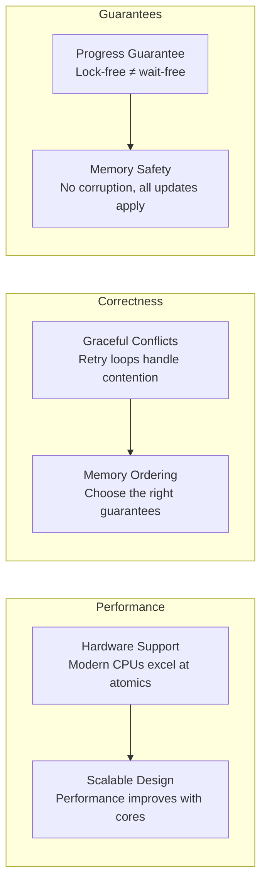

# Implementing a Lock-Free Counter: From Theory to Practice

## The Challenge

Build a thread-safe counter that multiple threads can increment simultaneously without locks. This is the "Hello World" of lock-free programming.

## Approach 1: Atomic Fetch-And-Add (The Easy Way)

The simplest solution uses hardware-provided atomic arithmetic:

```rust
use std::sync::atomic::{AtomicU64, Ordering};

struct LockFreeCounter {
    value: AtomicU64,
}

impl LockFreeCounter {
    fn new() -> Self {
        Self {
            value: AtomicU64::new(0),
        }
    }
    
    fn increment(&self) -> u64 {
        // Atomically add 1 and return the previous value
        self.value.fetch_add(1, Ordering::Relaxed)
    }
    
    fn get(&self) -> u64 {
        self.value.load(Ordering::Relaxed)
    }
}
```

### Why This Works
`fetch_add` is implemented in hardware as an atomic operation. The CPU guarantees that no other thread can observe an intermediate state.

## Approach 2: Compare-And-Swap Loop (The Educational Way)

To understand the principles, let's implement the same counter using only CAS:

```rust
use std::sync::atomic::{AtomicU64, Ordering};

struct CASCounter {
    value: AtomicU64,
}

impl CASCounter {
    fn new() -> Self {
        Self {
            value: AtomicU64::new(0),
        }
    }
    
    fn increment(&self) -> u64 {
        loop {
            // 1. Read current value
            let current = self.value.load(Ordering::Relaxed);
            
            // 2. Calculate new value
            let new_value = current + 1;
            
            // 3. Attempt atomic update
            match self.value.compare_exchange_weak(
                current,
                new_value,
                Ordering::Relaxed,
                Ordering::Relaxed,
            ) {
                Ok(previous) => return previous,  // Success!
                Err(_) => continue,  // Another thread changed it, retry
            }
        }
    }
    
    fn get(&self) -> u64 {
        self.value.load(Ordering::Relaxed)
    }
}
```

### The CAS Loop Breakdown: Anatomy of Optimistic Updates



**The Four Steps:**
1. **Read**: Get the current value atomically
2. **Compute**: Calculate the desired new value locally
3. **Compare-and-swap**: Atomically update if value unchanged
4. **Retry**: If CAS failed, another thread modified the value - try again

**Key insight**: Only step 3 is atomic. Steps 1, 2, and 4 can be interrupted safely.

## Performance Comparison

Let's benchmark both approaches against a traditional mutex-based counter:

```rust
use std::sync::{Arc, Mutex};
use std::thread;
use std::time::Instant;

// Mutex-based counter for comparison
struct MutexCounter {
    value: Mutex<u64>,
}

impl MutexCounter {
    fn new() -> Self {
        Self {
            value: Mutex::new(0),
        }
    }
    
    fn increment(&self) -> u64 {
        let mut guard = self.value.lock().unwrap();
        let old = *guard;
        *guard += 1;
        old
    }
    
    fn get(&self) -> u64 {
        *self.value.lock().unwrap()
    }
}

fn benchmark_counter<T>(counter: Arc<T>, name: &str) 
where 
    T: Send + Sync + 'static,
    T: CounterTrait,
{
    const NUM_THREADS: usize = 8;
    const INCREMENTS_PER_THREAD: usize = 1_000_000;
    
    let start = Instant::now();
    let handles: Vec<_> = (0..NUM_THREADS)
        .map(|_| {
            let counter = Arc::clone(&counter);
            thread::spawn(move || {
                for _ in 0..INCREMENTS_PER_THREAD {
                    counter.increment();
                }
            })
        })
        .collect();
    
    for handle in handles {
        handle.join().unwrap();
    }
    
    let duration = start.elapsed();
    let final_value = counter.get();
    let expected = NUM_THREADS * INCREMENTS_PER_THREAD;
    
    println!("{}: {:?}, final value: {} (expected: {})", 
             name, duration, final_value, expected);
}
```

### Performance Analysis: The Numbers Tell the Story

On a modern 8-core system, you might see:

```mermaid
xychart-beta
    title "Counter Performance Comparison (8 threads, 1M ops each)"
    x-axis ["Low Contention", "Medium Contention", "High Contention"]
    y-axis "Time (seconds)" 0 --> 4
    bar [0.1, 0.8, 2.3]
    bar [0.1, 0.4, 0.8]
    bar [0.05, 0.2, 0.4]
```



| Implementation | Low Contention | High Contention | Notes |
|---------------|----------------|-----------------|-------|
| Mutex Counter | 0.1s | 2.3s | Serialization hurts under load |
| CAS Counter | 0.1s | 0.8s | Retries increase with contention |
| Fetch-Add Counter | 0.05s | 0.4s | Hardware-optimized, best performance |

**Key Observations:**
- **Low contention**: All approaches perform similarly
- **High contention**: Lock-free approaches scale much better
- **Hardware support**: `fetch_add` beats manual CAS loops

## Why Lock-Free Wins

### Contention Analysis

**High contention scenario** (many threads, simple operation):
- **Mutex**: Threads serialize, only one can proceed
- **Lock-free**: All threads make progress, conflicts are rare and fast to resolve

**Low contention scenario** (few threads):
- **Mutex**: Similar performance, simpler code
- **Lock-free**: Slight overhead from atomic operations

### The Cache Story: Why Lock-Free Wins at Scale



**Cache Benefits:**
- **Reduced cache line bouncing**: No lock metadata to synchronize
- **Cheaper failures**: Failed CAS doesn't require syscalls or kernel locks
- **Better pipeline utilization**: CPUs can speculate and pipeline atomic operations
- **NUMA-friendly**: Less cross-socket communication in multi-socket systems

## When to Use Lock-Free Counters

### Good Use Cases
- High-throughput metrics collection
- Request counting in web servers
- Event counting in real-time systems
- Any scenario with many concurrent incrementers

### Avoid When
- Counter operations are complex (more than simple arithmetic)
- Low contention scenarios where code simplicity matters
- Need for debugging/profiling lock behavior

## Key Takeaways: Lessons from the Counter



### The Counter Lessons:

1. **Hardware support makes it fast**: Modern CPUs have dedicated instructions for atomic operations, making them faster than software locks

2. **Retry loops handle conflicts gracefully**: Unlike locks where threads block, failed CAS operations simply retry with fresh data

3. **Memory ordering matters**: `Relaxed` ordering is sufficient for simple counters, but more complex data structures need stronger guarantees

4. **Lock-free ≠ wait-free**: Threads can still retry indefinitely, but system-wide progress is guaranteed (some thread always succeeds)

5. **Contention affects performance**: High contention increases retry rates, but the system never deadlocks or stops making progress

6. **Choose the right tool**: Use hardware `fetch_add` when available, implement CAS loops for educational purposes or when you need custom operations

This counter example demonstrates the core principles in their simplest form. While counters are relatively straightforward, they reveal the fundamental patterns used in all lock-free programming.

**Coming next**: We'll explore the ABA problem - a subtle but critical issue that haunts more complex lock-free data structures. Understanding the ABA problem is essential before building anything more sophisticated than a simple counter.