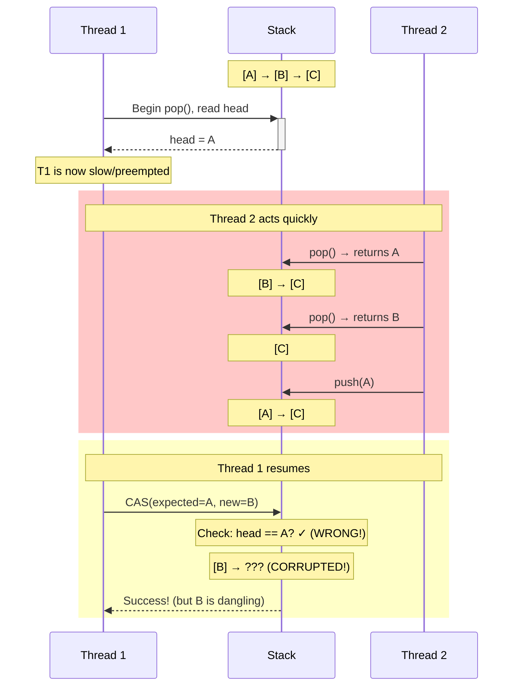
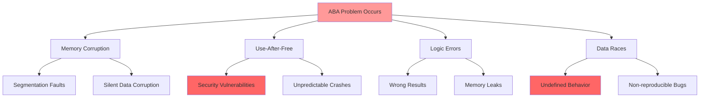
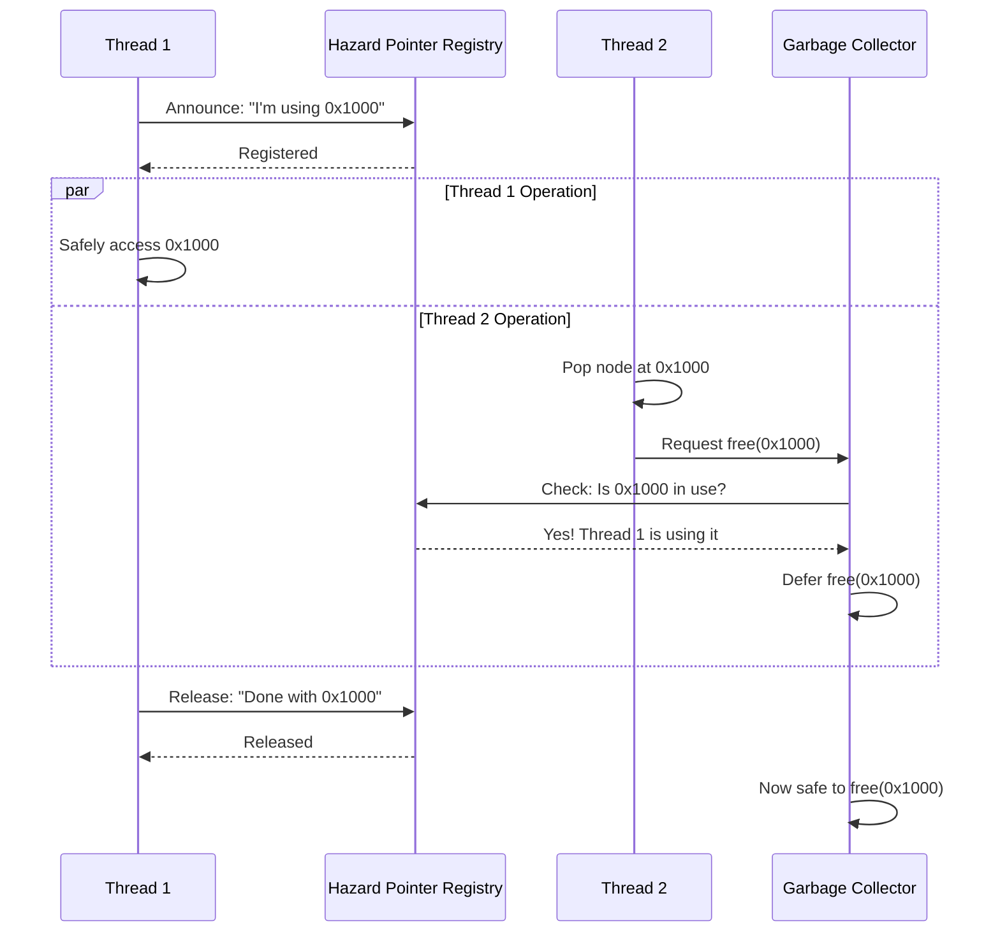
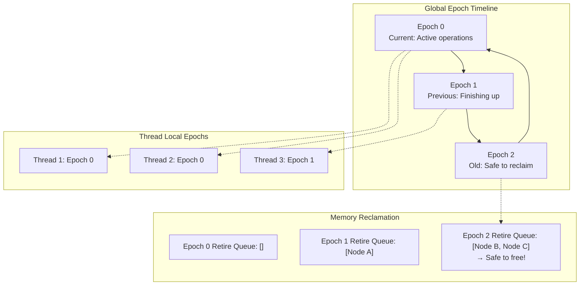
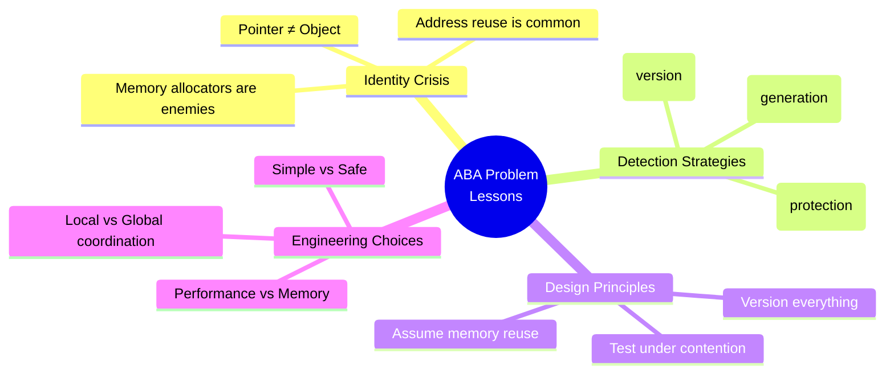

# The ABA Problem: When Success Lies

## The Subtle Bug That Haunts Lock-Free Programming

The ABA problem is one of the most insidious issues in lock-free programming. It occurs when a Compare-And-Swap operation succeeds even though the data structure has been modified in ways that violate the algorithm's assumptions.

## The Problem Illustrated: When Success Deceives

Consider this sequence with a lock-free stack:



**The Deception**: Thread 1's CAS succeeds because the head pointer has the same **value** (A), but it points to a **different node** with different linkage!

## A Concrete Example: The Lock-Free Stack

Here's a vulnerable lock-free stack implementation:

```rust
use std::sync::atomic::{AtomicPtr, Ordering};
use std::ptr;

struct Node<T> {
    data: T,
    next: AtomicPtr<Node<T>>,
}

struct LockFreeStack<T> {
    head: AtomicPtr<Node<T>>,
}

impl<T> LockFreeStack<T> {
    fn new() -> Self {
        Self {
            head: AtomicPtr::new(ptr::null_mut()),
        }
    }
    
    fn push(&self, data: T) {
        let new_node = Box::into_raw(Box::new(Node {
            data,
            next: AtomicPtr::new(ptr::null_mut()),
        }));
        
        loop {
            let head = self.head.load(Ordering::Acquire);
            unsafe {
                (*new_node).next.store(head, Ordering::Relaxed);
            }
            
            if self.head.compare_exchange_weak(
                head,
                new_node,
                Ordering::Release,
                Ordering::Relaxed,
            ).is_ok() {
                break;
            }
        }
    }
    
    // VULNERABLE TO ABA PROBLEM!
    fn pop(&self) -> Option<T> {
        loop {
            let head = self.head.load(Ordering::Acquire);
            if head.is_null() {
                return None;
            }
            
            let next = unsafe { (*head).next.load(Ordering::Acquire) };
            
            // ABA PROBLEM: head might be the same pointer value
            // but point to a different node that was allocated
            // at the same memory address!
            if self.head.compare_exchange_weak(
                head,
                next,
                Ordering::Release,
                Ordering::Relaxed,
            ).is_ok() {
                let data = unsafe { Box::from_raw(head).data };
                return Some(data);
            }
        }
    }
}
```

## The Memory Reuse Scenario: The Address Space Trap

```mermaid
flowchart TD
    subgraph "Timeline"
        T1["T1: Read head = 0x1000 (Node A)"]
        T2a["T2: Pop A, free(0x1000)"]
        T2b["T2: Pop B"]
        T2c["T2: Push C, malloc() returns 0x1000!"]
        T1b["T1: CAS succeeds (0x1000 == 0x1000)"]
        
        T1 --> T2a
        T2a --> T2b
        T2b --> T2c
        T2c --> T1b
    end
    
    subgraph "Memory State"
        M1["0x1000: Node A { data: 'A', next: 0x2000 }"]
        M2["0x1000: <freed memory>"]
        M3["0x1000: Node C { data: 'C', next: 0x3000 }"]
        M4["0x1000: Node C (corrupted linkage!)"]
        
        M1 --> M2
        M2 --> M3
        M3 --> M4
    end
```



**The Classic ABA Sequence:**
1. **Thread A**: Reads head pointer (0x1000 containing Node A)
2. **Thread B**: Pops Node A, `free(0x1000)` returns memory to allocator
3. **Thread B**: Pops Node B, continues operations
4. **Thread B**: Pushes new Node C, `malloc()` **reuses** address 0x1000
5. **Thread A**: CAS succeeds (0x1000 == 0x1000), but A ≠ C!

**Result**: Thread A successfully "pops A" but actually manipulates Node C's linkage!

## Why This Is Dangerous: The Cascade of Failures



**Immediate Dangers:**
- **Memory corruption**: Writing to freed/reallocated memory
- **Use-after-free**: Accessing objects that no longer exist
- **Logic errors**: Algorithm state becomes inconsistent
- **Data races**: Multiple threads access same memory unsynchronized

**Cascading Effects:**
- **Security vulnerabilities**: Attackers can trigger controlled memory corruption
- **Heisenbugs**: Bugs that disappear when you try to debug them
- **Silent failures**: Wrong results without obvious crashes
- **Production instability**: Intermittent failures under load

**Real-world Impact**: ABA bugs are notoriously difficult to reproduce because they depend on precise timing and memory allocation patterns.

## Solution 1: Tagged Pointers - The Version Control Approach

Add a version counter to detect modifications:

```mermaid
flowchart TD
    subgraph "Traditional Pointer (Vulnerable)"
        P1["Pointer: 0x1000<br/>Points to: Node A"]
        P2["Pointer: 0x1000<br/>Points to: Node C<br/>(CAS succeeds!)"]
        P1 -.->|Memory reuse| P2
    end
    
    subgraph "Tagged Pointer (Protected)"
        TP1["Pointer: 0x1000<br/>Tag: 42<br/>Combined: 0x002A_0000_0000_1000"]
        TP2["Pointer: 0x1000<br/>Tag: 43<br/>Combined: 0x002B_0000_0000_1000"]
        TP1 -.->|Memory reuse| TP2
        TP2 -.->|"CAS fails!<br/>(different tags)"| Fail["ABA Detected"]]
    end
```

**How Tagged Pointers Work:**
- Pack pointer and version counter into single atomic word
- Increment tag on every successful CAS
- Even if pointer address is reused, tag will be different
- ABA becomes impossible (until tag wraps around)

```rust
use std::sync::atomic::{AtomicU64, Ordering};

// Pack pointer and version into a single 64-bit value
struct TaggedPtr<T> {
    ptr: *mut T,
    tag: u32,
}

impl<T> TaggedPtr<T> {
    fn pack(ptr: *mut T, tag: u32) -> u64 {
        (ptr as u64) | ((tag as u64) << 48)
    }
    
    fn unpack(packed: u64) -> Self {
        Self {
            ptr: (packed & 0x0000_FFFF_FFFF_FFFF) as *mut T,
            tag: (packed >> 48) as u32,
        }
    }
}

struct SafeLockFreeStack<T> {
    head: AtomicU64,  // Tagged pointer
}

impl<T> SafeLockFreeStack<T> {
    fn pop(&self) -> Option<T> {
        loop {
            let packed_head = self.head.load(Ordering::Acquire);
            let head = TaggedPtr::unpack(packed_head);
            
            if head.ptr.is_null() {
                return None;
            }
            
            let next = unsafe { (*head.ptr).next.load(Ordering::Acquire) };
            let next_packed = TaggedPtr::pack(next, head.tag + 1);
            
            // Now ABA is impossible: even if pointer is reused,
            // tag will be different
            if self.head.compare_exchange_weak(
                packed_head,
                next_packed,
                Ordering::Release,
                Ordering::Relaxed,
            ).is_ok() {
                let data = unsafe { Box::from_raw(head.ptr).data };
                return Some(data);
            }
        }
    }
}
```

## Solution 2: Hazard Pointers - The "I'm Using This" Approach



**Hazard Pointer Protocol:**
1. **Announce**: Thread declares which pointers it's accessing
2. **Protect**: Memory manager defers freeing announced pointers
3. **Validate**: Re-check pointer validity after announcement
4. **Release**: Thread clears announcement when done
5. **Reclaim**: Memory manager frees unreferenced objects

**Trade-offs:**
- ✅ Eliminates ABA problem completely
- ✅ Works with any memory allocator
- ❌ Memory overhead (hazard pointer arrays)
- ❌ Deferred reclamation (memory usage spikes)

```rust
use std::sync::atomic::{AtomicPtr, Ordering};
use std::collections::HashSet;
use std::thread;

thread_local! {
    static HAZARD_POINTERS: RefCell<Vec<*mut Node<T>>> = 
        RefCell::new(Vec::new());
}

impl<T> LockFreeStack<T> {
    fn pop_with_hazards(&self) -> Option<T> {
        loop {
            let head = self.head.load(Ordering::Acquire);
            if head.is_null() {
                return None;
            }
            
            // Announce that we're using this pointer
            HAZARD_POINTERS.with(|hp| {
                hp.borrow_mut().push(head);
            });
            
            // Re-check that head is still valid
            if self.head.load(Ordering::Acquire) != head {
                continue;  // Pointer changed, retry
            }
            
            let next = unsafe { (*head).next.load(Ordering::Acquire) };
            
            if self.head.compare_exchange_weak(
                head,
                next,
                Ordering::Release,
                Ordering::Relaxed,
            ).is_ok() {
                // Safe to dereference: we have a hazard pointer
                let data = unsafe { (*head).data };
                
                // Don't actually free the node immediately
                // Instead, add to a deferred free list
                defer_free(head);
                
                HAZARD_POINTERS.with(|hp| {
                    hp.borrow_mut().retain(|&p| p != head);
                });
                
                return Some(data);
            }
        }
    }
}
```

## Solution 3: Epoch-Based Reclamation - The Generation Game



**Epoch-Based Protocol:**
1. **Global Counter**: System maintains a global epoch counter
2. **Local Tracking**: Each thread tracks its current epoch
3. **Grace Period**: Memory freed in epoch N can't be reclaimed until epoch N+2
4. **Batch Reclamation**: Free memory in batches when epochs advance
5. **Progress Guarantee**: System can always advance epochs

**Why This Works:**
- If a thread is in epoch N, it can't access memory freed in epoch N+1
- By epoch N+2, all threads have moved past the dangerous memory
- **Conservative**: May delay reclamation, but never causes ABA

**Trade-offs:**
- ✅ Low overhead per operation
- ✅ Batch efficiency for memory management
- ❌ Memory usage spikes (delayed reclamation)
- ❌ Global synchronization points

```rust
use std::sync::atomic::{AtomicUsize, Ordering};

static GLOBAL_EPOCH: AtomicUsize = AtomicUsize::new(0);

thread_local! {
    static LOCAL_EPOCH: Cell<usize> = Cell::new(0);
}

fn enter_critical_section() {
    let global = GLOBAL_EPOCH.load(Ordering::Acquire);
    LOCAL_EPOCH.with(|local| local.set(global));
}

fn exit_critical_section() {
    // Advance global epoch periodically
    GLOBAL_EPOCH.fetch_add(1, Ordering::Release);
    
    // Free memory from 2+ epochs ago
    // (Safe because no thread can be accessing it)
    reclaim_old_memory();
}
```

## The Trade-offs: Choosing Your ABA Defense

```mermaid
radar
    title ABA Solution Comparison
    options
        x-axis ["Performance", "Memory Usage", "Complexity", "Portability", "Guarantees", "Scalability"]
    
    data
        Tagged Pointers [8, 9, 6, 7, 7, 8]
        Hazard Pointers [6, 5, 4, 9, 9, 7]
        Epoch-Based [7, 6, 7, 8, 8, 6]
```

| Solution | Performance | Memory | Complexity | Best For |
|----------|-------------|---------|------------|----------|
| **Tagged Pointers** | High | Low | Medium | Simple structures, 64-bit systems |
| **Hazard Pointers** | Medium | High | Low | Complex structures, strong guarantees |
| **Epoch-Based** | High | Medium | Medium | High-throughput systems |

**Detailed Analysis:**

### Tagged Pointers
- ✅ **Fast**: No additional synchronization overhead
- ✅ **Compact**: Single atomic word per pointer
- ❌ **Limited**: Reduces available address space
- ❌ **Wraparound**: ABA possible after 2^16 operations

### Hazard Pointers
- ✅ **Strong guarantees**: Complete ABA elimination
- ✅ **Flexible**: Works with any data structure
- ❌ **Memory overhead**: O(threads × max_hazards)
- ❌ **Complex validation**: Must re-verify pointers

### Epoch-Based Reclamation
- ✅ **Batch efficiency**: Amortized reclamation cost
- ✅ **Good scalability**: Low contention on epoch counter
- ❌ **Memory spikes**: Delayed reclamation under load
- ❌ **Global coordination**: Epoch advancement requires coordination

**Recommendation**: Start with **tagged pointers** for simple cases, graduate to **epoch-based** for production systems, use **hazard pointers** when you need ironclad guarantees.

## Mental Model: The Library Book Analogy

Think of the ABA problem like a library book checkout system:

```mermaid
flowchart TD
    subgraph "Without ABA Protection (Dangerous)"
        Student1["Student checks out<br/>'Introduction to Algorithms'<br/>from Shelf A-1"]
        Returned["Book returned, shelved elsewhere"]
        NewBook["Different book placed<br/>at Shelf A-1 with same title"]
        Student2["Student returns to Shelf A-1<br/>Sees 'Introduction to Algorithms'<br/>Assumes it's the same book!"]
        
        Student1 --> Returned
        Returned --> NewBook
        NewBook --> Student2
    end
    
    subgraph "With ABA Protection (Safe)"
        StudentA["Student checks out<br/>'Algorithms' v1.0<br/>ISBN: 978-0-262-03384-8"]
        ReturnedA["Book returned"]
        NewBookA["Different edition placed<br/>'Algorithms' v2.0<br/>ISBN: 978-0-262-03385-5"]
        StudentB["Student checks ISBN<br/>Different! Not the same book<br/>Handles appropriately"]
        
        StudentA --> ReturnedA
        ReturnedA --> NewBookA
        NewBookA --> StudentB
    end
```



**The Core Problem**: 
**Pointer equality ≠ object identity** in concurrent environments

**Real-world Parallel:**
- **Location**: Shelf A-1 (memory address)
- **Content**: Book (data structure node)
- **Identity**: ISBN/version (tag/generation counter)

**Without protection**: "Same shelf, same title" assumption fails
**With protection**: "Same shelf, same title, same ISBN" provides true identity

**Key insight**: In concurrent systems, you need more than just address equality to ensure you're working with the same logical object.

## Key Lessons: Wisdom from the ABA Trenches



### The Universal Truths:

1. **Pointer equality ≠ object identity** in concurrent environments
   - Memory addresses get reused constantly
   - Same address ≠ same object
   - Need additional identity verification

2. **Memory reuse makes ABA inevitable** without protection
   - Modern allocators aggressively reuse memory
   - Popular addresses get recycled quickly
   - Stack/queue heads are prime targets

3. **Every pointer-based lock-free algorithm needs ABA protection**
   - Simple counters are immune (no pointers)
   - Linked structures are vulnerable
   - Prevention is easier than detection

4. **Choose protection based on your constraints**
   - **Performance-critical**: Tagged pointers
   - **Memory-constrained**: Epoch-based
   - **Safety-critical**: Hazard pointers

5. **Test under realistic conditions**
   - ABA bugs hide in timing-dependent scenarios
   - Memory pressure increases reuse likelihood
   - Production load patterns reveal edge cases

### The Bottom Line:
> "ABA is not just a theoretical problem—it's a practical reality that will bite you in production if you don't address it proactively."

Understanding and solving the ABA problem is the difference between toy lock-free algorithms and production-ready systems.

The ABA problem represents the subtle complexity that makes lock-free programming challenging. It's the reason why "just use atomic operations" isn't sufficient advice—you need deep understanding of the failure modes and appropriate countermeasures.

**Next steps**: Armed with this knowledge of ABA and its solutions, you're ready to examine complete, production-ready implementations that handle these challenges correctly. The final section provides working Rust code that demonstrates these concepts in practice.