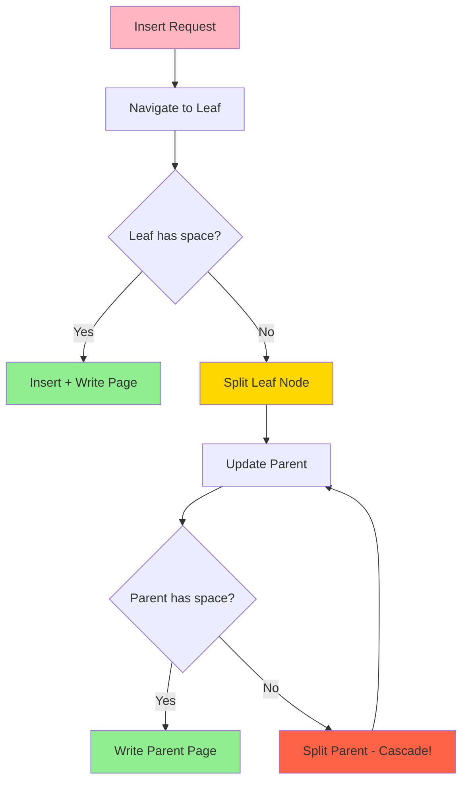
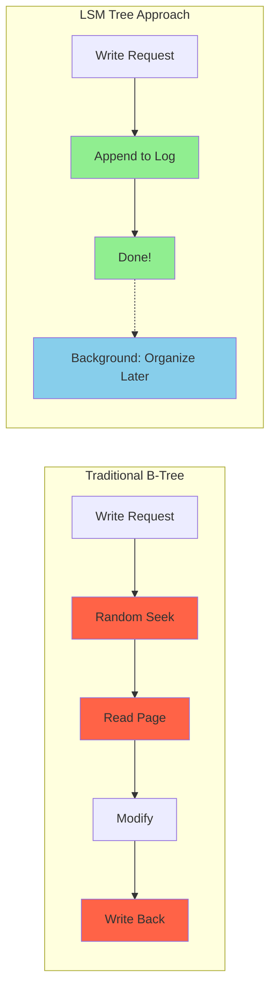

# The Core Problem: Why Traditional Storage Engines Struggle with Writes

## The Write Performance Bottleneck

Modern applications generate massive amounts of data that must be persisted durably. However, traditional storage engines, built around B-Trees, face a fundamental challenge: **write amplification** and **random I/O**.

## How B-Trees Handle Writes

Consider inserting a new key-value pair into a B-Tree stored on disk:



**The Problem**: One logical write becomes multiple random disk operations:
1. Navigate to the leaf node (multiple random reads)
2. Check if leaf has space
   - If yes: Insert and write the entire page back to disk
   - If no: Split the leaf, update parent, possibly cascade splits
3. Each split requires reading and writing multiple pages
4. Result: One logical write becomes many physical disk operations

## The Random I/O Problem

Traditional storage engines suffer from **random I/O patterns**:

```mermaid
gantt
    title Disk Head Movement in B-Tree Writes
    dateFormat X
    axisFormat %s
    
    section Disk Operations
    Seek to page 147    :0, 10
    Write "apple"       :10, 12
    Seek to page 3      :12, 22
    Write "zebra"       :22, 24
    Seek to page 89     :24, 34
    Write "banana"      :34, 36
```



**The ping-pong effect**:
```
Insert key "apple" → Seek to page 147 → Write page 147
Insert key "zebra" → Seek to page 3   → Write page 3  
Insert key "banana"→ Seek to page 89  → Write page 89
```

Each write requires seeking to a different disk location, making the storage device head jump around like a ping-pong ball. **Seek time dominates performance**.

## Why This Matters: The Performance Cliff

### Hard Disk Drives (HDDs)
- **Sequential write**: ~200 MB/s
- **Random write**: ~100 operations/s (2,000x slower!)
- **Seek time**: 5-10ms per random access

### Solid State Drives (SSDs)  
- **Sequential write**: ~500 MB/s
- **Random write**: ~10,000 operations/s (still 50x slower)
- **Write endurance**: Limited program/erase cycles

## Real-World Impact

Imagine a social media application receiving 100,000 new posts per second:

**With B-Tree storage**:
- Each post insertion triggers multiple random I/O operations
- Disk becomes the bottleneck at ~1,000 writes/second
- 99% of writes must wait in queue
- Application becomes unresponsive

**The symptom**: Applications that can process millions of reads per second grinding to a halt when write load increases.

## The Fundamental Trade-off

Traditional storage engines optimize for:
- **Fast point queries** (O(log n) lookups)
- **Efficient range scans** (sorted order on disk)
- **Low space overhead** (balanced trees)

But sacrifice:
- **Write throughput** (random I/O kills performance)
- **Write latency** (multiple disk seeks per operation)
- **Predictable performance** (varies with tree structure)

## Write-Heavy Workload Examples

Modern applications that break traditional storage:

### Time-Series Data
```
sensor_id:1001, timestamp:1609459200, temperature:23.5
sensor_id:1001, timestamp:1609459201, temperature:23.7
sensor_id:1001, timestamp:1609459202, temperature:23.6
```
Millions of measurements per second, all recent data.

### Event Logging
```
user_id:12345, action:click, timestamp:..., page:/product/abc
user_id:67890, action:view, timestamp:..., page:/home
user_id:12345, action:purchase, timestamp:..., item:xyz
```
High-velocity event streams that must be persisted immediately.

### Metrics Collection
```
metric:cpu.usage, host:web01, value:75.2, time:...
metric:mem.usage, host:web01, value:2.1GB, time:...
metric:disk.io, host:db03, value:1500ops, time:...
```
Continuous monitoring data from thousands of hosts.

## The LSM Tree Insight

What if we could eliminate random writes entirely? What if every write operation was sequential?



LSM Trees make a radical trade-off:
- **Sacrifice**: Immediate organization and fast point queries
- **Gain**: Blazing fast writes through sequential I/O only

The core insight: **defer the organization work**. Write data quickly in an unorganized fashion, then clean up later when the system has spare cycles.

## Analogy: The Messy Desk Strategy

**Traditional approach (B-Tree)**: 
File every document immediately in the correct alphabetical folder. Every new document requires finding the right folder, possibly reorganizing if folders are full.

**LSM approach**: 
Throw all documents in an "inbox" pile on your desk. When the pile gets too big, sort the entire pile and file it away. Do this periodically when you have time.

The LSM strategy trades organization overhead for pure write speed, handling the organization as a background task.

The next section explores how this philosophy translates into concrete data structures and algorithms.